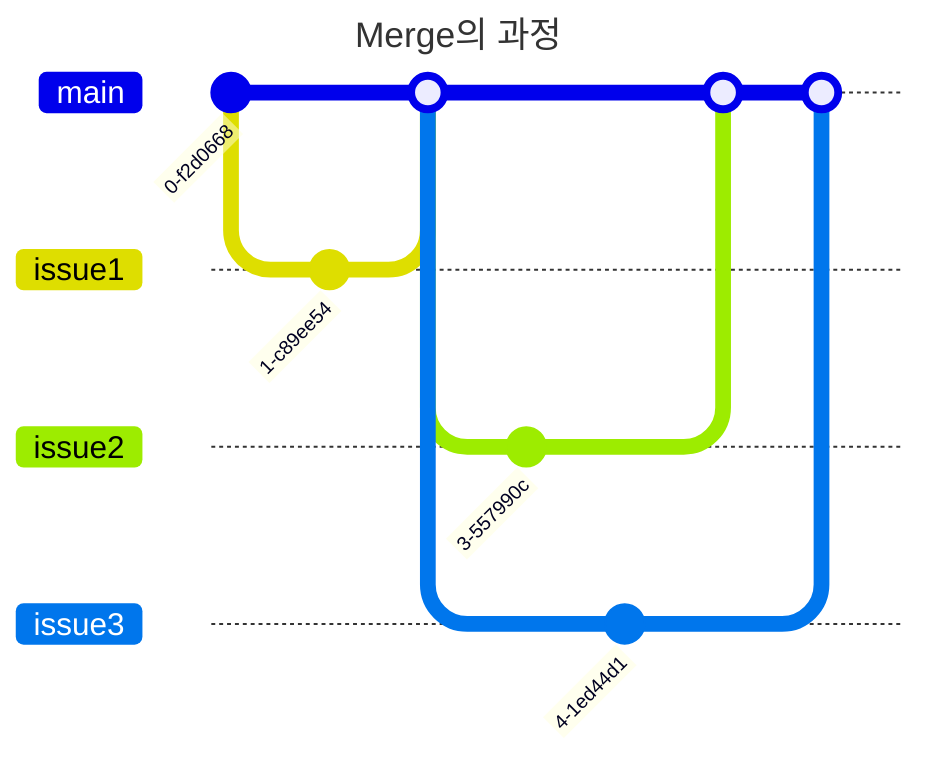

#git #branch

## Git 명령어
- `git branch`: 브랜치 목록 및 현재 브랜치 확인
	- `-d <branch_name>`: `<branch_name>` 브랜치 삭제
- `git checkout <branch_name>`: `<branch_name>` 브랜치 HEAD로 이동
	- `-b <branch_name>`: `<branch_name>` 브랜치를 생성하고 이동
- `git merge <branch_name>`: 현재 브랜치를 기준으로 `<branch_name>` 브랜치를 가져와 병합
- `git reset`: 이전 스테이징 상태로 되돌린다.
	- `--hard`: 커밋, 현재 파일 변경 상태를 완전히 지우고 되돌아가는 옵션

## HEAD
- 현재 브랜치의 가장 최근 커밋을 의미한다.
- 이 HEAD를 기준으로 포인터를 상대 경로로 이동할 수 있다.

## Merge
- 브랜치는 구성 요소 별로 나누어서 작업을 용이하게 한다.
- 머지는 이 각각의 브랜치를 하나의 리포지토리로 병합하는 작업을 의미한다.
- 병합 자체도 수정 사항으로 보기 때문에 스테이징 해야한다.

## Rebase
- 현재 브랜치의 ㅃ

## 브랜치 전략
- 
- 메인 브랜치
	- 피쳐 브랜치
	- 릴리스 브랜치
	- 핫픽스 브랜치