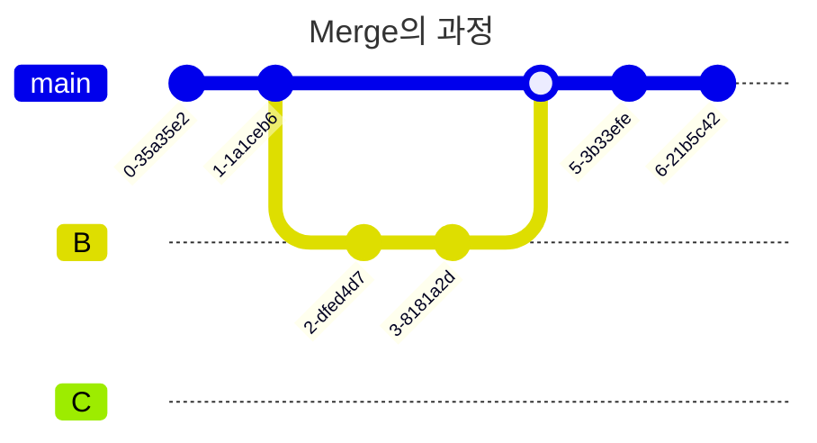

#git #branch

## HEAD
- 작업 브랜치의 가장 최근 커밋

## Merge
- 브랜치는 구성 요소 별로 나누어서 작업을 용이하게 한다.
- 머지는 이 각각의 브랜치를 하나의 리포지토리로 병합하는 작업을 의미한다.

```mermaid
---
title: Merge의 과정
---
gitGraph
   commit
   commit
   branch B
   branch C
   checkout B
   commit
   commit
   checkout main
   merge B
   commit
   commit
```

## Rebase
- 

## 브랜치 전략
- 
- 메인 브랜치
	- 피쳐 브랜치
	- 릴리스 브랜치
	- 핫픽스 브랜치