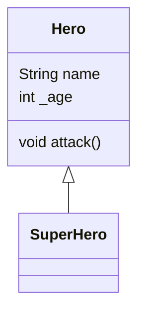

#dart
## 테스트
- 경계값 분석
- 성공 케이스와 실패 케이스 작성

## 인스턴스 초기화 과정
1. 인스턴스 변수 초기화
	- 형식 매개변수 초기화 (`this` 키워드를 통해 매개변수를 바로 변수에 할당)
2. 초기화 리스트 실행
3. 생성자 본문 실행

## 상속
- `extends` 키워드 사용
- `super`는 super class(부모)를 의미

### 클래스 다이어그램
- 상속 관계를 한 눈에 알아볼 수 있도록 표기
- 몇 가지 규칙만 이해하면 손쉽게 그릴 수 있음

### 다중 상속
- 다트는 다중 상속 지원하지 않음
- `mixin`으로 비슷한 구현 가능 (인터페이스)

### 오버라이드
- 기존 기능을 재정의
- 오버라이드 메서드는 호출 인스턴스를 기준으로 상속 관계를 탐색, 가장 가까이 오버라이드 된 메서드 호출

---
#blog
## 성장일지 블로깅 주제 선정
- Dart 테스트 중복 출력 고치기
- IPTIME 공유기로 홈 서버 구성하기

---
#growth-log 

