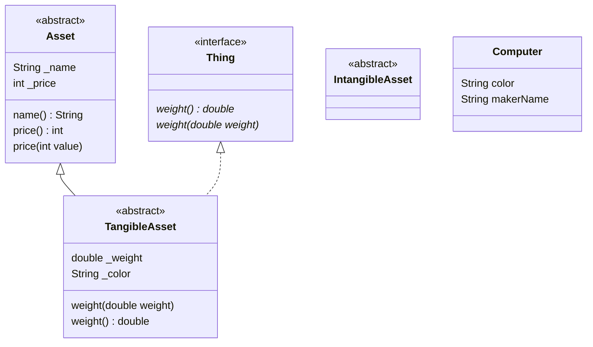

#dart 

## 추상 클래스
- `abstract` 키워드로 정의
- 추상 클래스는 인스턴스화 할 수 없음
- 추상 클래스는 추상 메서드를 가짐, 추상 메서드는 자식 클래스에서 반드시 정의해야 함
- 하나 이상의 구현을 가지게 되면 추상 클래스
- 자바와 동일

```dart
abstract class Clazz {
	...
}
```

## 순수 추상 클래스
- [용어 - 순수 추상 클래스](https://en.wikibooks.org/wiki/C%2B%2B_Programming/Classes/Abstract_Classes/Pure_Abstract_Classes)
- [stackoverflow - 순수 추상 클래스와 추상 클래스의 차이](https://stackoverflow.com/questions/15253642/what-is-the-difference-between-abstract-class-and-pure-abstract-class-in-c)
- 구현 없이 순수히 추상 메서드로 이루어 진 경우 순수 추상 클래스라 함

## 인터페이스
- 순수 추상 클래스(Pure Abstract Classe)일 경우 `interface` 키워드를 붙여서 인터페이스를 정의 가능
- 순수 추상 클래스를 언어 차원에서 지원하는 것으로 이해하면 됨
- 자바와 동일

```dart
abstract interface Attackable {
	...
}
```

## UML
- UML에서 클래스 명이 이탤릭 스타일일 경우, 추상 클래스를 의미한다.
- 추상 메서드도 동일한 규칙(이탤릭 스타일)을 따른다.
- 구현체 입장에서 보았을 때, 추상 메서드를 구현했다면 이탤릭 스타일을 제거하면 된다.
- 구현체를 상속한 구현체가 있을 경우, 오버라이드 하지 않았다면 메서드를 표기하지 않아도 됨


