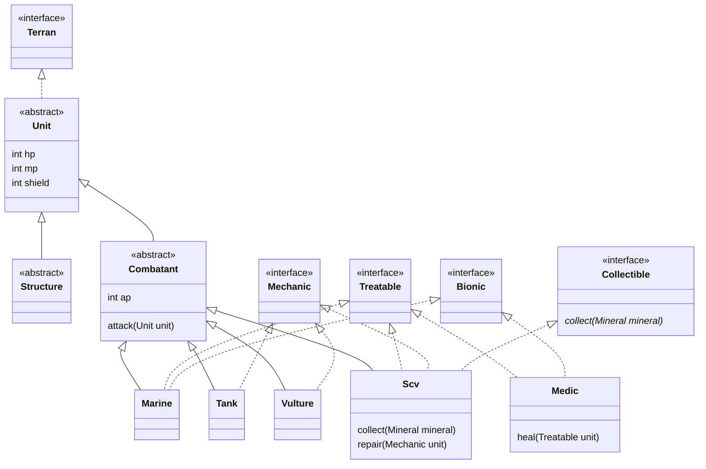

#dart 


## 업 캐스팅과 오버라이딩

```dart
Slime slime = Slime('A');
Monster monster = Slime('B');

slime.run();
monster.run();
```

- 업 캐스팅을 하고 메서드를 호출하면 실제 인스턴스를 기준으로 상속 관계를 탐색해서 메서드를 호출하기 때문에 실제 `Slime` 인스턴스의 오버라이딩 된 `run()`이 호출된다.


