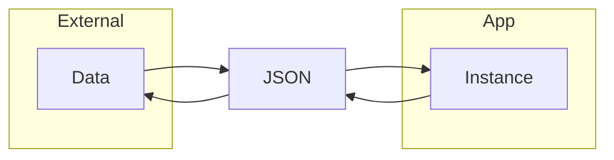

#dart #serialization #exception #io 

# Exception

|          | Syntax Error    | Runtime Error                  | Logic Error            |
| -------- | --------------- | ------------------------------ | ---------------------- |
| 원인       | 코드의 형식적 오류      | 실행 중 예상 외의 사태가 발생하여 동작이 중지됨 | 기술한 처리 내용에 논리적인 오류가 있음 |
| 알아 채는 방법 | 컴파일하면 에러남       | 실행하면 도중에 강제 종료                 | 실행하면 예상 외의 값이 나옴       |
| 해결 방법    | 컴파일러의 지적을 보고 수정 | 에러                             | 원인을 스스로 찾아서 해결         |
## Exception vs Error

| 구분       | Exception                          | Error                                                  |
| -------- | ---------------------------------- | ------------------------------------------------------ |
| 의미       | 프로그램이 복구할 수 있는 오류                  | 복구가 불가능한 오류                                            |
| 원인       | 네트워크 오류, 잘못된 입력, 파일 찾을수 없음         | Stack Overflow, OOM(Out of Memory), Null Dereference 등 |
| catch 가능 | 일반적으로 `try-catch`로 처리              | `catch` 하기 힘듦                                          |
| 예제       | `FormatException`, `IOException` 등 | `StackOverflowError`, `OutOfMemoryError` 등             |
- 예외: 일반적으로 프로그램 내에서 복구할 수 있는 오류 (Java - Unchecked)
- 에러: 프로그램에서 복구할 수 없는 오류 (Java - Checked)

## try-catch
- `try-catch` 구문으로 런타임 예외를 잡아서 해결

### rethrow
- `catch` 절에서 `rethrow` 키워드로 예외 처리를 뒤로 미룰 수 있음
- 자바의 `throws`랑 동일함

### on
- 특정 예외를 `on ~~~Exception` 으로 캐치 가능
- `on` 절은 순서가 중요함, 이미 잡힌 예외는 아래 줄의 `on`에 잡히지 않음

### finally 
- 다른 언어들과 같이, `try-catch-finally` 구조로 마지막에 무조건 실행을 보장함
- 예를 들면 데이터베이스 커넥션 반환이라든지.. 무조건 실행해야 하는 경우 사용

## 예외 클래스 정의
- `Exception` 인터페이스 구현
- `toString()` 오버라이드

# dart:io 패키지
- `dart:io` 패키지를 이용해서 파일 조작 가능
- `File` 인터페이스도 제공

### 경로 접근
- `Directory.current.path`를 이용해서 현재 프로젝트 폴더 경로 접근 가능

### Write
- `File` 인터페이스가 제공하는 메서드를 이용하면 됨
- 예를 들면 `writeAsStringSync()`와 같은 메서드
- 계속 붙여 쓰려면 `mode` 네임드 파라미터를 이용해 `FileMode.append`로 지정

# 다양한 파일 형식
## CSV
- CSV(Comma-Separated Values)
- 쉼표로 구분 된 값을 의미하는 형식
	- id,이름,나이
	- 1,제이,10

## Properties
- `Properties` 클래스를 사용하여 키와 값 엔트리를 읽고 쓰기 가능

## XML
- `DOM Parser` 또는 `SAX Parser` 등을 통해 파서를 제작해야 함

## JSON
- 키와 값으로 이루어진 형식
- 네트워크 통신에서 가장 많이 사용

## 직렬화
- 데이터 구조나 객체 상태를 저장하고 나중에 재구성할 수 있는 포맷으로 변환하는 과정

- `jsonDecode()`, `jsonEncode()` 등의 내장 함수 존재
- Map 타입을 올바른 JSON 형식의 문자열로 변환하거나 JSON 형식을 Map 타입으로 변환
- `toJson()`, `fromJson()`이 관습적 표준 메서드 이름