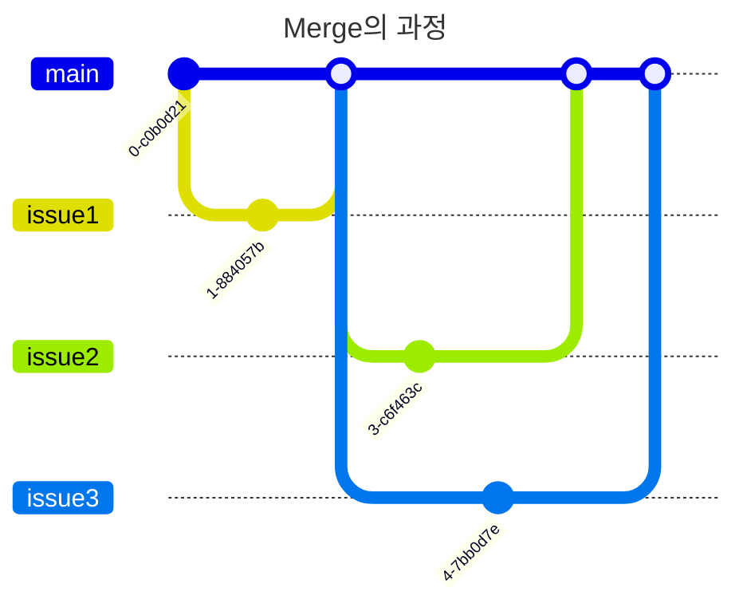
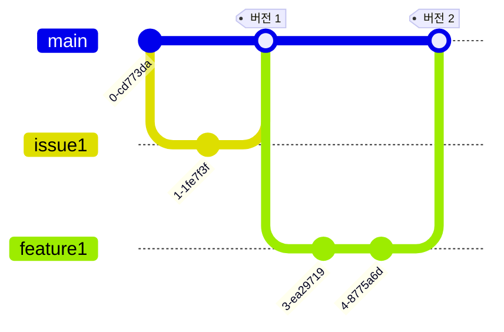

#git

## Git 명령어
- `git branch`: 브랜치 목록 및 현재 브랜치 확인
	- `-d <branch_name>`: `<branch_name>` 브랜치 삭제
- `git checkout <branch_name>`: `<branch_name>` 브랜치 HEAD로 이동
	- `-b <branch_name>`: `<branch_name>` 브랜치를 생성하고 이동
- `git merge <branch_name>`: 현재 브랜치를 기준으로 `<branch_name>` 브랜치를 가져와 병합
- `git reset`: 이전 스테이징 상태로 되돌린다.
	- `--hard`: 커밋, 현재 파일 변경 상태를 완전히 지우고 되돌아가는 옵션
- `git rebase`: 베이스(기초), 뿌리를 변경하는 것

## HEAD
- 현재 브랜치의 가장 최근 커밋을 의미한다.
- 이 HEAD를 기준으로 포인터를 상대 경로로 이동할 수 있다.

## Merge
- 브랜치는 구성 요소 별로 나누어서 작업을 용이하게 한다.
- 머지는 이 각각의 브랜치를 하나의 리포지토리로 병합하는 작업을 의미한다.
- 다른 브랜치를 가져와서 병합하기 때문에, 병합할 브랜치에서 명령어를 입력 해야한다.
- 병합할 때 충돌 시 충돌 부분을 수정 해야한다.
- 병합 자체도 수정 사항으로 보기 때문에 스테이징 해야한다.


## Rebase
- 현재 브랜치의 뿌리를 옮기는 것
- 머지와 결과는 같다.
- `issue3`에서 `main` 브랜치로 뿌리를 옮기는 것
- 머지와 마찬가지로 스테이징 상태로 변경 해야하는데, `git rebase --continue`를 통해 스테이징 상태로 변경할 수 있다.

## Pull
- Remote의 변경 사항을 로컬 저장소에 덮어 씌운다.

## Fetch
- Remote의 변경 사항을 읽기만 한다.

## Tag
- 커밋에 태그를 붙일 수 있다.
- 주로 버전 관리를 한 눈에 알아볼 수 있게 사용함


---

#github
## 대문 꾸미기
- Username과 동일한 이름의 레포지토리를 생성하면 대문이 된다.
- 해당 리포지토리에 `README.md`을 수정하면 됨

---
#dart

## Dart 코딩 컨벤션
- 문자열은 홑따옴표(`'`)로 감싸서 사용
- 파일명은 단어와 언더바를 이용
	- `dart_file.dart`

## 타입 추론
- `var` 키워드로 선언함
- `var` 키워드로 선언한 변수는 다른 타입으로 변경 불가
- 사용 권장하지 않음

## Object
- `null`을 제외한 모든 타입의 부모, 최상위 객체
- 최상위 객체이므로 다형성에 의해 어떤 값이든 할당 가능
- 정확히는 `nullable` 하지 않은 모든 클래스의 부모 클래스

## 상수

> 변수가 늘수록 버그 발생률이 기하급수적으로 늘어난다.
> 따라서 최대한 상수를 사용해야 한다.
- `final`
	- 런타임 상수
	- 실행 시점에 할당 된 값이 변하지 않음
- `const`
	- 컴파일타임 상수
	- 값이 변하지 않음

## Extension
- Dart는 공식적으로 래퍼 클래스를 지원하지 않음
- `extension`과 `on`키워드를 통해 특정 타입을 확장할 수 있음

```dart
extension MyIntExtension on int {
	bool get isEven => this % 2 == 0;
	int get square => this * this;
	
	bool get isPrime {
		for (int i = 2; i < this; i++) {
			if (this % i == 0) {
				return false;
			}
		}
		
		return true;
	}
	
	int multiple(int x) {
		return this * x;
	}
}

void main() {
	int number = 4;
	int prime = 1009;
	
	print(number.isEven); // true
	print(number.square); // 16
	print(number.isPrime); // false
	print(prime.isPrime); // true
	print(number.multiple(2)); // 8
}
```