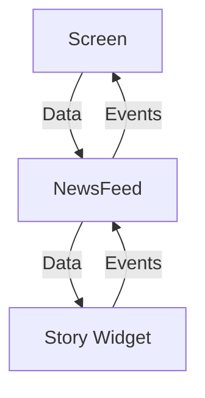
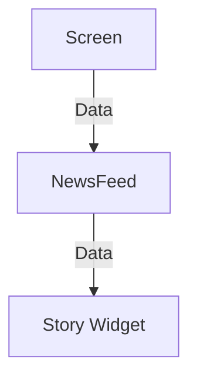
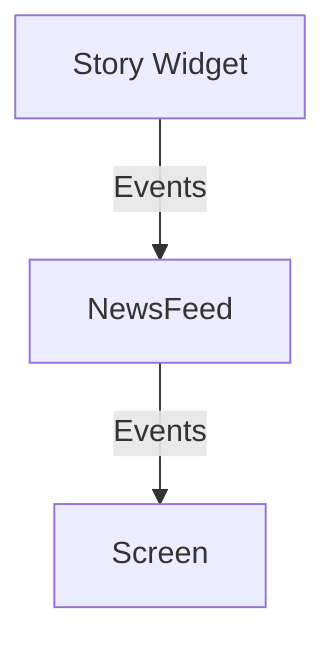

#flutter

## 상태 없는 Widget 작성 규칙
- UI 작성 규칙을 정하지 않으면 정말 아무렇게나 UI를 짜게 됨
- 이 규칙을 항상 지키면 좋은 UI 코드 유지 가능
- 콜백을 잘 작성하게 됨
- **재사용 가능한** UI 코드 작성 가능
- **테스트 가능한** UI 코드 작성 가능


### 데이터의 흐름



- 대부분의 위젯은 Stateless이며 getter, setter를 노출하지 않는다.
- 생성자로 데이터를 받아 UI를 갱신하며 데이터는 생성자를 통해 전달받음
- 데이터가 변경되면 UI는 업데이트 된다.

### 이벤트의 흐름
- 사용자와 UI의 인터랙션시 onTap 등 이벤트 발생
- 이벤트는 콜백 함수를 통해 외부의 앱 로직에 전달하고 로직은 앱의 상태를 변경
- 상태가 변경되면 변경된 상태를 다시 그린다.
- 즉, 이벤트 처리의 경우 콜백을 사용


## Stateless 컴포넌트 작성 규칙
### 1. 컴포넌트는 가능한한 Stateless를 유지한다

- 생성자를 통해 표시할 데이터를 전달받고 이러한 상태는 변경되지 않도록 유지한다.
- 가능하면 불변 모델 클래스를 데이터로 받는다.
	
### 2. StatelessWidget 내부에서 앱의 상태를 변경하지 않는다.

- 유저 인터랙션을 통한 화면 이동, 데이터 변경 등 상태 변경 행위 금지

### 3. 유저 인터랙션으로 상태 변경이 필요할 때는 콜백함수를 통해서 외부에서 노출한다.

- 콜백을 통해 이벤트를 밖으로 내보내기만 하고, 외부에서 처리하도록 한다.

## 위젯 작성 규칙을 지킬 경우 얻는 이점
- MVVM 패턴 적용시 동일한 규칙으로 UI를 유지할 수 있다.
- 테스트 가능한 UI 작성
- 성능 향상
- UI 로직의 통일성
- 유지보수의 용이성

---
## UI 테스트
> [!warning] 테스트 시 MaterialApp이 없으면 실패

- 위젯을 테스트 할 때는 testWidget()
- pumpWidget(): runApp()에 해당
- find의 메서드와 다양한 매처를 통해서 테스트 가능
### 이벤트 테스트 예시


---
## Directory 구조
- data
	- data_source
	- model
	- repository
- presentation
	- component (공통 컴포넌트)
	- sign_in (필요하면 화면 단위로 디렉토리 구성)
	- sign_up (필요하면 화면 단위 디렉토리 구성)
- ui (앱 전체에 적용할 속성을 ui 폴더에 별도 작성하여 관리, 색상, 폰트, 테마 등)
	- color_styles.dart 
	- text_styles.dart

### 색상 스타일 정의 예시
```dart
abstract class ColorStyles {
	static const Color black = Color(0xFF000000);
	static const Color gray1 = Color(0xFF484848);
}
```

### 글자 스타일 정의 예시

```dart
abstract class TextStyles {
	static const TextStyle titleTextBold = TextStyle(fontSize: 50, fontWeight: FontWeight.bold, fontFamily: 'Poppins');
	static const TextStyle headerTextBold = TextStyle(fontSize: 30, fontWeight: FontWeight.bold, fontFamily: 'Poppins');
}
```

### 테마 빌더
- [Material Theme Builder](https://material-foundation.github.io/material-theme-builder/)
- 구글은 머리티얼3 테마를 사용하는 것을 추천
- 실제로는 디자이너와 협업을 위해 자체 정의하는 것이 편함

### 폰트 적용
- [공식 문서](https://docs.flutter.dev/ui/design/text/typography)
- [패키지 - google_fonts](https://pub.dev/packages/google_fonts)
- [프로젝트에 폰트 삽입](https://docs.flutter.dev/cookbook/design/fonts)
	- 폰트 성능 개선 시 const로 TextStyle 선언 가능

### 디자이너와 협업
- 협업 시 일반적으로 피그마 사용
- 스타일 가이드 필수 (폰트 사이즈나, 색상 등)


## 참고
- [Flutter - Widget Test](https://docs.flutter.dev/cookbook/testing/widget/introduction)