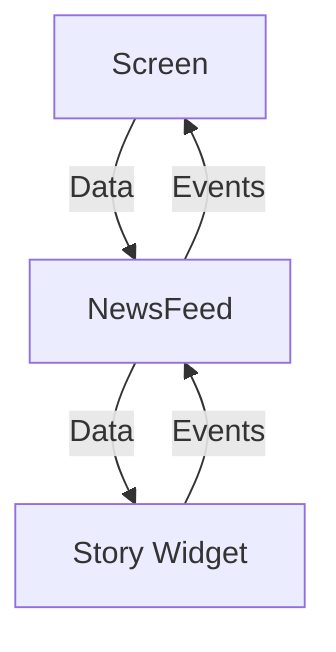

#flutter

## 상태 없는 Widget 작성 규칙
- UI 작성 규칙을 정하지 않으면 정말 아무렇게나 UI를 짜게 됨
- 이 규칙을 항상 지키면 좋은 UI 코드 유지 가능
- 콜백을 잘 작성하게 됨
- **재사용 가능한** UI 코드 작성 가능
- **테스트 가능한** UI 코드 작성 가능

### 데이터의 흐름

- 대부분의 위젯은 Stateless이며 getter, setter를 노출하지 않는다.
- 생성자로 데이터를 받아 UI를 갱신하며 데이터는 생성자를 통해 전달받음
- 데이터가 변경되면 UI는 업데이트 된다.

### 이벤트의 흐름
- 사용자와 UI의 인터랙션시 onTap 등 이벤트 발생
- 이벤트는 콜백 함수를 통해 외부의 앱 로직에 전달하고 로직은 앱의 상태를 변경
- 상태가 변경되면 변경된 상태를 다시 그린다.
- 즉, 이벤트 처리의 경우 콜백을 사용

## 컴포넌트는 가능한한 Stateless를 유지한다
- 생성자를 통해 표시할 데이터를 전달받고 이러한 상태는 변경되지 않도록 유지한다.
- 가능하면 불변 모델 클래스를 데이터로 받는다.
