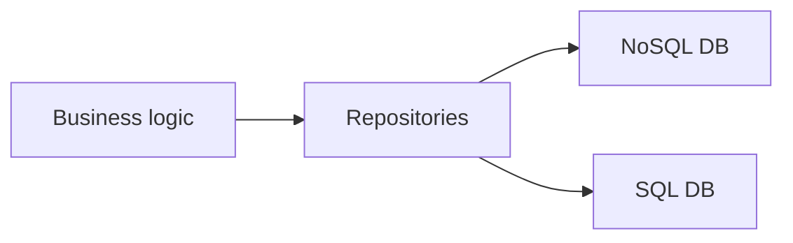
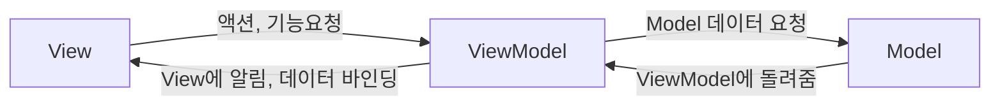
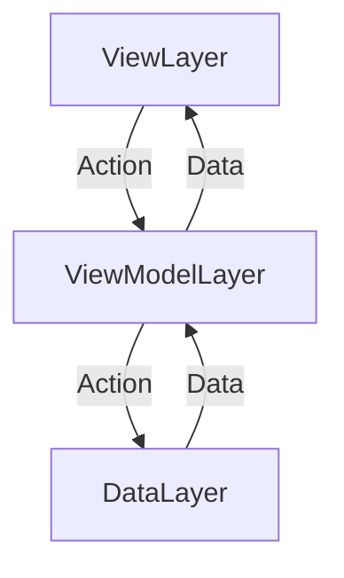

#flutter #architecture #mvvm

# MVVM Architecture
- 현재 모바일 앱에 가장 적합한 아키텍처 중 하나

### 비즈니스 로직을 처리하는 클래스




- `Repository`는 여러 화면에서 다양하게 활용될 수 있도록 만들고
- 특정 화면에서 필요한 데이터를 다시 정리하여 `View`에 전달하는 역할을 하는 클래스를 `ViewModel`이라 한다.
- 내일 디자인이 바뀌어도 `Repository`를 변경할 필요가 없어야한다.

### 각 레이어의 역할



- View
	- UI 화면
	- ViewModel의 데이터에 의해 자동으로 화면 갱신
- ViewModel
	- 앱 화면 비즈니스 로직
	- Repository를 이용하여 UI 관련 비즈니스 로직을 작성
	- View에서 해야할 동작들 정의
	- 데이터가 변경되면 View에 알림
- Model
	- 데이터 비즈니스 로직
	- DB, 파일, 서버와의 통신 등
	- 주로 Repository라고 함

### 데이터와 액션의 흐름 관계


- 아키텍쳐의 핵심은 단방향 의존성
- Action과 Data의 명확하고 일관된 흐름

## ViewModel의 역할
- 모델에서 제공한 데이터를 UI로 표시하기 쉬운 형태로 변환 (Facade, 복잡한 로직을 숨겨줌)
- 여러가지 상태를 캡슐화
	- 화면에 표시할 데이터
	- 로딩 상태
- View에서 발생하는 액션(이벤트) 처리의 캡슐화


> [!note] 
> - ViewModel은 단지 화면(View)에 대한 로직(Model)일 뿐
> - 하나의 화면(View)에 하나의 ViewModel이 일반적이다.
> - 화면(View)와 로직을 분리 한 것

### ViewModel 작성
- Flutter에서 제공하는 옵저버 패턴을 구현한 상태 알림용 클래스 `ChangeNotifier`
- notifyListeners()를 호출하여 변경사항을 알림
- 데이터바인딩 구현의 핵심
- 수업에서는 ViewModel 작성에 활용

### 예시 코드

```dart
class TodoViewModel with ChangeNotifier {
	final TodoRepository _todoRepository;
	TodoViewModel(this._todoRepository);
}
```
- `with`는 상속의 하나의 부모만 가질 수 있는 상속의 제약을 해결하기 위한 기능
- `with`를 사용하면 `with` 대상의 기능만을 추가함


- Screen은 Scaffold를 반환해야 UI가 정상 렌더

- ListenableBuilder
	- ChangeNotifier의 알림 이벤트를 자동으로 감지해서 위젯 빌드해주는 위젯

--- 
## 참고
- [Flutter - App architecture](https://docs.flutter.dev/app-architecture/guide)
- [Microsoft - MVVM(Model-View-ViewModel)](https://learn.microsoft.com/ko-kr/dotnet/architecture/maui/mvvm)
- [ChangeNotifier class](https://api.flutter.dev/flutter/foundation/ChangeNotifier-class.html)
