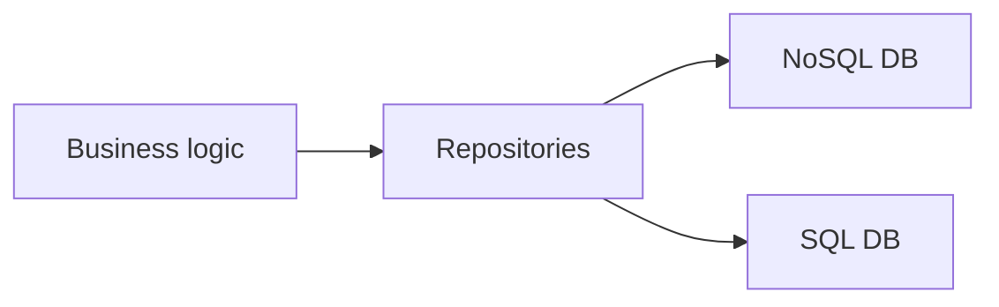
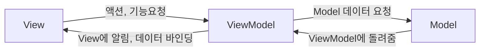

#flutter #architecture #mvvm

## MVVM Architecture
- 현재 모바일 앱에 가장 적합한 아키텍처 중 하나

### 비즈니스 로직을 처리하는 클래스

- `Repository`는 여러 화면에서 다양하게 활용될 수 있도록 만들고
- 특정 화면에서 필요한 데이터를 다시 정리하여 `View`에 전달하는 역할을 하는 클래스를 `ViewModel`이라 한다.
- 내일 디자인이 바뀌어도 `Repository`를 변경할 필요가 없어야한다.

### 각 레이어의 역할

- View
	- UI 화면
	- ViewModel의 데이터에 의해 자동으로 화면 갱신
- ViewModel
	- 앱 화면 비즈니스 로직
	- View에서 해야할 동작들 정의
	- 데이터가 변경되면 View에 알림
- 

--- 
## 참고
- [Flutter - App architecture](https://docs.flutter.dev/app-architecture/guide)
