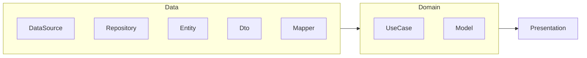
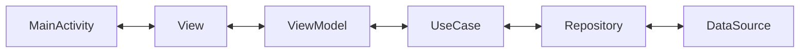

#flutter

## 클린 아키텍쳐
- 기능만 잘 만들고 구조를 신경 쓰지 않으면, 나중에 수정하거나 확장하기 어렵다.
	- 핵심 개념
	- SRP
	- DIP
	- 계층 간 명확한 분리

### 클린 아키텍쳐 레이어

- 디자인 보고, 도메인 도출 (Repository, Model 등)

### Usecase
- 하나의 기능만 수행하는 비즈니스 로직 클래스
- ViewModel 대신 실제 동작을 처리
- 여러 ViewModel에서 재활용 가능
- 기존 ViewModel의 비즈니스 로직 메서드를, 클래스로 빼는 것

### 공통 기능 
- core 디렉토리에 공통 부분 작성
