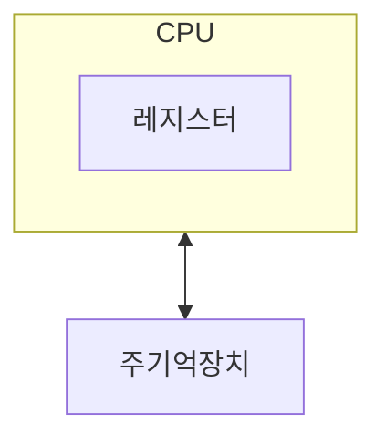
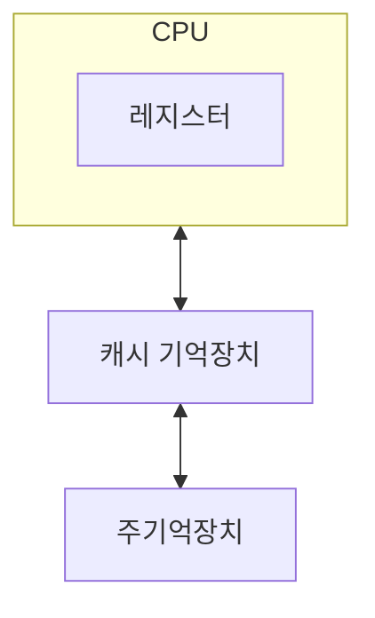
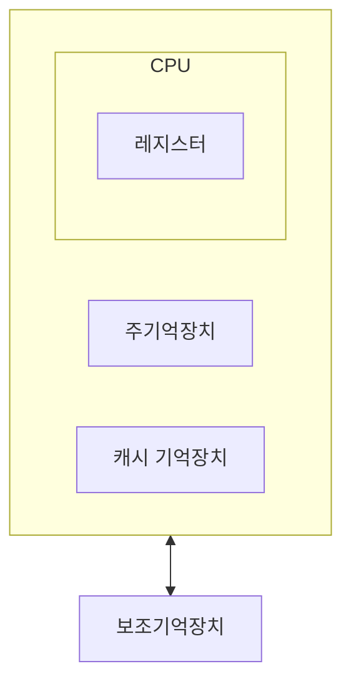

#lecture 

## 보조기억장치의 필요성

### 대용량의 기억 장치가 필요
- 주기억장치는 프로그램 및 데이터를 모두 수용하기에는 충분하지 않음
- 사회 전반적으로 컴퓨터 응용 영역이 넓어짐

### 비휘발성 기억장치
- 전원 공급 없이 데이터를 보관할 수 있어야 함 (SSD, HDD 등)
### 주기억장치의 효율적 사용

- 지역성의 원리 활용
	- 프로그램은 보조기억장치에 저장
	- 프로그램을 실행하면 주기억장치에 프로그램을 로드
- 기억장치의 계층 구조
	- CPU가 실행해야 할 명령어나 데이터를 주기억장치에서 필요할 때 레지스터로 가져와 계산
- CPU와 주기억장치의 속도 차이
	- CPU는 주기억장치에 비해 수십배 정도 빠름
	- 따라서 주기억장치가 명령어나 데이터를 전달하는 속도가 CPU 입장에서는 너무 느리다
	- 따라서 중간에 캐시 기억장치를 둠

- 캐시 기억장치는 지역성의 원리를 활용해서, CPU가 연산에 활용해야하는 지역에 해당하는 부분만 캐싱
- 캐시 기억장치를 이용하면서 CPU의 연산 속도가 더 빠르게 됨
- 마찬가지로 주기억장치도 모든 데이터와 명령어를 가지고 있을 필요가 없음
- 결과적으로 지역성의 원리를 활용해서 다음과 같은 계층 구조가 만들어지게 됨

- 위로 갈수록 접근(Access) 속도가 빠름
- 계층 구조의 위쪽에 해당할수록 접근(Access) 속도가 빠르고, 가격 또한 비쌈
- 낮을 수록 접근 속도가 느리고
