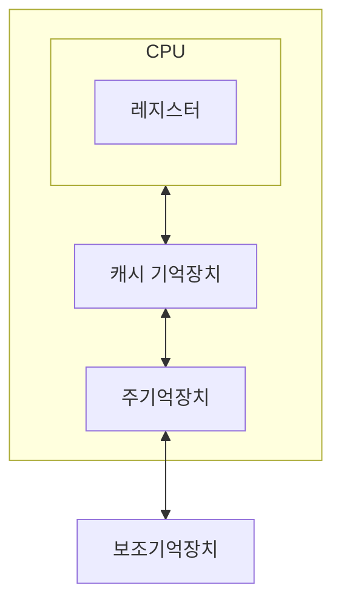

#lecture 

## 보조기억장치의 필요성

### 대용량의 기억 장치가 필요
- 주기억장치는 프로그램 및 데이터를 모두 수용하기에는 충분하지 않음
- 사회 전반적으로 컴퓨터 응용 영역이 넓어짐

### 비휘발성 기억장치
- 전원 공급 없이 데이터를 보관할 수 있어야 함 (SSD, HDD 등)
### 주기억장치의 효율적 사용

- 기억장치 계층구조
	- 지역성의 원리 (연산 또는 필요한 데이터를 각 계층에 미리 올려놓고 필요할 때 상위 계층에서 로드하여 사용, 지역적으로 이루어지기 때문에 효율적이고 속도가 빠름)
- 계층 구조의 위쪽에 해당할수록 접근 속도가 빠르고, 가격이 비싸며, 용량이 작음
- 계층 구조의 아래에 해당할수록 접근 속도가 느리고, 가격이 싸고, 용량이 큼

## 보조기억장치의 종류

| 접근 방식 | 매체 형태  |              매체 종류               |
| :---: | :----: | :------------------------------: |
|  순차   | 자기테이프  | 릴 테이프 카트리지 테이프(DAT, DLT, LTO) |
|  직접   | 자기 디스크 |          플로피디스크, 하드디스크           |
|  직접   | 광 디스크  |       CD-ROM, DVD, Blu-ray       |
|  직접   | 기타 매체  |                                  |

