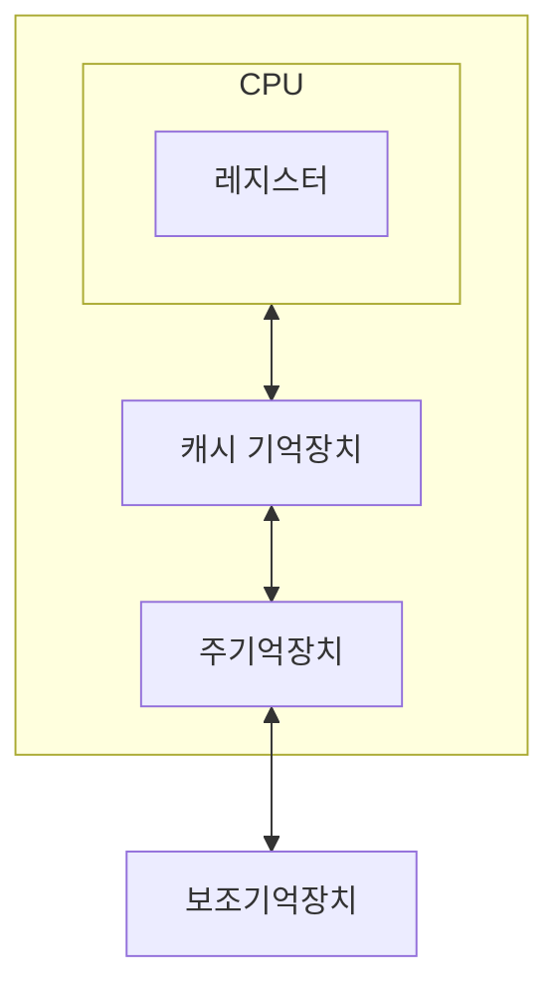

#lecture 

## 보조기억장치의 필요성

### 대용량의 기억 장치가 필요
- 주기억장치는 프로그램 및 데이터를 모두 수용하기에는 충분하지 않음
- 사회 전반적으로 컴퓨터 응용 영역이 넓어짐

### 비휘발성 기억장치
- 전원 공급 없이 데이터를 보관할 수 있어야 함 (SSD, HDD 등)
### 주기억장치의 효율적 사용

- 기억장치 계층구조
	- 지역성의 원리 (연산 또는 필요한 데이터를 각 계층에 미리 올려놓고 필요할 때 상위 계층에서 로드하여 사용, 지역적으로 이루어지기 때문에 효율적이고 속도가 빠름)
- 계층 구조의 위쪽에 해당할수록 접근 속도가 빠르고, 가격이 비싸며, 용량이 작음
- 계층 구조의 아래에 해당할수록 접근 속도가 느리고, 가격이 싸고, 용량이 큼

## 보조기억장치의 종류

| 접근 방식 | 매체 형태  |              매체 종류               |
| :---: | :----: | :------------------------------: |
|  순차   | 자기테이프  | 릴 테이프 카트리지 테이프(DAT, DLT, LTO) |
|  직접   | 자기 디스크 |          플로피디스크, 하드디스크           |
|  직접   | 광 디스크  |       CD-ROM, DVD, Blu-ray       |
|  직접   | 기타 매체  |           플래시 메모리, SSD           |

| 접근 방식 |                     설명                     | 속도  |                   방식                    |
| :---: | :----------------------------------------: | :-: | :-------------------------------------: |
| 순차 접근 |        앞에서부터 뒤로 차례로 데이터를 읽어들이거나 사용         | 느림  | 물리적 순서에 따라 데이터를 저장하고 기록된 순서에 따라 읽을 수 있음 |
| 직접 접근 | 데이터가 있는 위치에 직접 접근해서 원하는 위치의 데이터를 직접 읽거나 사용 | 빠름  |   데이터의 위치를 지정하여 데이터를 저장하거나 읽어 낼 수 있음    |

#### 하드 디스크
- 액츄에이터 암, 읽기·쓰기 헤드, 디스크로 이루어 짐
- 각각의 트랙으로 나누어진 기록면 위에서 이동하여 원하는 위치에서 읽기·쓰기를 함
	- 디스크의 표면에는 여러 개의 원형 트랙이 배열 됨
	- 각 트랙은 정해진 양의 데이터를 저장하는 구획인 섹터로 나뉨 (예전에 윈도우 OS에서 배드섹터, 조각모음을 떠올려보자)
- 내부의 기계 장치 속도에 비례하기 때문에 하드디스크 성능은 물리적으로 한계가 존재
	- 탐색시간: 읽기·쓰기 헤드가 지정된 트랙으로 이동하는데 걸리는 시간
	- 회전지연시간: 디스크가 회전하여 데이터 위치가 헤드에 도달하는 시간, 디스크의 회전 속도에 따라 결정됨
	- 전송시간: 주기억장치와 하드디스크 사이에 데이터를 전송하는 데 소비되는 시간

#### 광 디스크
- 레이저를 이용하여 기록면에서 데이터를 읽음 (CD, DVD 등)
- 한 장의 마스터로부터 대용량 데이터를 인쇄하듯 찍어내어 대량 생산 가능
	- 음악, 영화, 프로그램 설치 디스크 등을 저렴한 비용으로 제작하여 배포 가능

|               종류               |                         특성                         |                   |
| :----------------------------: | :------------------------------------------------: | :---------------: |
|   ROM (Read Only Memory)    |        제작 단계에서 한 번만 기록 가능 내용의 추가나 수정 불가         |  상업용으로 제작된 CD 등   |
| WORM (Write Once Read Many) | 공백 상태로 제작된 디스크에 1회에 한해 기록 가능 데이터의 영구적 기록을 위해 사용 | 게임 구울 때 사용하던 공 CD |
|       RW (ReWritable)       |   디스크에 반복적으로 쓰고 지울 수 있음 약 1,000회 정도의 재 기록 가능    |   이건 사용해본적 없는듯    |

#### 반도체 기억장치

|                         |                         특징                          |                                           장점                                            |                                                                                            |
| :---------------------: | :-------------------------------------------------: | :-------------------------------------------------------------------------------------: | ------------------------------------------------------------------------------------------ |
|       USB 플래시 메모리       |       전기적으로 데이터를 지우고 다시 기록할 수 있는 비휘발성 반도체 메모리       |                컴퓨터가 켜진 상태에서 자유롭게 연결·분리 가능  크기가 작고 가벼워 휴대용 저장장치로 적합                |                                                                                            |
| SSD (Solid-State Drive) | 자기디스크와 동일한 인터페이스를 가지나, 디스크 대신 반도체 메모리를 사용하여 데이터를 저장 | 움직이는 기계 부품이 없기 때문에 내구성이 강하고 전력 소모가 적음  마찬가지로 기계 부품이 없어 데이터를 읽는 시간이 매우 빠르고 무게가 가벼움 | 기록과 삭제 횟수가 한정되어 수명이 짧음  데이터 기록시 먼저 블록 삭제를 한 후 쓰기를 수행하므로 읽기와 쓰기 속도가 비대칭  가격이 비쌈 |

#### 클라우드 저장장치
- 클라우드 컴퓨팅: 인터넷을 기반으로 컴퓨터의 연산능력, 저장공간, 서비스 등 다양한 컴퓨터의 자원을 언제 어디서나 필요한만큼 이용하고 비용을 지불하는 컴퓨팅 방식
- 클라우드 저장장치: 서비스를 제공하는 사업자는 다수의 분산된 저장장치로 거대한 저장공간을 구성

- 파일 호스팅 서비스
	- Google Drive, Microsoft OneDrive, DropBox, Apple iCloud 등
	- 개인 파일 저장 서비스 및 파일 동기화 및 공유 서비스
