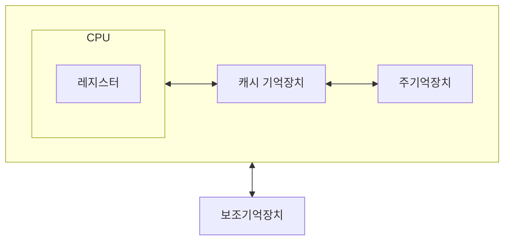

#lecture 

## 보조기억장치의 필요성

### 대용량의 기억 장치가 필요
- 주기억장치는 프로그램 및 데이터를 모두 수용하기에는 충분하지 않음
- 사회 전반적으로 컴퓨터 응용 영역이 넓어짐

### 비휘발성 기억장치
- 전원 공급 없이 데이터를 보관할 수 있어야 함 (SSD, HDD 등)
### 주기억장치의 효율적 사용

- 기억장치 계층구조
	- 
- 계층 구조의 위쪽에 해당할수록 접근 속도가 빠르고, 가격이 비싸며, 용량이 작음
- 계층 구조의 아래에 해당할수록 접근 속도가 느리고, 가격이 싸고, 용량이 큼
