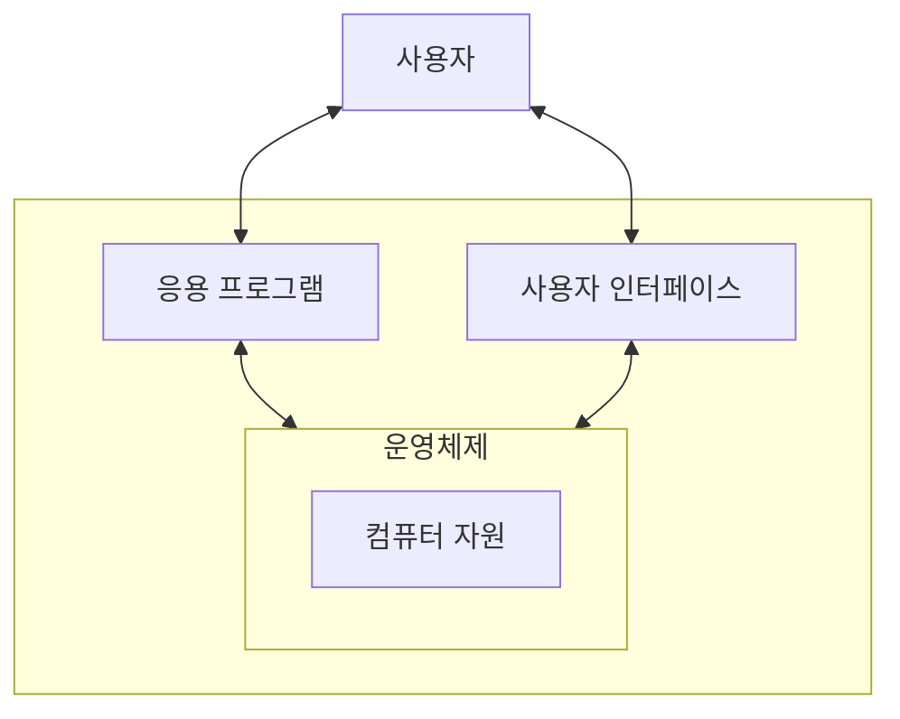
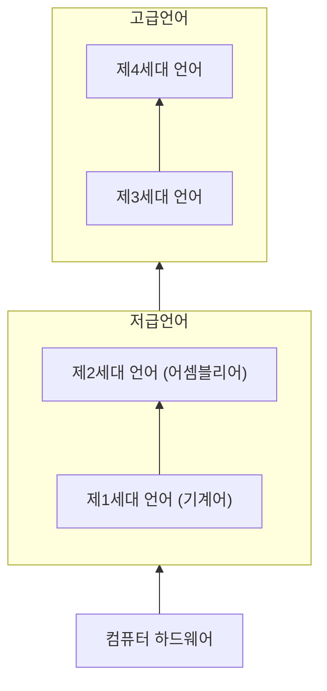

#lecture

## 소프트웨어의 종류

- 소프트웨어란?
	- 컴퓨터의 하드웨어가 다양한 목적의 작업을 수행할 수 있도록 지시하는 일련의 명령어로 구성된 다양한 종류의 프로그램 및 관련 데이터

### 응용 소프트웨어
- 일반적으로 사용하는 프로그램
	- 웹 브라우저, 문서 편집기 등
### 시스템 소프트웨어
- 하드웨어와 응용 소프트웨어 사이에서 조율
- 하드웨어를 운영하고, 응용 소프트웨어가 동작하기 위한 기반 구조를 형성하는 소프트웨어
- 대표적으로 운영 체제, 프로그래밍 언어번역기(컴파일러, 인터프리터) 등

#### 운영체제


- 운영체제는 컴퓨터가 동작하는 동안 항상 실행되고 있음
	- 컴퓨터에 전원이 들어오면 BIOS 실행
	- Booting (운영체제를 메모리에 적재)

|           운영체제의 역할            |
| :---------------------------: |
| 사용자가 컴퓨터와 대화할 수 있도록 인터페이스를 제공 |
|       컴퓨터의 하드웨어 장치를 관리        |
|        파일시스템을 관리하고 보존         |
| 프로그램들이 원활하게 실행될 수 있도록 관리하고 지원 |

##### 대화형 인터페이스 제공
- 컴퓨터의 전문가가 아닌 일반인들도 편리하고 직관적으로 사용할 수 있도록 명령어 인터페이스 (Command-Line Interface)가 아닌 GUI(Graphical User Interface)를 제공

##### 컴퓨터의 하드웨어 자원 관리
- 주기억장치의 관리
- 디스플레이, 키보드, 마우스, 오디오 장치, 프린터, 네트워크, 보조기억장치 등의 관리

##### 파일시스템 관리
- 폴더 관리
- 파일 생성, 복사, 삭제
- 파일 검색
- 백업 및 복구

#### 언어 번역기
- 프로그래밍 언어로 작성된 프로그램을 컴퓨터가 실행할 수 있는 기계어 코드로 변환하는 프로그램
- 원시 프로그램 (프로그래밍 언어로 작성된 소스) -> 목적(object) 프로그램

##### 컴파일러
- 원시 프로그램 전체를 기계어 명령으로 구성된 목적 프로그램으로 번역
- 인터프리터에 비해 프로그램이 빠르게 실행 됨 (Java, Rust 등)

##### 인터프리터
- 프로그램의 문장 단위로 명령을 해석하여 실행
- 프로그램 번역을 기다리지 않고 즉시 실행 (Javascript, Python 등)

두 가지 방식을 혼합한 다양한 언어 번역기도 존재함


## 소프트웨어의 개발

### 프로그래밍 언어

#### 저급언어
##### 기계어
- 제1세대 프로그래밍 언어 (1GL)
- 기계중심의 언어
- 컴퓨터가 직접 이해하고 실행할 수 있는 2진 코드 형태의 언어

```
00000101 00010000 00000000
```

##### 어셈블리어
- 제2세대 프로그래밍 언어 (2GL)
- 마찬가지로 기계중심의 언어
- 2진 코드 형태의 기계어 명령을 알기 쉬운 기호로 표현

```asm
00000101 00010000 00000000

2세대 언어 (어셈블리어) -> ADD AX, 0010H
```

#### 고급언어
##### 제3세대 언어
- 문제 중심의 언어
- 사람에게 친숙한 문장 구조나 수식 표현을 사용
- 문제 해결 방식에 따라 다양한 프로그래밍 패러다임 존재
	- 절차적: `C`, `FORTRAN`, `COBOL`
	- 객체지향: `C++`, `Java` 등

```dart
ADD AX, 0010H

3세대 언어 -> if (a < 0) {
	print('음수')
}
```
##### 제4세대 언어
- 기존 순차적 고급언어에 비해 보다 높은 수준의 기능을 제공함으로 프로그래밍 노력이나 시간을 줄이기 위한 언어
- 데이터베이스의 검색, 리포트 생성, 데이터 조작 및 분석 등을 위한 언어

### 프로그래밍 언어의 추상화 단계


- 높은 세대의 언어는 낮은 세대의 언어를 몰라도 사용할 수 있도록 추상화 되어 있음

##### 제5세대 언어
- 인공지능의 구현이나 전문가 시스템을 만들기 위한 목적으로 개발된 프로그래밍 언어
- 주어진 문제에 대헤 제공된 규칙, 제약사항 등을 이용하여 문제를 해결하는 방식의 언어
- 실용적 응용에서 기대에 부응할 만한 결과를 만들어내는데 실패함

## 소프트웨어의 사용권
## 기업활동과 정보 시스템의 발전