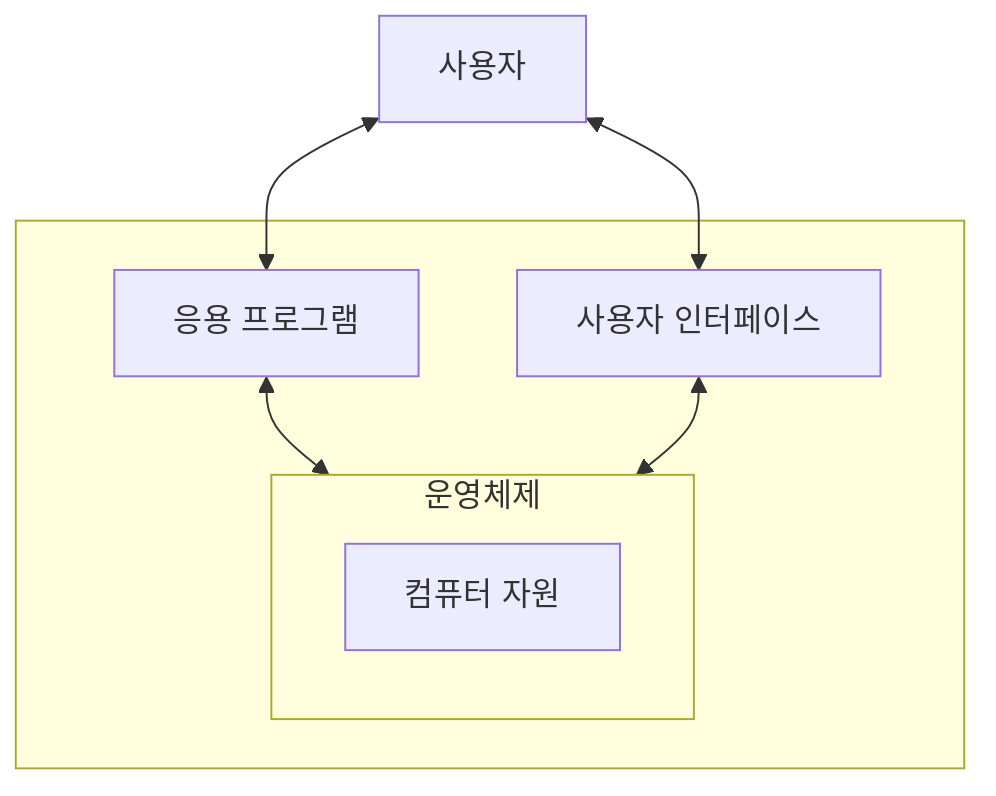

#lecture

## 소프트웨어의 종류

- 소프트웨어란?
	- 컴퓨터의 하드웨어가 다양한 목적의 작업을 수행할 수 있도록 지시하는 일련의 명령어로 구성된 다양한 종류의 프로그램 및 관련 데이터

### 응용 소프트웨어
- 일반적으로 사용하는 프로그램
	- 웹 브라우저, 문서 편집기 등
### 시스템 소프트웨어
- 하드웨어와 응용 소프트웨어 사이에서 조율
- 하드웨어를 운영하고, 응용 소프트웨어가 동작하기 위한 기반 구조를 형성하는 소프트웨어
- 대표적으로 운영 체제, 프로그래밍 언어번역기(컴파일러, 인터프리터) 등

#### 운영체제

- 운영체제는 컴퓨터가 동작하는 동안 항상 실행되고 있음
- 컴퓨터에 전원이 들어오면 BIOS 실행
- Booting (운영체제를 메모리에 )

## 소프트웨어의 개발
## 소프트웨어의 사용권
## 기업활동과 정보 시스템의 발전