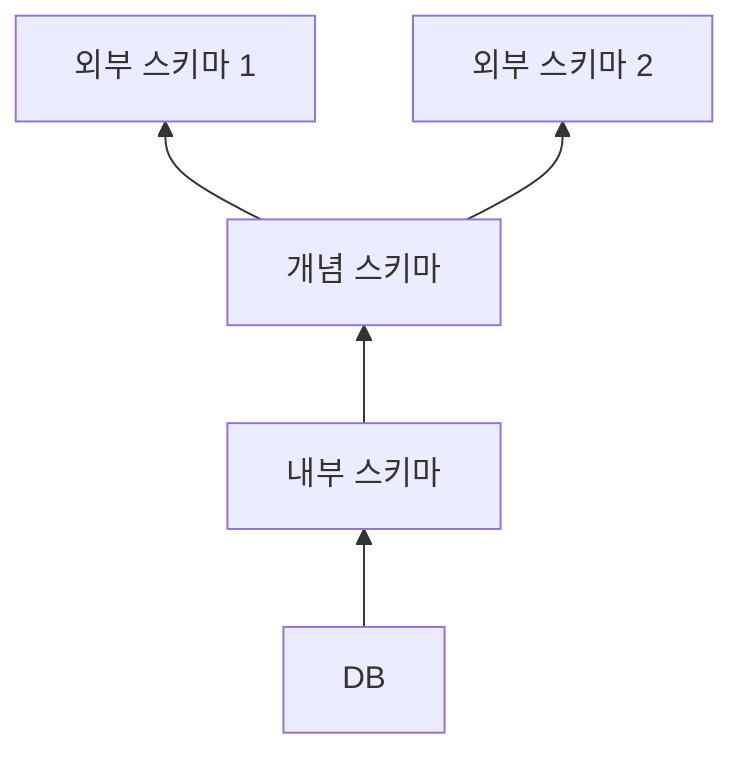

#lecture 

# 데이터베이스 개요
- 다양한 영역의 활동에 따른 매우 많은 양의 데이터 발생

## 파일
- 보조기억장치에 저장되어 있는 데이터의 집합
- 보관되어 있는 위치와 이름으로 접근하여 사용

### 파일 구조

|     구조      |               설명               |
| :---------: | :----------------------------: |
|   순차적 구조    |    앞에서부터 차례대로 데이터를 읽고 쓰는 구조    |
|   상대적 구조    | 키를 통해 상대주소로 변환하여 데이터를 읽고 쓰는 구조 |
| 인덱스된 구조  | 키를 통해 인덱스에 접근하여 데이터를 읽고 쓰는 구조  |

### 파일을 이용한 데이터 관리
#### 응용 프로그램 단위로 필요한 파일을 소유·관리
- 데이터가 프로그램에 종속됨
- 서로 다른 응용이 부분적으로 같은 데이터를 필요로 하는 경우 데이터의 중복이 발생함
- 예: 급여 관리 프로그램용 데이터와 인사관리 프로그램용 데이터의 경우 동일한 데이터를 두 프로그램 모두 필요로 할 경우가 존재함
- 이는 저장공간 낭비와 데이터의 모순이 발생할 수 있는 문제가 발생

## 데이터베이스란?
- 어떤 조직이나 단체를 유지하고 관리하는데 필수적인 관련 데이터의 집합
	- 논리적으로 연관된 하나 이상의 데이터의 집합
	- 데이터를 고도로 구조화함으로써 검색·갱신·관리를 효율화한 것

# 데이터베이스 관리 시스템
## 데이터베이스 관리 시스템(DBMS)이란?
- 응용프로그램과 데이터 간의 독립성을 유지하고, 다수 사용자에 의한 공용을 지원하는 소프트웨어 패키지

## 데이터베이스 관리 시스템의 역할
- 빠른 데이터의 저장, 검색, 갱신
- 데이터의 독립성 유지
- 데이터 공유 및 다수 사용자의 동시실행 제어
- 데이터의 빠르고 안전한 저장 및 파손 회복 능력 (복구 능력)
- 표준 질의언어, 질의처리 기능, 응용프로그램 개발환경 등 제공
- 데이터 보안

## 데이터베이스 관리 시스템의 필수 기능

### 데이터 정의
- 다양한 응용프로그램을 지원하기 위한 데이터베이스 구조를 정의하는 기능
	- 모든 응용프로그램을 위한 데이터의 논리적 구조 정의
	- 데이터베이스를 보조기억장치에 저장하기 위한 물리적 구조 정의
	- 데이터의 논리적 구조와 물리적 구조 사이의 매핑을 정의

### 데이터 조작
- 사용자의 요구에 따라 데이터베이스에 체계적으로 접근하고 조작하는 기능
	- 검색, 갱신, 삽입, 삭제 등의 연산을 지원하는 데이터 언어를 통해 지시

### 데이터 제어
- 공용 목적으로 관리되는 데이터베이스의 내용에 대한 정확성과 안전성을 유지하는 기능
	- 데이터의 무결성이 유지되도록 제어 (유일 키나 참조 키 등?)
	- 정당한 사용만 허가하기 위한 권한 검사 및 보안 유지
	- 여러 사용자의 동시 접근에 따른 정확성이 유지되도록 병행 제어 (LOCK 등)

## 데이터베이스 언어란?
- 데이터베이스에 대한 작업을 수행하는 특수 목적의 언어
- SQL(Structured Query Language) 관계형 데이터베이스 관리 시스템(RDBMS)에서 사용되는 데이터베이스 언어가 있다.

|                  DDL                  |                                 DML                                  |
| :-----------------------------------: | :------------------------------------------------------------------: |
|       Data Definition Language        |                      Data Manipulation Language                      |
| 데이터베이스의 스키마를 생성, 변경, 삭제할 목적으로 사용하는 언어 | DDL에 의해 정의된 데이터베이스에 대해 데이터의 삽입, 검색, 수정, 삭제 등의 처리를 하기 위한 목적으로 사용하는 언어 |
# 데이터베이스 스키마
## 데이터베이스 스키마(Schema)란?
- 데이터베이스에서 데이터의 구조, 데이터의 표현 방법, 제약조건 등을 정의한 것

### 3계층 스키마 구조

- 외부 스키마는 뷰라고도 함

# 데이터베이스 시스템의 장·단점

## 장점
### 데이터 중복의 최소화
- 데이터 일관성 확보
- 저장공간의 절감
### 데이터 독립성 보장
- 논리적 데이터 독립성
- 물리적 데이터 독립성
### 데이터의 일관성 및 무결성
- 데이터 중복을 최소화하여 일관성 유지
- 데이터 갱신시 DBMS의 중앙제어를 통해 유효성 검사
### 데이터의 공유
- 다양한 응용의 요구사항을 수렴한 통합적 개념 스키마를 통한 데이터 공유
### 데이터베이스의 사용자 인터페이스 표준화
- SQL에 의한 표준 사용자 인터페이스

## 단점
### 운영비의 증대
- 고가의 DBMS, 더 높은 CPU 성능과 큰 주기억장치가 필요

### 데이터 처리 방법의 복잡성
- 다양한 응용을 고려한 ㅓ 구조 설계가 가능한 고급 설계자 및 프로그래머가 필요함

# 데이터 웨어하우스