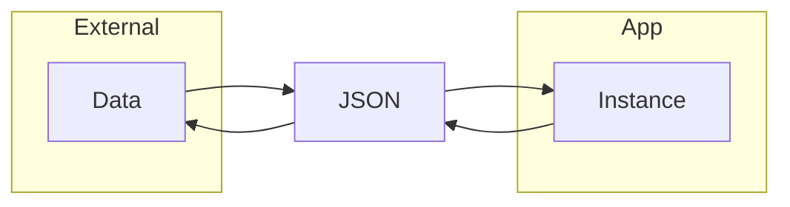

#dart #serialization

## 직렬화
- 데이터 구조나 객체 상태를 저장하고 나중에 재구성할 수 있는 포맷으로 변환하는 과정

- `jsonDecode()`, `jsonEncode()` 등의 내장 함수 존재
- Map 타입을 올바른 JSON 형식의 문자열로 변환하거나 JSON 형식을 Map 타입으로 변환
- `toJson()`, `fromJson()`이 관습적 표준 메서드 이름

---
[[파일 조작, 다양한 파일 형식]]