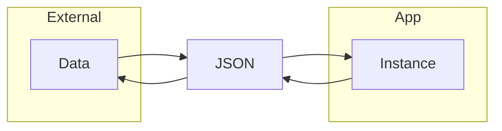

#dart #serialization

## 직렬화
- 데이터 구조나 객체 상태를 저장하고 나중에 재구성할 수 있는 포맷으로 변환하는 과정

```mermaid
graph LR

subgraph "External"
	Data
end

subgraph App
	Instance
end

JSON

Data --> JSON -->  Instance

Instance --> JSON --> Data 
```

- `jsonDecode()`, `jsonEncode()` 등의 내장 함수 존재, Map 타입을 올바문자열로 변환 해줌

---
[[파일 조작, 다양한 파일 형식]]