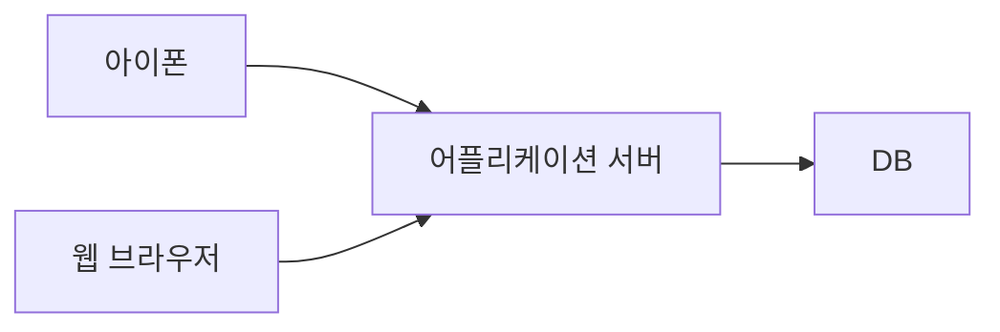
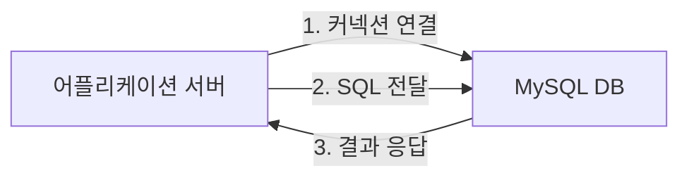
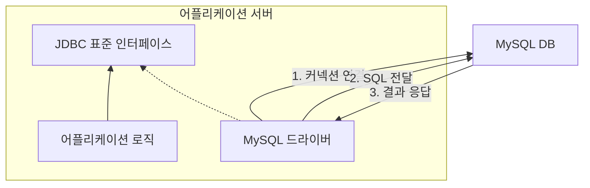
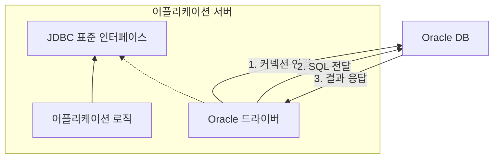
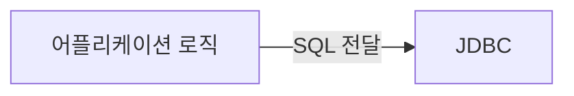
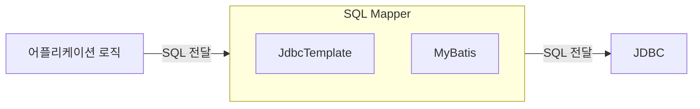
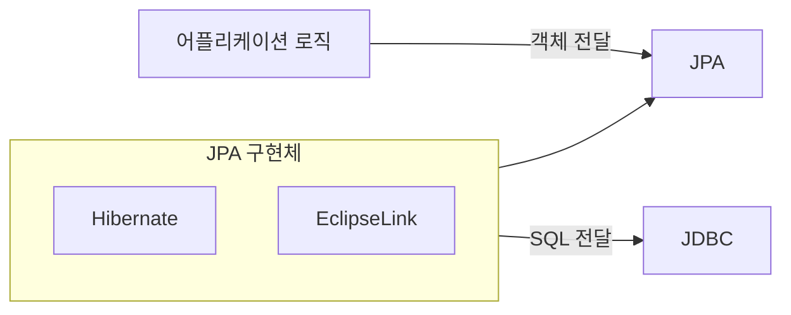

## 어플리케이션과 데이터베이스 기본 통신 구조

어플리케이션을 개발 할 때 중요한 데이터는 대부분 데이터베이스에 보관한다.



클라이언트가 어플리케이션 서버를 통해 데이터를 저장하거나 조회하면, 어플리케이션 서버는 다음 과정을 통해서 데이터베이스를 사용한다.



1. 커넥션 연결: 주로 TCP/IP를 사용해서 커넥션을 연결한다.
2. SQL 전달: 어플리케이션 서버는 DB가 이해할 수 있는 SQL을 연결된 커넥션을 통해 DB에 전달한다.
3. 결과 응답: DB는 전달된 SQL을 수행하고 그 결과를 응답한다. 어플리케이션 서버는 응답 결과를 활용한다.

## JDBC 등장 이유

먼저 과거로 돌아가서 JDBC는 왜 등장했는지부터 알아본다. 그러기 위해서는 다음과 같은 사실을 알아야 한다.

어플리케이션의 용도에 따라 사용할 수 있는 다양한 데이터베이스가 존재한다. 그런데 각각의 데이터베이스마다 커넥션을 연결하는 방법, SQL을 전달하는 방법, 그리고 결과를 응답 받는 방법이 모두 다르다.

여기에는 두 가지 큰 문제가 있다.

1. 데이터베이스를 다른 종류의 데이터베이스로 변경하면 어플리케이션 서버에 개발된 데이터베이스 사용 코드도 함께 변경해야 한다.
2. 개발자가 각각의 데이터베이스마다 커넥션 연결, SQL 전달, 그리고 결과를 응답 받는 방법을 새롭게 학습해야 한다.

이 문제를 해결하기 위해 `JDBC`라는 자바 표준이 등장했다.

## JDBC 표준 인터페이스

> JDBC(Java Database Connectivity)는 자바에서 데이터베이스에 접속할 수 있도록 하는 자바 API다.
>
> JDBC는 데이터베이스에서 자료를 쿼리하거나 업데이트하는 방법을 제공한다.

![[jdbc-1.png]]

`JDBC`는 다음 3가지 기능을 표준 인터페이스로 정의해서 제공한다.

- `java.sql.Connection`: 커넥션 연결
- `java.sql.Statement`: SQL을 담은 내용
- `java.sql.ResultSet`: SQL 요청 응답

자바는 이렇게 표준 인터페이스를 정의해두었다. 이제부터 개발자는 이 표준 인터페이스만 사용해서 개발하면 된다.

그런데 인터페이스만 있다고 해서 기능이 동작하지는 않는다. 그렇다고 JDBC 인터페이스를 사용하고 싶은 개발자가 매번 직접 개발해봐야 다른 이들이 구현한 코드와 동작이 매번 달라진다.

따라서 이 `JDBC` 인터페이스를 가지고 각각의 DB 벤더(제공 회사)에서 자신의 DB에 맞도록 구현해서 라이브러리로 제공하는데 이것을 `JDBC 드라이버`라 한다.

예를 들어서 MySQL DB에 접근할 수 있는 것은 `MySQL JDBC 드라이버`라 하고, Oracle DB에 접근할 수 있는 것은 `Oracle JDBC 드라이버`라 한다.

쉽게 말해 `JDBC 드라이버`는 `JDBC` 인터페이스의 구현체다.

**MySQL 드라이버 사용**



**Oracle 드라이버 사용**



이렇게 `JDBC`의 등장으로 두 가지 문제가 해결되었다.

1. 데이터베이스를 다른 종류의 데이터베이스로 변경하면 어플리케이션 서버의 데이터베이스 사용 코드도 함께 변경해야 하는 문제
2. 개발자가 각각의 데이터베이스마다 커넥션 연결, SQL 전달, 결과 응답 받는 방법을 새로 학습해야 하는 문제

**해결**

1. 어플리케이션 로직은 이제 `JDBC 인터페이스`에만 의존한다. 따라서 데이터베이스를 다른 종류의 데이터베이스로 변경하고 싶으면 `JDBC 인터페이스` 구현체만 변경하면 된다. 따라서 다른 종류의 데이터베이스로 변경해도 어플리케이션 서버의 로직은 그대로 유지할 수 있다.
2. 개발자는 `JDBC 인터페이스` 사용법만 학습하면 된다. 한번 배워두면 수십개의 데이터베이스에 모두 동일하게 적용할 수 있다.

> [!tip] 표준화의 한계
> `JDBC`의 등장으로 많은 것이 편리해졌지만, 각각의 데이터베이스마다 SQL 또는 데이터 타입등 일부 사용법이 다르다.
>
> ANSI SQL이라는 표준이 있기는 하지만 일반적인 부분만 공통화 했기 때문에 한계가 있다. 대표적으로 실무에서 기본으로 사용하는 페이징 SQL은 각각의 데이터베이스마다 사용법이 다르다.
>
> 결국 데이터베이스를 변경하면 `JDBC` 코드는 변경하지 않아도 되지만 SQL은 해당 데이터베이스에 맞도록 변경해야 하는 것이다. 참고로 JPA(Java Persistence API)를 사용하면 이렇게 각각의 데이터베이스마다 다른 SQL을 정의해야 하는 문제도 많은 부분 해결할 수 있다.

## JDBC와 최신 데이터 접근 기술

앞서서는 과거로 돌아가서 JDBC가 왜 등장했고, 어떤 문제들을 해결했는지 알아보았다. 그런데 `JDBC`는 1997년에 출시된 오래된 기술이고 사용하는 방법도 복잡하다.

최근에는 `JDBC`를 직접 사용하기 보다는 `JDBC`를 편리하게 사용하는 다양한 기술이 존재한다. 대표적으로 `SQL Mapper`와 `ORM` 기술로 나눌 수 있다.

#### JDBC 직접 사용



#### SQL Mapper



**SQL Mapper의 장점**

- JDBC를 편리하게 사용하도록 도와준다.
- SQL 응답 결과를 객체로 편리하게 변환해준다.
- JDBC의 반복 코드를 제거해준다.

**SQL Mapper의 단점**

- 개발자가 SQL을 직접 작성해야한다.
- 대표 기술: 스프링 JdbcTemplate, MyBatis

#### ORM



`ORM`은 객체를 관계형 데이터베이스 테이블과 매핑해주는 기술이다. 이 기술 덕분에 개발자는 반복적인 SQL을 직접 작성하지 않고 ORM 기술이 개발자 대신에 SQL을 동적으로 만들어 실행해준다. 추가로 각각의 데이터베이스마다 다른 SQL을 사용하는 문제도 중간에서 해결해준다.

- 대표 기술: `JPA`, `Hibernate`, `EclipseLink`
- `JPA`는 자바 진영의 `ORM` 표준 인터페이스이고, 이것의 구현체로 `Hibernate`와 `EclipseLink`등이 있다.

### SQL Mapper와 ORM의 장단점

`SQL Mapper`와 `ORM` 둘 다 각각 장단점이 있다.

쉽게 설명하자면 `SQL Mapper`는 SQL만 직접 작성하면 나머지 번거로운 일은 `SQL Mapper`가 대신 해결해준다. 따라서 `SQL Mapper`는 SQL만 작성할 줄 알면 금방 배워서 사용할 수 있다.

반면 `ORM`은 SQL 자체를 작성하지 않아도 되어서 개발 생산성이 매우 높아진다. 편리한 반면에 쉬운 기술은 아니므로 실무에서 사용하려면 깊이있게 학습해야 한다.

> [!error] JDBC를 반드시 학습해야 하는 이유
> 이런 기술들도 내부에서는 모두 `JDBC`를 사용한다. 따라서 `JDBC`를 직접 사용하지는 않더라도 `JDBC`가 어떻게 동작하는지 기본 원리를 알아두어야 한다. 그래야 해당 기술들을 더욱 깊이있게 이해할 수 있고, 무엇보다 문제가 발생했을 때 근본적인 문제를 찾아서 해결할 수 있다.
>
> 따라서 **JDBC는 자바 개발자라면 꼭 알아두어야 하는 필수 기본 기술**이다.

## 데이터베이스 연결

어플리케이션과 데이터베이스를 연결해본다.

먼저 데이터베이스에 접속하는데 필요한 기본 정보를 편리하게 사용할 수 있도록 다음과 같이 상수를 가지는 클래스를 만든다.

```java
public abstract class ConnectionConst {
    public static final String URL = "jdbc:h2:tcp://localhost/~/test";
    public static final String USERNAME = "sa";
    public static final String PASSWORD = "";
}
```

이 `ConnectionConst`는 다른 곳에서 생성자를 통해 생성할 수 없도록 추상 클래스로 만든다.

다음으로 `JDBC` 인터페이스를 사용해서 실제 데이터베이스에 연결하는 코드를 작성한다.

```java
@Slf4j
public class DBConnectionUtil {
    public static Connection getConnection() {
        try {
            Connection connection = DriverManager.getConnection(URL, USERNAME, PASSWORD);
            log.info("get connection = {}, class = {}", connection, connection.getClass());
            return connection;
        } catch (SQLException e) {
            throw new IllegalStateException(e);
        }
    }
}
```

데이터베이스에 연결하려면 `JDBC`가 제공하는 `DriverManager.getConnection(..)`를 사용하면 된다.

이렇게하면 라이브러리에 있는 데이터베이스 드라이버를 찾아서 해당 드라이버가 제공하는 커넥션을 반환해준다. 여기서는 H2 데이터베이스 드라이버가 작동해서 실제 데이터베이스와 커넥션을 맺고 그 결과를 반환해준다.

다음과 같이 간단히 학습용 테스트 코드를 만들어서 실행해보자.

```java
class DBConnectionUtilTest {

    @Test
    void getConnection() {
        Connection connection = DBConnectionUtil.getConnection();
        Assertions.assertThat(connection).isNotNull();
    }
}
```

테스트 `getConnection()`을 실행하면 다음과 같이 앞서 지정한 로그가 출력 된다.

```
url=jdbc:h2:tcp://localhost/~/test user=SA, class = class org.h2.jdbc.JdbcConnection
```

`class` 정보를 살펴보면 `org.h2.jdbc.JdbcConnection`인 것을 알 수 있는데, 이것이 바로 H2 데이터베이스 드라이버가 제공하는 H2 전용 커넥션이다.

## JDBC DriverManager 연결 이해

```java
Connection connection = DriverManager.getConnection(URL, USERNAME, PASSWORD);
```

앞서 `DriverManager.getConnection(..)`를 통해 드라이버를 찾고, 해당 드라이버를 통해 H2 데이터베이스 커넥션을 획득했다. 그런데 이 과정은 어떻게 처리되는 것일까?

`JDBC`가 제공하는 `DriverManager`는 라이브러리에 등록된 DB 드라이버 목록을 자동으로 인식한다.

`DriverManager.getConnection(URL, USERNAME, PASSWORD)`를 호출하면 `DriverManager`는 드라이버들에게 순서대로 입력된 파라미터 정보를 넘겨서 커넥션을 획득 할 수 있는지 확인한다. 다음의 그림은 이 과정을 간략히 표현한 그림이다.

![[jdbc-2.png]]

이제 `URL, USERNAME, PASSWORD` 정보를 전달 받은 드라이버는 다음과 같은 절차를 진행한다.

- `URL` 정보를 체크해서 본인이 처리할 수 있는 요청인지 확인한다. 예를 들어서 `URL`이 `jdbc:h2`로 시작하면 이것은 H2 데이터베이스에 접근하기 위한 규칙이다. 따라서 H2 드라이버는 본인이 처리할 수 있으므로 실제 데이터베이스에 연결해서 커넥션을 획득하고 이 커넥션을 클라이언트에 반환 한다.
- 만약 `URL`이 `jdbc:h2`로 시작했는데 MYSQL 드라이버가 먼저 실행되면 처리할 수 없는 `URL`이기 때문에 처리할 수 없다는 결과를 반환하고 다음 드라이버에게 순서가 넘어간다.

앞서 프로젝트에 H2 데이터베이스 드라이버 라이브러리만 등록했기 때문에 H2 드라이버가 제공하는 H2 데이터베이스 커넥션을 제공 받는다.

```gradle title="build.gradle"
runtimeOnly 'com.h2database:h2'
```

## JDBC 개발 - 등록

본격적으로 `JDBC`를 이용해서 어플리케이션을 개발해본다.

여기서는 `JDBC`를 이용해서 회원 데이터를 데이터베이스에 관리하는 기능을 개발한다.

```java title="Member.java"
@Data
public class Member {
    private String memberId;
    private int money;

    public Member() {
    }

    public Member(String memberId, int money) {
        this.memberId = memberId;
        this.money = money;
    }
}
```

다음으로 `JDBC`의 `DriverManager`를 사용해서 회원 객체를 데이터베이스에 저장하기 위해 저장소 클래스를 구현한다.

```java title="MemberRepositoryV0.java"
/**
 * JDBC - DriverManager 사용
 */
@Slf4j
public class MemberRepositoryV0 {

    public Member save(Member member) throws SQLException {
        String sql = "INSERT INTO member(member_id, money) VALUES(?, ?)";

        Connection connection = null;
        PreparedStatement preparedStatement = null;

        try {
            connection = getConnection();
            preparedStatement = connection.prepareStatement(sql);
            preparedStatement.setString(1, member.getMemberId());
            preparedStatement.setInt(2, member.getMoney());

		    preparedStatement.executeUpdate();

            return member;
        } catch (SQLException e) {
            log.error("db error", e);
            throw e;
        } finally {
            close(connection, preparedStatement, null);
        }
    }

    private void close(Connection connection, Statement statement, ResultSet resultSet) {
        if (resultSet != null) {
            try {
                resultSet.close();
            } catch (SQLException e) {
                log.info("error", e);
            }
        }

        if (statement != null) {
            try {
                statement.close();
            } catch (SQLException e) {
                log.info("error", e);
            }
        }

        if (connection != null) {
            try {
                connection.close();
            } catch (SQLException e) {
                log.info("error", e);
            }
        }
    }

    private static Connection getConnection() {
        return DBConnectionUtil.getConnection();
    }
}
```

**커넥션 획득**

- `getConnection()`: 이전에 만들어둔 `DBConnectionUtil`을 통해서 데이터베이스 커넥션을 획득한다.

**save() - SQL 전달**

- `sql`: 데이터베이스에 전달할 SQL을 정의한다. 여기서는 데이터를 등록해야 하므로 `Insert`문을 준비했다.
- `connection.prepareStatement(sql)`: 데이터베이스에 전달할 SQL과 파라미터로 전달할 데이터들을 준비한다.
  - `sql`: `INSERT INTO member(member_id, money) VALUES(?, ?)`
  - `preprareStatement.setString(1, member.getMemberId())`: SQL의 첫 번째 `?`에 입력되는 파라미터를 지정한다. 문자이므로 `setString()`을 사용한다.
  - `preprareStatement.setInt(2, member.getMoney())`: SQL의 두 번째 `?`에 입력되는 파라미터를 지정한다. `Int`형 숫자이므로 `setInt`를 지정한다.
- `prepareStatement.executeUpdate()`: `Statement`를 통해 준비된 SQL을 커넥션을 통해 실제 데이터베이스에 전달한다. 참고로 `executeUpdate()`는 `int`를 반환하는데 영향 받은 DB row 수를 반환한다. 여기서는 하나의 row를 등록했으므로 1을 반환한다.

**void close(Connection connection, Statement statement, ResultSet resultSet) - 리소스 정리**

쿼리를 실행하고 나면 반드시 리소스를 정리해야 한다. 여기서는 `Connection`, `PreparedStatement`를 사용했다. 리소스를 정리할 때는 항상 역순으로 해야한다.

`Connection`을 획득하고 `Connection`을 통해 `PreparedStatement`를 만들었기 때문에 리소스를 반환할 때는 `PreparedStatement`를 먼저 종료하고, 그 다음에 `Connection`을 종료하면 된다.

참고로 여기서 사용하지 않은 `ResultSet`은 결과를 조회할 때 사용한다.

> [!error] 리소스 누수
> 리소스 정리는 꼭 해주어야 한다. 따라서 예외가 발생하든, 하지 않든 항상 수행되어야 하므로 `finally` 구문에 주의해서 작성 해야한다.
> 만약 이 부분을 놓치게되면 커넥션이 끊어지지 않고 계속 유지되는 문제가 발생할 수 있다.
>
> 이런 것을 리소스 누수라고 하는데, 커넥션 부족으로 장애가 발생 할 수 있다.

> [!tip] Statement와 PreparedStatement
> `PreparedStatement`는 `Statement`의 자식 타입인데, `?`를 통한 파라미터 바인딩등의 기능을 제공한다.
>
> 참고로 `SQL Injection` 공격을 예방하려면 `PreparedStatement`를 통한 파라미터 바인딩 방식을 사용해야 한다.

이제 테스트로 코드를 실행해서 `JDBC`로 회원을 등록해보자.

```java title="MemberRepositoryV0Test.java"
class MemberRepositoryV0Test {
    MemberRepositoryV0 repository = new MemberRepositoryV0();

    @Test
    void crud() throws SQLException {
        Member member = new Member("memberV0", 10000);
        repository.save(member);
    }
}
```

H2 데이터베이스 웹 콘솔에서 `member` 테이블을 살펴보면 `memberV0`이 잘 저장 되어있는 것을 확인할 수 있다.

## JDBC 개발 - 조회

이번에는 `JDBC`를 통해 이전에 저장한 데이터를 조회하는 기능을 개발해본다.

```java
public Member findById(String memberId) throws SQLException {
    String sql = "SELECT * FROM member WHERE member_id = ?";
    Connection connection = null;
    PreparedStatement statement = null;
    ResultSet resultSet = null;

    try {
        connection = getConnection();
        statement = connection.prepareStatement(sql);
        statement.setString(1, memberId);
        resultSet = statement.executeQuery();

        if (resultSet.next()) {
            Member member = new Member();
            member.setMemberId(resultSet.getString("member_id"));
            member.setMoney(resultSet.getInt("money"));
            return member;
        } else {
            throw new NoSuchElementException("Member not found memberId = " + memberId);
        }

    } catch (SQLException e) {
        log.info("error", e);
        throw e;
    } finally {
        close(connection, statement, resultSet);
    }
}
```

앞서 구현했던 `save()` 메서드와 유사하다. 그런데 이번 쿼리는 `SELECT`문을 사용하므로 `statement.executeQuery()`를 통해 결과인 `ResultSet`을 받아와야 한다.

#### ResultSet

`ResultSet`은 다음과 같은 구조를 가진 [[Set 자료구조]]다.

![[jdbc-3.png]]

`ResultSet`은 내부에 커서(cursor)를 이동해서 다음 데이터를 조회할 수 있다.

> [!warning] ResultSet의 커서
> 참고로 최초에 반환 받은 `resultSet`의 커서는 데이터를 가리키고 있지 않다.
>
> 따라서 `resultSet.next()`를 반드시 한번은 호출해야 데이터를 조회할 수 있다.

- `resultSet.next()`: 반환 값은 `boolean` 형태이다. 커서가 다음으로 이동한다.
  - `true`가 반환되면 이동 결과 데이터가 존재한다는 뜻이다.
  - `false`가 반환되면 더이상 커서가 가리키는 데이터가 없다는 뜻이다.
- `resultSet.getString("member_id")`: 현재 커서가 가리키고 있는 행의 `member_id` 컬럼을 `String` 타입으로 반환한다.
- `resultSet.getInt("money")`: 현재 커서가 가리키고 있는 행의 `money` 컬럼을 `int` 타입으로 반환한다.

마찬가지로 테스트 코드를 다음과 같이 작성한다.

```java
@Test
void crud() throws SQLException {
    // save
    Member member = new Member("memberV2", 10000);
    repository.save(member);

    // findById
    Member findMember = repository.findById("memberV2");
    assertThat(findMember).isEqualTo(member);
}
```

이전에 작성했던 테스트 코드 아래에 작성했다.

## JDBC 개발 - 수정, 삭제

수정과 삭제는 등록과 비슷하다. 등록, 수정, 삭제처럼 데이터를 변경할 때의 쿼리는 `executeUpdate()`를 사용하면 된다.

```java
public void update(String memberId, int money) throws SQLException {
    String sql = "UPDATE member SET money = ? WHERE member_id = ?";
    Connection connection = null;
    PreparedStatement statement = null;

    try {
        connection = getConnection();
        statement = connection.prepareStatement(sql);
        statement.setInt(1, money);
        statement.setString(2, memberId);

        int affectedRows = statement.executeUpdate();
        log.info("affectedRows = {}", affectedRows);
    } catch (SQLException e) {
        log.error("db error", e);
        throw e;
    } finally {
        close(connection, statement, null);
    }
}
```

주의해야할 점은 `statement`에 파라미터를 지정 해야할 때의 순서다. 그 외엔 `save()`함수와 유사하다.

다시 테스트 코드를 추가한다.

```java
@Test
void crud() throws SQLException {
    String memberId = "memberV3";
    // save
    Member member = new Member(memberId, 10000);
    repository.save(member);

    // findById
    Member findMember = repository.findById(memberId);
    assertThat(findMember).isEqualTo(member);

    // update member's money to be 20_000
    repository.update(member.getMemberId(), 20000);
    Member affectedMember = repository.findById(memberId);
    assertThat(affectedMember.getMoney()).isEqualTo(20_000);
}
```

잘 작동하는 것을 확인했다면 다음으로 회원 삭제 기능을 추가한다.

```java
public void delete(String memberId) throws SQLException {
    String sql = "DELETE FROM member WHERE member_id = ?";
    Connection connection = null;
    PreparedStatement statement = null;

    try {
        connection = getConnection();
        statement = connection.prepareStatement(sql);
        statement.setString(1, memberId);

        int affectedRows = statement.executeUpdate();
        log.info("affectedRows = {}", affectedRows);
    } catch (SQLException e) {
        log.error("db error", e);
        throw e;
    } finally {
        close(connection, statement, null);
    }
}
```

다음의 테스트 코드도 추가한다.

```java
@Test
void crud() throws SQLException {
    String memberId = "memberV0";
    // save
    Member member = new Member(memberId, 10000);
    repository.save(member);

    // findById
    Member findMember = repository.findById(memberId);
    assertThat(findMember).isEqualTo(member);

    // update member's money to be 20_000
    repository.update(member.getMemberId(), 20000);
    Member affectedMember = repository.findById(memberId);
    assertThat(affectedMember.getMoney()).isEqualTo(20_000);

    // delete
    repository.delete(member.getMemberId());
    assertThatThrownBy(() ->
            repository.findById(member.getMemberId()))
            .isInstanceOf(NoSuchElementException.class);
}
```

---

References: 김영한의 스프링 DB 1편

Links to this page: [[Set 자료구조]], [[커넥션 풀과 데이터소스 이해]]
