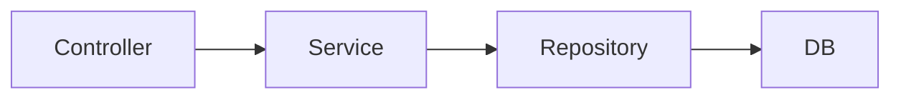
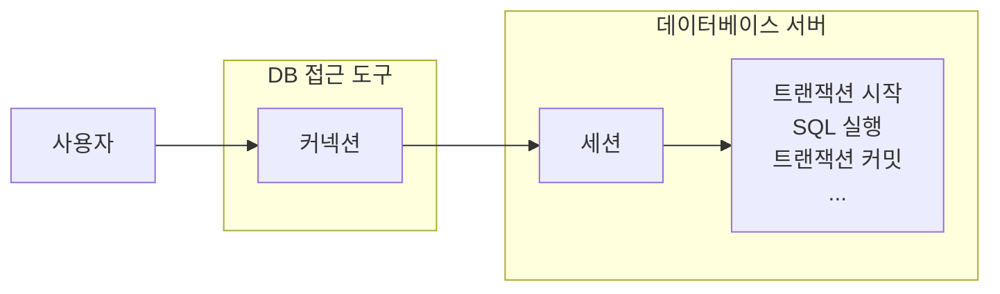

## 웹 어플리케이션의 계층 구조

여러가지 어플리케이션 구조가 있지만 가장 단순하면서 많이 사용하는 방법은 역할에 따라 3가지 계층으로 나누는 것이다.



#### 순수한 서비스 계층

여기서 가장 중요한 곳은 핵심 비즈니스 로직이 들어있는 서비스 계층이다.

시간이 흘러서 UI(웹)와 관련된 부분이 변하고, 데이터 저장 기술을 다른 기술로 변경해도, 비즈니스 로직은 최대한 변경없이 유지되어야 한다. 이렇게 하려면 서비스 계층을 특정 기술에 종속적이지 않게 개발해야 한다.

이렇게 계층을 나눈 이유도 서비스 계층을 최대한 순수하게 유지하기 위한 목적이 크다. 기술에 종송적인 부분은 프레젠테이션 계층, 데이터 접근 계층에서 가지고 간다.

**프레젠테이션 계층**

- UI와 관련된 처리 담당
- 웹 요청과 응답
- 사용자 요청 검증
- 주 사용 기술: 서블릿과 HTTP 같은 웹 기술, 스프링 MVC

프레젠테이션 계층은 클라이언트가 접근하는 UI와 관련된 기술인 웹, 서블릿, HTTP와 관련된 부분을 담당한다. 그래서 서비스 계층을 이런 UI와 관련된 기술로부터 보호해준다.

예를 들어서 HTTP API를 사용하다가 GRPC 같은 기술로 변경해도 프레젠테이션 계층의 코드만 변경하고, 서비스 계층은 변경하지 않아도 된다.

**서비스 계층**

- 비즈니스 로직 담당
- 주 사용 기술: 가급적 특정 기술에 의존하지 않고, 순수 자바 코드로 작성

**데이터 접근 계층**

- 실제 데이터베이스에 접근하는 코드
- 주 사용 기술: JDBC, JPA, File, Redis, MongoDB..

데이터 접근 계층은 데이터를 저장하고 관리하는 기술을 담당한다. 그래서 JDBC, JPA와 같은 구체적인 데이터 접근 기술로부터 서비스 계층을 보호해준다.

예를 들어서 JDBC를 사용하다가 JPA로 변경해도 서비스 계층은 변경하지 않아도 된다. 물론 서비스 계층에서 데이터 접근 계층을 직접 접근하는 것이 아니라, 인터페이스를 제공하고 서비스 계층은 이 인터페이스에 의존하는 것이 좋다.

그래야 서비스 코드의 변경 없이 `JdbcRepository`를 `JpaRepository`로 변경할 수 있다.

이렇게 계층화를 통해 서비스 계층이 특정 기술에 종속되지 않기 때문에 비즈니스 로직을 유지보수 하기도 쉽고 테스트 하기도 쉬워진다.

> [!summary] 순수한 서비스 계층 정리
> 서비스 계층은 가급적 비즈니스 로직만 구현하고 특정 구현 기술에 직접 의존해서는 안된다. 이렇게 하면 향후 구현 기술이 변경될 때 변경의 영향 범위를 최소화 할 수 있다.

## 문제점들

서비스 계층을 순수하게 유지하려면 어떻게 해야할까? 지금까지 개발한 `MemberServiceV1` 코드를 살펴보자.

### MemberServiceV1

```java
@RequiredArgsConstructor
public class MemberServiceV1 {
    private final MemberRepositoryV1 memberRepository;

    public void transfer(String fromId, String toId, int money) throws SQLException {
        Member fromMember = memberRepository.findById(fromId);
        Member toMember = memberRepository.findById(toId);

        memberRepository.update(fromId, fromMember.getMoney() - money);
        memberRepository.update(toId, toMember.getMoney() + money);
    }
}
```

이 `MemberServiceV1`은 특정 기술에 (거의) 종속되지 않고, 비즈니스 로직만 존재한다. 특정 기술과 관련된 코드가 거의 없어서 코드가 깔끔하고 유지보수 하기 쉽다.

향후 비즈니스 로직의 변경이 필요하면 이 부분을 변경하면 된다.

사실 여기에도 다음과 같은 남은 문제가 있다.

- `SQLException`이라는 `JDBC` 기술에 의존한다는 점이다.
- 이 부분은 `memberRepository`에서 던지는 예외이기 때문에 `memberRepository`에서 해결해야 한다.
- `MemberRepositoryV1`이라는 구체 클래스에 직접 의존하고 있다.

다음으로 트랜잭션을 적용한 `MemberServiceV2` 코드를 살펴본다.

### MemberServiceV2

```java
@Slf4j
@RequiredArgsConstructor
public class MemberServiceV2 {
    private final MemberRepositoryV2 memberRepository;
    private final DataSource dataSource;

    public void transfer(String fromId, String toId, int money) throws SQLException {
        Connection con = dataSource.getConnection();

        try {
            con.setAutoCommit(false);

            bizLogic(con, fromId, toId, money);

            con.commit();
        } catch (Exception e) {
            con.rollback();
            throw new IllegalStateException(e);
        } finally {
            release(con);
        }
    }

    private void bizLogic(Connection con, String fromId, String toId, int money) throws SQLException {
        Member fromMember = memberRepository.findById(con, fromId);
        Member toMember = memberRepository.findById(con, toId);

        memberRepository.update(con, fromId, fromMember.getMoney() - money);
        validation(toMember);
        memberRepository.update(con, toId, toMember.getMoney() + money);
    }

    private static void release(Connection con) {
        if (con != null) {
            try {
                con.setAutoCommit(true);
                con.close();
            } catch (Exception e) {
                log.info("error", e);
            }
        }
    }

    private static void validation(Member toMember) {
        if (toMember.getMemberId().equals("ex")) {
            throw new IllegalStateException("이체 중 예외 발생");
        }
    }
}
```

트랜잭션은 비즈니스 로직이 있는 서비스 계층에서 시작하는 것이 좋다.

그런데 문제는 트랜잭션을 사용하기 위해서 `javax.sql.DataSource`, `java.sql.Connection`, `java.sql.SQLException` 같은 `JDBC` 기술에 의존해야 한다는 점이다.

트랜잭션을 사용하기 위해 `JDBC` 기술에 의존한다. 결과적으로 비즈니스 로직보다 `JDBC`를 사용해서 트랜잭션을 처리하는 코드가 더 많다. 향후 `JDBC`에서 `JPA` 같은 다른 기술로 바꾸어 사용하게 되면 서비스 코드도 모두 함께 변경해야 한다.

핵심 비즈니스 로직과 `JDBC` 기술이 섞여 있어서 유지보수 하기 어렵다.

## 문제 정리

지금까지 개발한 어플리케이션의 문제점은 크게 3가지이다.

- 트랜잭션 문제
- 예외 누수 문제
- JDBC 반복 문제

#### 트랜잭션 문제

가장 큰 문제는 트랜잭션을 적용하면서 생긴 다음과 같은 문제들이다.

- `JDBC` 구현 기술이 서비스 계층에 누수되는 문제
  - 트랜잭션을 적용하기 위해 `JDBC` 구현 기술이 서비스 계층에 누수되었다.
  - 서비스 계층은 순수해야 한다. -> 구현 기술을 변경해도 서비스 계층 코드는 최대한 유지할 수 있어야 한다.
    - 그래서 데이터 접근 계층에 `JDBC` 코드를 다 몰아두는 것이다.
    - 물론 데이터 접근 계층의 구현 기술이 변경될 수도 있으니 데이터 접근 계층은 인터페이스를 제공하는 것이 좋다.
  - 서비스 계층은 특정 기술에 종속되지 않아야한다. 지금까지 그렇게 노력해서 데이터 접근 계층으로 `JDBC` 관련 코드를 모았는데, 트랜잭션을 적용하면서 결국 서비스 계층에 `JDBC` 구현 기술의 누수가 발생했다.
- 트랜잭션 동기화 문제
  - 같은 트랜잭션을 유지하기 위해 커넥션을 파라미터로 넘겨야한다.
  - 이때 파생되는 문제들도 있다. 똑같은 기능도 트랜잭션용 기능과 트랜잭션을 유지하지 않는 기능으로 분리해야 한다.
- 트랜잭션 적용 반복 문제
  - 트랜잭션 적용 코드를 보면 반복이 많다. `try`, `catch`, `finally`...

#### 예외 누수

- 데이터 접근 계층의 `JDBC` 구현 기술 예외가 서비스 계층으로 전파된다.
- `SQLException`은 체크 예외이기 때문에 데이터 접근 계층을 호출한 서비스 계층에서 해당 예외를 잡아서 처리하거나 명시적으로 `throws`를 통해서 다시 밖으로 던져야한다.
- `SQLException`은 `JDBC` 전용 기술이다. 향후 `JPA`나 다른 데이터 접근 기술을 사용하면, 그에 맞는 다른 예외로 변경해야 하고 결국 서비스 코드도 수정해야 한다.

#### JDBC 반복 문제

- 지금까지 작성한 `MemberRepository` 코드는 순수한 `JDBC`를 사용했다.
- 이 코드들은 유사한 코드의 반복이 너무 많다.
  - `try`, `catch`, `finally`...
  - 커넥션을 열고, `PreparedStatement`를 사용하고, 결과를 매핑하고.. 실행하고, 커넥션과 리소스를 정리한다.

> [!note] 스프링과 문제 해결
> 스프링은 서비스 계층을 순수하게 유지하면서, 지금까지 이야기한 문제들을 해결할 수 있는 다양한 방법과 기술들을 제공한다.
>
> 지금부터 스프링을 사용해서 어플리케이션이 가진 문제들을 하나씩 해결해본다.

## 트랜잭션 추상화

현재 서비스 계층은 트랜잭션을 사용하기 위해서 `JDBC` 기술에 의존하고 있다. 향후 `JDBC`에서 `JPA` 같은 다른 데이터 접근 기술로 변경하면, 서비스 계층의 트랜잭션 관련 코드도 모두 함께 수정해야 한다.

**구현 기술에 따른 트랜잭션 사용법**

- 트랜잭션은 원자적 단위의 비즈니스 로직을 처리하기 위해 사용한다.
- 구현 기술마다 트랜잭션을 사용하는 방법이 다르다.
  - `JDBC`: `con.setAutoCommit(false)`
  - `JPA`: `transaction.begin()`

#### JDBC 트랜잭션 의존

트랜잭션을 사용하는 코드는 데이터 접근 기술마다 다르다.

만약 다음의 그림과 같이 `JDBC` 기술을 사용하고, `JDBC` 트랜잭션에 의존하다가 `JPA` 기술로 변경하게 되면 서비스 계층의 트랜잭션을 처리하는 코드도 모두 함께 변경해야 한다.

![[transaction-7.png]]

#### JDBC -> JPA 기술로 변경

![[transaction-8.png]]

이렇게 `JDBC` 기술을 사용하다가 `JPA` 기술로 변경하게 되면 서비스 계층의 코드도 `JPA` 기술을 사용하도록 함께 수정해야 한다.

#### 트랜잭션 추상화

이 문제를 해결하려면 트랜잭션 기능을 추상화하면 된다. 아주 단순하게 생각하면 다음과 같은 인터페이스를 만들어서 사용하면 된다.

```java
public interface TxManager {
	begin();
	commit();
	rollback();
}
```

트랜잭션은 사실 단순하다. 트랜잭션을 시작하고, 비즈니스 로직의 수행이 끝나면 커밋하거나 롤백하면 된다.

그러면 다음과 같이 `TxManager` 인터페이스를 기반으로 각각의 기술에 맞는 구현체를 구현하면 된다.

- `JdbcTxManager`: `JDBC` 트랜잭션 기능을 제공하는 구현체
- `JpaTxManager`: `JPA` 트랜잭션 기능을 제공하는 구현체

#### 트랜잭션 추상화와 의존관계

![[transaction-9.png]]

서비스는 특정 트랜잭션 기술에 직접 의존하는 것이 아니라, `TxManager`라는 추상화된 인터페이스에만 의존한다. 이제 원하는 구현체를 [[컴포넌트 스캔과 의존관계 자동 주입|의존관계 주입]]을 통해서 주입하면 된다.

이렇게 클라이언트인 서비스는 인터페이스에 의존하고 의존관계 주입을 사용한 덕분에 `OCP` 원칙을 지키게 되었다. 이제 트랜잭션을 사용하는 서비스 코드를 전혀 변경하지 않고, 트랜잭션 기술을 마음껏 변경할 수 있다.

#### 스프링의 트랜잭션 추상화

스프링은 이미 이런 고민을 다 해두었다. 우리는 스프링이 제공하는 트랜잭션 추상화 기술을 사용하면 된다. 심지어 데이터 접근 기술에 따른 트랜잭션 구현체도 대부분 만들어두어서 가져다 사용하기만 하면 된다.

![[transaction-10.png]]

스프링 트랜잭션 추상화의 핵심은 `PlatformTransactionManager` 인터페이스다.

- `org.springframework.transaction.PlatformTransactionManager`

```java title="PlatformTransactionManager.java"
public interface PlatformTransactionManager extends TransactionManager {
    TransactionStatus getTransaction(@Nullable TransactionDefinition definition) throws TransactionException;
    void commit(TransactionStatus status) throws TransactionException;
    void rollback(TransactionStatus status) throws TransactionException;
}
```

- `getTransaction()`: 트랜잭션을 시작한다.
  - 이름이 `getTransaction()`인 이유는 기존에 이미 진행중인 트랜잭션이 있는 경우 해당 트랜잭션에 참여할 수 있기 때문이다.
  - 트랜잭션 참여, 전파에 대한 부분은 뒤에서 설명한다.
- `commit()`: 트랜잭션을 커밋한다.
- `rollback()`: 트랜잭션을 롤백한다.

앞으로 `PlatformTransactionManager` 인터페이스와 구현체를 포함해서 **트랜잭션 매니저**로 줄여서 표현한다.

## 트랜잭션 동기화

스프링이 제공하는 트랜잭션 매니저는 크게 두 가지 역할을 한다.

- 트랜잭션 추상화
- 리소스 동기화

이 중 트랜잭션 추상화에 대해선 앞 부분에서 설명했기 때문에 생략한다.

#### 리소스 동기화



트랜잭션을 유지하려면 트랜잭션의 시작부터 끝까지 같은 데이터베이스 커넥션(세션)을 유지해야한다. 결국 같은 커넥션을 동기화하기 위해서 이전에는 파라미터로 커넥션을 전달하는 방법을 사용했다.

파라미터로 커넥션을 전달하는 방법은 코드가 지저분해지는 것은 물론이고, 커넥션을 넘기는 메서드와 넘기지 않는 메서드를 중복해서 만들어야 하는 등 여러가지 단점들이 많다.

#### 트랜잭션 매니저와 트랜잭션 동기화 매니저

![[transaction-11.png]]

스프링은 **트랜잭션 동기화 매니저**를 제공한다. 이것은 쓰레드 로컬(ThreadLocal)을 사용해서 커넥션을 동기화해준다. 트랜잭션 매니저는 내부에서 이 트랜잭션 동기화 매니저를 사용한다.

트랜잭션 동기화 매니저는 쓰레드 로컬을 사용하기 때문에 멀티쓰레드 상황에 안전하게 커넥션을 동기화 할 수 있다. 따라서 커넥션이 필요하면 트랜잭션 동기화 매니저를 통해 커넥션을 획득하면 된다.

따라서 이전처럼 파라미터로 커넥션을 전달하지 않아도 된다.

> [!tip] ThreadLocal
> 쓰레드 로컬을 사용하면 각각의 쓰레드마다 별도의 저장소가 부여된다. 따라서 해당 쓰레드만 해당 데이터에 접근할 수 있다.
>
> 따라서 동시에 같은 요청이 오더라도, 할당되는 쓰레드가 다르기 때문에 같은 커넥션을 사용한다거나 하는 문제가 발생하지 않는다.

**동작 흐름**

1. 트랜잭션을 시작하려면 커넥션이 필요하다. 트랜잭션 매니저는 데이터소스를 통해 커넥션을 만들고, 트랜잭션을 시작한다.
2. 트랜잭션 매니저는 트랜잭션이 시작된 커넥션을 트랜잭션 동기화 매니저에 보관한다.
3. 리포지토리는 트랜잭션 동기화 매니저에 보관된 커넥션을 꺼내서 사용한다. 따라서 파라미터로 커넥션을 전달하지 않아도 된다.
4. 트랜잭션이 종료되면 트랜잭션 매니저는 트랜잭션 동기화 매니저에 보관된 커넥션을 통해 트랜잭션을 종료하고, 커넥션도 닫는다.

그러니까, 커넥션을 만들고 해당 커넥션을 통해 트랜잭션을 시작한다. (수동 커밋모드로 변경한다) 그 다음에 해당 커넥션을 트랜잭션 동기화 매니저라는 저장소에 보관한다.

리포지토리는 트랜잭션 동기화 매니저에 보관된 커넥션을 꺼내서 사용하고 트랜잭션이 종료되면 커넥션을 닫는다.

> [!summary] 트랜잭션 매니저와 트랜잭션 동기화 매니저 정리
> 핵심은 트랜잭션 커넥션을 직접 생성해서 전달하는 것이 아니라, 트랜잭션 매니저로 커넥션을 생성하고 트랜잭션 동기화 매니저라는 커넥션 보관함에 보관해서 사용한다는 것이다.

## 트랜잭션 문제 해결 - 트랜잭션 매니저 1

```java title="MemberRepositortV3.java"
/**
 * 트랜잭션 - 트랜잭션 매니저 DataSourceUtils.getConnection()
 * DataSourceUtils.releaseConnection()
 */
@Slf4j
@RequiredArgsConstructor
public class MemberRepositoryV3 {
    private final DataSource dataSource;

    public Member save(Member member) throws SQLException {
        String sql = "INSERT INTO member(member_id, money) VALUES(?, ?)";

        Connection connection = null;
        PreparedStatement statement = null;

        try {
            connection = getConnection();
            statement = connection.prepareStatement(sql);
            statement.setString(1, member.getMemberId());
            statement.setInt(2, member.getMoney());

            statement.executeUpdate();

            return member;
        } catch (SQLException e) {
            log.error("db error", e);
            throw e;
        } finally {
            close(connection, statement, null);
        }
    }

    public void delete(String memberId) throws SQLException {
        String sql = "DELETE FROM member WHERE member_id = ?";
        Connection connection = null;
        PreparedStatement statement = null;

        try {
            connection = getConnection();
            statement = connection.prepareStatement(sql);
            statement.setString(1, memberId);

            int affectedRows = statement.executeUpdate();
            log.info("affectedRows = {}", affectedRows);
        } catch (SQLException e) {
            log.error("db error", e);
            throw e;
        } finally {
            close(connection, statement, null);
        }
    }

    public void update(String memberId, int money) throws SQLException {
        String sql = "UPDATE member SET money = ? WHERE member_id = ?";
        Connection connection = null;
        PreparedStatement statement = null;

        try {
            connection = getConnection();
            statement = connection.prepareStatement(sql);
            statement.setInt(1, money);
            statement.setString(2, memberId);

            int affectedRows = statement.executeUpdate();
            log.info("affectedRows = {}", affectedRows);
        } catch (SQLException e) {
            log.error("db error", e);
            throw e;
        } finally {
            close(connection, statement, null);
        }
    }

    public Member findById(String memberId) throws SQLException {
        String sql = "SELECT * FROM member WHERE member_id = ?";
        Connection connection = null;
        PreparedStatement statement = null;
        ResultSet resultSet = null;

        try {
            connection = getConnection();
            statement = connection.prepareStatement(sql);
            statement.setString(1, memberId);
            resultSet = statement.executeQuery();

            if (resultSet.next()) {
                Member member = new Member();
                member.setMemberId(resultSet.getString("member_id"));
                member.setMoney(resultSet.getInt("money"));
                return member;
            } else {
                throw new NoSuchElementException("Member not found memberId = " + memberId);
            }

        } catch (SQLException e) {
            log.info("error", e);
            throw e;
        } finally {
            close(connection, statement, resultSet);
        }
    }

    private void close(Connection connection, Statement statement, ResultSet resultSet) {
        JdbcUtils.closeResultSet(resultSet);
        JdbcUtils.closeStatement(statement);

        // 주의! 트랜잭션 동기화를 사용하려면 DataSourceUtils를 사용해야 한다.
        DataSourceUtils.releaseConnection(connection, dataSource);
    }

    private Connection getConnection() throws SQLException {
        // 주의! 트랜잭션 동기화를 사용하려면 DataSourceUtils를 사용해야 한다.
        Connection connection = DataSourceUtils.getConnection(dataSource);

        log.info("getConnection = {}, class = {}", connection, connection.getClass());

        return connection;
    }
}
```

커넥션을 파라미터로 전달하는 부분이 모두 제거되어 조금 깔끔해졌다.

**DataSourceUtils.getConnection()**

- `getConnection()`에서 `DataSourceUtils.getConnection()`을 사용하도록 변경된 부분을 특히 주의해야 한다.
- `DataSourceUtils.getConnection()`은 다음과 같이 동작한다.
  - 트랜잭션 동기화 매니저가 관리하는 커넥션이 있으면 해당 커넥션을 반환한다.
  - 트랜잭션 동기화 매니저가 관리하는 커넥션이 없는 경우 새로운 커넥션을 생성해서 반환한다.

**DataSourceUtils.releaseConnection()**

- `close()`에서 `DataSourceUtils.releaseConnection()`을 사용하도록 변경된 부분을 특히 주의해야 한다. 커넥션을 `con.close()` 사용해서 직접 닫아버리면 커넥션이 유지되지 않는 문제가 발생한다. 이 커넥션은 이후 로직은 물론이고 트랜잭션을 종료할 때 까지 살아있어야 한다.
- `DataSourceUtils.releaseConnection()`을 사용하면 커넥션을 바로 닫는 것이 아니다.
  - **트랜잭션을 사용하기 위해 동기화된 커넥션은 커넥션을 닫지 않고 그대로 유지해준다.**
  - 트랜잭션 동기화 매니저가 관리하는 커넥션이 없는 경우 해당 커넥션을 닫는다.

이제 트랜잭션 매니저를 사용하는 서비스 코드를 만들어본다.

```java
/**
 * 트랜잭션 - 파라미터 연동, 풀을 고려한 종료
 */
@Slf4j
@RequiredArgsConstructor
public class MemberServiceV3_1 {
    private final MemberRepositoryV3 memberRepository;
    private final PlatformTransactionManager transactionManager;

    public void transfer(String fromId, String toId, int money) throws SQLException {
        // 트랜잭션 시작
        TransactionStatus status = transactionManager.getTransaction(new DefaultTransactionDefinition());

        try {
            bizLogic(fromId, toId, money);
            transactionManager.commit(status);
        } catch (Exception e) {
            transactionManager.rollback(status);
            throw new IllegalStateException(e);
        }
    }

    private void bizLogic(String fromId, String toId, int money) throws SQLException {
        Member fromMember = memberRepository.findById(fromId);
        Member toMember = memberRepository.findById(toId);

        memberRepository.update(fromId, fromMember.getMoney() - money);
        validation(toMember);
        memberRepository.update(toId, toMember.getMoney() + money);
    }

    private static void validation(Member toMember) {
        if (toMember.getMemberId().equals("ex")) {
            throw new IllegalStateException("이체 중 예외 발생");
        }
    }
}
```

코드가 깔끔해져서 한 눈에 잘 들어온다.

- `private final PlatformTransactionManager transactionManager`
  - 트랜잭션 매니저를 주입 받는다. 지금은 `JDBC` 기술을 사용하기 때문에 `DataSourceTransactionManager` 구현체를 주입 받아야 한다.
  - 물론 `JPA` 같은 기술로 변경되면 `JpaTransactionManager`를 주입 받으면 된다.
- `transactionManager.getTransaction()`
  - 트랜잭션을 시작한다.
  - `TransactionStatus status`를 반환한다. 현재 트랜잭션의 상태 정보가 포함되어 있다. 이후 트랜잭션을 커밋, 롤백할 때 필요하다.
- `new DefaultTransactionDefinition()`
  - 트랜잭션과 관련된 옵션을 설정할 수 있다. 자세한 내용은 뒤에서 설명한다.
- `transactionManager.commit(status)`
  - 트랜잭션이 성공하면 커밋한다.
- `transactionManager.rollback(status)`
  - 트랜잭션이 실패하면 롤백한다.

```java title="MemberServiceTestV3_1Test.java"
/**
 * 트랜잭션 - 트랜잭션 매니저
 */
class MemberServiceV3_1Test {
    public static final String MEMBER_A = "memberA";
    public static final String MEMBER_B = "memberB";
    public static final String MEMBER_EX = "ex";

    private MemberRepositoryV3 memberRepositoryV3;
    private MemberServiceV3_1 memberServiceV3_1;

    @BeforeEach
    void beforeEach() {
        DriverManagerDataSource dataSource = new DriverManagerDataSource(URL, USERNAME, PASSWORD);
        memberRepositoryV3 = new MemberRepositoryV3(dataSource);
        PlatformTransactionManager transactionManager = new DataSourceTransactionManager(dataSource);
        memberServiceV3_1 = new MemberServiceV3_1(transactionManager, memberRepositoryV3);
    }

    @AfterEach
    void afterEach() throws SQLException {
        memberRepositoryV3.delete(MEMBER_A);
        memberRepositoryV3.delete(MEMBER_B);
        memberRepositoryV3.delete(MEMBER_EX);
    }

    @Test
    @DisplayName("정상 이체")
    void transfer() throws SQLException {
        // GIVEN
        Member memberA = new Member(MEMBER_A, 10000);
        Member memberB = new Member(MEMBER_B, 10000);

        memberRepositoryV3.save(memberA);
        memberRepositoryV3.save(memberB);

        // WHEN
        memberServiceV3_1.transfer(memberA.getMemberId(), memberB.getMemberId(), 2000);

        // THEN
        Member findMemberA = memberRepositoryV3.findById(memberA.getMemberId());
        Member findMemberB = memberRepositoryV3.findById(memberB.getMemberId());

        Assertions.assertThat(findMemberA.getMoney()).isEqualTo(8000);
        Assertions.assertThat(findMemberB.getMoney()).isEqualTo(12000);
    }

    @Test
    @DisplayName("이체중 예외 발생")
    void transferToEx() throws SQLException {
        // GIVEN
        Member memberA = new Member(MEMBER_A, 10000);
        Member memberEx = new Member(MEMBER_EX, 10000);

        memberRepositoryV3.save(memberA);
        memberRepositoryV3.save(memberEx);

        // WHEN
        Assertions
                .assertThatThrownBy(
                        () -> memberServiceV3_1.transfer(memberA.getMemberId(), memberEx.getMemberId(), 2000))
                .isInstanceOf(IllegalStateException.class);

        // THEN
        Member findMemberA = memberRepositoryV3.findById(memberA.getMemberId());
        Member findMemberB = memberRepositoryV3.findById(memberEx.getMemberId());

        Assertions.assertThat(findMemberA.getMoney()).isEqualTo(10000);
        Assertions.assertThat(findMemberB.getMoney()).isEqualTo(10000);
    }
}
```

트랜잭션 매니저를 사용한 테스트 코드도 잘 작동한다.

## 트랜잭션 문제 해결 - 트랜잭션 매니저 2

트랜잭션 매니저의 전체 동작 흐름을 자세히 이해해본다.

#### 트랜잭션 시작

![[transaction-12.png]]

1. 클라이언트의 요청으로 서비스 로직을 실행한다.
2. 서비스 계층에서 `transactionManager.getTransaction()`을 호출해서 트랜잭션을 시작한다.
3. 트랜잭션을 시작하려면 먼저 데이터베이스 커넥션이 필요하다. 따라서 트랜잭션 매니저는 내부에서 데이터소스를 사용해 커넥션을 생성한다.
4. 커넥션을 수동 커밋 모드로 변경해서 실제 데이터베이스 트랜잭션을 시작한다.
5. 커넥션을 트랜잭션 동기화 매니저에 보관한다.

#### 로직 실행

![[transaction-13.png]]

6. 트랜잭션 동기화 매니저는 쓰레드 로컬에 커넥션을 보관한다. 따라서 멀티 쓰레드 환경에 안전하게 커넥션을 보관할 수 있다.
7. 서비스는 비즈니스 로직을 실행하면서 리포지토리의 메서드들을 호출한다. 이때 커넥션을 파라미터로 전달하지 않아도 된다.
8. 리포지토리 메서드들은 트랜잭션이 시작된 커넥션이 필요하다. 리포지토리는 `DataSourceUtils.getConnection()`을 사용해서 트랜잭션 동기화 매니저에 보관된 커넥션을 꺼내서 사용한다. 이 과정을 통해서 자연스럽게 같은 커넥션을 사용하고, 트랜잭션도 유지된다.

#### 트랜잭션 종료

![[transaction-14.png]]

9. 획득한 커넥션을 사용해서 SQL을 데이터베이스에 전달해서 실행한다.
10. 비즈니스 로직이 끝나고 트랜잭션을 종료한다. 트랜잭션은 커밋하거나 롤백하면 종료된다.
11. 트랜잭션을 종료하려면 동기화된 커넥션이 필요하다. 트랜잭션 동기화 매니저를 통해 동기화된 커넥션을 획득한다.
12. 획득한 커넥션을 통해 데이터베이스에 트랜잭션을 커밋하거나 롤백한다.
13. 전체 리소스를 정리한다.
    - 트랜잭션 동기화 매니저를 정리한다. 쓰레드 로컬은 사용 후 꼭 정리해야 한다.
    - 커넥션 풀을 고려해 `con.setAutoCommit(true)`로 되돌린다. (커넥션은 기본적으로 autocommit이 true이기 때문, 다음에 누군가가 이 커넥션을 획득하더라도 문제가 발생하지 않도록)
    - `con.close()`를 호출해서 커넥션을 종료한다. 커넥션 풀을 사용하는 경우 `con.close()`를 호출하면 커넥션 풀에 반환한다.

> [!summary] 정리
> 트랜잭션 추상화 덕분에 서비스 코드는 이제 `JDBC` 기술에 의존하지 않는다.
>
> - 이후 JDBC에서 JPA로 기술을 변경해도 서비스 코드를 그대로 유지할 수 있다.
> - 기술 변경 시 의존관계 주입만 `DataSourceTransactionManager`에서 `JpaTransactionManager`로 변경하면 된다.
> - `java.sql.SQLException`이 아직 남아있지만 이 부분은 뒤에서 설명한다.
> - 트랜잭션 동기화 매니저 덕분에 커넥션을 파라미터로 넘기지 않아도 된다.

## 트랜잭션 문제 해결 - 트랜잭션 템플릿

트랜잭션을 사용하는 로직을 살펴보면 다음과 같은 패턴이 반복되는 것을 확인할 수 있다.

```java
// 트랜잭션 시작
TransactionStatus status = transactionManager.getTransaction(new DefaultTransactionDefinition());

try {
    bizLogic(fromId, toId, money);
    transactionManager.commit(status);
} catch (Exception e) {
    transactionManager.rollback(status);
    throw new IllegalStateException(e);
}
```

- 트랜잭션 시작, 비즈니스 로직 실행, 성공 시 커밋, 실패시 롤백
- 다른 서비스에서 트랜잭션을 시작하려면 `try`, `catch`, `finally`를 포함한 성공 시 커밋, 실패시 롤백 코드가 반복될 것이다.
- 이런 형태는 각각의 서비스에서 반복된다. 달라지는 부분은 비즈니스 로직 뿐이다.
- 이럴 때 **템플릿 콜백 패턴**을 활용하면 이런 반복 문제를 깔끔하게 해결할 수 있다.

스프링은 `TransactionTemplate`라는 편리한 기능을 제공한다. 지금은 템플릿 콜백 패턴에 대해서 자세히 이해하지 못하지만 추후에 스프링의 핵심 디자인 패턴들을 공부할 때 자세히 알아본다.

#### 트랜잭션 템플릿

템플릿 콜백 패턴을 적용하려면 템플릿을 제공하는 클래스를 작성해야 하는데, 스프링은 `TransactionTemplate`라는 템플릿 클래스를 제공한다.

```java
public class TransactionTemplate {
    private PlatformTransactionManager transactionManager;
    public <T> T execute(TransactionCallback<T> action) {..}
    void executeWithoutResult(Consumer<TransactionStatus> action) {..}
}
```

- `execute()`: 반환 값이 있을 때 사용한다.
- `executeWithoutResult()`: 반환 값이 없을 때 사용한다.

트랜잭션 템플릿을 사용해서 반복하는 부분을 제거해본다.

```java
/**
 * 트랜잭션 - 트랜잭션 템플릿
 */
@Slf4j
public class MemberServiceV3_2 {
    //    private final PlatformTransactionManager transactionManager;
    private final MemberRepositoryV3 memberRepository;
    private final TransactionTemplate txTemplate;

    public MemberServiceV3_2(MemberRepositoryV3 memberRepository, PlatformTransactionManager transactionManager) {
        this.memberRepository = memberRepository;
        this.txTemplate = new TransactionTemplate(transactionManager);
    }

    public void transfer(String fromId, String toId, int money) throws SQLException {
        txTemplate.executeWithoutResult((status) -> {
            try {
                bizLogic(fromId, toId, money);
            } catch (SQLException e) {
                throw new IllegalStateException(e);
            }
        });
    }

    private void bizLogic(String fromId, String toId, int money) throws SQLException {
        Member fromMember = memberRepository.findById(fromId);
        Member toMember = memberRepository.findById(toId);

        memberRepository.update(fromId, fromMember.getMoney() - money);
        validation(toMember);
        memberRepository.update(toId, toMember.getMoney() + money);
    }

    private static void validation(Member toMember) {
        if (toMember.getMemberId().equals("ex")) {
            throw new IllegalStateException("이체 중 예외 발생");
        }
    }
}
```

트랜잭션 템플릿을 사용할 때 관례적으로 생성자에서 `TransactionManager`를 주입 받고, 주입 받은 `TransactionManager`를 사용해서 `TransactionTemplate`를 내부적으로 생성한다.

따라서 비즈니스 로직에서는 직접적으로 `TransactionManager`를 사용하지 않고 위의 코드처럼`TransactionTemplate`를 사용한다.

결과적으로 트랜잭션 템플릿 덕분에 트랜잭션을 시작하고, 커밋하거나 롤백하는 코드가 모두 제거되었다.

> 트랜잭션 템플릿의 기본 동작은 다음과 같다
>
> - 비즈니스 로직이 정상 수행되면 커밋한다.
> - 언체크 예외가 발생하면 롤백한다. 그 외의 경우 커밋한다. (체크 예외의 경우에는 커밋하는데, 이 부분은 뒤에서 설명한다.)
> - 코드에서 예외를 처리하기 위해 `try-catch` 구문이 들어갔는데, `bizLogic()`을 호출하면 `SQLException` 체크 예외를 넘기기 때문이다. 해당 람다에서 체크 예외를 밖으로 던질 수 없기 때문에 언체크 예외로 바꾸어 던지도록 체크 예외를 언체크 예외로 전환했다.

테스트 코드를 변경한다. 다음 부분만 고치면 정상 작동한다.

```java
private MemberRepositoryV3 memberRepositoryV3;
private MemberServiceV3_2 memberServiceV3_2;

@BeforeEach
void beforeEach() {
    DriverManagerDataSource dataSource = new DriverManagerDataSource(URL, USERNAME, PASSWORD);
    memberRepositoryV3 = new MemberRepositoryV3(dataSource);
    PlatformTransactionManager transactionManager = new DataSourceTransactionManager(dataSource);
    memberServiceV3_2 = new MemberServiceV3_2(memberRepositoryV3, transactionManager);
}
```

> [!summary] 정리
> 트랜잭션 템플릿 덕분에 트랜잭션을 사용할 때 반복하는 코드를 제거할 수 있었다.
>
> 하지만 이 곳은 서비스 계층인데 비즈니스 로직 뿐만 아니라 트랜잭션을 처리하는 기술 로직이 포함되어 있다.
>
> 어플리케이션을 구성하는 로직을 핵심 기능과 부가 기능으로 구분하면 서비스 입장에서 비즈니스 로직은 핵심 기능이고, 트랜잭션은 부가 기능이다.
>
> 이렇게 비즈니스 로직과 트랜잭션을 처리하는 기술 로직이 한 곳에 있으면 두 관심사를 하나의 클래스에서 처리하게 된다. 결과적으로 코드를 유지보수하기 어려워진다.
>
> 서비스 계층은 가급적 핵심 비즈니스 로직만 존재하는게 좋다. 하지만 트랜잭션 기술을 사용하려면 어쩔 수 없이 트랜잭션 코드가 나와야한다. 어떻게 하면 이 문제를 해결할 수 있을까?

---

References: 김영한의 스프링 DB 1편

Links to this page: [[컴포넌트 스캔과 의존관계 자동 주입]]
