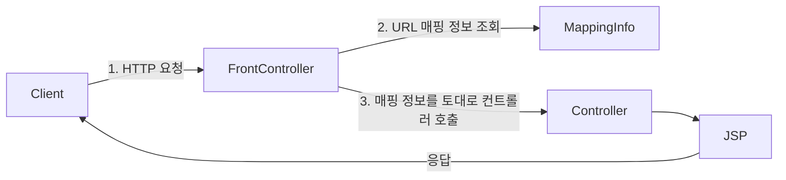
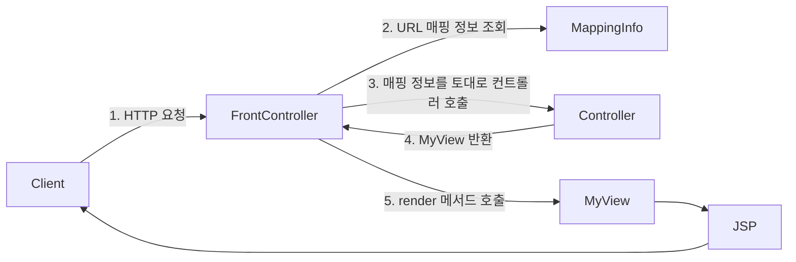
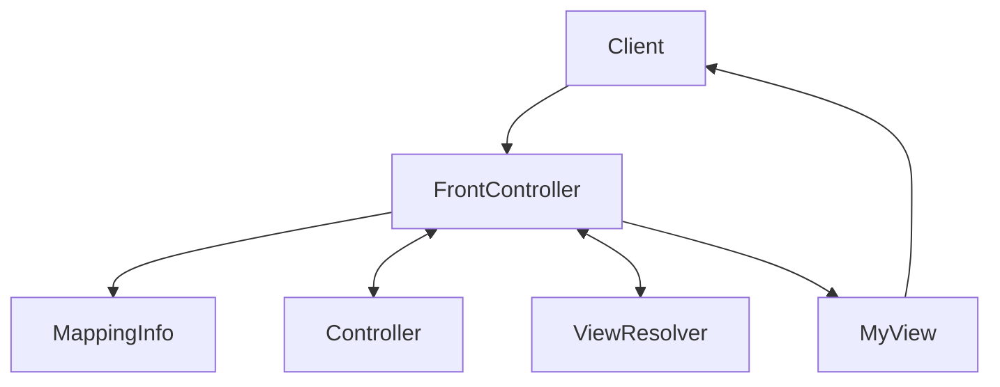
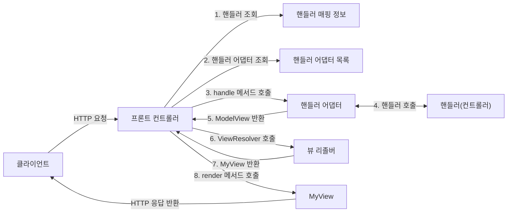

---
title:
tags:
  - java
  - programming
  - mvc
  - spring
  - adapter
publish: true
date: 2024-11-21
---

## 프론트 컨트롤러 패턴

프론트 컨트롤러 패턴을 학습하고, 프론트 컨트롤러를 기반으로 단계별로 MVC 프레임워크를 직접 구현해본다.

![[spring-basic-front-contoller-1.png]]

![[spring-basic-front-controller-2.png]]

프론트 컨트롤러 패턴을 도입하기 전에는 다수의 서블릿 객체에 중복되는 코드가 많았다. 그런데 공통적인 부분들을 로직화해서 따로 빼는 것에도 문제가 있었다. 중복되는 코드를 공통 로직으로 뺸다고 해도 어짜피 작성하는 코드는 또 다시 중복되기 때문이다.

프론트 컨트롤러 패턴을 도입하면, 공통되는 로직등을 한 곳에서 모두 처리하고 비즈니스 로직은 따로 처리할 수 있게 된다. 스프링 MVC도 이와 같은 구조를 가지고 있다.

**프론트 컨트롤러 패턴 특징**

- 프론트 컨트롤러 서블릿 하나로 클라이언트의 요청을 받음
- 프론트 컨트롤러가 요청에 맞는 컨트롤러를 찾아서 호출
- 입구를 하나로 만든다.
- 따라서 공통 처리가 가능해짐
- 프론트 컨트롤러를 제외한 나머지 컨트롤러는 서블릿을 사용하지 않아도 됨

**스프링 웹 MVC와 프론트 컨트롤러**

스프링 웹 MVC의 핵심은 바로 프론트 컨트롤러다. 스프링 웹 MVC의 `DispatcherServlet`이 프론트 컨트롤러 패턴으로 구현되어 있다.

## 프론트 컨트롤러 도입

이번 목표는 기존 코드를 최대한 유지하면서, 프론트 컨트롤러를 도입하는 것이다.

먼저 다음과 같은 구조를 맞추어두고 점진적으로 리팩터링한다.



- `MappingInfo`는 HTTP 요청이 어떤 URL에 요청했는지와 해당 URL에 매핑된 컨트롤러가 어떤 컨트롤러인지의 정보를 갖고있다.

### ControllerV1 - 구조 개선

```java
public interface ControllerV1 {
    void process(HttpServletRequest request, HttpServletResponse response) throws ServletException, IOException;
}
```

서블릿과 비슷한 모양의 컨트롤러 인터페이스를 도입한다. 각 컨트롤러들은 이 인터페이스를 구현하면 된다. 프론트 컨트롤러는 이 인터페이스를 호출해서 구현과 관계없이 로직의 일관성을 가져갈 수 있다.

```java
public class MemberFormControllerV1 implements ControllerV1 {
    @Override
    public void process(HttpServletRequest request, HttpServletResponse response) throws ServletException, IOException {
        String viewPath = "/WEB-INF/views/new-form.jsp";
        RequestDispatcher dispatcher = request.getRequestDispatcher(viewPath);
        dispatcher.forward(request, response);
    }
}
```

```java
public class MemberSaveControllerV1 implements ControllerV1 {
    private MemberRepository memberRepository = MemberRepository.getInstance();

    @Override
    public void process(HttpServletRequest request, HttpServletResponse response) throws ServletException, IOException {
        String username = request.getParameter("username");
        int age = Integer.parseInt(request.getParameter("age"));

        Member member = new Member(username, age);
        memberRepository.save(member);

        request.setAttribute("member", member);

        String viewPath = "/WEB-INF/views/save.jsp";
        RequestDispatcher dispatcher = request.getRequestDispatcher(viewPath);
        dispatcher.forward(request, response);
    }
}
```

```java
public class MemberListControllerV1 implements ControllerV1 {
    private MemberRepository memberRepository = MemberRepository.getInstance();

    @Override
    public void process(HttpServletRequest request, HttpServletResponse response) throws ServletException, IOException {
        List<Member> members = memberRepository.findAll();

        request.setAttribute("members", members);

        String viewPath = "/WEB-INF/views/members.jsp";
        RequestDispatcher dispatcher = request.getRequestDispatcher(viewPath);
        dispatcher.forward(request, response);
    }
}
```

이제 모든 컨트롤러를 구현했다. 마지막으로 프론트 컨트롤러를 구현할 차례다.

```java
@WebServlet(name = "frontControllerServletV1", urlPatterns = "/front-controller/v1/*")
public class FrontControllerServletV1 extends HttpServlet {
    private Map<String, ControllerV1> controllerMap = new HashMap<>();

    public FrontControllerServletV1() {
        controllerMap.put("/front-controller/v1/members/new-form", new MemberFormControllerV1());
        controllerMap.put("/front-controller/v1/members/save", new MemberSaveControllerV1());
        controllerMap.put("/front-controller/v1/members", new MemberListControllerV1());
    }

    @Override
    protected void service(HttpServletRequest request, HttpServletResponse response) throws ServletException, IOException {
        String requestURI = request.getRequestURI();

        ControllerV1 controller = controllerMap.get(requestURI);

        if (controller == null) {
            response.setStatus(HttpServletResponse.SC_NOT_FOUND);
            return;
        }

        controller.process(request, response);
    }
}
```

- 프론트 컨트롤러는 와일드카드 `*`를 `urlPattern`으로 사용하여 `/front-controller/v1`를 포함한 모든 하위 요청이 이 서블릿을 통하도록 한다.
- 프론트 컨트롤러 서블릿 객체는 내부에 맵 구조의 `controllerMap`을 가진다.
- 생성시 `controllerMap`에 URL 매핑 정보를 키로하는 컨트롤러 객체를 담는다.
- 요청 URI를 가져와 `controllerMap`의 키로 사용하여 컨트롤러를 찾고, 다형성을 이용하여 각 컨트롤러가 구현한 `process()` 메서드를 호출한다.

### ControllerV2 - 뷰 분리

모든 컨트롤러에서 뷰로 이동하는 부분에 중복이 있고, 깔끔하지 않다.

```java
String viewPath = "/WEB-INF/views/save.jsp";
RequestDispatcher dispatcher = request.getRequestDispatcher(viewPath);
dispatcher.forward(request, response);
```

이 부분을 깔끔하게 분리하기 위해 다음과 같은 구조의 별도로 뷰를 처리하는 객체를 만든다.



```java
public class MyView {
    private String viewPath;

    public MyView(String viewPath) {
        this.viewPath = viewPath;
    }

    public void render(HttpServletRequest request, HttpServletResponse response) throws ServletException, IOException {
        RequestDispatcher dispatcher = request.getRequestDispatcher(viewPath);
        dispatcher.forward(request, response);
    }
}
```

```java
public interface ControllerV2 {
    MyView process(HttpServletRequest request, HttpServletResponse response) throws ServletException, IOException;
}
```

```java
public class MemberFormControllerV2 implements ControllerV2 {
    @Override
    public MyView process(HttpServletRequest request, HttpServletResponse response)
            throws ServletException, IOException {
        return new MyView("/WEB-INF/views/new-form.jsp");
    }
}
```

```java
public class MemberListControllerV2 implements ControllerV2 {
    private MemberRepository memberRepository = MemberRepository.getInstance();

    @Override
    public MyView process(HttpServletRequest request, HttpServletResponse response) throws ServletException, IOException {
        List<Member> members = memberRepository.findAll();
        request.setAttribute("members", members);

        return new MyView("/WEB-INF/views/members.jsp");
    }
}
```

```java
public class MemberSaveControllerV2 implements ControllerV2 {
    private MemberRepository memberRepository = MemberRepository.getInstance();

    @Override
    public MyView process(HttpServletRequest request, HttpServletResponse response)
            throws ServletException, IOException {
        String username = request.getParameter("username");
        int age = Integer.parseInt(request.getParameter("age"));

        Member member = new Member(username, age);
        memberRepository.save(member);

        request.setAttribute("member", member);


        return new MyView("/WEB-INF/views/save.jsp");
    }
}
```

```java
@WebServlet(name = "frontControllerServletV2", urlPatterns = "/front-controller/v2/*")
public class FrontControllerServletV2 extends HttpServlet {
    private Map<String, ControllerV2> controllerMap = new HashMap<>();

    public FrontControllerServletV2() {
        controllerMap.put("/front-controller/v2/members/new-form", new MemberFormControllerV2());
        controllerMap.put("/front-controller/v2/members/save", new MemberSaveControllerV2());
        controllerMap.put("/front-controller/v2/members", new MemberListControllerV2());
    }

    @Override
    protected void service(HttpServletRequest request, HttpServletResponse response) throws ServletException, IOException {
        String requestURI = request.getRequestURI();

        ControllerV2 controller = controllerMap.get(requestURI);

        if (controller == null) {
            response.setStatus(HttpServletResponse.SC_NOT_FOUND);
            return;
        }

        MyView view = controller.process(request, response);
        view.render(request, response);
    }
}
```

이제 각 컨트롤러는 복잡한 `dispatch.forward()`를 직접 호출하지 않아도 된다. 단순히 `MyView` 객체를 생성하고 거기에 뷰 경로만 넣고 반환하면 된다.

`ControllerV2.process()`의 반환 타입이 `MyView`이므로 프론트 컨트롤러는 호출 결과로 `MyView` 객체를 반환 받는다. 그리고 해당 `view.render()`를 호출하면 `forward` 로직을 수행해서 JSP가 실행된다.

### ControllerV3 - Model 추가

**서블릿 종속성 제거**

컨트롤러 입장에서 `HttpServletRequest`, `HttpServletResponse`가 꼭 필요할까?
요청 파라미터의 정보는 자바의 Map으로 대신 넘기도록 하면 지금 구조에서는 컨트롤러가 서블릿 기술을 몰라도 동작할 수 있다.

그리고 `request` 객체를 Model로 사용하는 대신에 별도의 Model 객체를 만들어서 반환하면 된다.
우리가 구현하는 컨트롤러가 서블릿 기술을 전혀 사용하지 않도록 변경해본다. 이렇게 하면 구현 코드도 매우 단순해지고, 테스트 코드 작성이 쉽다.

**뷰 이름 중복 제거**

컨트롤러에서 지정하는 뷰 이름에 중복이 있는 것을 확인할 수 있다. 컨트롤러는 **뷰의 논리 이름**을 반환하고, 실제 물리 위치의 이름은 프론트 컨트롤러에서 처리하도록 단순화 하자.

이렇게 해두면 향후 뷰의 폴더 위치가 함께 이동해도 프론트 컨트롤러만 고치면 된다.

- `/WEB-INF/views/new-form.jsp` -> `new-form`
- `/WEB-INF/views/save` -> `save`
- `/WEB-INF/views/members.jsp` -> `members`

이렇게 구현할 V3의 구조는 다음과 같다.



```java
public class MemberFormControllerV3 implements ControllerV3 {
    @Override
    public ModelView process(Map<String, String> paramMap) {
        return new ModelView("new-form");
    }
}
```

```java
public class MemberListControllerV3 implements ControllerV3 {
    private MemberRepository memberRepository = MemberRepository.getInstance();

    @Override
    public ModelView process(Map<String, String> paramMap) {
        List<Member> members = memberRepository.findAll();
        ModelView model = new ModelView("members");
        model.getModel().put("members", members);

        return model;
    }
}
```

```java
public class MemberSaveControllerV3 implements ControllerV3 {
    private MemberRepository memberRepository = MemberRepository.getInstance();

    @Override
    public ModelView process(Map<String, String> paramMap) {
        String username = paramMap.get("username");
        int age = Integer.parseInt(paramMap.get("age"));

        Member member = new Member(username, age);
        memberRepository.save(member);

        ModelView model = new ModelView("save");
        model.getModel().put("member", member);

        return model;
    }
}
```

```java
public class ModelView {
    private String viewName;
    private Map<String, Object> model = new HashMap<>();

    public ModelView(String viewName) {
        this.viewName = viewName;
    }

    public String getViewName() {
        return viewName;
    }
    public void setViewName(String viewName) {
        this.viewName = viewName;
    }
    public Map<String, Object> getModel() {
        return model;
    }
    public void setModel(Map<String, Object> model) {
        this.model = model;
    }
}
```

```java
public class MyView {
    private String viewPath;

    public MyView(String viewPath) {
        this.viewPath = viewPath;
    }

    public void render(HttpServletRequest request, HttpServletResponse response) throws ServletException, IOException {
        RequestDispatcher dispatcher = request.getRequestDispatcher(viewPath);
        dispatcher.forward(request, response);
    }

    public void render(Map<String, Object> model, HttpServletRequest request,
                       HttpServletResponse response)
            throws ServletException, IOException {
        model.forEach((key, value) -> request.setAttribute(key, value));

        RequestDispatcher dispatcher = request.getRequestDispatcher(viewPath);
        dispatcher.forward(request, response);
    }
}
```

```java
@WebServlet(name = "frontControllerServletV3", urlPatterns = "/front-controller/v3/*")
public class FrontControllerServletV3 extends HttpServlet {
    private Map<String, ControllerV3> controllerMap = new HashMap<>();

    public FrontControllerServletV3() {
        controllerMap.put("/front-controller/v3/members/new-form", new MemberFormControllerV3());
        controllerMap.put("/front-controller/v3/members/save", new MemberSaveControllerV3());
        controllerMap.put("/front-controller/v3/members", new MemberListControllerV3());
    }

    @Override
    protected void service(HttpServletRequest request, HttpServletResponse response)
            throws ServletException, IOException {
        String requestURI = request.getRequestURI();

        ControllerV3 controller = controllerMap.get(requestURI);

        if (controller == null) {
            response.setStatus(HttpServletResponse.SC_NOT_FOUND);
            return;
        }

        Map<String, String> paramMap = createParamMap(request);
        ModelView mv = controller.process(paramMap);
        String viewName = mv.getViewName();
        MyView view = viewResolver(viewName);
        view.render(mv.getModel(), request, response);
    }

    private static MyView viewResolver(String viewName) {
        return new MyView("/WEB-INF/views/" + viewName + ".jsp");
    }

    private static Map<String, String> createParamMap(HttpServletRequest request) {
        Map<String, String> paramMap = new HashMap<>();
        request.getParameterNames().asIterator()
                .forEachRemaining(paramName -> paramMap.put(paramName, request.getParameter(paramName)));
        return paramMap;
    }
}
```

### ControllerV4 - 단순하고 실용적인 컨트롤러

앞서 만든 v3 컨트롤러는 서블릿 종속성을 제거하고 뷰 경로의 중복을 제거하는 등, 잘 설계된 컨트롤러이다.

그런데 실제 컨트롤러 인터페이스를 구현하는 개발자 입장에서 보면, 항상 `ModelView` 객체를 생성하고 반환해야 하는 부분이 조금은 번거롭다.

좋은 프레임워크는 아키텍처도 중요하지만, 그와 더불어 실제 개발하는 개발자가 단순하고 편리하게 사용할 수 있어야 한다. 실용성이 있어야 한다.

이번에는 v3를 조금 변경해서 실제 구현하는 개발자들이 매우 편리하게 개발할 수 있는 v4 버전을 개발해본다. 기본적인 구조는 v3와 같지만, 대신 컨트롤러가 `ModelView`를 반환하지 않고 `viewName`만 반환한다.

```java
public interface ControllerV4 {
    /**
     * @param paramMap
     * @param model
     * @return viewName
     */    String process(Map<String, String> paramMap, Map<String, Object> model);
}
```

`ControllerV4`의 구현체들은 이제 `process()`로 문자열을 반환한다. 이 문자열은 JSP 논리 이름인 `viewName`을 의미한다.

```java
public class MemberFormControllerV4 implements ControllerV4 {
    @Override
    public String process(Map<String, String> paramMap, Map<String, Object> model) {
        return "new-form";
    }
}
```

```java
public class MemberListControllerV4 implements ControllerV4 {
    private MemberRepository memberRepository = MemberRepository.getInstance();

    @Override
    public String process(Map<String, String> paramMap, Map<String, Object> model) {
        List<Member> members = memberRepository.findAll();
        model.put("members", members);

        return "members";
    }
}
```

```java
public class MemberSaveControllerV4 implements ControllerV4 {
    private MemberRepository memberRepository = MemberRepository.getInstance();

    @Override
    public String process(Map<String, String> paramMap, Map<String, Object> model) {
        String username = paramMap.get("username");
        int age = Integer.parseInt(paramMap.get("age"));

        Member member = new Member(username, age);
        memberRepository.save(member);

        model.put("member", member);
        return "save";
    }
}
```

구조를 조금 바꿨을 뿐인데 개발자 입장에서 컨트롤러 내부에서 비즈니스 로직을 작성하기가 굉장히 편리해졌다.

```java title="FrontControllerServletV4.java"
@Override
protected void service(HttpServletRequest request, HttpServletResponse response)
		throws ServletException, IOException {
	...

	Map<String, Object> model = new HashMap<>();

	String viewName = controller.process(paramMap, model);
	MyView view = viewResolver(viewName);

	view.render(model, request, response);
}
```

`FrontControllerV4`는 위 `service()` 메서드의 마지막 부분을 제외하면 바뀐 부분도 없다.

컨트롤러 내부에서 모델을 생성하는게 아니라, 프론트 컨트롤러에서 모델을 생성하고 다루게 되면서 컨트롤러 내부에서의 로직이 매우 간단해지고, 더군다나 프론트 컨트롤러에서의 로직도 간단해졌다.

## 유연한 컨트롤러 (어댑터 패턴)

만약 어떤 개발자는 앞서 개발했던 `ControllerV3` 방식으로 개발하고 싶고, 다른 개발자는 `ControllerV4` 방식으로 개발하고 싶다면 어떻게 해야할까?

**어댑터 패턴**

지금까지 우리가 개발한 프론트 컨트롤러는 한 가지 방식의 컨트롤러 인터페이스만 사용할 수 있다.
`ControllerV3`, `ControllerV4`는 완전히 다른 인터페이스이다. 따라서 호환이 불가능하다. 마치 v3는 110v이고, v4는 220v 전기 콘센트 같은 것이다.

이럴 때 사용하는 것이 바로 어댑터이다. 어댑터 패턴을 사용해서 프론트 컨트롤러가 다양한 방식의 컨트롤러를 처리할 수 있도록 변경해본다.

`ControllerV5`는 다음의 구조로 구현한다.



- **핸들러 어댑터**: 중간에 어댑터 역할을 하는 어댑터가 추가되었는데 이름이 핸들러 어댑터이다. 여기서 어댑터 역할을 해주는 덕분에 다양한 종류의 컨트롤러를 호출할 수 있다.
- **핸들러**: 컨트롤러의 이름을 더 넓은 범위인 핸들러로 변경했다. 그 이유는 이제 어댑터가 있기 때문에 꼭 컨트롤러의 개념 뿐만 아니라 어떠한 것이든 해당하는 종류의 어댑터만 있으면 다 처리할 수 있기 때문이다.

### MyHandlerAdapter

```java
public interface MyHandlerAdapter {
	boolean supports(Object handler);
	ModelView handle(HttpServletRequest request, HttpServletResponse response, Object handler) throws ServletException, IOException;
}
```

- `boolean supports(Object handler)`
  - `handler`는 컨트롤러를 의미한다.
  - 어댑터가 해당 컨트롤러를 처리할 수 있는지 판단하는 메서드다.
- `ModelView handle(HttpServletRequest request, HttpServletResponse response, Object handler)`
  - 어댑터는 실제 컨트롤러를 호출하고, 그 결과로 `ModelView`를 반환해야 한다.
  - 실제 컨트롤러가 `ModelView`를 반환하지 못하면, 어댑터가 `ModelView`를 직접 생성해서라도 반환해야 한다.
  - 이전에는 프론트 컨트롤러가 실제 컨트롤러를 호출했지만 이제는 이 어댑터를 통해서 실제 컨트롤러가 호출된다.

먼저` ControllerV3`를 지원하는 어댑터를 구현해본다.

### ControllerV3HandlerAdapter

```java
public class ControllerV3HandlerAdapter implements MyHandlerAdapter {
    @Override
    public boolean supports(Object handler) {
        return (handler instanceof ControllerV3);
    }

    @Override
    public ModelView handle(HttpServletRequest request, HttpServletResponse response, Object handler)
            throws ServletException, IOException {
        ControllerV3 controller = (ControllerV3) handler;

        Map<String, String> paramMap = createParamMap(request);

        return controller.process(paramMap);
    }

    private static Map<String, String> createParamMap(HttpServletRequest request) {
        Map<String, String> paramMap = new HashMap<>();
        request.getParameterNames().asIterator()
                .forEachRemaining(paramName -> paramMap.put(paramName, request.getParameter(paramName)));
        return paramMap;
    }
}
```

- **boolean supports(Object handler)**
  - 파라미터로 입력받은 객체 `handler`가 `ControllerV3` 타입이거나 하위 타입인지 확인한다.
- **ModelView handle(HttpServletRequest request, HttpServletResponse response, Object handler)**
  - 파라미터로 입력 받은 객체 `handler`를 `ControllerV3`로 캐스팅하고 파라미터 맵을 만들고, `ModelView`를 반환한다.
- **Map<String, String> createParamMap(HttpServletRequest request)**
  - 파라미터로 입력 받은 객체 `request`의 파라미터들을 모두 조회해서 반복하며 해당 파라미터의 키와 값을 통해 `paramMap`을 만들고 반환한다.

```java
@WebServlet(name = "frontControllerServletV5", urlPatterns = "/front-controller/v5/*")
public class FrontControllerServletV5 extends HttpServlet {
    private final Map<String, Object> handlerMappingMap = new HashMap<>();
    private final List<MyHandlerAdapter> handlerAdapters = new ArrayList<>();

    public FrontControllerServletV5() {
        initHandlerMappingMap();
        initHandlerAdapters();
    }

    private void initHandlerMappingMap() {
        handlerMappingMap.put("/front-controller/v5/v3/members/new-form", new MemberFormControllerV3());
		handlerMappingMap.put("/front-controller/v5/v3/members/save", new MemberSaveControllerV3());
		handlerMappingMap.put("/front-controller/v5/v3/members", new MemberListControllerV3());
    }

    private void initHandlerAdapters() {
        handlerAdapters.add(new ControllerV3HandlerAdapter());
    }

    @Override
    protected void service(HttpServletRequest request, HttpServletResponse response)
            throws ServletException, IOException {
        Object handler = getHandler(request);

        if (handler == null) {
            response.setStatus(HttpServletResponse.SC_NOT_FOUND);
            return;
        }

        MyHandlerAdapter adapter = getHandlerAdapter(handler);

        ModelView mv = adapter.handle(request, response, handler);

        String viewName = mv.getViewName();
        MyView view = viewResolver(viewName);
        view.render(mv.getModel(), request, response);
    }

    private MyHandlerAdapter getHandlerAdapter(Object handler) {
        for (MyHandlerAdapter adapter : handlerAdapters) {
            if (adapter.supports(handler)) {
                return adapter;
            }
        }

        throw new IllegalArgumentException("handler adapter를 찾을 수 없습니다. handler = " + handler);
    }

    private Object getHandler(HttpServletRequest request) {
        String requestURI = request.getRequestURI();
        return handlerMappingMap.get(requestURI);
    }

    private static MyView viewResolver(String viewName) {
        return new MyView("/WEB-INF/views/" + viewName + ".jsp");
    }
}
```

**컨트롤러(Controller) -> 핸들러 (Handler)**

이전에는 컨트롤러를 직접 매핑해서 사용했다. 그런데 이제는 어댑터를 사용하기 때문에, 컨트롤러 뿐만 아니라 어댑터가 지원하기만 하면 어떤 것이라도 URL에 매핑해서 사용할 수 있다.

그래서 이름을 컨트롤러에서 더 넓은 범위의 핸들러로 변경했다.

> [!note] 정리
> 지금은 V3 컨트롤러를 사용할 수 있는 어댑터와 `ControllerV3`만 들어 있어서 크게 감흥이 없다.
>
> `ControllerV4`를 사용할 수 있도록 기능을 추가해본다.

## 유연한 컨트롤러 2

`FrontControllerServletV5`에 `ControllerV4` 기능도 추가한다.

먼저 `FrontControllerSevletV5`의 메서드를 다음과 같이 수정한다.

```java
private void initHandlerMappingMap() {
    handlerMappingMap.put("/front-controller/v5/v3/members/new-form", new MemberFormControllerV3());
    handlerMappingMap.put("/front-controller/v5/v3/members/save", new MemberSaveControllerV3());
    handlerMappingMap.put("/front-controller/v5/v3/members", new MemberListControllerV3());

    handlerMappingMap.put("/front-controller/v5/v4/members/new-form", new MemberFormControllerV4());
    handlerMappingMap.put("/front-controller/v5/v4/members/save", new MemberSaveControllerV4());
    handlerMappingMap.put("/front-controller/v5/v4/members", new MemberListControllerV4());
}

private void initHandlerAdapters() {
    handlerAdapters.add(new ControllerV3HandlerAdapter());
    handlerAdapters.add(new ControllerV4HandlerAdapter());
}
```

- `handlerMappingMap`에 새롭게 `ControllerV4` 구현체들을 삽입한다.
- `handlerAdapters`에 새롭게 `ControllerV4HandlerAdapter`를 삽입한다.
- 다음으로, `ControllerV4HandlerAdapter`를 구현한다.

```java
public class ControllerV4HandlerAdapter implements MyHandlerAdapter {
    @Override
    public boolean supports(Object handler) {
        return (handler instanceof ControllerV4);
    }

    @Override
    public ModelView handle(HttpServletRequest request, HttpServletResponse response, Object handler)
            throws ServletException, IOException {
        ControllerV4 controller = (ControllerV4) handler;

        Map<String, String> paramMap = createParamMap(request);
        Map<String, Object> model = new HashMap<>();

        String viewName = controller.process(paramMap, model);

        ModelView mv = new ModelView(viewName);
        mv.setModel(model);

        return mv;
    }

    private static Map<String, String> createParamMap(HttpServletRequest request) {
        Map<String, String> paramMap = new HashMap<>();
        request.getParameterNames().asIterator()
                .forEachRemaining(paramName -> paramMap.put(paramName, request.getParameter(paramName)));
        return paramMap;
    }
}
```

- `supports()`는 이전 `ControllerV3HandlerAdapter`와 동일하게, 이 구현체가 어떤 컨트롤러를 지원하는지의 여부를 반환한다. 이 구현체같은 경우 `ControllerV4`를 지원하므로 `instanceof` 키워드를 사용하여 파라미터의 타입이 `ControllerV4` 타입이거나 하위타입인지를 비교한다.
- `ControllerV4`의 구조는 프론트 컨트롤러에서 모델을 생성해서 넣어주고, 단순히 JSP 파일의 논리 이름만 반환한다.
- 따라서 이 어댑터의 `handle()` 메서드는 해당 기능을 지원하도록 모델을 생성하고, `ControllerV4.process()`의 반환값인 문자열을 이용해 `ModelView`를 생성한다.
- 마지막으로 해당 `ModelView`에 세터를 통해 `model`을 설정하고 `ModelView`를 반환한다.

이 부분이 중요한 부분인데, 여기서 어댑터 패턴의 장점이 나온다. 두 구현체가 각기 다른 유형을 반환하는데 여기서 이 `Adapter`가 **프론트 컨트롤러와 컨트롤러의 중간에서 마치 110v 전기 콘센트를 220v 전기 콘센트로 변경하듯이 반환 값을 형식을 맞추어 반환해준다.**

## 정리

지금까지 v1 ~ v5로 점진적으로 프레임워크를 발전시켜왔다. 지금까지 한 작업을 정리해보자.

- **v1 - 프론트 컨트롤러 도입**
  - 기존 구조를 최대한 유지하면서 프론트 컨트롤러를 도입
- **v2 - View 분류**
  - 단순 반복되는 뷰 로직 분리
- **v3 - Model 추가**
  - 서블릿 종속성 제거
  - 뷰 이름 중복 제거
- **v4 - 단순하고 실용적인 컨트롤러**
  - 프론트 컨트롤러에서 ModelView를 직접 관리
  - 구현 입장에서 ModelView를 직접 생성해서 반환하지 않도록 편리한 인터페이스 제공
- **v5 - 유연한 컨트롤러**
  - 어댑터 도입
  - 어댑터를 추가해서 프레임워크를 유연하고 확장성 있게 설계

여기에 어노테이션을 사용해서 컨트롤러를 더 편리하게 발전시킬 수도 있다. 만약 어노테이션을 사용해서 컨트롤러를 편리하게 사용할 수 있게 하려면 어노테이션을 지원하는 어댑터를 추가하면 된다.

다형성과 어댑터 패턴 덕분에 기존 구조를 유지하면서, 프레임워크의 기능을 확장할 수 있다.

**스프링 MVC**

여기서 더 발전시키면 좋겠지만, 스프링 MVC의 핵심 구조를 파악하는데 필요한 부분은 모두 만들어보았다. 지금까지 작성한 코드는 스프링 MVC 프레임워크 핵심 코드의 축약 버전이고, 구조도 거의 같다.

스프링 MVC는 지금까지 우리가 학습한 내용과 거의 같은 구조를 가지고 있다.

---

References: 김영한의 스프링 MVC 1편

Links to this page:
