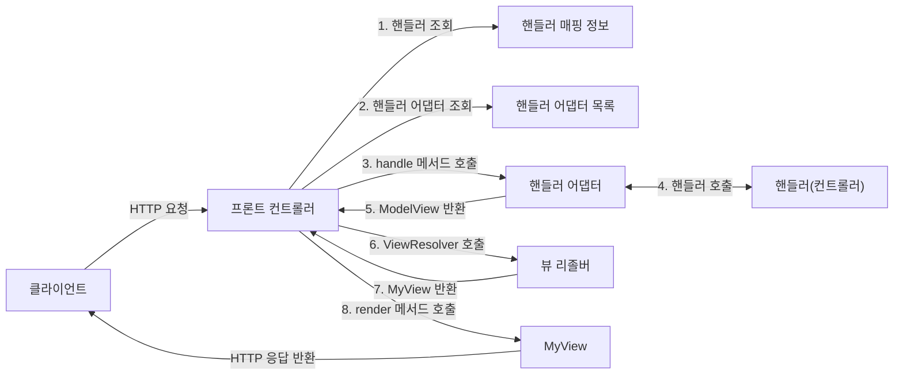
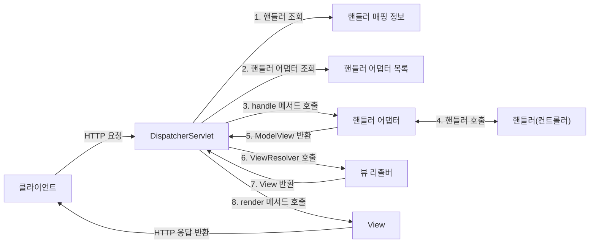

## 직접 만든 프레임워크와 스프링 MVC 구조 비교

앞서 직접 만든 MVC 프레임워크와 스프링 MVC의 구조를 비교해보자.

**직접 만든 MVC 프레임워크 구조**



**스프링 MVC의 구조**



도표를 보면 이름이 달라졌을 뿐이지, 구조는 완전히 동일하다는 것을 알 수 있다.

**직접 만든 MVC 프레임워크 -> 스프링 MVC 비교**

- FrontController -> DispatcherServlet
- handlerMappingMap -> HandlerMapping
- MyHandlerAdapter -> HandlerAdapter
- ModelView -> ModelAndView
- viewResolver -> ViewResolver
- MyView -> View

## DispatcherServlet 구조 살펴보기

`org.springframework.web.servlet.DispatcherServlet`

스프링 MVC도 프론트 컨트롤러의 패턴으로 동일하게 구현되어 있다. 스프링 MVC의 프론트 컨트롤러가 바로 디스패쳐 서블릿(`DispatchServlet`)이다. 그리고 이 디스패쳐 서블릿이 바로 스프링 MVC의 핵심이다.

#### DispatcherServlet 서블릿 등록

- `DispatcherServlet`도 부모 클래스에서 `HttpServlet`을 상속 받아서 사용하고, 서블릿으로 동작한다.
- `DispatcherServlet` -> `FrameworkServlet` -> `HttpServletBean` -> `HttpServlet`
- 스프링 부트는 `DispatcherServlet`을 서블릿으로 자동으로 등록하면서, 모든 경로(`urlPatterns="/"`)에 대해서 매핑한다.

> [!tip] urlPatterns의 우선 순위
> 우선순위는 더 자세한 경로가 우선순위가 높다. 그래서 기존에 등록한 서블릿도 함께 동작한다.
>
> 우선순위 예) "/hi" > "/"

#### 요청 흐름

- 서블릿이 호출되면 `HttpServlet`이 제공하는 `service()`가 호출된다.
- 스프링 MVC는 `DispatcherService`의 부모인 `FrameworkServlet`에서 `service()`를 오버라이드 해두었다.
- `FrameworkServlet.service()`를 시작으로 여러 메서드가 호출되면서 `DispatcherServlet.doDispatch()`가 호출된다.

`DispatcherServlet` 의 핵심인 `doDispatch()` 코드를 분석해본다.

최대한 간단히 설명하기 위해 예외처리, 인터셉터 기능은 제외했다.

```java
protected void doDispatch(HttpServletRequest request, HttpServletResponse
response) throws Exception {
	HttpServletRequest processedRequest = request;
	HandlerExecutionChain mappedHandler = null;
	ModelAndView mv = null;

	// 1. 핸들러 조회
	mappedHandler = getHandler(processedRequest);

	if (mappedHandler == null) {
		noHandlerFound(processedRequest, response);
		return;
	}

	// 2. 핸들러 어댑터 조회 - 핸들러를 처리할 수 있는 어댑터
	HandlerAdapter ha = getHandlerAdapter(mappedHandler.getHandler());

	// 3. 핸들러 어댑터 실행 -> 4. 핸들러 어댑터를 통해 핸들러 실행 -> 5. ModelAndView 반환
	mv = ha.handle(processedRequest, response, mappedHandler.getHandler());
	processDispatchResult(processedRequest, response, mappedHandler, mv,
	dispatchException);
}

private void processDispatchResult(HttpServletRequest request,
HttpServletResponse response, HandlerExecutionChain mappedHandler,
ModelAndView mv, Exception exception) throws Exception {
	// 뷰 렌더링 호출
	render(mv, request, response);
}

protected void render(ModelAndView mv, HttpServletRequest request,
HttpServletResponse response) throws Exception {
	View view;
	String viewName = mv.getViewName();

	// 6. 뷰 리졸버를 통해서 뷰 찾기, 7. View 반환
	view = resolveViewName(viewName, mv.getModelInternal(), locale, request);

	// 8. 뷰 렌더링
	view.render(mv.getModelInternal(), request, response);
}
```

![[spring-mvc1-springmvc-structure.png]]

**동작 순서**

1. 핸들러 조회: 핸들러 매핑을 통해 요청 URL에 매핑된 핸들러(컨트롤러)를 조회한다.
2. 핸들러 어댑터 조회: 핸들러를 실행할 수 있는 핸들러 어댑터를 조회한다.
3. 핸들러 어댑터 실행: 핸들러 어댑터를 실행한다.
4. 핸들러 실행: 핸들러 어댑터가 실제 핸들러를 실행한다.
5. ModelAndView 반환: 핸들러 어댑터는 핸들러가 반환하는 정보를 ModelAndView로 변환해서 반환한다.
6. viewResolver 호출: 뷰 리졸버를 찾고 실행한다.
   - JSP의 경우: `InternalResourceViewResolver`가 자동 등록되고 사용된다.
7. View 반환: 뷰 리졸버는 뷰의 논리 이름을 물리 이름으로 바꾸고, 렌더링 역할을 담당하는 뷰 객체를 반환한다.
   - JSP의 경우: `InternalResourceView(JstlView)`를 반환하는데, 내부에 `forward()` 로직이 있다.
8. 뷰 렌더링: 뷰를 통해서 뷰를 렌더링 한다.

**인터페이스 살펴보기**

- 스프링 MVC의 큰 강점은 `DispatcherServlet` 코드의 변경 없이, 원하는 기능을 변경하거나 확장할 수 있다는 점이다. 지금까지 설명한 대부분으 확장 가능할 수 있게 인터페이스로 제공한다.
- 이 인터페이스들만 구현해서 `DispatcherServlet`에 등록하면 나만의 컨트롤러를 만들 수도 있다.

**주요 인터페이스 목록**

- 핸들러 매핑: `org.springframework.web.servlet.HandlerMapping`
- 핸들러 어댑터: `org.springframework.web.servlet.HandlerAdapter`
- 뷰 리졸버: `org.springframework.web.servlet.ViewResolver`
- 뷰: `org.springframework.web.servlet.View`

> [!note] 정리
> 스프링 MVC는 코드 분량도 매우 많고, 복잡해서 내부 구조를 다 파악하는 것은 쉽지 않다. 사실 해당 기능을 확장하거나 나만의 컨트롤러를 만드는 일은 없다. 왜냐하면 스프링 MVC는 전세계 수 많은 개발자들의 요구사항에 맞추어 기능을 계속 확장해왔고, 그래서 웹 어플리케이션을 만들 때 필요로 하는 대부분의 기능이 이미 다 구현되어 있다.
>
> 그래도 이렇게 핵심 동작 방식을 알아두어야 향후 문제가 발생했을 때 어떤 부분에서 문제가 발생했는지 쉽게 파악하고, 문제를 해결할 수 있다.
>
> 그리고 확장 포인트가 필요할 때, 어떤 부분을 확장해야 할 지 감을 잡을 수 있다. 실제 다른 컴포넌트를 제공하거나 기능을 확장하는 부분들은 진행하면서 조금씩 설명한다.

## 핸들러 매핑과 핸들러 어댑터

지금은 전혀 사용하지 않지만, 스프링이 과거에 주로 사용했던 간단한 컨트롤러로 핸들러 매핑과 어댑터를 이해해본다.

스프링도 처음에는 유연하지 않은 다음과 같은 형식의 컨트롤러를 제공했다.

```java
public interface Controller {
	ModelAndView handleRequest(HttpServletRequest request,
	 HttpServletResponse response) throws Exception;
}
```

이 인터페이스를 구현하는 컨트롤러 클래스를 만든다.

```java
@Component("/springmvc/old-controller")
public class OldController implements Controller {
    @Override
    public ModelAndView handleRequest(HttpServletRequest request, HttpServletResponse response) throws Exception {
        System.out.println("OldController.handleRequest");
        return null;
    }
}
```

- `@Component`: 이 컨트롤러는 `/springmvc/old-controller`라는 이름의 스프링 빈으로 등록되었다.
- **빈의 이름으로 URL을 매핑**할 것이다.

브라우저에서 이 경로로 이 경로로 이동해보면 이 컨트롤러가 호출된 것을 알 수 있다. 이 컨트롤러는 어떻게 **URL**로 호출 될 수 있는 것일까?

이 컨트롤러가 호출되려면 다음 두 가지가 필요하다.

- **HandlerMapping (핸들러 매핑)**
  - 핸들러 매핑에서 이 컨트롤러를 찾을 수 있어야 한다.
  - 예) **스프링 빈의 이름으로 핸들러를 찾을 수 있는 핸들러 매핑**이 필요하다.
- **HandlerAdapter (핸들러 어탭터)**
  - 핸들러 매핑을 통해서 찾은 핸들러를 실행할 수 있는 핸들러 어댑터가 필요하다.
  - 예) `Controller` 인터페이스를 실행할 수 있는 핸들러 어댑터를 찾고 실행해야 한다.

스프링은 이미 필요한 핸들러 매핑과 핸들러 어댑터를 대부분 구현해두었다. 개발자가 직접 핸들러 매핑과 핸들러 어댑터를 만드는 일은 거의 없다.

#### 스프링 부트가 자동 등록하는 핸들러 매핑과 핸들러 어댑터

**HandlerMapping 동작 순서**

(다양하지만 중요한 부분 위주로 설명하기 위해 생략)

```
0 = RequestMappingHandlerMapping : 어노테이션 기반의 컨트롤러인 @RequestMapping에서 사용
1 = BeanNameUrlHandlerMapping    : 스프링 빈의 이름으로 핸들러를 찾는다.
```

**HandlerAdapter 동작 순서**

(다양하지만 중요한 부분 위주로 설명하기 위해 생략)

```
0 = RequestMappingHandlerAdapter : 애노테이션 기반의 컨트롤러인 @RequestMapping에서 사용
1 = HttpRequestHandlerAdapter : HttpRequestHandler 처리
2 = SimpleControllerHandlerAdapter : Controller 인터페이스(애노테이션X, 과거에 사용) 처리
```

1. 핸들러 매핑으로 핸들러 조회
   1. 핸들러 매핑을 순서대로 실행해서, 핸들러를 찾는다.
   2. `BeanNameUrlHandlerMapping`이 실행에 성공하고 핸들러인 `OldController`를 반환한다.
2. 핸들러 어댑터 조회
   1. `HandlerAdapter`의 `supports()`를 순서대로 호출한다.
   2. `SimpleControllerHandlerAdapter`가 `Controller` 인터페이스를 지원하므로 대상이 된다.
3. 핸들러 어댑터 실행
   1. 디스패처 서블릿이 조회한 `SimpleControllerHandlerAdapter`를 실행하면서 핸들러 정보도 함께 넘겨준다.
   2. `SimpleControllerHandlerAdapter`는 핸들러인 `OldController`를 내부에서 실행하고, 그 결과를 반환한다.

**정리**

- `OldController`를 실행하면서 사용된 객체는 다음과 같다.
- `HandlerMapping` = `BeanNameUrlHandlerMapping`
- `HandlerAdapter` = `SimpleContainerHandlerAdapter`

### HttpRequestHandler

핸들러 매핑과 어댑터를 잘 이해하기 위해 `Controller` 인터페이스가 아닌 다른 핸들러를 알아본다.
`HttpRequestHandler`는 **서블릿과 가장 유사한 형태**의 핸들러이다.

```java
public interface HttpRequestHandler {
	void handleRequest(HttpServletRequest request, HttpServletResponse response) throws ServletException, IOException;
}
```

위 `HttpRequestHandler.handleRequest()`를 살펴보면 반환 값이 `void`인 것을 알 수 있다. 기본 서블릿 형식처럼 모든 것을 이 `handleRequest()` 메서드 안에서 처리해야 한다는 것이다.

```java
Component("/springmvc/request-handler")
public class MyHttpRequestHandler implements HttpRequestHandler {
    @Override
    public void handleRequest(HttpServletRequest request, HttpServletResponse response)
            throws ServletException, IOException {
        System.out.println("MyHttpRequestHandler.handleRequest");
    }
}
```

- `MyHttpRequestHandler`는 `HttpRequestHandler`의 구현체다.

1. 핸들러 매핑으로 핸들러 조회

   1. `HandlerMapping` 을 순서대로 실행해서, 핸들러를 찾는다.
   2. 이 경우 빈 이름으로 핸들러를 찾아야 하기 때문에 이름 그대로 빈 이름으로 핸들러를 찾아주는 `BeanNameUrlHandlerMapping` 가 실행에 성공하고 핸들러인`MyHttpRequestHandler` 를 반환한다.

2. 핸들러 어댑터 조회
   1. `HandlerAdapter` 의 `supports()` 를 순서대로 호출한다.
   2. `HttpRequestHandlerAdapter` 가 `HttpRequestHandler` 인터페이스를 지원하므로 대상이 된다.
3. 핸들러 어댑터 실행
   1. 디스패처 서블릿이 조회한 `HttpRequestHandlerAdapter` 를 실행하면서 핸들러 정보도 함께 넘겨준다.
   2. `HttpRequestHandlerAdapter`는 핸들러인 `MyHttpRequestHandler`를 내부에서 실행하고, 그 결과를 반환한다.

**정리**

- `MyHttpRequestHandler`를 실행하면서 사용된 객체는 다음과 같다.
- `HandlerMapping` = `BeanNameUrlHandlerMapping`
- `HandlerAdapter` = `HttpRequestHandlerAdapter`

> [!tip] @RequestMapping
> 가장 우선순위가 높은 핸들러 매핑과 핸들러 어댑터는 다음 두 핸들러 매핑과 어댑터다.
>
> - `RequestMappingHandlerMapping`
> - `ReqeustMappingHandlerAdapter`
>
> `@RequestMapping` 어노테이션의 앞글자를 따서 만든 이름인데, 이것이 바로 지금 스프링에서 주로 사용하는 어노테이션 기반의 컨트롤러를 지원하는 매핑과 어댑터이다. 실무에서는 99.9% 이 방식의 컨트롤러를 사용한다.

## 뷰 리졸버

이번에는 뷰 리졸버에 대해서 자세히 알아본다. 앞서 간단히 만들었던 `OldController` 클래스의 `handleRequest()`가 `ModelAndView`를 통해 `JSP` 파일의 논리 이름을 반환하도록 한다.

```java
@Component("/springmvc/old-controller")
public class OldController implements Controller {
    @Override
    public ModelAndView handleRequest(HttpServletRequest request, HttpServletResponse response) throws Exception {
        System.out.println("OldController.handleRequest");
        return new ModelAndView("new-form");
    }
}
```

다시 `localhost:8080/springmvc/old-controller`를 방문해보면 컨트롤러는 정상 호출 되지만, `Whitelabel Error Page` 에러가 발생한다.

현재 스프링 부트를 사용하고 있기 때문에 `application.properties`에 다음 설정을 추가한다.

```
spring.mvc.view.prefix=/WEB-INF/views/
spring.mvc.view.suffix=.jsp
```

다시 `localhost:8080/springmvc/old-controller`를 방문해보면 정상적으로 동작한다.

#### 뷰 리졸버 - InternalResourceViewResolver

스프링 부트는 `InternalResourceViewResolver`라는 뷰 리졸버를 자동으로 등록하는데, 이 때 `application.properties`에 등록한 `spring.mvc.view.prefix`와 `spring.mvc.view.suffix` 설정 정보를 사용해서 등록한다.

실제로 스프링 부트는 다음의 코드처럼 `InternalResourceViewResolver`를 등록한다.

```java
@ServletComponentScan
@SpringBootApplication
public class ServletApplication {
	public static void main(String[] args) { ... }

	@Bean
	ViewResolver internalResourceViewResolver() {
		return new InternalResourceViewResolver("/WEB-INF/views", ".jsp");
	}
}
```

- `InternalResourceViewResolver`의 파라미터는 앞서 `application.properties`에 등록한 `prefix`와 `suffix`와 같다.

#### 뷰 리졸버의 동작 방식

스프링 부트가 자동 등록하는 뷰 리졸버

(다양하지만 중요한 부분 위주로 설명하기 위해 생략)

```
1 = BeanNameViewResolver         : 빈 이름으로 뷰를 찾아서 반환한다. (예: 엑셀 파일 생성 기능에 사용)
2 = InternalResourceViewResolver : JSP를 처리할 수 있는 뷰를 반환한다.
```

1. 핸들러 어댑터 호출
   - 핸들러 어댑터를 통해 `new-form`이라는 논리 뷰 이름을 획득한다.
2. ViewResolver 호출
   - `new-form`이라는 뷰 이름으로 viewResolver를 순서대로 호출한다.
   - `BeanNameViewResolver`는 `new-form`이라는 이름의 스프링 빈으로 등록된 뷰를 찾아야 하는데 없다.
   - 따라서 `InternalResourceViewResolver`가 호출된다.
3. InternalResourceViewResolver
   - 이 뷰 리졸버는 `InternalResourceView`를 반환한다.
4. 뷰 - InternalResourceView
   - `InternalResourceView`는 JSP처럼 `forward()`를 호출해서 처리할 수 있는 경우에 사용한다.
5. view.render()
   - `view.render()`가 호출되고, `InternalResourceView`는 `forward()`를 사용해서 JSP를 실행한다.

---

References: 김영한의 스프링 MVC 1편

Links to this page:
