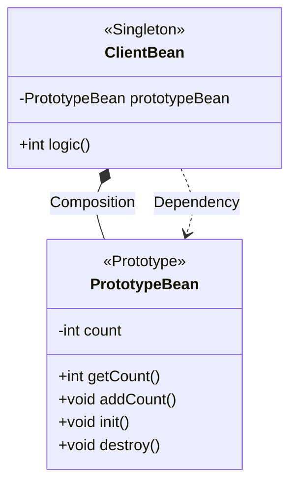

---
title:
tags:
  - java
  - programming
  - spring
publish: true
date: 2024-11-19
---

## 빈 스코프란?

스프링 빈은 스프링 컨테이너의 시작과 함께 생성되어서 스프링 컨테이너가 종료될 때 까지 유지된다고 학습했다. 이것은 스프링 빈이 기본적으로 싱글톤 스코프로 생성되기 때문이다.

스코프는 번역 그대로 빈이 존재할 수 있는 범위를 의미한다. 스프링은 다음과 같은 다양한 스코프를 지원한다.

- **싱글톤**: 기본 스코프, 스프링 컨테이너의 시작과 종료까지 유지되는 가장 넓은 범위의 스코프
- **프로토타입**: 스프링 컨테이너는 프로토타입 빈의 생성과 의존관계 주입까지만 관여하고 더는 관리하지 않는 매우 짧은 범위의 스코프
- **웹 관련 스코프**:
  - **request**: 웹 요청이 들어오고 나갈때까지 유지되는 스코프
  - **session**: 웹 세션이 생성되고 종료될 때 까지 유지되는 스코프
  - **application**: 웹의 서블릿 컨텍스트와 같은 범위로 유지되는 스코프

빈 스코프는 다음과 같이 지정할 수 있다.

### 컴포넌트 스캔을 통한 빈 자동 등록

```java
@Scope("prototype")
@Component
public class HelloBean {}
```

### @Configuration 설정 정보를 통한 빈 수동 등록

```java
@Scope("prototype)
@Bean
PrototypeBean HelloBean() {
	return new HelloBean();
}
```

지금까지는 싱글톤 스코프를 계속 사용하였으니 프로토타입 스코프부터 알아본다.

## 프로토타입 스코프

싱글톤 스코프의 빈을 조회하면 스프링 컨테이너는 항상 같은 인스턴스의 스프링 빈을 반환한다. 반면에 프로토타입 스코프를 스프링 컨테이너에 조회하면 스프링 컨테이너는 항상 새로운 인스턴스를 생성해서 반환한다.

### 싱글톤 빈 요청 과정

![[spring-basic-bean-scope-1.png]]

1. 싱글톤 스코프의 빈을 스프링 컨테이너에 요청한다.
2. 스프링 컨테이너는 본인이 관리하는 스프링 빈을 반환한다.
3. 이후에 스프링 컨테이너에 같은 요청이 와도 같은 객체 인스턴스의 스프링 빈을 반환한다.

### 프로토타입 빈 요청 과정

![[spring-basic-bean-scope-2.png]]

1. 프로토타입 스코프의 빈을 스프링 컨테이너에 요청한다
2. 스프링 컨테이너는 이 시점에 프로토타입 빈을 생성하고, 필요한 의존관계를 주입한다.

![[spring-basic-bean-scope-3.png]] 3. 스프링 컨테이너는 생성한 프로토타입 빈을 클라이언트에 반환한다. 4. 이후에 스프링 컨테이너에 같은 요청이 오면 항상 새로운 프로토타입 빈을 생성해서 반환한다.

> [!summary] 핵심
> **스프링 컨테이너는 프로토타입 빈을 생성하고, 의존관계 주입, 초기화까지만 처리한다.**
> 클라이언트에 빈을 반환하고, 이후 스프링 컨테이너는 생성된 프로토타입 빈을 관리하지 않는다.
>
> 프로토타입 빈을 관리할 책임은 프로토타입을 받은 클라이언트에게 있다. 그래서 `@PreDestroy`같은 종료 메서드가 호출되지 않는다.

```java
public class PrototypeBeanTest {
    @Test
    void prototypeBeanFind() {
        AnnotationConfigApplicationContext ac = new AnnotationConfigApplicationContext(PrototypeBean.class);

        PrototypeBean bean1 = ac.getBean(PrototypeBean.class);
        PrototypeBean bean2 = ac.getBean(PrototypeBean.class);

        System.out.println("bean1 = " + bean1);
        System.out.println("bean2 = " + bean2);

        Assertions.assertThat(bean1).isNotSameAs(bean2);

        ac.close();
    }

    @Scope("prototype")
    static class PrototypeBean {
        @PostConstruct
        public void init() {
            System.out.println("PrototypeBeanTest.init");
        }

        @PreDestroy
        public void destroy() {
            System.out.println("PrototypeBeanTest.destroy");
        }
    }
}
```

- 싱글톤 빈은 스프링 컨테이너 생성 시점에 초기화 메서드가 실행 되지만, 프로토타입 스코프의 빈은 스프링 컨테이너에서 빈을 조회할 때 생성되고 초기화 메서드도 실행 된다.
- 싱글톤 빈은 스프링 컨테이너가 관리하기 때문에 스프링 컨테이너가 종료될 때 빈의 종료 메서드가 실행되지만, 프로토타입 빈은 스프링 컨테이너가 생성과 의존관계 주입 그리고 초기화까지만 관여하고 더는 관리하지 않는다.
- 따라서 프로토타입 빈은 스프링 컨테이너가 종료될 때 `@PreDestroy`가 적용된 종료 메서드를 실행하지 않는다.

> [!note] 프로토타입 빈의 특징
>
> - 스프링 컨테이너에 요청할 때 마다 새로 생성된다.
> - 스프링 컨테이너는 프로토타입 빈의 생성과 의존관계 주입, 그리고 초기화까지만 관여한다.
> - 종료 메서드가 호출되지 않는다.
> - 그래서 프로토타입 빈을 조회한 클라이언트가 관리해야 한다. 종료 메서드에 대한 호출도 클라이언트가 직접 해야한다.

## 프로토타입 스코프 - 싱글톤 빈과 함께 사용시 문제점

스프링 컨테이너에 프로토타입 스코프의 빈을 요청하면 항상 새로운 객체 인스턴스를 생성해서 반환한다.
하지만 싱글톤 빈과 함께 사용할 때는 의도한 대로 잘 동작하지 않으므로 주의해야 한다.

```java
public class SingletonWithPrototypeTest1 {
    @Test
    void prototypeFind() {
        AnnotationConfigApplicationContext ac = new AnnotationConfigApplicationContext(PrototypeBean.class);
        PrototypeBean bean1 = ac.getBean(PrototypeBean.class);
        bean1.addCount();
        assertThat(bean1.getCount()).isEqualTo(1);

        PrototypeBean bean2 = ac.getBean(PrototypeBean.class);
        bean2.addCount();
        assertThat(bean2.getCount()).isEqualTo(1);
    }

    @Test
    void singletonClientUsePrototype() {
        AnnotationConfigApplicationContext ac = new AnnotationConfigApplicationContext(ClientBean.class,
                PrototypeBean.class);
        ClientBean clientBean1 = ac.getBean(ClientBean.class);
        ClientBean clientBean2 = ac.getBean(ClientBean.class);

        int count1 = clientBean1.logic();
        assertThat(count1).isEqualTo(1);

        int count2 = clientBean2.logic();
        assertThat(count2).isEqualTo(2);
    }

    @Scope("singleton")
    @RequiredArgsConstructor
    static class ClientBean {
        private final PrototypeBean prototypeBean;

        public int logic() {
            prototypeBean.addCount();
            return prototypeBean.getCount();
        }
    }

    @Scope("prototype")
    static class PrototypeBean {
        private int count;

        public void addCount() {
            count++;
        }

        public int getCount() {
            return count;
        }

        @PostConstruct
        public void init() {
            System.out.println("PrototypeBean.init = " + this);
        }

        @PreDestroy
        public void destroy() {
            System.out.println("PrototypeBean.destroy");
        }
    }
}
```

실습을 위해 먼저 테스트 코드를 작성한다. 위 코드의 구조는 아래와 같다.



이 코드는 개발자의 의도와 다르게 작동할 수 있는데, 이유는 스코프의 차이로 인해 발생한다. 코드를 살펴보면 `ClientBean`은 싱글톤 스코프를 가지는 객체이고, `PrototypeBean`은 프로토타입 스코프를 가지는 객체이다.

스프링 컨테이너가 시작과 동시에 객체를 생성하고, 의존관계를 주입한다. 이 떄 `ClientBean`의 의존관계인 `PrototypeBean`이 주입된다.

스프링 컨테이너는 프로토타입 스코프를 가지는 객체에 대해 객체 생성, 의존관계 주입, 초기화까지만 관여한다. 따라서 `ClientBean`에 주입된 `PrototypeBean`은 이제 스프링 컨테이너의 관리 영역에서 벗어난 것이다.

어쨌든 `ClientBean`은 싱글톤 스코프를 가지므로, 스프링 컨테이너가 종료될 때 까지 유지된다. 따라서 한번 주입 된 **`PrototypeBean`은 의도와 다르게 매번 새로운 객체를 생성하지 않고, 같은 객체를 사용하게 된다.** 쉽게 이야기 해서 싱글톤 빈이 프로토타입 빈을 사용하게 된다. 그런데 싱글톤 빈은 생성 시점에만 의존관계 주입을 받기 때문에, 프로토타입 빈이 새로 생성되기는 하지만, 싱글톤 빈과 함께 계속 유지되는 것이 문제다.

이럴거면 싱글톤 빈을 쓰지, 왜 프로토타입 빈으로 사용하겠는가?

개발자의 의도가 `ClientBean.logic()`을 호출할 때마다 새로운 `PrototypeBean` 인스턴스를 사용하는 것이라면 어떻게 구현해야 할까?

## 프로토타입 스코프 - 싱글톤 빈과 함께 사용시 Provider로 문제 해결

싱글톤 빈과 프로토타입 빈을 함께 사용할 때, 어떻게 하면 사용할 때 마다 새로운 프로토타입 빈을 생성할 수 있을까?

### 스프링 컨테이너에 요청

가장 간단한 방법은 싱글톤 빈이 프로토타입을 사용할 때 마다 스프링 컨테이너에 새로 요청하는 것이다.

```java
static class ClientBean {
	@Autowired private ApplicationContext ac;

	public int logic() {
		PrototypeBean prototypeBean = ac.getBean(PrototypeBean.class);
		prototypeBean.addCount();

		return prototypeBean.getCount();
	}
}

```

- `ApplicationContext`를 통해서 `getBean()`시 항상 새로운 프로토타입 빈이 생성된다.
- 그런데 이렇게 스프링 어플리케이션 컨텍스트 전체를 주입받게 되면, 스프링 컨테이너에 종속적인 코드가 되고, 단위 테스트도 어려워진다.
- 의존관계를 외부에서 주입 받는게 아니라 이렇게 직접 필요한 의존관계를 찾는 것을 Dependency Lookup(DL), 의존관계 조회(탐색)이라한다.
- 지금 필요한 기능은 프로토타입 빈을 컨테이너에서 대신 찾아주는, 정확히 **DL** 정도의 기능만 제공하는 무언가다.

스프링에는 이미 모든게 준비되어 있다.

### ObjectFactory, ObjectProvider

지정한 빈을 컨테이너에서 대신 찾아주는 DL 서비스를 제공하는 것이 바로 `ObjectProvider`이다. 참고로 과거에는 `ObjectFactory`가 있었는데, 여기에 편의 기능을 추가해서 `ObjectProvider`가 만들어졌다.

```java
@Scope("singleton")
static class ClientBean {
    @Autowired private ObjectProvider<PrototypeBean> prototypeBeanObjectProvider;

    public int logic() {
        PrototypeBean prototypeBean = prototypeBeanObjectProvider.getObject();
        prototypeBean.addCount();
        return prototypeBean.getCount();
    }
}
```

- 실행해보면 `prototypeBeanObjectProvider.getObject()`를 통해서 항상 새로운 프로토타입 빈이 생성되는 것을 확인할 수 있다.
- `ObjectProvider`의 `getObject()`를 호출하면, 내부에서는 스프링 컨테이너를 통해 해당 빈을 찾아서 반환한다. 프로토타입 스코프를 가진 객체라면, 컨테이너에서 새롭게 인스턴스를 생성해서 반환하는 것이다.
- 스프링이 제공하는 기능을 사용하지만, 기능이 단순하므로 단위테스트를 만들거나 mock 코드를 만들기는 훨씬 쉬워진다.

> [!note] ObjectProvider\<T>의 핵심
> 프로토타입에 한정 되어 사용하는 것이 아니라, 스프링 컨테이너를 통해서 의존관계를 탐색하는 데에 편리하게 사용하는 것이다.
>
> 프로토타입 전용은 아니고, 핵심 컨셉은 스프링 컨테이너에서 스프링 빈을 조회할 때 사용한다.

> [!summary] 정리
>
> - 프로토타입 빈을 언제 사용해야 할까? 매번 사용할 때 마다 의존관계 주입이 완료된 새로운 객체가 필요하면 사용하면 된다.
> - 그런데 실무에서 웹 어플리케이션을 개발해보면, 싱글톤 빈으로 대부분의 문제를 해결할 수 있기 때문에 프로토타입 빈을 직접적으로 사용하는 경우는 매우 드물다.
> - `ObjectProvider`는 프로토타입 뿐만 아니라 Dependency Lookup이 필요한 경우 언제든지 사용할 수 있다.

## 웹 스코프

지금까지 싱글톤과 프로토타입 스코프를 학습했다.

싱글톤은 스프링 컨테이너의 시작과 끝까지 함께하는 매우 긴 스코프이고, 프로토타입은 생성과 의존관계 주입, 그리고 초기화까지만 진행하는 특별한 스코프이다. 이번에는 웹 스코프에 대해서 알아본다.

#### 웹 스코프의 특징

- 웹 스코프는 웹 환경에서만 동작한다.
- 웹 스코프는 프로토타입과 다르게 스프링이 해당 스코프의 종료시점까지 관리한다. 따라서 종료 메서드가 호출된다.

#### 종류

- **request**: HTTP 요청마다 생성되고, 유지되는 스코프다. 따라서 각각의 HTTP 요청마다 별도의 빈 인스턴스가 생성되고 관리된다.
- **session**: HTTP Session과 동일한 생명주기를 가지는 스코프
- **application**: 서블릿 컨텍스트(`ServletContext`)와 동일한 생명주기를 가지는 스코프
- **websocket**: 웹 소켓과 동일한 생명주기를 가지는 스코프

사실 아직 세션이나, 서블릿 컨텍스트, 웹 소켓 같은 용어를 잘 모른다. 여기서는 `request` 스코프만을 예제로 설명한다. 나머지도 범위만 다르지 동작은 비슷하다.

#### request 스코프 예제를 위한 설정

```title="build.gradle"
implementation 'org.springframework.boot:spring-boot-starter-web'
```

웹 스코프는 웹 환경에서만 동작하므로 웹 환경이 동작하도록 위 라이브러리를 추가한다.

> [!tip] 참고
> 스프링 부트는 웹 라이브러리가 없으면 우리가 지금까지 학습한 `AnnotationConfigApplicationContext`를 기반으로 어플리케이션을 구동한다.
>
> 웹 라이브러리가 추가되면 웹과 관련된 추가 설정과 환경들이 필요하므로 `AnnotationConfigServletWebServerApplicationContext`를 기반으로 어플리케이션을 구동한다.

### request 스코프 예제 개발

동시에 여러 HTTP 요청이 오면 정확히 어떤 요청이 남긴 로그인지 구분하기 어렵다. 이럴때 사용하기 좋은 것이 바로 request 스코프이다.

다음과 같이 로그가 남도록 request 스코프를 활용해서 추가 기능을 개발한다.

```
[d06b992f...] request scope bean create
[d06b992f...] [http://localhost:8080/log-demo] controller test
[d06b992f...] [http://localhost:8080/log-demo] service id = testId
[d06b992f...] request scope bean close
```

- UUID를 사용해서 HTTP 요청을 구분한다.
- requestURL 정보도 추가로 출력하여 어떤 URL을 요청해서 남은 로그인지 구분한다.

```java title="MyLogger.java"
@Component
@Scope(value = "request")
public class MyLogger {
    private String uuid;

    @Setter
    private String requestURL;

    public void log(String message) {
        System.out.println("[" + uuid + "] " + "[" + requestURL + "] " + message);
    }

    @PostConstruct
    public void init() {
        uuid = UUID.randomUUID().toString();
        System.out.println("[" + uuid + "] request scope bean create: " + this);
    }

    @PreDestroy
    public void close() {
        System.out.println("[" + uuid + "] request scope bean close: " + this);
    }
}
```

- 로그를 출력하기 위한 `MyLogger` 클래스이다.
- `@Scope(value = "request")`를 사용해서 request 스코프로 지정했다. 이제 이 빈은 HTTP 요청 당 하나씩 생성되고, HTTP 요청이 끝나는 시점에 소멸된다.
- 이 빈이 생성되는 시점에 자동으로 `@PostConstruct` 초기화 메서드를 사용, uuid를 생성해서 저장해둔다. 이 빈은 HTTP 요청 당 하나씩 생성되므로 uuid를 저장해두면 다른 HTTP 요청과 구분할 수 있다.
- 이 빈이 소멸되는 시점에 `@PreDestroy`를 사용해서 종료 메시지를 남긴다.
- `requestURL`은 이 빈이 생성되는 시점에는 알 수 없으므로 외부에서 세터로 입력 받는다.

```java title="LogDemoService.java"
@Service
@RequiredArgsConstructor
public class LogDemoService {
    private final ObjectProvider<MyLogger> myLoggerProvder;

    public void logic(String id) {
        MyLogger myLogger = myLoggerProvder.getObject();
        myLogger.log("service id = " + id);
    }
}
```

```java title="LogDemoController.java"
@Controller
@RequiredArgsConstructor
public class LogDemoController {
    private final LogDemoService logDemoService;
    private final ObjectProvider<MyLogger> myLoggerProvider;

    @RequestMapping("log-demo")
    @ResponseBody
    public String logDemo(HttpServletRequest request) {
        String requestURL = request.getRequestURL().toString();
        MyLogger myLogger = myLoggerProvider.getObject();
        myLogger.setRequestURL(requestURL);

        myLogger.log("controller test");
        logDemoService.logic("testId");

        return "OK";
    }

}
```

1. 스프링 어플리케이션을 실행하는 시점에 싱글톤 빈은 생성해서 주입이 가능하지만, request 스코프 빈은 아직 생성되지 않는다. 따라서 이 빈은 실제 고객의 요청이 와야만 생성할 수 있다.
2. 따라서 `ObjectProvider`를 통해서, 실제 요청이 왔을 때 의존관계를 탐색하여 생성한다.

> [!tip] 계층의 분리
> 만약 reqeust scope를 사용하지 않고 파라미터로 컨트롤러에서 사용하던 정보를 서비스 계층에 넘긴다면 파라미터가 많아서 지저분해진다.
>
> 더 문제는 requestURL 같은 웹과 관련된 정보가 웹과 관련없는 서비스 계층까지 넘어가게 된다.
>
> 웹과 관련된 부분은 컨트롤러까지만 사용해야 한다. 서비스 계층은 웹 기술에 종속되지 않고 가급적 순수하게 유지하는 것이 유지보수 관점에서 좋다.

```title="실행 결과"
[a5a093ea-018a-416e-99b3-8bc433936fda] request scope bean create: hello.core.common.MyLogger@48584598
[a5a093ea-018a-416e-99b3-8bc433936fda] [http://localhost:8080/log-demo] controller test
[a5a093ea-018a-416e-99b3-8bc433936fda] [http://localhost:8080/log-demo] service id = testId
[a5a093ea-018a-416e-99b3-8bc433936fda] request scope bean close: hello.core.common.MyLogger@48584598
```

- `ObjectProvider` 덕분에 `ObjectProvider.getObject()`를 호출하는 시점까지 request scope **빈의 생성을 지연**할 수 있다. (정확한 표현은, 스프링 컨테이너에 request scope 빈 생성 요청을 지연하는 것이다)
- `ObjectProvider.getObject()`를 호출하는 시점에는 HTTP 요청이 진행중이므로 request scope 빈의 생성이 정상 처리된다.
- `ObjectProvider.getObject()`를 `LogDemoController`, `LogDemoService`에서 각각 한번씩 따로 호출해도 같은 HTTP 요청이면 같은 스프링 빈이 반환된다.

### 스코프와 프록시

이번에는 프록시 방식을 사용해본다.

```java
@Component
@Scope(value = "request", proxyMode = ScopedProxyMode.TARGET_CLASS)
public class MyLogger { ... }
```

- `proxyMode = ScopedProxyMode.TARGET_CLASS`
  - 적용 대상이 인터페이스가 아닌 클래스면 `TARGET_CLASS`를 선택
  - 적용 대상이 인터페이스면 `INTERFACE`를 선택
  - 여기서 적용 대상은, `MyLogger`이다. 만약 `MyLogger`가 인터페이스면 `INTERFACE`를 선택하라는 의미다. 현재 예제에서는 클래스이기 때문에 `TARGET_CLASS`를 선택한다.
- 이렇게 하면 마치 ObjectProvider를 이용하듯이 잘 작동한다.
- 사실 **`MyLogger`의 가짜 프록시 클래스를 만들어두고 HTTP 요청과 상관 없이 가짜 프록시 클래스를 다른 빈에 미리 주입**해 두는 것이다.

**CGLIB**이라는 라이브러리로 내 클래스를 상속 받은 가짜 프록시 객체를 만들어서 주입한다.

- `@Scope`의 `proxyMode = ScopedProxyMode.TARGET_CLASS`를 설정하면 스프링 컨테이너는 CGLIB이라는 바이트 코드 조작 라이브러리를 통해서 `MyLogger`를 상속받은 가짜 프록시 객체를 생성한다.
- 객체를 확인해보면 우리가 등록한 순수한 `MyLogger` 클래스가 아니라 `MyLogger$$EnhancerBySpringCGLIB`이라는 클래스로 만들어진 객체가 대신 등록된 것을 확인할 수 있다.
- 그리고 스프링 컨테이너에 "myLogger"라는 이름으로 이 가짜 프록시 객체를 등록한다.
- `ac.getBean("myLogger", MyLogger.class)`로 조회해도 가짜 프록시 객체가 조회 된다.
- 그래서 의존관계 주입도 이 가짜 프록시 객체가 주입된다.

![[spring-basic-bean-scope-proxy.png]]
이 가짜 프록시 객체는 요청이 오면 내부에서 진짜 빈을 요청하는 위임 로직이 들어있다.

- 가짜 프록시 객체는 내부에 진짜 `myLogger`를 찾는 방법을 알고 있다.
- 클라이언트가 `myLogger.log()`를 호출하면 사실은 가짜 프록시 객체의 메서드를 호출한 것이다.
- 가짜 프록시 객체는 request 스코프의 진짜 `myLogger.log()`를 호출한다.
- 가짜 프록시 객체는 원본 클래스를 상속 받아서 만들어졌기 때문에 이 객체를 사용하는 클라이언트 입장에서는 사실 원본인지 아닌지도 모르게 동일하게 사용할 수 있다(다형성)

#### 동작 정리

- CGLIB이라는 라이브러리로 내 클래스를 상속 받은 가짜 프록시 객체를 만들어서 의존관계 주입한다.
- 이 가짜 프록시 객체는 실제 요청이 오면 그때 내부에서 실제 빈을 요청하는 위임 로직이 들어있다.
- 가짜 프록시 객체는 실제 request scope와는 관계가 없다. 그냥 가짜이고, 내부에 단순한 위임 로직만 있고 싱글톤 처럼 동작한다.

#### 특징 정리

- 프록시 객체 덕분에 클라이언트는 마치 싱글톤 빈을 사용하듯이 편리하게 request scope를 사용할 수 있다.
- 사실 Provider를 사용하든, 프록시를 사용하든 핵심 아이디어는 **진짜 객체 조회를 꼭 필요한 시점까지 지연처리**한다는 점이다.
- 단지 어노테이션 설정만으로 원본 객체를 프록시 객체로 대체할 수 있다. 이것이 바로 다형성과 DI 컨테이너가 가진 큰 장점이다.
- 꼭 웹 스코프가 아니더라도 프록시는 사용할 수 있다.

> [!warning] 주의점
> 마치 싱글톤을 사용하는 것 같지만, 다르게 동작하기 때문에 결국 주의해서 사용해야 한다.
>
> 이런 특별한 scope는 꼭 필요한 곳에만 최소화해서 사용하자, 무분별하게 사용하면 유지보수가 어려워진다.

---

References: 김영한의 스프링 핵심 원리 - 기본편

Links to this page: [[로그 추적기]], [[스프링 AOP 실무 주의사항]]