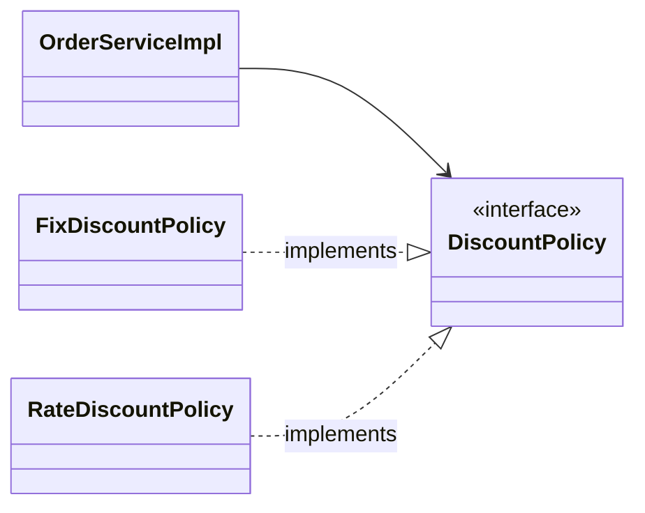
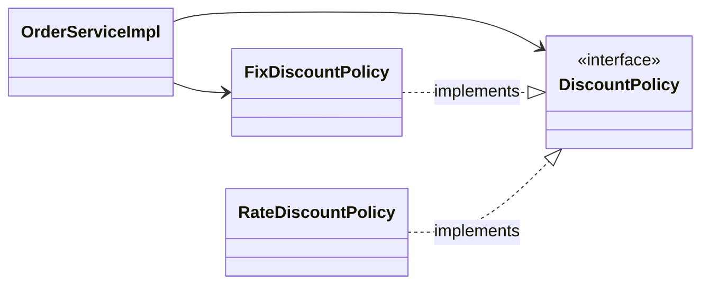
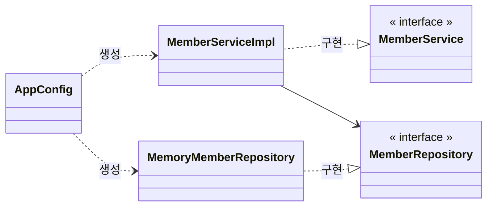
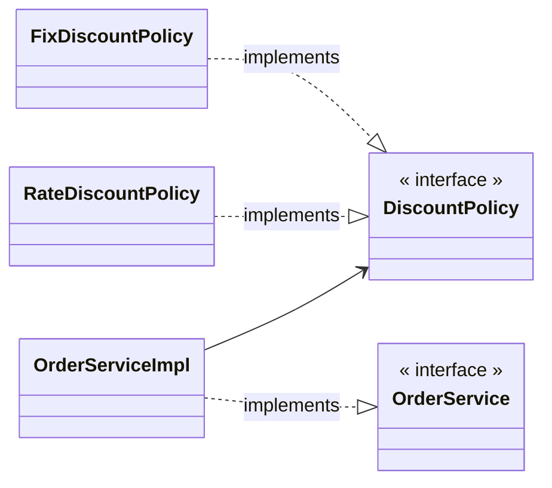

---
title:
tags:
  - java
  - programming
  - spring
publish: true
date: 2024-11-15
---

## 비즈니스 요구사항과 설계

- 회원
  - 회원을 가입하고 조회할 수 있다.
  - 회원은 일반과 VIP 두 가지 등급이 있다.
  - 회원 데이터는 자체 DB를 구축할 수 있고, 외부 시스템과 연동할 수 있다. (미확정)
- 주문과 할인 정책
  - 회원은 상품을 주문할 수 있다.
  - 회원 등급에 따라 할인 정책을 적용할 수 있다.
  - 할인 정책은 모든 VIP는 1000원을 할인해주는 고정 금액 할인을 적용해달라. (나중에 변경 가능)
  - 할인 정책은 변경 가능성이 높다. 회사의 기본 할인 정책을 아직 정하지 못했고, 오픈 직전까지 고민을 미루고 싶다. 최악의 경우 할인을 적용하지 않을 수도 있다. (미확정)

요구사항을 살펴보면 회원 데이터, 할인 정책 같은 부분은 지금 당장 결정하기 어려운 부분이다. 그렇다고 정책이 결정 될 때까지 개발을 무기한 기다릴 수도 없다.

앞서 학습했던 [[resources/프로그래밍/강의/김영한의 자바/기본/다형성|다형성]]을 활용하여 객체 지향 설계 방법으로 개발한다. 먼저 스프링 없는 순수한 자바로만 개발을 진행한다.

## 회원 도메인 설계

- 회원을 가입하고 조회할 수 있다.
- 회원은 일반과 VIP 두 가지 등급이 있다.
- 회원 데이터는 자체 DB를 구축할 수도 있고, 외부 시스템과 연동할 수 있다. (미확정)

![[spring-basic-예제만들기-1.png]]

![[spring-basic-예제만들기-2.png]]

![[spring-basic-예제만들기3.png]]

- **도메인 협력 관계 다이어그램**: 회원 도메인간 협력 관계를 나타낸다. 역할과 구현을 나눈 것이다.
- **클래스 다이어그램**: 협력 관계 다이어그램을 바탕으로 클래스 간의 관계를 구체화해서 나타낸다.
- **객체 다이어그램**: 객체, 실제 메모리간의 참조가 어떻게 되는지를 나타낸다. 회원 서비스는 정확히 `MemberServiceImpl` 객체다.

## 회원 도메인

회원 도메인과 관련된 구현은 완료되었다. 테스트를 할 차례다.

### 회원 서비스 구현체

```java
public class MemberServiceImpl implements MemberService {
    private final MemberReository memberRepository = new MemoryMemberRepository();

    @Override
    public void join(Member member) {
        memberRepository.save(member);
    }

    @Override
    public Member findMember(Long memberId) {
        return memberRepository.findById(memberId);
    }
}
```

### 회원 가입 테스트

```java
import org.assertj.core.api.Assertions;
import org.junit.jupiter.api.Test;

public class MemberServiceTest {
    MemberService memberService = new MemberServiceImpl();

    @Test
    void join() {
        // Given
        Member member1 = new Member(1L, "member1", Grade.VIP);
        // When
        memberService.join(member1);
        Member find = memberService.findMember(member1.getId());
        // Then
        Assertions.assertThat(member1).isEqualTo(find);
    }
}
```

> [!question] 회원 도메인 설계의 문제점
> 이 코드의 설계상 문제점은 무엇일까?
> 다른 저장소로 변경할 때 OCP 원칙을 잘 준수할까? DIP를 잘 지키고 있을까?
>
> **의존관계가 인터페이스 뿐만 아니라 구현까지 모두 의존하는 문제점이 있다.**
>
> 현재는 인터페이스에 의존하는 필드에 직접 구현체를 생성한다. 그리고 생성자를 통해 주입한다고 하여도 코드를 변경해야 한다. DIP를 위반하고 있다.
>
> 이 문제는 주문 도메인까지 만들고나서 문제점과 해결 방안을 찾아본다.

## 주문과 할인 도메인 설계

- 주문과 할인 정책
  - 회원은 상품을 주문할 수 있다.
  - 회원 등급에 따라 할인 정책을 적용할 수 있다.
  - 할인 정책은 모든 VIP는 1000원을 할인해주는 고정 금액 할인을 적용해달라. (나중에 변경 가능)
  - 할인 정책은 변경 가능성이 높다. 회사의 기본 할인 정책을 아직 정하지 못했고, 오픈 직전까지 고민을 미루고 싶다. 최악의 경우 할인을 적용하지 않을 수도 있다. (미확정)

![[spring-basic-예제만들기-3.png]]

1. 주문 생성: 클라이언트는 주문 서비스에 주문 생성을 요청한다.
2. 회원 조회: 할인을 위해서는 회원 등급이 필요하다. 회원 저장소에서 회원을 조회한다.
3. 할인 적용: 주문 서비스는 회원 등급에 따른 할인 여부를 할인 정책에 위임한다.
4. 주문 결과 반환: 주문 서비스는 할인 결과를 포함한 주문 결과를 반환한다.

> 실제로는 주문 데이터를 DB에 저장하겠지만, 예제의 단순함을 위해 주문의 결과를 반환한다.

![[spring-basic-예제만들기-4.png]]

**역할과 구현**을 분리해서 자유롭게 구현 객체를 조립할 수 있게 설계했다. 덕분에 회원 저장소는 물론이고, 할인 정책도 유연하게 변경할 수 있다.

![[spring-basic-예제만들기-5.png]]

좋은 객체 지향 설계 덕분에 회원을 메모리에 저장하거나, DB에 저장한다해도 주문 서비스에 대해서 변경하지 않아도 된다. 협력 관계를 그대로 재사용 할 수 있다.

실제 구현 코드는 너무 길어지므로 문서에 업로드하지 않는다.

## 객체 지향 원리 적용

서비스 오픈 직전에 할인 정책을 현재 존재하는 `FixDiscountPolicy`(정액 할인제)가 아닌 `RateDiscountPolicy`(정률 할인제)로 변경하게 되는 시나리오를 가정한다.

핵심은 객체지향 설계 원칙을 잘 준수했는지 확인하는 것이다.

### 새로운 할인 정책 구현

먼저 정액 할인제가 아닌 정률 할인제 클래스를 구현한다.

```java title="RateDiscountPolicy.java"
import hello.core.member.Grade;
import hello.core.member.Member;

public class RateDiscountPolicy implements DiscountPolicy {
    private int discountPercent = 10;

    @Override
    public int discount(Member member, int price) {
        if (member.getGrade() == Grade.VIP) {
            return price * discountPercent / 100;
        } else {
            return 0;
        }
    }
}
```

구현은 끝났으므로, 테스트 코드를 작성한다.

인텔리제이에서 메서드 이름에 포인터를 두고 `CMD+SHIFT+T`를 하면 테스트를 자동으로 생성해준다.

```java title="RateDiscountPolicyTest.java"
import hello.core.member.Grade;
import hello.core.member.Member;
import org.assertj.core.api.Assertions;
import org.junit.jupiter.api.DisplayName;
import org.junit.jupiter.api.Test;

class RateDiscountPolicyTest {
    RateDiscountPolicy discountPolicy = new RateDiscountPolicy();

    @Test
    @DisplayName("VIP는 10% 할인이 적용되어야 한다.")
    void vip_o() {
        // Given
        Member member = new Member(1L, "memberVIP", Grade.VIP);

        // When
        int discount = discountPolicy.discount(member, 10000);

        // Then
        Assertions.assertThat(discount).isEqualTo(1000);
    }

}
```

- `@DisplayName()`: 이 어노테이션은 테스트 시 출력되는 이름을 변경해준다. 아주 유용한 어노테이션이다.

테스트에서 성공하는 테스트도 물론 중요하지만, 실패하는 테스트도 중요하다. 따라서 VIP가 아니면 할인이 적용되지 않는지도 테스트한다.

```java
@Test
@DisplayName("VIP가 아니면 할인이 적용되지 않아야 한다.")
void vip_x() {
    // Given
    Member member = new Member(1L, "memberBASIC", Grade.BASIC);

    // When
    int discount = discountPolicy.discount(member, 10000);

    // Then
    Assertions.assertThat(discount).isEqualTo(0);
}
```

![[spring-basic-테스트-1.png]]

개발 하다가 종종 개발이 끝난 기능인데, 불안할 때가 있다. 이런 경우는 항상 테스트를 잘 활용해야 한다.

### 새로운 할인 정책 적용과 문제점

```java
public class OrderServiceImpl implements OrderService {
    private final MemberReository memberReository = new MemoryMemberRepository();
//    private final DiscountPolicy discountPolicy = new FixDiscountPolicy();
    private final DiscountPolicy discountPolicy = new RateDiscountPolicy();
```

할인 정책을 변경하려면 위 처럼 클라이언트 코드인 `OrderServiceImpl`의 코드를 변경해야 한다.

**문제점**

- 우리는 역할과 구현을 충실하게 분리했다. -> OK
- 다형성도 활용하고, 인터페이스와 구현 객체를 분리했다. -> OK
- OCP, DIP 같은 객체지향 설계 원칙을 충실히 준수했다.
  - -> 그렇게 보이지만 사실은 아니다.
- DIP: 주문서비스 클라이언트인 `OrderServiceImpl`는 `DiscountPolicy` 인터페이스에 의존하면서 DIP를 지킨 것 같은데?
  - -> 클래스 의존관계를 분석해보자. 추상(인터페이스) 뿐만 아니라 구체(구현) 클래스에도 의존하고 있다.
- OCP: 변경하지 않고 확장할 수 있다고 했는데?
  - -> 지금 코드는 기능을 확장해서 변경하면, 클라이언트 코드에 영향을 준다. 따라서 OCP 위반이다.

#### 왜 클라이언트 코드를 변경해야 할까?

기대 했던 의존관계 다이어그램은 다음과 같다.



실제 의존관계는 다음과 같다.



클라이언트인 `OrderServiceImpl`이 인터페이스인 `DiscountPolicy` 뿐만 아니라 그 구현인 `FixDiscountPolicy`도 의존하고 있다. **DIP** 위반이다.

```java
public class OrderServiceImpl implements OrderService {
    private final DiscountPolicy discountPolicy = new RateDiscountPolicy();
}
```

그래서 `FixDiscountPolicy`를 `RateDiscountPolicy`로 변경하는 순간, `OrderServiceImpl`의 소스코드도 함께 변경해야 한다. **OCP** 위반이다.

#### 이 문제를 어떻게 코드 변경 없이 해결할 수 있을까?

**DIP 위반 문제**

- 추상에만 의존하도록 변경 (인터페이스에만 의존)

인터페이스에만 의존하도록 설계와 코드를 다음과 같이 변경한다. 그런데 구현체가 없어서 코드를 실행하면 `null pointer exception`이 발생한다.

```java
public class OrderServiceImpl implements OrderService {
    private DiscountPolicy discountPolicy;
}
```

이 문제를 해결하려면 누군가가 클라이언트인 `OrderServiceImpl`에 `DiscountPolicy`의 구현 객체를 대신 생성하고 주입해야 한다.

### 관심사의 분리

- 어플리케이션을 하나의 공연이라 생각해보자, 각각의 인터페이스를 배역이라 생각하자. 그런데 실제 배역에 맞는 배우를 선택하는 것은 누구인가?
- 로미오와 줄리엣 공연을 하면 로미오 역할을 누가 할지는 배우들이 정하는게 아니다. 이전 코드는 마치 로미오 역할(인터페이스)을 하는 레오나르도 디카프리오(구현체, 배우)가 줄리엣 역할(인터페이스)을 직접 초빙하는 것과 같다. 디카프리오는 공연도 해야하고, 동시에 여자 주인공도 직접 초빙해야하는 "**다양한 책임**"을 갖고 있다.

> [!tip] 관심사를 분리하자
>
> - 배우는 본인의 역할인 배역을 수행하는 것에만 집중해야 한다.
> - 디카프리오는 어떤 여자 주인공이 선택되더라도 똑같이 공연을 할 수 있어야 한다.
> - 공연을 구성하고, 담당 배우를 섭외하고, 역할에 맞는 배우를 지정하는 책임을 담당하는 별도의 "**공연 기획자**"가 나올 시점이다.
> - 공연 기획자를 만들고, 배우와 공연 기획자의 책임을 확실히 분리하자.

### AppConfig 등장

어플리케이션의 전체 동작 방식을 구성(config)하기 위해, **구현 객체를 생성**하고, **연결**하는 책임을 가지는 별도의 설정 클래스를 만들자.

```java title="AppConfig.java"
public class AppConfig {
    public MemberService memberService() {
        return new MemberServiceImpl(new MemoryMemberRepository());
    }

    public OrderService orderService() {
        return new OrderServiceImpl(new MemoryMemberRepository(), new FixDiscountPolicy());
    }
}
```

- `AppConfig`은 애플리케이션의 실제 동작에 필요한 구현 객체를 생성한다.
- `AppConfig`은 생성한 객체 인스턴스의 참조(레퍼런스)를 생성자를 통해서 주입(연결)해준다.



- 객체의 생성과 연결은 `AppConfig`이 담당한다.
- **DIP 완성**: `MemberServiceImpl`은 `MemberRepository`인 추상에만 의존한다. 이제 구체 클래스를 몰라도 된다.
- 관심사의 분리: 객체를 생성하고 연결하는 역할과 실행하는 역할히 명확히 분리되었다.

### AppConfig 리팩터링

현재 `AppConfig`을 보면 중복이 있고, 역할에 따른 구현이 잘 보이지 않는다. 중복을 제거하고 역할에 따른 구현이 보이도록 리팩터링 한다.

```java
public class AppConfig {
    public MemberService memberService() {
        return new MemberServiceImpl(memberRepository());
    }

    private static MemberReository memberRepository() {
        return new MemoryMemberRepository();
    }

    public OrderService orderService() {
        return new OrderServiceImpl(memberRepository(), discountPolicy());
    }

    private static DiscountPolicy discountPolicy() {
        return new FixDiscountPolicy();
    }
}
```

이제 `AppConfig`을 살펴보면 역할과 구현 클래스가 한 눈에 들어온다. 어플리케이션 전체 구성이 어떻게 되어 있는지 빠르게 파악 할 수 있다.

## 새로운 구조와 할인 정책 적용

- 처음으로 돌아가서, 정액 할인 정책을 정률 할인 정책으로 변경해본다.
- `FixDiscountPolicy` -> `RateDiscountPolicy`



클래스 다이어그램을 살펴보면, `OrderServiceImpl`은 `DiscountPolicy`를 의존하고 있다. 따라서 `AppConfig`에서 그 구현체인 `RateDiscountPolicy`를 주입하면 된다.

어플리케이션 구성 영역과 사용 영역이 완전히 구분되어 있다. `FixDiscountPolicy`를 `RateDiscountPolicy`로 변경해도 구성 영역인 `AppConfig`만 영향을 받고, 사용 영역은 전혀 영향을 받지 않는다.

> [!note] 정리
> `AppConfig`의 등장으로 어플리케이션이 크게 **사용 영역**과 **구성 영역**으로 분리 되었고, 덕분에 할인 정책을 변경해도 사용 영역은 변경할 필요가 없이 `AppConfig`이 있는 구성 영역만 변경하면 됐다.

## 좋은 객체 지향 설계의 5가지 원칙 적용

여기선 크게 3가지가 적용 되었다.

- SRP
- DIP
- OCP

**SRP(단일 책임 원칙)**

한 클래스는 하나의 책임만 가져야 한다.

- 클라이언트 객체는 직접 구현 객체를 생성하고, 연결하고, 실행하는 다양한 책임을 가지고 있음
- SRP 단일 책임 원칙을 따르면서 관심사를 분리함
- 구현 객체를 생성하고 연결하는 책임은 `AppConfig`이 담당
- 클라이언트 객체는 실행하는 책임만 담당

**DIP (의존관계 역전 원칙)**

- 새로운 할인 정책을 개발하고, 적용하려고 하니 클라이언트 코드도 함께 변경해야 했다.
- 따라서 DIP를 지키도록 `DiscountPolicy` 인터페이스에만 의존하도록 코드를 변경했다.
- 하지만 클라이언트 코드는 인터페이스만으로는 아무것도 실행할 수 없다.
- `AppConfig`이 `FixDiscountPolicy` 인스턴스를 클라이언트 코드 대신 생성해서 클라이언트 코드에 의존관계를 주입하여 DIP 원칙을 따르면서 문제를 해결했다.

**OCP (개방-폐쇄 원칙)**

- 다형성을 활용해서 클라이언트가 DIP를 지킴
- 어플리케이션을 사용 영역과 구성 영역으로 나눔
- `AppConfig`이 의존관계를 `FixDiscountPolicy` -> `RateDiscountPolicy`로 변경해서 클라이언트 코드에 주입하므로 클라이언트 코드는 변경하지 않아도 됨
- **소프트웨어 요소를 새롭게 확장해도 사용 영역의 변경은 닫혀있음**

## IoC, DI, 컨테이너

### 제어의 역전 IoC (Inversion of Control)

- 기존 프로그램은 클라이언트 구현 객체가 스스로 필요한 서버 구현 객체를 생성하고, 연결하고, 실행했다. 한마디로 구현 객체가 프로그램의 제어 흐름을 스스로 조종했다. 개발자 입장에서는 자연스러운 흐름이다.
- 반면에 `AppConfig`가 등장한 이후에 구현 객체는 자신의 로직을 실행하는 역할만 담당한다. 프로그램의 제어 흐름은 이제 `AppConfig`가 가져간다. 예를 들어서 `OrderServiceImpl` 은 필요한 인터페이스들을 호출하지만 어떤 구현 객체들이 실행될지 모른다.
- 프로그램에 대한 제어 흐름에 대한 권한은 모두 `AppConfig`가 가지고 있다. 심지어`OrderServiceImpl`도 `AppConfig`가 생성한다. 그리고 `AppConfig`는 `OrderServiceImpl`이 아닌 `OrderService` 인터페이스의 다른 구현 객체를 생성하고 실행할 수 도 있다. 그런 사실도 모른체 `OrderServiceImpl` 은 묵묵히 자신의 로직을 실행할 뿐이다.
- 이렇듯 프로그램의 제어 흐름을 직접 제어하는 것이 아니라 외부에서 관리하는 것을 제어의 역전(IoC)이라 한다.

**프레임워크 vs 라이브러리**

- 프레임워크가 내가 작성한 코드를 제어하고, 대신 실행하면 그것은 프레임워크가 맞다. (JUnit)
- 반면에 내가 작성한 코드가 직접 제어의 흐름을 담당한다면 그것은 프레임워크가 아니라 라이브러리다.

### 의존관계 주입 (Dependency Injection)

- `OrderServiceImpl`은 `DiscountPolicy` 인터페이스에 의존한다. 실제 어떤 구현 객체가 사용될지는 모른다.
- 의존관계는 **정적인 클래스 의존 관계**와 **실행 시점에 결정되는 동적인 인스턴스 의존 관계** 둘을 분리해서 생각해야 한다.

정적인 의존관계: 클래스가 사용하는 import 코드만 보고 의존관계를 쉽게 판단할 수 있다. 정적인 의존관계는 어플리케이션을 실행하지 않아도 분석할 수 있다.

동적인 인스턴스 의존관계: 어플리케이션 실행 시점에 실제 생성된 객체 인스턴스의 참조가 연결된 의존 관계다. 어플리케이션 **실행 시점(런타임)**에 외부에서 실제 구현 객체를 생성하고 클라이언트에 전달해서 클라이언트와 서버의 실제 의존관계가 연결되는 것을 **의존관계 주입**이라 한다.

이런 의존관계 주입을 사용하면 클라이언트의 코드를 변경하지 않고, 클라이언트가 호출하는 대상의 인타입 인스턴스를 변경할 수 있다.

의존관계 주입을 사용하면 정적인 클래스 의존관계를 변경하지 않고, 동적인 객체 인스턴스 의존관계를 쉽게 변경할 수 있다.

### IoC 컨테이너, DI 컨테이너

- `AppConfig`처럼 객체를 생성하고 관리하면서 의존관계를 연결해 주는 것을 **IoC 컨테이너** 또는 **DI 컨테이너**라 한다.
- 의존관계 주입에 초점을 맞추어, 최근에는 주로 DI 컨테이너라 한다.
- 또는 어셈블러, 오브젝트 팩토리등으로 불리기도 한다.

## 스프링으로 전환하기

지금까지는 순수한 자바 코드만으로 DI를 적용했다. 이제 스프링을 사용해서 전환한다.

```java
@Configuration
public class AppConfig {

    @Bean
    public MemberService memberService() {
        return new MemberServiceImpl(memberRepository());
    }

    @Bean
    public MemberReository memberRepository() {
        return new MemoryMemberRepository();
    }

    @Bean
    public OrderService orderService() {
        return new OrderServiceImpl(memberRepository(), discountPolicy());
    }

    @Bean
    public DiscountPolicy discountPolicy() {
        return new RateDiscountPolicy();
    }
}
```

- `AppConfig`에 설정을 구성한다는 뜻의 `@Configuration` 어노테이션을 붙여준다.
- 각 메서드에 `@Bean`을 붙여준다. 이렇게 하면 스프링 컨테이너에 스프링 빈으로 등록된다.

```java title="MemberApp에 스프링 컨테이너 적용"
public class MemberApp {
    public static void main(String[] args) {
        // AppConfig app = new AppConfig();
        // MemberService memberService = app.memberService();
        ApplicationContext applicationContext = new AnnotationConfigApplicationContext(AppConfig.class);
        MemberService memberService = applicationContext.getBean("memberService", MemberService.class);

        Member memberA = new Member(1L, "memberA", Grade.VIP);
        Member memberB = new Member(2L, "memberA", Grade.VIP);

        memberService.join(memberA);

        Member findMember = memberService.findMember(1L);

        System.out.println("findMember = " + findMember.getName());
    }
}
```

> [!note] 스프링 컨테이너
>
> - `ApplicationContext`를 스프링 컨테이너라 한다.
> - 기존에는 개발자가 `AppConfig`을 사용해서 직접 객체를 생성하고 DI를 했지만, 이제부터는 스프링 컨테이너를 통해서 사용한다.
> - 스프링 컨테이너는 `@Configuration`이 붙은 `AppConfig`을 구성 정보로 사용한다. 여기서 `@Bean`이라 적힌 메서드를 모두 호출해서 반환된 객체를 스프링 컨테이너에 등록한다. 이렇게 스프링 컨테이너에 등록된 객체를 스프링 빈이라 한다.
> - 스프링 빈은 `@Bean`이 붙은 메서드의 명을 스프링 빈의 이름으로 사용한다. (memberService, orderService)

다음 내용은 [[스프링 컨테이너와 스프링 빈]] 문서에 정리한다.

---

References: 김영한의 스프링 핵심 원리 - 기본편

Links to this page: [[resources/프로그래밍/강의/김영한의 자바/기본/다형성|다형성]], [[스프링 컨테이너와 스프링 빈]]
