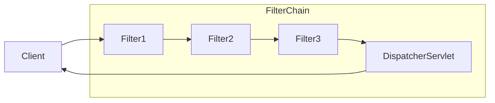

---
title:
tags:
  - java
  - programming
  - spring
  - security
  - filter
publish: false
date: 2024-12-06
---

## 스프링 시큐리티 기본 아키텍쳐

서블릿을 지원하는 스프링 시큐리티 프레임워크는 [[8. 로그인 처리 2 - 필터와 인터셉터#서블릿 필터|서블릿 필터]]를 기반으로 동작한다. 따라서 서블릿 필터에 대한 기본적인 이해가 필요하다.

클라이언트가 어플리케이션에 요청을 보내면 컨테이너는 요청 URI의 경로에 따라 `HttpServletRequest`를 처리해야 하는 필터 인스턴스와 서블릿을 포함하는 `FilterChain`을 생성한다.

스프링 MVC 어플리케이션에서 서블릿은 `DispatcherServlet`의 인스턴스이다. 그리고 하나의 서블릿은 최대 하나의 `HttpServletRequest`와 `HttpServletResponse`를 처리할 수 있다. 그리고 둘 이상의 필터를 연결하고, 순서를 가지게 만들 수 있다.

쉽게 말해서 다음과 같은 흐름을 가진다.



- 클라이언트가 요청 전송
- 요청 핸들러 매핑(위 다이어그램에선 생략)
- 핸들러에 따라 필터 인스턴스와 서블릿이 포함된 `FilterChain`을 생성
- `Filter`가 요청을 필터링
- 필터링이 끝나면 다음 필터 호출
- 최종적으로 컨트롤러 호출

## FilterChainProxy

![[filter-chain-proxy.png]]

그림과 같이 스프링 시큐리티는 `DelegatingFilterProxy`를 서블릿 필터체인에 등록해 프록시 패턴을 사용하여 서블릿 필터체인에서 요청과 응답을 가로채고, 내부적으로 요청을 필터링 한다.

그리고 `DelegatingFilterProxy`는 내부에 `FilterChainProxy`를 가지고 있다. 이 `FilterChainProxy`는 스프링 빈이기 때문에 일반적으로 `DelegatingFilterProxy`로 래핑된다.

단순히 생각해보면 서블릿 필터의 `doFilter()`를 통해 서블릿 필터 흐름 내에 사용하는 요청을 내부적으로 처리할 수 있는 구조이다.

`FilterChainProxy`는 내부적으로 서블릿 필터 개념과 동일한 `SecurityFilterChain`을 가진다. 이 필터 체인 내부의 필터들은 일반적으로 스프링 빈이지만 `DelegatingFilterProxy`가 아닌 `FilterChainProxy`에 등록하는데 그 이유는 다음과 같다.

1. 스프링 시큐리티의 서블릿 지원을 위한 시작점(프론트 컨트롤러 패턴과 유사)을 제공한다.
2. `FilterChainProxy`는 스프링 시큐리티 사용의 핵심이므로 선택 사항으로 간주되지 않는 공통 작업을 수행한다(예: 메모리 누수 방지를 위한 `SecurityContext` 제거)
3. 특정 유형의 공격으로부터 어플리케이션을 보호하기 위해 스프링 시큐리티의 `HttpFirewall` 적용
4. 서블릿 필터와 동일하게, `SecurityFilterChain`이 언제 호출되어야 하는지 사용자가 지정할 수 있음

서블릿 컨테이너에서 필터 인스턴스는 URL 매칭을 기반으로 호출된다. 그러나 `FilterChainProxy`는 `RequestMatcher` 인터페이스를 사용해서 `HttpServletRequest` 스펙을 모두 활용해서 호출을 결정할 수 있다.

### 다중 보안 필터체인

스프링 시큐리티는 `SecurityFilterChain`을 다중으로 등록할 수 있다. 다음의 그림을 참고하자.
![[multiple-security-filter-chain.png]]

그림의 우측 `SecuriyFilterChain`이 내부적으로 가지고 있는 파란 블럭은 필터를 의미한다.

다중 보안필터체인 그림에서 `FilterChainProxy`는 어떤 보안필터체인을 사용할지 결정하는데 패턴과 일치하는 첫 번째 `SecurityFilterChain`만 호출된다.

**/api/messages 요청**

- `/api`의 `SecurityFilterChain0` 패턴에서 먼저 일치
- 따라서 `SecurityFilterChainn`에서 일치하더라도 `SecurityFilterChain0`만 호출

**/message 요청**

- `/api`의 `SecurityFilterChain0` 패턴에서 일치하지 않음
- 따라서 `FilterChainProxy`는 각 `SecurityFilterChain`을 계속 시도한다.
- 만약 일치하는 보안 필터 인스턴스가 없으면 가정하면 `SecurityFilterChainn`이 호출된다.

`SecurityFilterChain0`을 보면 내부적으로 보안 필터 인스턴스가 세 개만 구성되어 있는 것을 확인할 수 있다. 그러나 `SecurityFilterChainn`에는 4개의 보안 필터 인스턴스가 구성되어 있다.

이는 각 `SecurityFilterChain`은 고유하며, 개별적으로 구성할 수 있다는 것을 의미한다.

> [!warning]
> 유의해야 할 점은 실제로 어플리케이션에서 스프링 시큐리티가 특정 요청을 무시하도록 하려는 경우에 `SecurityFilterChain`에 필터 인스턴스가 0개일 수 있다는 점이다.

## SecurityFilter

`SecurityFilter`는 `SecurityFilterChain` API를 통해 `FilterChainProxy`에 삽입 된다.

이 필터들은 취약점 보호, 인증, 권한 부여등 다양한 용도로 사용한다. 필터는 특정 순서로 실행되어 적절한 시점에 호출되도록 보장한다.

예를 들어서 인증을 수행하는 필터는 인가를 수행하는 필터보다 먼저 호출되어야 하는 경우가 대표적이다. 일반적으로 스프링 시큐리티의 필터 순서는 알 필요가 없지만 순서를 아는 것이 도움이 되는 경우가 있다.

순서를 알고 싶다면 `FilterOrderRegistration` 코드를 확인하면 된다. 이런 보안 필터(`SecurityFilter`)는 대부분 `HttpSecurity` 인스턴스를 사용해서 다음과 같이 빌더 패턴으로 선언된다.

```java
@Configuration
@EnableWebSecurity
public class SecurityConfig {

    @Bean
    public SecurityFilterChain filterChain(HttpSecurity http) throws Exception {
        http
                .csrf(Customizer.withDefaults())
                .httpBasic(Customizer.withDefaults())
                .formLogin(Customizer.withDefaults())
                .authorizeHttpRequests(authorize -> authorize
                        .anyRequest().authenticated()
                );
        return http.build();
    }
}
```

여담으로 이와 같은 구조는 [[간단 스프링 시큐리티 가이드]]의 예제에서도 볼 수 있었다. 아무튼 위의 구성은 다음의 순서를 가지는 `SecurityFilterChain`을 생성한다.

1. CsrfFilter
2. UsernamePasswordAuthenticationFilter
3. BasicAuthenticationFilter
4. AuthorizationFilter

앞서 학습한 내용처럼 `SecurityFilterChain`은 위의 순서를 보장한다. 만약 적용된 필터의 목록을 보고 싶을 수 있다. 이 때 필터 목록은 `debug` 레벨에서 로그가 출력된다는 점을 기억하자.

## 필터체인에 필터 추가하기

대부분의 경우에 기본 보안 필터는 어플리케이션에 보안을 제공하기에 충분하다. 그러나 `SecurityFilterChain`에 사용자 정의 보안 필터를 추가하고 싶은 경우가 있을 수도 있다.

`HttpSecurity`는 다음과 같이 필터를 추가하는 세 가지 메서드를 제공한다.

- `addFilterBefore(Filter, Class<?>)`: `Filter`에 해당하는 필터의 앞에 필터를 추가한다.
- `addFilterAfter(Filter, Class<?>)`: `Filter`에 해당하는 필터의 뒤에 필터를 추가한다.
- `addFilterAt(Filter, Class<?>)`: `Filter`에 해당하는 필터를 내 필터로 대체한다.

## 커스텀 필터와 등록

먼저 다음과 같이 `Filter` 인터페이스를 구현하는 `TenantFilter`를 작성한다.

```java
public class TenantFilter implements Filter {

    @Override
    public void doFilter(ServletRequest servletRequest, ServletResponse servletResponse, FilterChain filterChain)
            throws IOException, ServletException {
        HttpServletRequest request = (HttpServletRequest) servletRequest;
        HttpServletResponse response = (HttpServletResponse) servletResponse;

        String tenantId = request.getHeader("X-Tenant-Id");
        boolean hasAccess = isUserAllowed(tenantId);
        if (hasAccess) {
            filterChain.doFilter(request, response);
            return;
        }
        throw new AccessDeniedException("Access denied");
    }

}
```

- 요청 헤더로부터 거주자 id를 가져온다.
- 만약 현재 요청자에게 액세스 권한이 있으면 `SecurityFilterChain`의 나머지 필터를 호출한다.
- 액세스 권한이 없으면 `AccessDeniedException`을 던진다.

> [!tip] OncePerRequestFilter
> `Filter` 인터페이스를 구현하면 `ServletRequest`를 `HttpServletRequest`로 캐스팅 해야하는데 귀찮다.
>
> 대신 요청당 한번만 호출되는 필터의 기본 클래스인 `OncePerRequestFilter` 클래스를 상속 받으면 `doFilterInternal()` 메서드에서 `HttpServletRequest`, `HttpServletResponse` 매개변수를 제공한다.

```java
@Bean
SecurityFilterChain filterChain(HttpSecurity http) throws Exception {
    http
            .csrf(Customizer.withDefaults())
            .httpBasic(Customizer.withDefaults())
            .formLogin(Customizer.withDefaults())
            .authorizeHttpRequests(authorize -> authorize
                    .anyRequest().authenticated()
            )
            .addFilterAfter(new TenantFilter(), AnonymousAuthenticationFilter.class);
    return http.build();
}
```

`HttpSecurity`가 제공하는 `addFilterAfter()`메서드를 통해 편리하게 필터를 삽입했다.

## 스프링 빈으로 필터를 등록하는 경우

필터에 `@Component`로 어노테이션을 적용하거나 구성 정보 클래스에서 스프링 빈으로 선언하면 스프링 부트는 자동으로 스프링 컨테이너에 필터를 빈으로 등록한다.

그런데 이로 인해 다음과 같은 문제가 발생할 수 있다.

- 필터가 스프링 컨테이너에 의해 한번 호출
- 스프링 시큐리티에 의해 다른 순서로 두번 호출

만약 필터가 스프링 빈이어야 하는 경우 (예: 의존성 주입을 위해) 구성 정보 클래스에 `FilterRegistrationBean` 빈을 선언하고 활성화 속성을 `false`로 지정하여 스프링 컨테이너에 빈으로 등록되지 않게 할 수 있다.

```java
@Bean
public FilterRegistrationBean<TenantFilter> tenantFilterRegistration(TenantFilter filter) {
    FilterRegistrationBean<TenantFilter> registration = new FilterRegistrationBean<>(filter);
    registration.setEnabled(false);
    return registration;
}
```

이렇게 설정하면, 오직 `HttpSecurity`만이 이 필터를 관리하게 된다.

---

References: [스프링 공식 문서 - 스프링 시큐리티 아키텍쳐](https://docs.spring.io/spring-security/reference/servlet/architecture.html)

Links to this page: [[8. 로그인 처리 2 - 필터와 인터셉터#서블릿 필터]], [[간단 스프링 시큐리티 가이드]]
