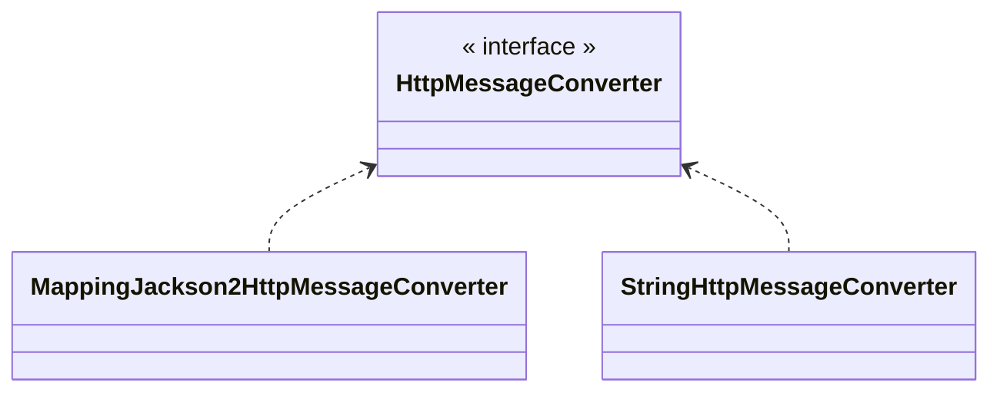

## HTTP 메세지 컨버터

HTTP API처럼 JSON 데이터를 HTTP 메세지 바디에 직접 읽거나 쓰는 경우 HTTP 메세지 컨버터를 사용하면 편리하다.



- `@ResponseBody`를 사용
  - HTTP의 Body에 문자 내용을 직접 반환
  - `viewResolver` 대신에 `HttpMessageConverter`가 동작
  - 기본 문자 처리는 `StringHttpMessageConverter`
  - 기본 객체 처리는 `MappingJackson2HttpMessageConverter`
  - byte 처리 등등 기타 여러 `HttpMessageConverter`가 기본으로 등록되어 있음

> [!tip] 참고
> 응답의 경우 클라이언트와 HTTP Accept 헤더, 서버의 컨트롤러 반환 타입 정보 둘을 조합해서 `HttpMessageConverter`가 선택된다.

**스프링 MVC는 다음의 경우에 HTTP 메시지 컨버터를 적용한다.**

- HTTP 요청: `@RequestBody`, `HttpEntity(RequestEntity)`
- HTTP 응답: `@ResponseBody`, `HttpEntity(ResponseEntity)`

HTTP 메시지 컨버터는 HTTP 요청, 응답에 모두 사용된다.

**스프링 부트 기본 메시지 컨버터**

(일부 생략)

```
0 = ByteArrayHttpMessageConverter
1 = StringHttpMessageConverter
2 = MappingJackson2HttpMessageConverter
```

스프링 부트는 이처럼 다양한 메시지 컨버터를 제공하는데, 대상 클래스 타입과 미디어 타입 둘을 체크해서 사용 여부를 결정한다. 만약 만족하지 않으면 다음 메시지 컨버터로 우선순위가 넘어간다.

몇 가지 주요한 메세지 컨버터를 알아본다.

- `ByteArrayHttpMessageConverter`: `byte[]` 데이터를 처리한다.
  - 클래스 타입: `byte[]`, 미디어타입: `*/*`
  - 요청 예) `@RequestBody byte[] data`
  - 응답 예) `@ResponseBody return byte[]` 응답 헤더 미디어타입 `application/octet-stream`
- `StringHttpMessageConverter`: `String` 문자로 데이터를 처리한다.
  - 클래스 타입: `String`, 미디어타입: `*/*`
  - 요청 예) `@RequestBody String data`
  - 응답 예) `@ResponseBody return "ok"` 응답 헤더 미디어타입 `text/plain`
- `MappingJackson2HttpMessageConverter` : application/json
  - 클래스 타입: 객체 또는 `HashMap` , 미디어타입 `application/json` 관련
  - 요청 예) `@RequestBody HelloData data`
  - 응답 예) `@ResponseBody return helloData` 응답 헤더 미디어타입 `application/json` 관련

**HTTP 요청 데이터 읽기 과정**

- HTTP 요청이 오고, 컨트롤러에서 `@RequestBody` , `HttpEntity` 파라미터를 사용한다.
- 메시지 컨버터 구현체가 메시지를 읽을 수 있는지 확인하기 위해 `canRead()` 를 호출한다.
- 대상 클래스 타입 지원 조건 확인
  - 예) `@RequestBody` 의 대상 클래스 (`byte[]` , `String` , `HelloData` )
- HTTP 요청의 Content-Type 미디어 타입 지원 조건 확인
- 예) `text/plain` , `application/json` , `*/*`
- `canRead()` 조건을 만족하면 `read()` 를 호출해서 객체 생성하고, 반환한다.

**HTTP 응답 데이터 생성 과정**

- 컨트롤러에서 `@ResponseBody` , `HttpEntity`로 값이 반환된다.
- 메시지 컨버터 구현체가 메시지를 쓸 수 있는지 확인하기 위해 `canWrite()` 를 호출한다.
- 대상 클래스 타입을 지원 조건 확인
  - 예) return의 대상 클래스 (`byte[]` , `String` , `HelloData` )
- HTTP 요청의 Accept 미디어 타입 지원 조건 확인 (더 정확히는 `@RequestMapping` 의 `produces`)
  - 예) `text/plain` , `application/json` , `*/*`
  - `canWrite()` 조건을 만족하면 `write()` 를 호출해서 HTTP 응답 메시지 바디에 데이터를 생성한다.

---

References: 김영한의 스프링 MVC 1편

Links to this page:
