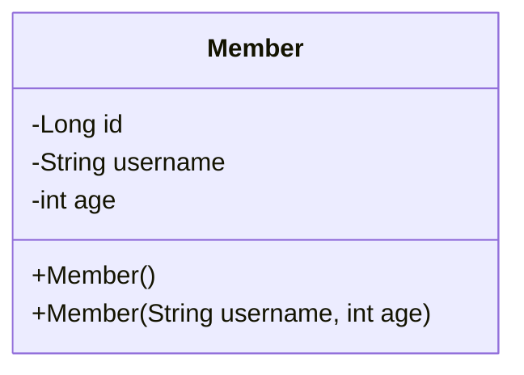

## 회원 관리 웹 어플리케이션

회원 관리 웹 어플리케이션을 만들어보면서 서블릿, JSP, MVC에 대해 학습한다.



위는 `Member` 클래스의 구조이다.

**기능 요구사항**

- 회원 저장
- 회원 목록 조회

요구사항에 맞춰서 `MemberRepository`를 구현한다. 그리고 이 레포지토리는 싱글톤 패턴을 적용한다.

```java
public class MemberRepository {
    private static Map<Long, Member> store = new HashMap<>();
    private static Long sequence = 0L;

    @Getter
    private static final MemberRepository instance = new MemberRepository();

    private MemberRepository() {}

    public Member save(Member member) {
        member.setId(++sequence);
        store.put(member.getId(), member);

        return member;
    }

    public Member findById(Long id) {
        return store.get(id);
    }

    public List<Member> findAll() {
        return new ArrayList<>(store.values());
    }

    public void clear() {
        store.clear();
    }
}
```

테스트 코드도 간단히 작성한다.

```java
class MemberRepositoryTest {
    MemberRepository memberRepository = MemberRepository.getInstance();

    @AfterEach
    void afterEach() {
        memberRepository.clear();
    }

    @Test
    void save() {
        // given
        Member member = new Member("hello", 20);

        // when
        Member savedMember = memberRepository.save(member);

        // then
        Member findMember = memberRepository.findById(savedMember.getId());
        assertThat(savedMember).isSameAs(findMember);
    }

    @Test
    void findAll() {
        // given
        Member member1 = new Member("member1", 20);
        Member member2 = new Member("member2", 30);
        memberRepository.save(member1);
        memberRepository.save(member2);
        // when
        List<Member> all = memberRepository.findAll();

        // then
        assertThat(all.size()).isEqualTo(2);
    }
}
```

### 서블릿으로 회원 관리 웹 어플리케이션 개발

가장 먼저 서블릿을 활용해서 회원 관리 웹 어플리케이션을 개발해본다.

```java
@WebServlet(name = "memberFormServlet", urlPatterns = "/servlet/members/new-form")
public class MemberFormServlet extends HttpServlet {
    private MemberRepository memberRepository = MemberRepository.getInstance();

    @Override
    protected void service(HttpServletRequest req, HttpServletResponse res) throws ServletException, IOException {
        res.setContentType("text/html");
        res.setCharacterEncoding("utf-8");

        PrintWriter w = res.getWriter();
        w.write("<!DOCTYPE html>\n" +
                "<html>\n" +
                "<head>\n" +
                " <meta charset=\"UTF-8\">\n" +
                " <title>Title</title>\n" +
                "</head>\n" +
                "<body>\n" +
                "<form action=\"/servlet/members/save\" method=\"post\">\n" +
                " username: <input type=\"text\" name=\"username\" />\n" +
                " age: <input type=\"text\" name=\"age\" />\n" +
                " <button type=\"submit\">전송</button>\n" +
                "</form>\n" +
                "</body>\n" +
                "</html>\n");
    }
}
```

폼 하나를 만들어서 전송하는데도 정말 힘들다.

실제로 전 직장에서 이런 작업 비슷한걸 했었는데 정말 힘든 작업이다. 서버 사이드 렌더링이기 때문에 틀리면 재시작 해야 하는데 `"`를 잘못 작성한다던지, HTML 태그를 이상하게 작성했다던지.. 아무튼 귀찮고 짜증나는 작업이다.

또 하나의 작업이 더 있다. Form 요청을 받아서 실제로 저장이 이루어지는 페이지이다.

```java
@WebServlet(name = "memberSaveServlet", urlPatterns = "/servlet/members/save")
public class MemberSaveServlet extends HttpServlet {
    private MemberRepository memberRepository = MemberRepository.getInstance();

    @Override
    protected void service(HttpServletRequest req, HttpServletResponse resp) throws ServletException, IOException {
        System.out.println("MemberSaveServlet.service");
        String username = req.getParameter("username");
        int age = Integer.parseInt(req.getParameter("age"));

        Member member = new Member(username, age);
        Member savedMember = memberRepository.save(member);

        resp.setContentType("text/html");
        resp.setCharacterEncoding("utf-8");
        PrintWriter w = resp.getWriter();
        w.write("<html>\n" +
                "<head>\n" +
                " <meta charset=\"UTF-8\">\n" +
                "</head>\n" +
                "<body>\n" +
                "성공\n" +
                "<ul>\n" +
                " <li>id="+member.getId()+"</li>\n" +
                " <li>username="+member.getUsername()+"</li>\n" +
                " <li>age="+member.getAge()+"</li>\n" +
                "</ul>\n" +
                "<a href=\"/index.html\">메인</a>\n" +
                "</body>\n" +
                "</html>");
    }
}
```

마지막으로 조회 페이지도 만들어본다.

```java
@WebServlet(name = "memberListServlet", urlPatterns = "/servlet/members")
public class MemberListServlet extends HttpServlet {
    private MemberRepository memberRepository = MemberRepository.getInstance();

    @Override
    protected void service(HttpServletRequest request, HttpServletResponse response) throws ServletException, IOException {
        response.setContentType("text/html");
        response.setCharacterEncoding("utf-8");
        List<Member> members = memberRepository.findAll();
        PrintWriter w = response.getWriter();
        w.write("<html>");
        w.write("<head>");
        w.write(" <meta charset=\"UTF-8\">");
        w.write(" <title>Title</title>");
        w.write("</head>");
        w.write("<body>");
        w.write("<a href=\"/index.html\">메인</a>");
        w.write("<table>");
        w.write(" <thead>");
        w.write(" <th>id</th>");
        w.write(" <th>username</th>");
        w.write(" <th>age</th>");
        w.write(" </thead>");
        w.write(" <tbody>");
    }
}
```

### 템플릿 엔진으로

지금까지 서블릿과 자바 코드만으로 HTML을 만들어보았다. 서블릿 덕분에 동적으로 원하는 HTML을 마음껏 만들 수 있다. 정적인 HTML 문서라면 화면이 계속 변화해야하는 회원의 저장 결과라던가 회원 목록을 보여주는 페이지를 만드는 것은 불가능 하다.

그런데 코드에서 보듯이 이것은 매우 복잡하고 비효율적이다. 자바 코드로 HTML을 만들어 내는 것 보다 차라리 HTML 문서에 동적으로 변경해야 하는 부분만 자바 코드를 넣을 수 있다면 편리할 것이다.

이것이 바로 템플릿 엔진이 나온 이유이다. 템플릿 엔진을 이용하면 HTML 문서에서 필요한 곳만 코드를 적용해서 동적으로 변경할 수 있다.

다음 시간에는 `JSP`로 동일한 작업을 진행해본다.

> [!tip]
> JSP는 성능과 기능면에서 다른 템플릿 엔진과의 경쟁에서 밀리면서, 점점 사장되어 가는 추세이다.
>
> 템플릿 엔진들은 각각 장단점이 있는데 강의에서는 JSP는 앞부분에서 잠깐 다루고 스프링과 잘 통합되는 Thymeleaf를 사용한다.

## JSP로 회원 관리 웹 어플리케이션 만들기

JSP를 사용하려면 먼저 다음 라이브러리를 추가해야 한다.

```title="build.gradle"
implementation 'org.apache.tomcat.embed:tomcat-embed-jasper'
implementation 'jakarta.servlet:jakarta.servlet-api' //스프링부트 3.0 이상
implementation 'jakarta.servlet.jsp.jstl:jakarta.servlet.jsp.jstl-api' //스프링부트3.0 이상
implementation 'org.glassfish.web:jakarta.servlet.jsp.jstl' //스프링부트 3.0 이상
```

스프링 부트 3.0 이상이면 `javax.servlet:jstl`을 제거하고 위 코드를 추가해야 한다.

```java title="new-form.jsp"
<%@ page contentType="text/html;charset=UTF-8" language="java" %>
<html>
<head>
<title>Title</title>
</head>
<body>
    <form action="/jsp/members/save.jsp" method="post">
    username: <input type="text" name="username" />
    age: <input type="text" name="age" />
    <button type="submit">전송</button>
    </form>
</body>
</html>
```

- JSP 파일의 첫 줄은 위처럼 JSP 문서라고 명시해야한다.

JSP는 서버 내부에서 서블릿으로 변환되는데, 우리가 만들었던 MemberFormServlet과 거의 비슷한 모습으로 변환된다.

브라우저에서 요청 시에는 정적 리소스 파일을 요청하는 것처럼 `.jsp`라는 확장자 명까지 모두 적어주어야 한다.

다음으로 회원 저장 JSP를 만들어본다.

```java title="save.jsp"
<%@ page contentType="text/html;charset=UTF-8" language="java" %>
<%@ page import="hello.servlet.domain.member.MemberRepository" %>
<%@ page import="hello.servlet.domain.member.Member" %>
<%
MemberRepository memberRepository = MemberRepository.getInstance();
System.out.println("save.jsp");
String username = request.getParameter("username");
int age = Integer.parseInt(request.getParameter("age"));
Member member = new Member(username, age);
System.out.println("member = " + member);
memberRepository.save(member);
%>
<html>
    <head>
    <meta charset="UTF-8">
    </head>
    <body>
    성공
    <ul>
        <li>id=<%=member.getId()%></li>
        <li>username=<%=member.getUsername()%></li>
        <li>age=<%=member.getAge()%></li>
    </ul>
<a href="/index.html">메인</a>
    </body>
</html>
```

JSP는 자바 코드를 그대로 다 사용할 수 있다.

- `<%@ page import="hello.servlet.domain.member.MemberRepository" %>
  - 자바의 import문과 같다.
- <% ... %>
  - 이 부분에는 자바 코드를 입력할 수 있다.
- <%= ... %>
  - 이 부분에는 자바 코드를 출력할 수 있다.

회원 저장 서블릿 코드와 다른점이 있다면, HTML을 중심으로 하고, 자바 코드를 부분 부분 입력해주었다. 그리고 `<%= ... %>`를 이용해서 HTML 중간에 자바 코드를 출력한다.

### 서블릿과 JSP의 한계

서블릿으로 개발할 때는 뷰(View) 화면을 위한 HTML을 만드는 작업이 자바 코드에 섞여서 지저분하고 복잡했다. JSP를 사용한 덕분에 뷰를 생성하는 HTML 작업을 깔끔하게 가져가고, 중간중간 동적으로 변경이 필요한 부분에만 자바 코드를 적용했다. 그런데 이렇게 해도 해결되지 않는 몇가지 고민이 남는다.

회원 저장 JSP를 보면 코드의 상위 절반은 회원을 저장하기 위한 비즈니스 로직이고, 나머지 하위 절반만 결과를 HTML로 보여주기 위한 뷰 영역이다. 회원 목록의 경우에도 마찬가지다.

코드를 잘 보면 JAVA 코드, 데이터를 조회하는 레포지토리등 다양한 코드가 모두 JSP에 노출되어 있다.
JSP가 너무 많은 역할을 한다. 이렇게 작은 프로젝트도 벌써 머리가 아파오는데, 수백 수천줄이 넘어가는 JSP를 떠올려보면 정말 지옥과 같을 것이다. (유지보수 지옥)

**MVC 패턴의 등장**

비즈니스 로직은 서블릿처럼 다른 곳에서 처리하고, JSP는 목적에 맞게 HTML로 화면(View)를 그려주는 일에 집중하도록 하자. 과거 개발자들도 모두 비슷한 고민이 있었고, 그래서 MVC 패턴이 등장했다.

이제 직접 MVC 패턴을 적용해서 프로젝트를 리팩터링 해본다.

## MVC 패턴

**너무 많은 역할**

하나의 서블릿이나 JSP만으로 비즈니스 로직과 뷰 렌더링까지 모두 처리하게 되면, 너무 많은 역할을 하게되고 결과적으로 유지보수가 어려워진다.

비즈니스 로직을 호출하는 부분에 변경이 발생해도 해당 코드를 손대야 하고, UI를 변경할 일이 있어도 비즈니스 로직이 함께 있는 해당 파일을 수정해야 한다. HTML 코드 하나 수정해야 하는데, 수백줄의 자바 코드가 함께 있다고 상상해보라! 또는 비즈니스 로직 하나를 수정하는데 수백 수천줄의 HTML 코드가 함께 있다고 상상해보라.

**변경의 라이프 사이클**

진짜 문제는 둘 사이에 변경의 라이프 사이클이 다르다는 점이다. 예를 들어서 UI를 수정하는 일과 비즈니스 로직을 수정하는 일은 각각 다르게 발생할 가능성이 매우 높다. 이렇게 변경의 라이프 사이클이 다른 부분을 하나의 코드로 관리하는 것은 유지보수하기 좋지 않다.

**기능 특화**

특히 JSP 같은 뷰 템플릿은 화면을 렌더링 하는데 최적화 되어 있기 때문에 이 부분의 업무만 담당하는 것이 가장 효과적이다.

#### Model View Controller

MVC 패턴은 지금까지 학습한 것 처럼 하나의 서블릿이나 JSP로 처리하던 것들을 컨트롤러와 뷰라는 영역으로 서로 역할을 나눈 것을 말한다. 웹 어플리케이션은 보통 이 MVC 패턴을 사용한다.

- **컨트롤러**: HTTP 요청을 받아서 파라미터를 검증하고, 비즈니스 로직을 실행한다. 그리고 뷰에 전달할 결과 데이터를 조회해서 모델에 담는다.
- **모델**: 뷰에 출력할 데이터를 담아둔다. 뷰가 필요한 데이터를 모두 모델에 담아서 전달해주는 덕분에 뷰는 비즈니스 로직이나 데이터 접근을 몰라도 되고, 화면을 렌더링 하는 일에 집중할 수 있다.
- **뷰**: 모델에 담겨있는 데이터를 사용해서 화면을 그리는 일에 집중한다. 여기서는 HTML을 생성하는 부분을 말한다.

> [!tip] 서비스 계층
> 컨트롤러에 비즈니스 로직을 둘 수도 있지만, 이렇게 되면 컨트롤러가 너무 많은 역할을 담당한다.
>
> 그래서 일반적으로 비즈니스 로직은 서비스(Service)라는 계층을 별도로 만들어서 처리한다. 그리고 컨트롤러는 비즈니스 로직이 있는 서비스를 호출하는 역할을 담당한다.
>
> 참고로 비즈니스 로직을 변경하면 비즈니스 로직을 호출하는 컨트롤러의 코드도 변경될 수 있다. 앞에서는 이해를 돕기 위해 비즈니스 로직을 호출한다는 표현 보다는, 비즈니스 로직이라 설명했다.

### MVC 패턴 적용

서블릿을 컨트롤러로 사용하고, JSP를 뷰로 사용해서 MVC 패턴을 적용해본다. 모델은 `HttpServletRequest` 객체를 사용한다. 앞서 한번 언급했듯이 `HttpServletRequest` 객체는 내부에 임시 데이터 저장소를 갖고 있다. `req.setAttribute()`, `req.getAttribute()`를 사용하면 데이터를 보관하고 조회할 수 있다.

```java title="MvcMemberFormServlet.java"
@WebServlet(name = "mvcMemberFormServlet", urlPatterns = "/servlet-mvc/members/new-form")
public class MvcMemberFormServlet extends HttpServlet {

    @Override
    protected void service(HttpServletRequest request, HttpServletResponse response) throws ServletException, IOException {
        String viewPath = "/WEB-INF/views/new-form.jsp";
        RequestDispatcher dispatcher = request.getRequestDispatcher(viewPath);
        dispatcher.forward(request, response);
    }
}
```

- `viewPath`는 말 그대로 뷰의 경로를 의미한다.
- `"/WEB-INF"`는 해당 경로 안에 JSP가 있으면 외부에서 직접 JSP를 호출 할 수 없다. 우리가 기대하는 것은 항상 컨트롤러를 통해서 JSP를 호출하는 것이므로 제약을 둔 것이다.
- `dispatcher.forward()`: 다른 서블릿이나 JSP로 이동할 수 있는 기능이다. 서버 내부에서 다시 호출이 발생한다.

> [!note] redirect vs forward
> 리다이렉트는 실제 클라이언트(웹 브라우저)에 응답이 나갔다가 클라이언트가 redirect 경로로 다시 요청한다. 따라서 클라이언트가 인지할 수 있고 URL 경로도 실제로 변경된다.
>
> 반면에 포워드는 서버 내부에서 일어나는 호출이기 때문에 클라이언트가 전혀 인지하지 못한다.

```java title="new-form.jsp"
<%@ page contentType="text/html;charset=UTF-8" language="java" %>
<html>
    <head>
        <meta charset="UTF-8">
        <title>Title</title>
    </head>
    <body>
        <form action="save" method="post">
        username: <input type="text" name="username" />
        age: <input type="text" name="age" />
        <button type="submit">전송</button>
        </form>
    </body>
</html>
```

이제 멤버를 저장하는 컨트롤러 역할의 서블렛과 뷰를 만든다.

```java
@WebServlet(name = "mvcMemberSaveServlet", urlPatterns = "/servlet-mvc/members/save")
public class MvcMemberSaveServlet extends HttpServlet {
    private MemberRepository memberRepository = MemberRepository.getInstance();

    @Override
    protected void service(HttpServletRequest req, HttpServletResponse res) throws ServletException, IOException {
        String username = req.getParameter("username");
        int age = Integer.parseInt(req.getParameter("age"));

        Member member = new Member(username, age);
        memberRepository.save(member);

        req.setAttribute("member", member);

        String viewPath = "/WEB-INF/views/save.jsp";
        RequestDispatcher dispatcher = req.getRequestDispatcher(viewPath);
        dispatcher.forward(req, res);
    }
}
```

```java title="save.jsp"
<%@ page contentType="text/html;charset=UTF-8" language="java" %>
<html>
    <head>
    <meta charset="UTF-8">
    </head>
    <body>
        성공
        <ul>
            <li>id=${member.id}</li>
            <li>username=${member.username}</li>
            <li>age=${member.age}</li>
        </ul>
        <a href="/index.html">메인</a>
    </body>
</html>
```

회원 목록 조회는 생략한다.

### MVC 패턴의 한계

MVC 패턴을 적용한 덕분에 컨트롤러의 역할과 뷰를 렌더링 하는 역할을 명확하게 구분할 수 있었다.
특히 뷰는 화면을 그리는 역할에 충실한 덕분에 코드가 깔끔하고 직관적이다. 단순하게 모델에서 필요한 데이터를 꺼내고 화면을 만들면 된다.

그런데 컨트롤러는 딱 봐도 중복이 많고, 필요하지 않는 코드들도 많이 보인다.

**포워드 중복**

View로 이동하는 코드가 항상 중복 호출되어야 한다. 물론 이 부분을 메서드로 공통화해도 되지만, 해당 메서드도 항상 직접 호출해야 한다.

**ViewPath의 중복**
뷰 패스의 접두어가 항상 `/WEB-INF/views/`로 중복되고 접미어가 항상 `.jsp`로 중복된다.

그리고 만약 `jsp`가 아닌 `Thymeleaf` 같은 다른 템플릿 엔진으로 변경하면 전체 코드를 다 바꿔야한다.

**사용하지 않는 코드**

다음 코드를 사용할 때도 있고, 사용하지 않을 때도 있다. 특히 `response`는 현재 코드에서 사용되지 않는다.

그리고 이런 `HttpServletRequest`, `HttpServletResponse`를 사용하는 코드는 테스트 케이스를 작성하기도 어렵다.

**공통 처리가 어렵다**

기능이 복잡해질수록 컨트롤러에서 공통으로 처리해야 하는 부분이 점점 더 많이 증가할 것이다. 단순히 공통 기능을 메서드로 뽑으면 될 것 같지만 결과적으로 해당 메서드를 항상 호출해야 하고, 실수로 호출하지 않으면 문제가 될 것이다. 그리고 호출하는 것 자체도 중복이다.

> [!summary] 프론트 컨트롤러 패턴 (Front Controller Pattern)
> 이 문제를 해결하려면 컨트롤러 호출 전에 먼저 공통 기능을 처리해야 한다. 소위 수문장 역할을 하는 기능이 필요하다.
>
> 프론트 컨트롤러 패턴을 도입하면 이런 문제를 깔끔하게 해결할 수 있다. (입구를 하나로 만드는 것이다)
>
> 스프링 MVC의 핵심도 바로 이 프론트 컨트롤러에 있다.

---

References: 김영한의 스프링 MVC 1편

Links to this page:
