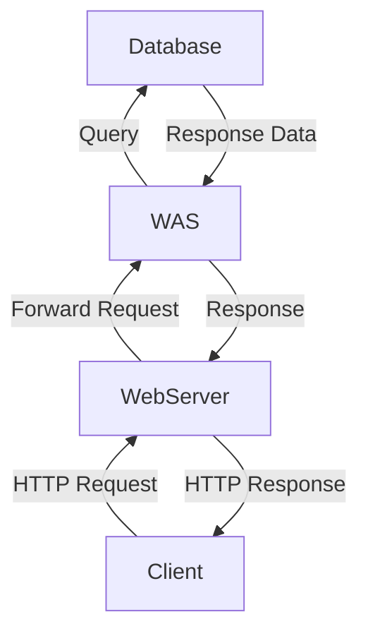
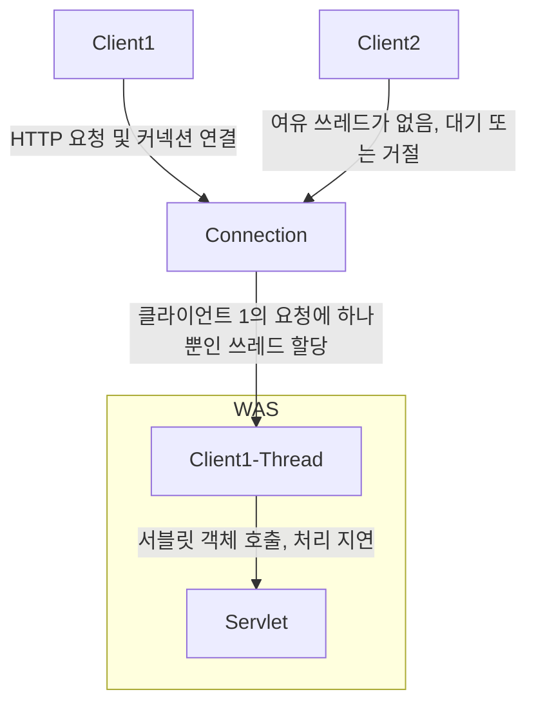
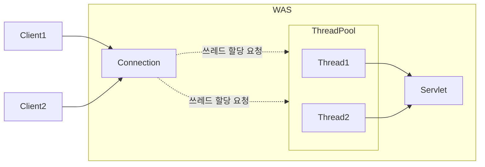
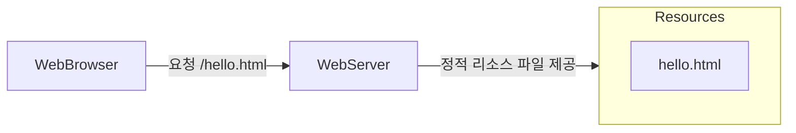
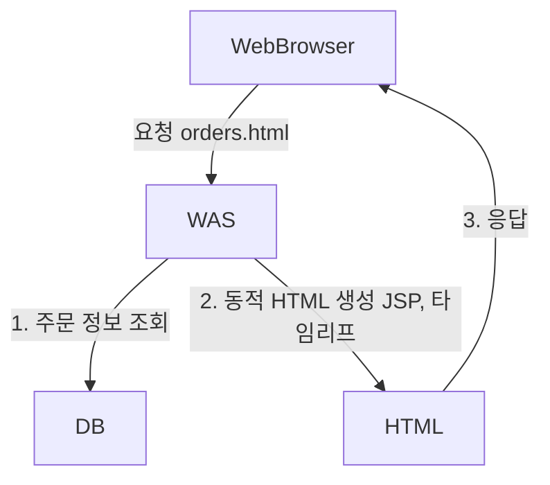
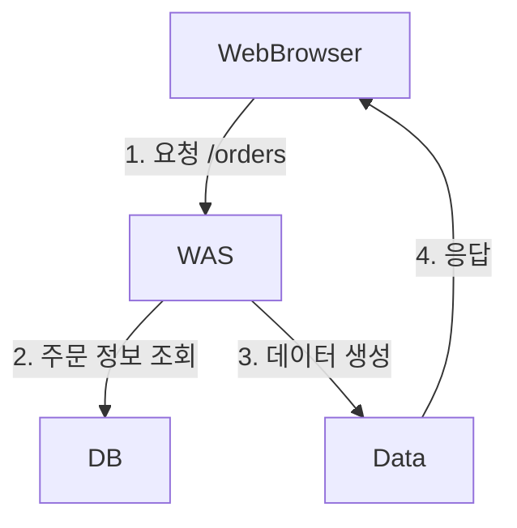
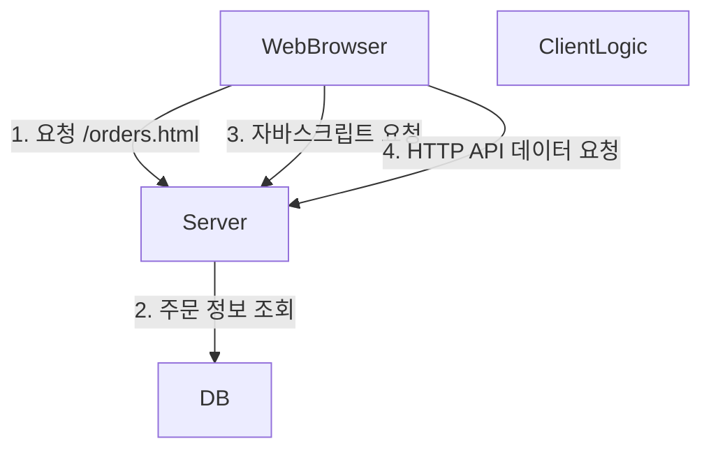

## 웹 서버와 웹 어플리케이션의 차이

> [[웹 서버]]와 [[웹 어플리케이션 서버]]에 대한 정의는 문서로 대체한다.

- 웹 서버는 정적 리소스(파일), WAS는 어플리케이션 로직
- 사실은 둘의 용어도 경계도 모호함
  - 웹 서버도 프로그램을 실행하는 기능을 포함하기도 함
  - 웹 어플리케이션 서버도 웹 서버의 기능을 제공함
- 자바는 서블릿 컨테이너 기능을 제공하면 WAS
  - 서블릿 없이 자바 코드를 실행하는 서버 프레임워크도 있다.
- WAS는 어플리케이션 코드를 실행하는데 더 특화

### 웹 시스템 구성 - WEB, WAS, DB



Bottom-Top 순서로 그린 아키텍쳐 다이어그램이다. 이런 구조에선 만약 `WAS`나 `DB`에서 장애가 발생하면 `WEB` 서버가 오류 화면 제공이 가능하다. 대부분 이런 구조를 많이 사용한다.

## 서블릿 (Servlet)

다음은 클라이언트(웹 브라우저)에서 요청한 HTTP 메시지다.

```http
POST /save HTTP/1.1
Host: localhost:8080
Content-Type: application/x-www-form-urlencoded

username=kim&age=20
```

만약 이 HTTP 요청을 직접 처리하는 웹 어플리케이션을 직접 구현하려면 다음과 같은 작업들이 필요하다. 이것들을 모두 구현해야 한다.

```text
서버 TCP/IP 연결 대기, 소켓 연결
HTTP 요청 메시지를 파싱해서 읽기
POST 방식, /save URL 인지
Content-Type 확인
HTTP 메세지 바디 내용 파싱
	username, age 데이터를 사용할 수 있게 파싱
저장 프로세스를 실행
비즈니스 로직 실행
	데이터베이스에 저장 요청
HTTP 응답 메시지 생성 시작
	HTTP 시작 라인 생성
	HTTP 헤더 생성
	메시지 바디에 HTML 생성에서 입력
TCP/IP에 응답 전달, 소켓 종료
```

과정만 살펴봐도 직접 구현하기 위해서는 어마무시한 수고가 들어갈 것이라는 것을 예상할 수 있다. 어떤 웹 서버를 만들더라도, `비즈니스 로직 실행` 부분을 제외하면 모두 HTTP 요청을 응답하기 위해 필수적인 기능들이다.

웹 서버들이 모두 공통적으로 처리해야하는 작업들을 대신하는 것이 서블릿이다.

따라서 웹 개발자는 서블릿을 이용하면 비즈니스와 관계 없는 HTTP 요청 처리와 같은 복잡한 프로세스는 비중을 적게 두고, 비즈니스 로직을 좀 더 중점적으로 개발할 수 있게 된다.

```java title="서블렛의 예시"
@WebServlet(name = "helloServlet", urlPatterns = "/hello")
public class HelloServlet extends HttpServlet {
	@Override
	protected void service(HttpSevletRequest request, HttpServletResponse response) {
		...
	}
}
```

- urlPatterns(/hello)의 URL이 호출되면 서블릿 코드가 실행
- HTTP 요청 정보를 편리하게 사용할 수 있는 `HTTPServletRequest`
- HTTP 응답 정보를 편리하게 제공할 수 있는 `HttpServletResponse`
- 개발자는 HTTP 스펙을 매우 편리하게 사용

![[spring-mvc1-servlet-1.png]]

## 서블릿 컨테이너

- 톰캣처럼 서블릿을 지원하는 WAS를 서블릿 컨테이너라고 함
- 서블릿 컨테이너는 서블릿 객체를 생성, 초기화, 호출, 종료하는 생명주기 관리
- 서블릿 객체는 **싱글톤으로 관리** (스프링 컨테이너의 싱글톤 빈과 유사)
  - 최초 로딩 시점에 서블릿 객체를 미리 만들어두고 재활용
  - 모든 고객 요청은 동일한 서블릿 객체 인스턴스에 접근
  - 서블릿 컨테이너 종료시 함께 종료
- JSP도 서블릿으로 변환 되어 사용
- 동시 요청을 위한 멀티쓰레드 처리 지원

## 동시 요청 - 멀티쓰레드

클라이언트가 서버에게 HTTP 요청을 보내게 되면, 커넥션 연결이 이루어져야 한다. 연결이 이루어지고 나면 "무언가"가 `Servlet` 객체를 호출해야 한다.

![[spring-mvc1-servlet-2.png]]

이 때 `Servlet` 객체를 호출하는 것이 쓰레드(Thread)다.

### 쓰레드 (Thread)

- 어플리케이션 코드를 하나하나 순차적으로 실행하는 것은 쓰레드
- 자바 메인 메서드를 처음 실행하면 `main`이라는 이름의 쓰레드가 실행
- 쓰레드가 없다면 자바 어플리케이션 실행 불가능
- 쓰레드는 한번에 하나의 코드 라인만 수행
- 동시 처리가 필요하면 쓰레드를 추가 생성

#### 단일 요청 - 쓰레드 하나 사용

![[spring-mvc1-thread-1.png]]

- 클라이언트 요청
  - 커넥션 연결
- 쓰레드 할당
  - 쓰레드가 서블릿 객체 호출
  - 서블릿 객체가 응답
- 응답 반환
- 쓰레드 휴식

#### 다중 요청 - 쓰레드 하나 사용



머메이드로 최대한 구조를 만들어보려고 했지만 만들기가 쉽지 않다. 어쨌든 위와 비슷한 구조로 이루어진다.

클라이언트 1이 요청을 보내고, 서블릿 객체에서 어떤 비즈니스 로직의 처리에 지연이 생겨서 처리가 늦어진다고 가정해본다.

그 사이에 클라이언트 2가 요청을 보내고 커넥션이 연결됐다. 그러나 단일 쓰레드는 현재 다른 업무를 처리중이다. 따라서 요청에 쓰레드가 할당되지 않는다. 쓰레드가 일을 끝낼 때 까지 기다려야한다.

### 요청마다 쓰레드 생성

위와 같은 단일 쓰레드 문제를 해결하기 위한 방법 중 하나다. 단순히 요청마다 쓰레드를 생성하는 것이다.

**장점**

- 동시 요청 처리 가능
- 리소스(CPU, 메모리)가 허용할 때 까지 처리 가능
- 하나의 쓰레드가 지연 되어도, 나머지 쓰레드는 정상 동작

**단점**

- 쓰레드는 생성 비용이 매우 비쌈
  - 고객의 요청이 올 때 마다 쓰레드를 생성하면 응답 속도가 늦어짐
- 쓰레드는 컨텍스트 스위칭 비용이 발생함
- 쓰레드 생성에 제한이 없음
  - 고객 요청이 너무 많이 오면 CPU 또는 메모리 임계점을 넘어서 서버가 죽을 위험이 있음

### 쓰레드 풀 (Thread Pool)

요청마다 쓰레드를 생성하는 것은 단점을 수용하기 위한 비용이 너무 크다. 따라서 대부분의 WAS는 쓰레드 풀이라는 것을 구현하여 문제를 해결한다.



쓰레드 풀은 쓰레드들을 풀 내부에 모아놓는 자료구조를 의미한다. 커넥션이 맺어지면 쓰레드 풀에 쓰레드 할당 요청을 하고, 풀 내부에 여유 쓰레드를 할당한다. 해당 쓰레드는 이제 서블릿 객체를 호출한다.

쓰레드를 다 사용하면, 쓰레드 풀에 다시 반납하여 추후에 재사용한다.

**특징**

- 필요한 쓰레드를 쓰레드 풀에 보관하고 관리한다.
- 쓰레드 풀에 생성 가능한 쓰레드의 최대치를 관리한다. 톰캣은 최대 200개 기본 설정 (변경 가능)

**사용**

- 쓰레드가 필요하면, 이미 생성되어 있는 쓰레드를 쓰레드 풀에서 꺼내서 사용한다.
- 사용을 종료하면 쓰레드 풀에 해당 쓰레드를 반납한다.
- 최대 쓰레드가 모두 사용중이어서 쓰레드 풀에 여유 쓰레드가 없으면?
  - 기다리는 요청은 거절하거나, 특정 숫자만큼만 대기하도록 설정할 수 있다.

**장점**

- 쓰레드가 미리 생성되어 있으므로, 쓰레드를 생성하고 종료하는 비용(CPU)이 절약되고, 응답 시간이 빠르다.
- 생성 가능한 쓰레드의 최대치가 있으므로 너무 많은 요청이 들어와도 기존 요청은 안전하게 처리할 수 있다.

### 쓰레드 풀의 실무 팁

- WAS의 주요 튜닝 포인트는 최대 쓰레드(max thread)수이다.
- 이 값을 너무 낮게 설정하면?
  - 동시 요청이 많으면 서버 리소스는 여유롭지만 클라이언트는 금방 응답 지연
- 이 값을 너무 높게 설정하면?
  - 동시 요청이 많으면, CPU, 메모리 리소스 임계점 초과로 서버 다운
- 장애 발생시?
  - 클라우드면 일단 서버부터 늘리고, 이후에 튜닝
  - 클라우드가 아니면 열심히 튜닝

### 쓰레드 풀의 적정 숫자

- 적정 숫자는 어떻게 찾을까?
- 어플리케이션 로직의 복잡도, CPU, 메모리, IO 리소스 상황에 따라 모두 다름
- 성능 테스트
  - 최대한 실제 서비스와 유사하게 성능 테스트 시도
  - 툴: Apache ab, 제이미터, nGrinder

### 핵심 - WAS의 멀티 쓰레드 지원

- 멀티 쓰레드에 대한 부분은 WAS가 처리
- 개발자가 멀티쓰레드 관련 코드를 신경쓰지 않아도 됨
- 개발자는 마치 싱글쓰레드 프로그래밍을 하듯이 편리하게 소스 코드를 개발
- 멀티쓰레드 환경이므로 싱글톤 객체(서블릿, 스프링 빈)는 주의해서 사용

## HTML, HTTP API, CSR, SSR

### 정적 리소스 제공



- 정적 리소스는 주로 고정되어 있는 HTML 파일, CSS, JS, 이미지, 영상 파일등을 제공한다.

### HTML 동적 페이지



- 동적으로 필요한 HTML 파일을 생성해서 전달

### HTTP API



- HTML이 아니라 데이터를 전달
- 주로 JSON 형식 사용
- 다양한 시스템에서 호출

### 서버사이드 렌더링(SSR)


서버사이드 렌더링은 최종 HTML을 생성해서 클라이언트에 전달하는 것을 의미한다. 주로 MVC 구조에서는 서버사이드 렌더링을 사용한다. 예전에 재직했던 회사에서도 `express`와 `ejs` 템플릿 엔진을 통해서 MVC 구조의 서버사이드 렌더링 웹 앱을 구현했었다.

- HTML 최종 결과를 서버에서 만들어서 웹 브라우저에 전달
- 주로 정적인 화면에 사용
- 관련 기술: JSP, 타임리프

### 클라이언트 사이드 렌더링(CSR)



- HTML 결과를 자바스크립트를 사용해 웹 브라우저에서 동적으로 생성해서 적용
- 주로 동적인 화면에 사용, 웹 환경을 마치 앱 처럼 필요한 부분부분 변경할 수 있음
- 예) 구글 지도, Gmail, 구글 캘린더
- 관련 기술: React, Vue.js

1. 클라이언트가 서버에 요청한다 (웹 브라우저)
2. 서버는 자바스크립트 링크가 있는 내용이 없는 HTML을 응답한다.
3. 클라이언트가 HTML 렌더링 코드를 요청한다. 주로 자바스크립트로 작성된 클라이언트 로직이다.
4. 서버가 응답한다.
5. 클라이언트가 API를 통해 데이터를 요청한다.
6. 서버가 데이터를 응답한다.
7. 클라이언트가 자바스크립트로 HTML 결과를 최종적으로 렌더링한다.

### UI 기술

**백엔드 (서버 사이드 렌더링)**

- JSP, 타임리프 (타임리프를 우선 학습, JSP는 사장되고 있는 기술이다.)
- 화면이 정적이고, 복잡하지 않을 때 사용
- 백엔드 개발자는 서버 사이드 렌더링 기술 학습 **필수**

**웹 프론트엔드 (클라이언트 사이드 렌더링)**

- React, Vue.js
- 복잡하고 동적인 UI 사용
- 웹 프론트엔드 개발자의 전문 분야

**선택과 집중**

- 백엔드 개발자의 웹 프론트엔드 기술 학습은 옵션
- 백엔드 개발자는 서버, DB, 인프라 등등 수 많은 백엔드 기술을 공부해야 한다.
- 웹 프론트엔드도 깊이있게 잘 하려면 숙련에 오랜 시간이 필요하다.

## 자바 웹 기술 역사

#### 과거 사용 기술

- `1997` **서블릿**
  - HTML 생성이 어려움
- `1999` **JSP**
  - HTML 생성은 편리하지만, 비즈니스 로직까지 너무 많은 역할 담당
- `1999 ~ 2000` **서블릿, JSP 조합 MVC 패턴 사용**
  - 모델, 뷰, 컨트롤러로 역할을 나누어 개발
- `Early 2000~ Early 2010` **MVC 프레임워크 춘추 전국시대**
  - MVC 패턴 자동화, 복잡한 웹 기술을 편리하게 사용할 수 있는 다양한 기능 지원
  - 스트럿츠, 웹워크, 스프링 MVC (과거 버전)

#### 현재 사용 기술

- `MVC 프레임워크 춘추 전국시대 마무리` **어노테이션 기반의 스프링 MVC 등장**
  - @Controller
  - 여태까지의 모든 MVC 기술들의 트레이드-오프를 없애고 장점만 취함
  - MVC 프레임워크의 춘추 전국시대 마무리
- **스프링 부트의 등장**
  - 스프링 부트는 서버를 내장
  - 과거에는 서버에 WAS를 직접 설치하고, 소스는 War 파일을 만들어서 설치한 WAS에 배포
  - 스프링 부트는 빌드 결과(Jar)에 WAS 서버 포함 -> 빌드 배포 단순화

#### 최신 기술

스프링 웹 기술의 분화

- `Web Servlet - Spring MVC`
- `Web Reactive - Spring WebFlux`
  - **특징**
    - 비동기 논 블록킹 처리
    - 최소 쓰레드로 최대 성능 (쓰레드 컨텍스트 스위칭 비용 효율화)
    - 함수형 스타일로 개발 - 동시처리 코드 효율화
    - 서블릿 기술 사용 X
  - **그런데**
    - 웹 플럭스는 기술적 난이도가 매우 높음
    - 아직은 RDB 지원 부족
    - 일반 MVC의 쓰레드 모델도 충분히 빠르다.
    - 실무에서 아직 많이 사용하지 않음 (전체 1% 이하)

#### 뷰 템플릿 역사

- `JSP`
  - 속도 느림, 기능 부족
- `프리마커(Freemarker)`, `벨로시티(Velocity)`
  - 속도 문제 해결, 다양한 기능
- `타임리프(Thymeleaf)`
  - 내추럴 템플릿: HTML의 모양을 유지하면서 뷰 템플릿 적용 가능
  - 스프링 MVC와 강력한 기능 통합
  - **최선의 선택** (단 성능은 프리마커, 벨로시티가 더 빠름)

---

References: 김영한의 스프링 MVC 1편

Links to this page:
