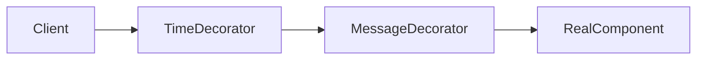
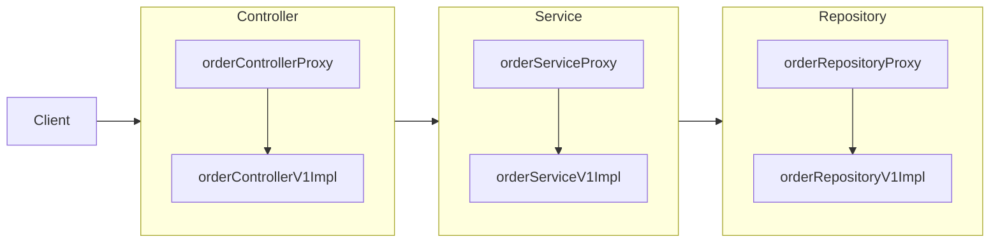

---
title:
tags:
  - java
  - programming
  - design-pattern
  - proxy-pattern
  - decorator-pattern
  - spring
publish: true
date: 2025-01-01
---

## 예제 프로젝트 만들기 소개

이전 프로젝트를 기반으로 다양한 상황에서의 프록시 사용법을 이해하기 위해 다음과 같은 기준으로 기본 예제 프로젝트를 만들어본다.

- **v1**: 인터페이스와 구현 클래스 - 스프링 빈으로 수동 등록
- **v2**: 인터페이스 없는 구체 클래스 - 스프링 빈으로 수동 등록
- **v3**: 컴포넌트 스캔으로 스프링 빈 자동 등록

실무에서는 스프링 빈으로 등록할 클래스는 인터페이스가 있는 경우도 있고, 없는 경우도 있다. 그리고 스프링 빈을 수동으로 직접 등록하는 경우도 있고 컴포넌트 스캔으로 등록하는 경우도 있다. 이런 다양한 케이스에 프록시를 어떻게 적용하는지 알아보기 위함이다.

## 예제 프로젝트 만들기 V1

먼저 인터페이스와 구현체로 나누어진 예제를 만들어본다.

```java title="인터페이스들"
public interface OrderRepositoryV1 {
    void save(String itemId);
}

public interface OrderServiceV1 {
    void orderItem(String itemId);
}

@RequestMapping // 스프링은 @Controller 또는 @RequestMapping 어노테이션이 있어야 스프링 컨트롤러로 인식
@ResponseBody
public interface OrderControllerV1 {

    @GetMapping("/v1/request")
    String reqeust(@RequestParam("itemId") String itemId);

    @GetMapping("/v1/no-log")
    String noLog();
}
```

```java title="구현체들"
public class OrderRepositoryV1Impl implements OrderRepositoryV1 {
    @Override
    public void save(String itemId) {
        if (itemId.equals("ex")) {
            throw new IllegalStateException("예외 발생!");
        }
        sleep(1000);
    }

    private void sleep(int ms) {
        try {
            Thread.sleep(ms);
        } catch (InterruptedException e) {
            e.printStackTrace();
        }

    }
}

public class OrderServiceV1Impl implements OrderServiceV1{
    private final OrderRepositoryV1 orderRepository;

    public OrderServiceV1Impl(OrderRepositoryV1 orderRepository) {
        this.orderRepository = orderRepository;
    }

    @Override
    public void orderItem(String itemId) {
        orderRepository.save(itemId);
    }
}

public class OrderControllerV1Impl implements OrderControllerV1{
    private final OrderServiceV1 orderService;

    public OrderControllerV1Impl(OrderServiceV1 orderService) {
        this.orderService = orderService;
    }

    @Override
    public String reqeust(String itemId) {
        orderService.orderItem(itemId);
        return "ok";
    }

    @Override
    public String noLog() {
        return "";
    }
}
```

이 구조의 예제에서 독특한 점은 컨트롤러가 인터페이스와 구현체로 나누어진다는 점이다. 다시 한번 컨트롤러 인터페이스를 살펴보면 다음과 같다.

```java
@RequestMapping
@ResponseBody
public interface OrderControllerV1 {

    @GetMapping("/v1/request")
    String reqeust(@RequestParam("itemId") String itemId);

    @GetMapping("/v1/no-log")
    String noLog();
}
```

- `@RequestMapping`: 스프링 MVC는 `@Controller` 또는 `@RequestMapping` 어노테이션이 타입에 있어야 스프링 컨트롤러로 인식한다. 그리고 스프링 컨트롤러로 인식해야 `HTTP URL`이 매핑되고 동작한다. 이 어노테이션은 인터페이스에 사용해도 된다.
- `@ResponseBody`: HTTP 메시지 컨버터를 사용해서 응답한다. 이 어노테이션은 인터페이스에 사용해도 된다.
- 인터페이스에는 `@RequestParam`의 값을 생략하면 `itemId`를 컴파일 이후 자바 버전에 따라 인식하지 못할 수 있다. 인터페이스에서는 꼭 넣어줘야 한다. 클래스에서는 생략해도 대부분 잘 지원된다.

> [!warning] 스프링 부트 3.0 변경 사항
> 스프링 부트 3.0(스프링 프레임워크 6.0)부터는 클래스 레벨에 `@RequestMapping`이 있어도 스프링 컨트롤러로 인식하지 않는다. 오직 `@Controller`가 있어야 스프링 컨트롤러로 인식한다. 참고로 `@RestController`는 내부에 `@Controller` 어노테이션을 포함하므로 인식 된다.
>
> 따라서 다음처럼 컨트롤러 인터페이스에 적용된 어노테이션을 변경해야 한다.
> `@RequestMapping` -> `@RestController`

## 예제 프로젝트 만들기 V2

이번에는 인터페이스가 없는 `Controller`, `Service`, `Repository`를 스프링 빈으로 수동 등록해본다.

```java
public class OrderRepositoryV2 {
    public void save(String itemId) {
        if (itemId.equals("ex")) {
            throw new IllegalStateException("예외 발생!");
        }
        sleep(1000);
    }

    private void sleep(int ms) {
        try {
            Thread.sleep(ms);
        } catch (InterruptedException e) {
            e.printStackTrace();
        }
    }
}

public class OrderServiceV2 {
    private final OrderRepositoryV2 orderRepository;

    public OrderServiceV2(OrderRepositoryV2 orderRepository) {
        this.orderRepository = orderRepository;
    }

    public void orderItem(String itemId) {
        orderRepository.save(itemId);
    }
}

@Slf4j
@RestController
public class OrderControllerV2 {
    private final OrderServiceV2 orderService;

    public OrderControllerV2(OrderServiceV2 orderService) {
        this.orderService = orderService;
    }

    @GetMapping("/v2/request")
    public String reqeust(String itemId) {
        orderService.orderItem(itemId);
        return "ok";
    }

    @GetMapping("/v2/no-log")
    public String noLog() {
        return "";
    }
}
```

다음으로 컴포넌트 스캔을 활용한 자동 스프링 빈 등록 예제를 만들어야 한다. 그런데 V2 클래스 이름과 컨트롤러 `GetMapping` 부분만 신경써서 `V3`로 변경하면 끝이므로 코드는 올리지 않겠다.

## 요구사항 추가

지금까지 강의에서 로그 추적기를 만들어서 기존 요구사항을 모두 만족했다.

**기존 요구사항**

- 모든 PUBLIC 메서드의 호출과 응답 정보를 로그로 출력
- 애플리케이션의 흐름을 변경하면 안됨
  - 로그를 남긴다고 해서 비즈니스 로직의 동작에 영향을 주면 안됨
- 메서드 호출에 걸린 시간
- 정상 흐름과 예외 흐름 구분
  - 예외 발생시 예외 정보가 남아야 함
- 메서드 호출의 깊이 표현
- HTTP 요청을 구분
  - HTTP 요청 단위로 특정 ID를 남겨서 어떤 HTTP 요청에서 시작된 것인지 명확하게 구분이 가능해야 함
  - 트랜잭션 ID (DB 트랜잭션X)

하지만 이 요구사항을 만족하기 위해서는 기존 코드를 많이 수정해야 한다. 코드 수정을 최소화 하기 위해서 템플릿 메소드 패턴과 콜백 패턴도 사용했지만, 결과적으로 로그를 남기고 싶은 클래스 모두 고쳐야한다.

로그를 남길 때 기존 원본 코드를 변경해야 한다는 사실 그 자체가 개발자에게는 가장 큰 문제로 남는다. 따라서 기존 요구사항에 다음의 요구사항이 추가되었다.

**요구사항 추가**

- 원본 코드를 전혀 수정하지 않고, 로그 추적기를 적용해라.
- 특정 메서드는 로그를 출력하지 않는 기능
  - 보안상 일부는 로그를 출력하면 안된다.
- 다음과 같은 다양한 케이스에 적용할 수 있어야 한다.
  - v1 - 인터페이스가 있는 구현 클래스에 적용
  - v2 - 인터페이스가 없는 구체 클래스에 적용
  - v3 - 컴포넌트 스캔 대상에 기능 적용

가장 어려운 문제는 **원본 코드를 전혀 수정하지 않고 로그 추적기를 도입해야 하는 것**이다. 이 문제를 해결하려면 **프록시(Proxy)** 개념을 먼저 이해해야 한다.

## 프록시, 프록시 패턴, 데코레이터 패턴 개념

먼저 프록시 개념을 이해하기 위해서는 클라이언트-서버 개념을 확실히 알고 있어야 한다. 이 클라이언트-서버 개념은 소프트웨어 개발에만 접목되는 개념이 아니라 다양한 방면에 적용 될 수 있는 개념이다.

클라이언트는 요청 또는 의뢰자이며 서버는 그 요청이나 의뢰를 처리해주는 것을 의미한다. 간단한 실생활 예시 클라이언트-서버 개념과 프록시를 알아보자.

참고로 프록시(Proxy)는 대리자라는 의미이고, 클라이언트-서버의 사이에서 요청을 다룬다. 따라서 프록시가 들어가게 되면 클라이언트-프록시-서버 순으로 요청이 전달되는 것이다.

#### 실생활 예시

- 음식 주문을 하는 손님
- 음식 주문을 받는 서버 - 프록시
- 주방에서 요리를 하는 요리사

손님, 서버(홀에서 주문을 받고, 요리사에게 주문 내용을 전달하는 사람), 요리사로 나뉜다.

1. 손님은 서버에게 스테이크를 주문한다.
2. 서버는 해당 요청을 처리하기 위해 주방의 요리사에게 요청을 전달한다.
3. 요리사는 요청을 전달받고 음식을 내어준다.
4. 서버는 음식을 클라이언트인 손님에게 반환한다.

**음식을 주문할 때**

- `클라이언트`: 손님
- `서버`: 음식 주문을 받은 서버

**주문을 주방에 전달할 때**

- `클라이언트`: 음식 주문을 받은 서버
- `서버`: 주방에서 요리하는 요리사

**전체적으로 본다면**

- `클라이언트`: 손님
- `프록시`: 음식 주문을 받은 서버
- `서버`: 주방에서 요리하는 요리사

일반적으로 레스토랑에선 손님이 주방에 곧바로 접근하여 주문하는 것을 서버를 통해 접근을 제어한다. 이 접근을 제어하는 서버가 프록시(대리자)인 것이다. 실제로 손님의 요청을 처리하는 곳은 주방이다. 사실 이 예시가 적절하지는 않지만 이렇게 이해해도 된다.

위 예시에서 알아봤듯이 클라이언트-서버 관계를 두고, 직접 클라이언트가 서버를 호출하는 것을 **직접 호출**이라고 하고 중간에 대리자를 두고 간접적으로 서버를 호출하는 것을 **간접 호출**이라 한다.

#### 간접 호출의 장점

직접 호출보다 간접 호출을 할 때 더 많은 장점이 있는데 대리자는 중간에서 다음과 같은 행위들을 수행 할 수 있기 때문이다. 물론 다음과 같은 행위만 수행하라는 룰은 없다. 대표적인 것이다.

- 접근 제어
  - 권한 체크
  - 캐싱
- 부가 기능 추가
  - 추가적인 로직 수행
- 프록시 체인
  - 대리자가 또 다른 대리자를 통해 요청 처리 등

참고로 프록시 체인은 스프링 시큐리티의 핵심 개념이다. `클라이언트-대리자1-대리자2-서버`처럼 여러 프록시가 중간에 있는 것이다.

#### 대체 가능

![[proxy-1.png]]

그런데 객체 세상에서 프록시 객체가 되려면 클라이언트는 서버에게 요청한 것인지 프록시에게 요청 한 것인지 조차 몰라야한다. 쉽게 이야기해서 서버와 프록시는 같은 인터페이스를 사용해야 하는 것이다.

그리고 클라이언트가 사용하는 서버 객체를 프록시 객체로 변경해도 클라이언트 코드를 전혀 변경하지 않고 동작할 수 있어야 한다.

#### GOF 디자인 패턴

GOF 디자인 패턴에서는 이 프록시 개념을 적용한 디자인 패턴을 의도에 따라 다음과 같이 크게 두 가지로 구분한다.

- **프록시 패턴**: 접근 제어가 목적일 때 프록시 패턴이라 한다.
- **데코레이터 패턴**: 부가 기능 추가가 목적일 때 데코레이터 패턴이라 한다.

## 프록시 패턴 - 예제 코드 1

프록시 패턴을 이해하기 위해 예제 코드를 작성해본다. 먼저 프록시 패턴을 도입하기 전 다음의 클래스 의존 관계를 가지는 코드를 구현한다.

![[proxy-2.png]]

```java title="Subject"
public interface Subject {
    String operation();
}
```

```java title="RealSubject"
@Slf4j
public class RealSubject implements Subject {
    @Override
    public String operation() {
        log.info("실제 객체 호출");
        sleep(1000);
        return "data";
    }

    private void sleep(int ms) {
        try {
            Thread.sleep(ms);
        } catch (InterruptedException e) {
            e.printStackTrace();
        }
    }
}
```

```java title="ProxyPatternClient"
public class ProxyPatternClient {
    private Subject subject;

    public ProxyPatternClient(Subject subject) {
        this.subject = subject;
    }

    public void execute() {
        subject.operation();
    }
}
```

이제 테스트를 간단히 작성한다.

```java title="ProxyPatternTest"
public class ProxyPatternTest {
    @Test
    void noProxy() {
        RealSubject realSubject = new RealSubject();
        ProxyPatternClient client = new ProxyPatternClient(realSubject);

        client.execute();
        client.execute();
        client.execute();
    }
}
```

테스트 코드를 실행해보면 `RealSubject`의 `operation`을 호출하기 때문에 `execute()` 호출 당 1초씩 소요되서 다음과 같이 총 3초가 소요된다.

```
10:40:28.350 [main] INFO hello.proxy.pureproxy.proxy.code.RealSubject - 실제 객체 호출
10:40:29.355 [main] INFO hello.proxy.pureproxy.proxy.code.RealSubject - 실제 객체 호출
10:40:30.360 [main] INFO hello.proxy.pureproxy.proxy.code.RealSubject - 실제 객체 호출
```

그런데 이 데이터가 한번 조회했을 때 변하지 않는 데이터라면 어딘가 보관해두고 이미 조회한 데이터를 사용하는 것이 성능상 더 좋다.

이런 것을 캐시라고 한다. 프록시 패턴의 주요 기능은 접근 제어이다. 캐시도 접근 자체를 제어하는 기능 중 하나이다.

이미 개발된 로직을 전혀 수정하지 않고 프록시 객체를 통해서 캐시를 적용해보자.

## 프록시 패턴 - 예제 코드 2

![[proxy-3.png]]

프록시 패턴을 적용하기 위해서 `Subject`를 구현하는 `Proxy`를 만들고, 해당 `Proxy`가 런타임에 다음의 그림과 같이 어떤 로직을 수행하면 된다.

![[proxy-4.png]]

```java title="CacheProxy"
@Slf4j
public class CacheProxy implements Subject {
    private final Subject target;
    private String cacheValue;

    public CacheProxy(Subject target) {
        this.target = target;
    }

    @Override
    public String operation() {
        log.info("프록시 호출");

        if (cacheValue == null) {
            cacheValue = target.operation();
        }

        return cacheValue;
    }
}
```

- 앞서 설명한 것 처럼 프록시는 실제 객체를 대체할 수 있어야 한다. 따라서 `Subject` 인터페이스를 구현해야 한다.
- 클라이언트가 프록시를 호출하면 프록시가 최종적으로 실제 객체를 호출해야 한다. 쉽게 말해서 프록시 객체는 타겟 객체를 알고 있어야 한다. 따라서 내부에 실제 객체의 참조를 갖도록 `private Subject target` 필드를 정의하고 생성자 호출 시점에 주입한다.
- 구현한 코드를 보면 `cacheValue`에 값이 없을 때 실제 객체를 호출해서 값을 구한다. 그리고 그 구한 값을 `cacheValue`에 보관하고 반환한다. 만약 `cacheValue`에 값이 있으면 실제 객체를 전혀 호출하지 않고 캐시 값을 그대로 반환한다. 따라서 최초 조회 이후에는 캐시(cacheValue)에서 매우 빠르게 데이터를 조회할 수 있다.

```java
@Test
void cacheProxyTest() {
    Subject realSubject = new RealSubject();
    Subject cacheProxy = new CacheProxy(realSubject);
    ProxyPatternClient client = new ProxyPatternClient(cacheProxy);

    client.execute();
    client.execute();
    client.execute();
}
```

`realSubject`와 `cacheProxy`를 생성하고 둘을 연결한다. 결과적으로 `cacheProxy`가 `realSubject`를 참조하는 런타임 객체 의존관계가 완성된다. 마지막으로 `client`에 `realSubject`가 아닌 `cacheProxy`를 주입한다. 이 과정을 통해서 `client -> cacheProxy -> realSubject` 런타임 객체 의존 관계가 완성된다.

테스트 코드를 실행해보면 다음과 같은 결과가 출력된다.

```
10:58:01.573 [main] INFO hello.proxy.pureproxy.proxy.code.CacheProxy - 프록시 호출
10:58:01.574 [main] INFO hello.proxy.pureproxy.proxy.code.RealSubject - 실제 객체 호출
10:58:02.579 [main] INFO hello.proxy.pureproxy.proxy.code.CacheProxy - 프록시 호출
10:58:02.580 [main] INFO hello.proxy.pureproxy.proxy.code.CacheProxy - 프록시 호출
```

로그를 살펴보면 의도대로 잘 동작한 것을 확인할 수 있다. 흐름은 다음과 같다.

- `execute()`가 호출되면 주입된 `cacheProxy.operation()`이 실행된다.
- `cacheProxy.operation()`은 캐시된 값인 `cacheValue`가 없으면 필드 참조하고 있는 `target` 객체인 `realSubject`의 `operation()`을 호출해 값을 반환 받는다.
- 반환된 값을 `cacheValue`에 보관하고 그 값을 반환한다.
- 이 후의 요청에서는 `cacheValue`에 값이 존재하므로 실제 객체인 `realSubject`를 호출하지 않고 해당 값을 반환한다.

> [!summary] 프록시 패턴의 핵심
> 프록시 패턴의 핵심은 `RealSubject` 코드와 클라이언트 코드를 전혀 변경하지 않고, 프록시를 도입해서 접근 제어를 했다는 점이다. 그리고 클라이언트 코드의 변경 없이 자유롭게 프록시를 넣고 뺄 수 있다. 실제 클라이언트의 입장에서는 프록시 객체가 주입 되었는지, 실제 객체가 주입 되었는지 알지 못한다.

## 데코레이터 패턴 - 예제 코드 1

다음의 클래스 의존관계를 코드로 구현한다. 사실 구조 자체는 동일한 프록시 개념을 사용하는 것이므로 앞선 프록시 패턴의 구조와 다를게 없다.

![[proxy-5.png]]

프록시 패턴과 동일한 구조이므로 예제 코드는 올리지 않는다.

## 데코레이터 패턴 - 예제 코드 2

앞서 설명한 것 처럼 프록시를 통해서 할 수 있는 기능은 크게 접근 제어와 부가 기능 추가라는 두 가지로 구분한다. 앞서 프록시 패턴에서 캐시를 통한 접근 제어를 알아보았다. 이번에는 프록시를 활용해서 부가 기능을 추가해본다.

이렇게 프록시로 부가 기능을 추가하는 것을 데코레이터 패턴이라고 한다.

#### 응답 값을 꾸며주는 데코레이터

응답 값을 꾸며주는 데코레이터 프록시를 만들어본다.

```java
@Slf4j
public class MessageDecorator implements Component {
    private Component component;

    public MessageDecorator(Component component) {
        this.component = component;
    }

    @Override
    public String operation() {
        log.info("MessageDecorator 실행");

        String result = component.operation();
        String decoratedResult = "*****" + result + "*****";

        log.info("MessageDecorator 꾸미기 적용 전 = {}, 적용 후 = {}", result, decoratedResult);

        return decoratedResult;
    }
}
```

`MessageDecorator`는 `Component`를 구현한다. 그리고 내부적으로 실제 호출되어야 하는 `component`를 참조한다. 이는 생성자 호출 시점에 반드시 컴포넌트 타입을 넣도록하는 제약을 통해서 지켜진다.

그리고 실제 `Component`의 호출 전이나 후에 어떤 로직을 수행하기만 하면 된다. 실제 호출은 다음과 같이 이루어진다.

```java
@Test
void decorator1() {
    Component realComponent = new RealComponent();
    Component decorator = new MessageDecorator(realComponent);

    DecoratorPatternClient client = new DecoratorPatternClient(decorator);

    client.execute();
}
```

중요한 것은 클라이언트의 코드를 전혀 수정하지 않았다는 점이다. 프록시 패턴 개념 자체는 어렵지 않은데, 실제로 어떻게 적용해야 할지 고민을 좀 해봐야 할 것 같다.

## 데코레이터 패턴 - 예제 코드 3

이번에는 기존 데코레이터에 더해서 실행 시간을 측정하는 기능까지 추가해본다. 프록시 체이닝을 통한다. 클래스 의존 관계는 다음과 같다.

![[proxy-6.png]]

런타임 객체 의존관계는 다음과 같다.



```java
@Slf4j
public class TimeDecorator implements Component {
    private Component component;

    public TimeDecorator(Component component) {
        this.component = component;
    }

    @Override
    public String operation() {
        log.info("TimeDecorator 실행");
        long startTime = System.currentTimeMillis();

        String result = component.operation();

        long endTime = System.currentTimeMillis();
        log.info("TimeDecorator 종료 = {}", (endTime - startTime) + "ms");
        return result;
    }
}
```

구현은 단순하다. `Component`를 구현하고, 내부적으로 호출 할 다음 프록시 객체를 알고 있기만 하면 된다.

```java
@Test
void decorator2() {
    Component realComponent = new RealComponent();
    Component messageDecorator = new MessageDecorator(realComponent);
    Component timeDecorator = new TimeDecorator(messageDecorator);

    DecoratorPatternClient client = new DecoratorPatternClient(timeDecorator);

    client.execute();
}
```

호출 순서가 중요하다. 다음과 같은 결과가 출력된다.

```
09:31:48.128 [main] INFO hello.proxy.pureproxy.decorator.code.TimeDecorator - TimeDecorator 실행
09:31:48.129 [main] INFO hello.proxy.pureproxy.decorator.code.MessageDecorator - MessageDecorator 실행
09:31:48.130 [main] INFO hello.proxy.pureproxy.decorator.code.RealComponent - RealComponent 실행
09:31:48.132 [main] INFO hello.proxy.pureproxy.decorator.code.MessageDecorator - MessageDecorator 꾸미기 적용 전 = data, 적용 후 = *****data*****
09:31:48.133 [main] INFO hello.proxy.pureproxy.decorator.code.TimeDecorator - TimeDecorator 종료 = 3ms
09:31:48.133 [main] INFO hello.proxy.pureproxy.decorator.code.DecoratorPatternClient - result = *****data*****
```

## 프록시 패턴과 데코레이터 패턴 정리

![[proxy-7.png]]

앞서 구현한 `Decorator` 기능엔 일부 중복이 존재한다. 꾸며주는 역할을 하는 `Decorator`들은 스스로 존재할 수 없다. 항상 꾸며줄 대상이 있어야 한다. 따라서 내부에 호출 대상인 `component`를 가지고 있어야 한다. 그리고 `component`를 항상 호출해야 한다. 이 부분도 중복이다.

이런 중복을 제거하기 위해 `component`를 속성으로 가지고 있는 `Decorator`라는 추상 클래스를 만드는 방법도 고민할 수 있다. 이렇게 하면 추가로 클래스 다이어그램에서 어떤 것이 실제 컴포넌트인지, 데코레이터인지 명확하게 구분할 수 있다.

여기까지 고민한 것이 바로 GOF에서 설명하는 데코레이터 패턴의 기본 예제이다.

#### 프록시 패턴과 데코레이터 패턴

프록시 패턴과 데코레이터 패턴은 그 모양이 거의 동일하고, 상황에 따라 정말 똑같을 때도 있다. 그러면 둘을 어떻게 구분할까? 디자인 패턴에서 중요한 것은 해당 패턴의 겉모양이 아니라 그 패턴을 만든 **의도(intent)**가 더 중요하다. 따라서 의도에 따라 패턴을 구분한다.

- 프록시 패턴: 다른 객체에 대한 **접근을 제어**하기 위해 대리자를 제공
- 데코레이터 패턴: **객체에 추가 책임(기능)을 동적으로 추가**하고 기능 확장을 위한 유연한 대안 제공

## 인터페이스 기반 프록시 - 적용

인터페이스와 구현체가 있는 `V1`에 지금까지 학습한 프록시를 도입해서 `LogTrace`를 사용해본다. 프록시를 사용하면 기존 코드를 전혀 수정하지 않고 로그 추적 기능을 도입할 수 있다.

![[proxy-8.png]]

여기에 로그 추적용 프록시를 추가하면 다음과 같은 구조가 된다.

![[proxy-9.png]]

그리고 어플리케이션 실행 시점에 프록시를 사용하도록 의존 관계를 설정해주어야 한다. 다음과 같은 구조(컨트롤러, 서비스 모두 동일하다)의 프록시 클래스를 구현하고 빈으로 등록해야 한다.

```java
@RequiredArgsConstructor
public class OrderRepositoryInterfaceProxy implements OrderRepositoryV1 {
    private final OrderRepositoryV1 target;
    private final LogTrace logTrace;

    @Override
    public void save(String itemId) {
        TraceStatus status = null;

        try {
            status = logTrace.begin("OrderRepository.save()");
            target.save(itemId);
            logTrace.end(status);
        } catch (Exception e) {
            logTrace.exception(status,e);
            throw e;
        }
    }
}
```

```java title="InterfaceProxyConfig"
@Configuration
public class InterfaceProxyConfig {
    @Bean
    public OrderControllerV1 orderController(LogTrace logTrace) {
        OrderControllerV1Impl target = new OrderControllerV1Impl(orderService(logTrace));

        return new OrderControllerInterfaceProxy(target, logTrace);
    }

    @Bean
    public OrderServiceV1 orderService(LogTrace logTrace) {
        OrderServiceV1Impl target = new OrderServiceV1Impl(orderRepository(logTrace));

        return new OrderServiceInterfaceProxy(target, logTrace);
    }

    @Bean
    public OrderRepositoryV1 orderRepository(LogTrace logTrace) {
        OrderRepositoryV1Impl target = new OrderRepositoryV1Impl();

        return new OrderRepositoryInterfaceProxy(target, logTrace);
    }
}
```

실제 어플리케이션에 스프링 빈으로 등록할 때는 프록시를 등록해야 프록시가 호출될 것이다. 그리고 그 프록시 내부에서만 실제 객체를 참조하면 된다.

**알아두기**

- 스프링 컨테이너에 빈으로 프록시 객체가 대신 등록된다.
- 실제 객체는 스프링 컨테이너에서 관리하지는 않지만 프록시 내부에 참조가 존재하므로 가비지 컬렉팅 되지 않는다.
- 다른 곳에서 의존 관계 주입을 통해 주입해도 프록시 객체가 주입된다.

프록시 객체는 `OrderxxxV1`을 구현하므로 다형성에 의해서 `OrderxxxV1`으로 반환할 수 있다. **프록시를 실제 객체 대신 등록** 하는 것이다. 다음은 프록시가 적용된 실제 `OrderControllerV1Impl`이다. 핵심 비즈니스 로직만 작성 되어 있어서 매우 깔끔하다.

```java title="실제 코드"
public class OrderControllerV1Impl implements OrderControllerV1 {
    private final OrderServiceV1 orderService;

    public OrderControllerV1Impl(OrderServiceV1 orderService) {
        this.orderService = orderService;
    }

    @Override
    public String reqeust(String itemId) {
        orderService.orderItem(itemId);
        return "ok";
    }

    @Override
    public String noLog() {
        return "";
    }
}
```

최종적으로는 다음과 같은 형태의 런타임 객체 의존 관계를 가진다.



이제 다음처럼 `InterfaceProxyConfig`을 구성 정보로 등록하고 서버를 실행해보자.

```java
@Import(InterfaceProxyConfig.class)
@SpringBootApplication(scanBasePackages = "hello.proxy.app.v3") //주의
public class ProxyApplication {

    public static void main(String[] args) {
       SpringApplication.run(ProxyApplication.class, args);
    }

    @Bean
    public LogTrace logTrace() {
       return new ThreadLocalLogTrace();
    }
}
```

실행 결과를 보면 로그 추적기가 프록시를 통해 잘 작동한 것을 확인할 수 있다.

```
2025-01-02 10:12:22.527  INFO 21902 --- [nio-8080-exec-2] h.p.trace.logtrace.ThreadLocalLogTrace   : [516fb241] OrderController.request()
2025-01-02 10:12:22.529  INFO 21902 --- [nio-8080-exec-2] h.p.trace.logtrace.ThreadLocalLogTrace   : [516fb241] |-->OrderService.orderItem()
2025-01-02 10:12:22.529  INFO 21902 --- [nio-8080-exec-2] h.p.trace.logtrace.ThreadLocalLogTrace   : [516fb241] |   |-->OrderRepository.save()
2025-01-02 10:12:23.534  INFO 21902 --- [nio-8080-exec-2] h.p.trace.logtrace.ThreadLocalLogTrace   : [516fb241] |   |<--OrderRepository.save() time=1005ms
2025-01-02 10:12:23.535  INFO 21902 --- [nio-8080-exec-2] h.p.trace.logtrace.ThreadLocalLogTrace   : [516fb241] |<--OrderService.orderItem() time=1007ms
2025-01-02 10:12:23.535  INFO 21902 --- [nio-8080-exec-2] h.p.trace.logtrace.ThreadLocalLogTrace   : [516fb241] OrderController.request() time=1008ms
```

이 쯤에서 추가된 요구사항을 다시 확인해보면 다음과 같다.

**요구사항 추가**

- ~~원본 코드를 전혀 수정하지 않고, 로그 추적기를 적용해라.~~
- ~~특정 메서드는 로그를 출력하지 않는 기능~~
  - ~~보안상 일부는 로그를 출력하면 안된다.~~
- 다음과 같은 다양한 케이스에 적용할 수 있어야 한다.
  - ~~v1 - 인터페이스가 있는 구현 클래스에 적용~~
  - v2 - 인터페이스가 없는 구체 클래스에 적용
  - v3 - 컴포넌트 스캔 대상에 기능 적용

프록시와 DI 덕분에 환상적으로 원본 코드를 전혀 손대지 않고 로그 추적기를 도입할 수 있었다. 물론 너무 많은 프록시를 만들어야 하는 단점이 있기는 하지만 이 부분은 나중에 해결하기로 한다.

## 구체 클래스 기반 프록시 - 예제 1

이번에는 구체 클래스에 프록시를 적용하는 방법을 학습해본다. 다음의 `ConcreteLogic`에 적용할 것이다.

```java
@Slf4j
public class ConcreteLogic {
    public String operation() {
        log.info("ConcreteLogic 실행");
        return "data";
    }
}
```

## 구체 클래스 기반 프록시 - 예제 2

이번에는 클래스를 기반으로 상속을 통해서 프록시를 구현한다.

![[proxy-10.png]]

```java
@Slf4j
public class TimeProxy extends ConcreteLogic{
    private final ConcreteLogic concreteLogic;

    public TimeProxy(ConcreteLogic concreteLogic) {
        this.concreteLogic = concreteLogic;
    }

    @Override
    public String operation() {
        log.info("TimeProxy 실행");
        long startTime = System.currentTimeMillis();

        String result = super.operation();

        long endTime = System.currentTimeMillis();
        log.info("TimeProxy 종료 = {}", (endTime - startTime) + "ms");

        return result;
    }
}
```

곧바로 테스트 코드를 작성해보자.

```java
@Test
void addProxy() {
    ConcreteLogic concreteLogic = new ConcreteLogic();
    TimeProxy timeProxy = new TimeProxy(concreteLogic);
    ConcreteClient client = new ConcreteClient(timeProxy);

    client.execute();
}
```

- `TimeProxy`는 생성자 호출 시점에 타겟이 되는 `ConcreteLogic`을 주입 받아야 한다.
- `ConcreteClient`는 생성자 호출 시점에 `ConcreteLogic`을 주입 받아야 한다.
- 그런데 `TimeProxy`는 `ConcreteLogic`의 자식 타입이므로 다형성에 의해 `ConcreteClient`에 주입할 수 있다.
- `TimeProxy`는 내부적으로 데코레이팅을 한 다음 실제 객체를 호출하고, 실제 객체의 호출 결과를 반환한다.

```
11:14:01.014 [main] INFO hello.proxy.pureproxy.concreteproxy.code.TimeProxy - TimeProxy 실행
11:14:01.015 [main] INFO hello.proxy.pureproxy.concreteproxy.code.ConcreteLogic - ConcreteLogic 실행
11:14:01.017 [main] INFO hello.proxy.pureproxy.concreteproxy.code.TimeProxy - TimeProxy 종료 = 0ms
```

> [!tip] 다형성
> 자바 언어에서 다형성은 인터페이스와 클래스를 구분하지 않고 모두 적용된다. 해당 타입과 그 타입의 하위 타입은 모두 다형성의 대상이 된다.

## 구체 클래스 기반 프록시 - 적용

이번에는 앞서 학습한 내용을 기반으로 구체 클래스만 있는 `V2` 어플리케이션에 프록시 기능을 적용해본다.

```java
public class OrderServiceConcreteProxy extends OrderServiceV2 {
    private final OrderServiceV2 target;
    private final LogTrace trace;

    public OrderServiceConcreteProxy(OrderServiceV2 target, LogTrace trace) {
        super(null);
        this.target = target;
        this.trace = trace;
    }

    @Override
    public void orderItem(String itemId) {
        TraceStatus status = null;

        try {
            status = trace.begin("OrderService.orderItem()");
            target.orderItem(itemId);
            trace.end(status);
        } catch (Exception e) {
            trace.exception(status,e);
            throw e;
        }
    }
}
```

**클래스 기반의 프록시의 단점**

- `super(null)`: 자바 기본 문법에 의해서 자식 클래스를 생성할 때는 항상 `super()`로 부모 클래스의 생성자를 호출해야 한다. 이 부분을 생략하면 기본 생성자가 호출된다. 그런데 부모 클래스인 `OrderServiceV2`는 기본 생성자가 없고 생성자에서 파라미터 1개를 필수로 받는다. 따라서 파라미터를 넣어서 `super()`를 호출해야 한다. [[상속과 메서드 오버라이딩#super 키워드 - 생성자]]에서 이 내용을 살펴볼 수 있다.
- 프록시는 부모 객체의 기능을 사용하지 않기 때문에 `super(null)`을 입력해도 된다.
- 인터페이스 기반 프록시는 이런 고민을 하지 않아도 된다.

컨트롤러 프록시도 다음과 같이 동일한 구조이다.

```java
public class OrderControllerConcreteProxy extends OrderControllerV2 {
    private final OrderControllerV2 target;
    private final LogTrace trace;

    public OrderControllerConcreteProxy(OrderControllerV2 target, LogTrace trace) {
        super(null);
        this.target = target;
        this.trace = trace;
    }

    @Override
    public String reqeust(String itemId) {
        TraceStatus status = null;

        try {
            status = trace.begin("OrderController.save()");
            String result = target.reqeust(itemId);
            trace.end(status);
            return result;
        } catch (Exception e) {
            trace.exception(status,e);
            throw e;
        }
    }

    @Override
    public String noLog() {
        return target.noLog();
    }
}
```

이제 다음과 같이 구성 정보를 정의하고 등록한 뒤에 실행해보자.

```java
@Configuration
public class ConcreteProxyConfig {

    @Bean
    public OrderRepositoryV2 orderRepository(LogTrace trace) {
        OrderRepositoryV2 target = new OrderRepositoryV2();
        return new OrderRepositoryConcreteProxy(target, trace);
    }

    @Bean
    public OrderServiceV2 orderService(LogTrace trace) {
        OrderServiceV2 target = new OrderServiceV2(orderRepository(trace));
        return new OrderServiceConcreteProxy(target, trace);
    }

    @Bean
    public OrderControllerV2 orderController(LogTrace trace) {
        OrderControllerV2 target = new OrderControllerV2(orderService(trace));
        return new OrderControllerConcreteProxy(target, trace);
    }
}
```

실행해보면 클래스 기반 프록시도 잘 동작한다.

```
2025-01-02 11:49:53.461  INFO 23805 --- [nio-8080-exec-1] h.p.trace.logtrace.ThreadLocalLogTrace   : [db2e0db4] OrderController.request()
2025-01-02 11:49:53.462  INFO 23805 --- [nio-8080-exec-1] h.p.trace.logtrace.ThreadLocalLogTrace   : [db2e0db4] |-->OrderService.orderItem()
2025-01-02 11:49:53.462  INFO 23805 --- [nio-8080-exec-1] h.p.trace.logtrace.ThreadLocalLogTrace   : [db2e0db4] |   |-->OrderRepository.save()
2025-01-02 11:49:54.468  INFO 23805 --- [nio-8080-exec-1] h.p.trace.logtrace.ThreadLocalLogTrace   : [db2e0db4] |   |<--OrderRepository.save() time=1005ms
2025-01-02 11:49:54.469  INFO 23805 --- [nio-8080-exec-1] h.p.trace.logtrace.ThreadLocalLogTrace   : [db2e0db4] |<--OrderService.orderItem() time=1006ms
2025-01-02 11:49:54.469  INFO 23805 --- [nio-8080-exec-1] h.p.trace.logtrace.ThreadLocalLogTrace   : [db2e0db4] OrderController.request() time=1008ms
```

## 인터페이스 기반 프록시와 클래스 기반 프록시

#### 프록시

프록시를 사용한 덕분에 원본 코드를 전혀 변경하지 않고, V1, V2 어플리케이션에 `LogTrace` 기능을 적용할 수 있었다.

#### 인터페이스 기반 프록시 vs 클래스 기반 프록시

- 인터페이스가 없어도 클래스 기반으로 프록시를 생성할 수 있다.
- 클래스 기반 프록시는 해당 클래스에만 적용할 수 있다. 인터페이스 기반 프록시는 인터페이스만 같으면 모든 곳에 적용할 수 있다.
- 클래스 기반 프록시는 상속을 사용하기 때문에 몇 가지 제약이 존재한다.
  - 부모 클래스 생성자 호출
  - `final` 클래스 인 경우 상속 불가
  - 클래스의 메서드가 `final` 메서드인 경우 오버라이딩 불가

인터페이스 기반의 프록시는 상속이라는 제약에서 자유롭다. 프로그래밍 관점에서도 인터페이스를 사용하는 것이 역할과 구현을 명확하게 나누기 때문에 더 좋다. 인터페이스 기반 프록시의 단점은 인터페이스가 필요하다는 그 자체이다. 인터페이스가 없으면 인터페이스 기반 프록시를 만들 수 없다.

> 인터페이스 기반 프록시는 캐스팅 관련해서 단점이 있다. 이 내용은 뒤에서 설명한다.

이론적으로는 모든 객체에 인터페이스를 도입해서 역할과 구현을 나누는 것이 좋다. 이렇게 하면 역할과 구현을 나누어서 구현체를 매우 편리하게 변경할 수 있다. 하지만 실제로는 구현을 거의 변경할 일이 없는 클래스도 많다.

인터페이스를 도입하는 것은 구현을 변경할 가능성이 있을 때 효과적인데, 구현을 변경할 가능성이 거의 없는 코드에 무작정 인터페이스를 사용하는 것은 번거롭고 그렇게 실용적이지 않다. 이런 곳에는 실용적인 관점에서 인터페이스를 사용하지 않고 구체 클래스를 바로 사용하는 것이 좋다고 생각한다. 핵심은 **인터페이스가 항상 필요하지는 않다는 것**이다.

#### 너무 많은 프록시 클래스

지금까지 프록시를 사용해서 기존 코드를 변경하지 않고 로그 추적기라는 부가 기능을 적용 했다. 그런데 문제는 프록시 클래스를 너무 많이 만들어야 한다는 점이다. 잘 보면 프록시 클래스가 하는 일은 `LogTrace`를 사용하는 것인데, 그 로직이 모두 똑같다.

대상 클래스만 다를 뿐이다. 근본적인 문제는 아직 해결되지 않았다. 바로 적용해야 하는 클래스가 100개라면 프록시 클래스도 100개를 만들어야 한다는 점이다. 프록시 클래스를 하나만 만들고 다른 모든곳에 적용하는 방법은 없을까?

---

References: 김영한의 스프링 핵심 원리 - 고급편

Links to this page: [[resources/프로그래밍/강의/김영한의 자바/기본/다형성|다형성]], [[상속과 메서드 오버라이딩]], [[스프링 AOP 이론]]
