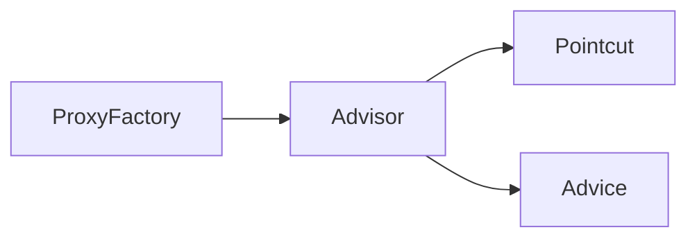

## 프록시 팩토리 - 소개

**문제점**

- 인터페이스가 있는 경우에는 JDK 동적 프록시를 사용하고, 그렇지 않은 경우에는 CGLIB를 적용하려면 어떻게 해야할까?
- 두 기술을 함께 사용할 때 부가 기능을 제공하기 위해서는 JDK 동적 프록시가 제공하는 `InvocationHandler`와 CGLIB가 제공하는 `MethodInterceptor`를 각각 중복으로 만들어서 관리해야 할까?
- 특정 조건에 맞을 때 프록시 로직을 적용하는 기능도 공통으로 제공되었으면?

#### 인터페이스가 있는 경우에는 JDK 동적 프록시를 사용하고, 그렇지 않은 경우에는 CGLIB를 적용하려면 어떻게 해야할까?

스프링은 유사한 구체적인 기술들이 있을 때, 그것들을 통합해서 일관성있게 접근하고 더욱 편리하게 사용할 수 있는 추상화 된 기술을 제공한다. 스프링은 동적 프록시를 통합해서 편리하게 만들어주는 프록시 팩토리(`ProxyFactory`)라는 기능을 제공한다.

이전에는 상황에 따라서 JDK 동적 프록시를 사용하거나 CGLIB을 사용해야 했다면, 이제는 이 프록시 팩토리 하나로 편리하게 동적 프록시를 생성할 수 있다. 프록시 팩토리는 인터페이스가 있으면 JDK 동적 프록시를 사용하고, 구체 클래스만 있다면 CGLIB를 사용한다.

그리고 이 설정을 변경할 수 있다.

![[proxy-factory-1.png]]

#### 두 기술을 함께 사용할 때 JDK 동적 프록시가 제공하는 InvocationHandler와 CGLIB가 제공하는 MethodInterceptor를 각각 중복으로 따로만들어야 할까?

스프링은 이 문제를 해결하기 위해 부가 기능을 적용할 때 `Advice`라는 새로운 개념을 도입했다. 개발자는 `InvocationHandler` 나 `MethodInterceptor`를 신경쓰지 않고, `Advice`만 만들면 된다. 결과적으로 `InvocationHandler`나 `MethodInterceptor`는 `Advice`를 호출한다.

프록시 팩토리를 사용하면 `Advice`를 호출하는 전용 `InvocationHandler`, `MethodInterceptor`를 내부에서 사용한다.

![[proxy-factory-2.png]]

조금 복잡할 수도 있는데, 핵심은 결국 프록시 생성은 `ProxyFactory`로 하고 로직은 `Advice`로 구현하면 된다.

#### 특정 조건에 맞을 때 프록시 로직을 적용하는 기능도 공통으로 제공되었으면?

앞서 특정 메서드 이름의 조건에 맞을 때만 프록시 부가 기능이 적용되는 코드를 직접 만들었다. 스프링은 `Pointcut`이라는 개념을 도입해서 이 문제를 일관성 있게 해결한다.

## 프록시 팩토리 - 예제 코드 1

#### Advice 만들기

`Advice`는 프록시에 적용하는 부가 기능 로직이다. 이것은 JDK 동적 프록시가 제공하는 `InvocationHandler`나 CGLIB이 제공하는 `MethodInterceptor`의 개념과 유사하다. 둘을 개념적으로 추상화 한 것이다.

프록시 팩토리를 사용하면 둘 대신에 `Advice`를 사용하면 된다. `Advice`를 만드는 방법은 여러가지가 있지만 기본적인 방법은 다음의 인터페이스를 구현하는 것이다. CGLIB이 제공하는 `MethodInterceptor`와 이름이 동일한데, 패키지가 다른 점을 유의해서 살펴보자.

```java title="org.aopalliance.intercept.MethodInterceptor"
package org.aopalliance.intercept;

@FunctionalInterface
public interface MethodInterceptor extends Interceptor {
    @Nullable
    Object invoke(@Nonnull MethodInvocation invocation) throws Throwable;
}
```

- `invoke()` 함수의 파라미터인 `MethodInvocation invacation`의 내부에는 다음 메서드를 호출하는 방법, 현재 프록시 객체 인스턴스, `args`, 메서드 정보들이 포함되어 있다. 기존에 파라미터로 제공되는 부분들이 합쳐졌다고 생각하면 된다.
- `MethodInterceptor`는 `Interceptor`를 상속하고 `Interceptor`는 `Advice` 인터페이스를 상속한다. 그래서 `Advice`라고 하는 것이다.

```java
@Slf4j
public class TimeAdvice implements MethodInterceptor {
    @Override
    public Object invoke(MethodInvocation invocation) throws Throwable {
        log.info("TimeAdvice 실행");
        long startTime = System.currentTimeMillis();

        Object result = invocation.proceed();

        long endTime = System.currentTimeMillis();
        long resultTime = endTime - startTime;

        log.info("TimeAdvice 종료. resultTime = {}", resultTime);
        return result;
    }
}
```

- `TimeAdvice`는 앞서 살펴본 `MethodInteceptor` 인터페이스를 구현한다.
- `Object result = invocation.proceed()`
  - `invocation.proceed()`를 호출하면 `target` 클래스를 호출하고 그 결과를 받는다.
  - 그런데 기존에 보았던 프록시들과 다르게 `target` 클래스의 정보가 보이지 않는다. `target` 클래스 정보는 `MethodInvocation invocation`안에 모두 포함에 되어 잇다.
  - 그 이유는 프록시 팩토리로 프록시를 생성하는 단계에서 이미 `target` 정보를 파라미터로 전달받기 때문이다.

#### 프록시 팩토리 사용 - JDK 동적 프록시

```java
@Test
@DisplayName("인터페이스가 있으면 JDK 동적 프록시 사용")
void interfaceProxy() {
    ServiceInterface target = new ServiceImpl();
    ProxyFactory proxyFactory = new ProxyFactory(target);
    proxyFactory.addAdvice(new TimeAdvice());
    ServiceInterface proxy = (ServiceInterface) proxyFactory.getProxy();

    log.info("targetClass = {}", target.getClass());
    log.info("proxyClass = {}", proxy.getClass());

	proxy.save();

	Assertions.assertThat(AopUtils.isAopProxy(proxy)).isTrue();
	Assertions.assertThat(AopUtils.isJdkDynamicProxy(proxy)).isTrue();
	Assertions.assertThat(AopUtils.isCglibProxy(proxy)).isFalse();
}
```

- `new ProxyFactory(target)`: 프록시 팩토리를 생성할 때, 생성자에 프록시의 호출 대상을 함께 넘긴다. 프록시 팩토리는 이 인스턴스 정보를 기반으로 프록시를 만들어낸다. 만약 이 인스턴스가 인터페이스의 구현체라면 (인스턴스에 인터페이스가 있다면) JDK 동적 프록시를 기본으로 사용하고, 인터페이스가 없고 구체 클래스만 있다면 CGLIB을 통해서 동적 프록시를 생성한다. 여기서는 `target`이 `new ServiceImpl()`의 인스턴스이기 때문에 `ServiceInterface` 인터페이스가 있다. 따라서 이 인터페이스를 기반으로 JDK 동적 프록시를 생성한다.
- `proxyFactory.addAdvice(new TimeAdvice())`: 프록시 팩토리를 통해서 만든 프록시가 사용할 부가 기능 로직을 설정한다. JDK 동적 프록시가 제공하는 `InvocationHandler`와 CGLIB이 제공하는 `MethodInterceptor`의 개념과 유사하다. 이렇게 프록시가 제공하는 부가 기능 로직을 `Advice`라고 한다.
- `proxyFactory.getProxy()`: 프록시 객체를 생성하고 그 결과를 받는다.

다음의 실행 결과를 살펴보면 JDK 동적 프록시가 생성된 것을 확인할 수 있다.

```
03:47:56.552 [main] INFO hello.proxy.proxyfactory.ProxyFactoryTest - targetClass = class hello.proxy.common.ServiceImpl
03:47:56.553 [main] INFO hello.proxy.proxyfactory.ProxyFactoryTest - proxyClass = class jdk.proxy2.$Proxy9
03:47:56.557 [main] INFO hello.proxy.common.advice.TimeAdvice - TimeAdvice 실행
03:47:56.557 [main] INFO hello.proxy.common.ServiceImpl - save 호출
03:47:56.557 [main] INFO hello.proxy.common.advice.TimeAdvice - TimeAdvice 종료. resultTime = 0
```

#### 프록시 팩토리를 통한 프록시 적용 확인

참고로 다음의 기능들은 모두 프록시 팩토리를 사용했을 때만 확인 가능하다. 프록시가 잘 적용되었는지 확인하려면 다음 기능을 사용하면 된다.

- `AopUtils.isAopProxy(proxy)`: 프록시 팩토리를 통해서 프록시가 생성되면 JDK 동적 프록시나, CGLIB 모두 참이다.
- `AopUtils.isJdkDynamicProxy(proxy)`: 프록시 팩토리를 통해서 프록시가 생성되고, JDK 동적 프록시일 경우 참
- `AopUtils.isCglibProxy(proxy)`: 프록시 팩토리를 통해서 프록시가 생성되고, CGLIB 동적 프록시일 경우 참

#### 프록시 팩토리 사용 - CGLIB 동적 프록시 사용

```java
@Test
@DisplayName("인터페이스가 있으면 CGLIB 동적 프록시 사용")
void concreteProxy() {
    ConcreteService target = new ConcreteService();
    ProxyFactory proxyFactory = new ProxyFactory(target);
    proxyFactory.addAdvice(new TimeAdvice());
    ConcreteService proxy = (ConcreteService) proxyFactory.getProxy();

    log.info("targetClass = {}", target.getClass());
    log.info("proxyClass = {}", proxy.getClass());

    proxy.call();

    Assertions.assertThat(AopUtils.isAopProxy(proxy)).isTrue();
    Assertions.assertThat(AopUtils.isJdkDynamicProxy(proxy)).isFalse();
    Assertions.assertThat(AopUtils.isCglibProxy(proxy)).isTrue();
}
```

실행 결과의 클래스 정보를 살펴보면 CGLIB 프록시가 적용된 것을 눈으로도 확인할 수 있다.

```
04:14:30.589 [main] INFO hello.proxy.proxyfactory.ProxyFactoryTest - targetClass = class hello.proxy.common.ConcreteService
04:14:30.590 [main] INFO hello.proxy.proxyfactory.ProxyFactoryTest - proxyClass = class hello.proxy.common.ConcreteService$$EnhancerBySpringCGLIB$$81910790
04:14:30.591 [main] INFO hello.proxy.common.advice.TimeAdvice - TimeAdvice 실행
04:14:30.596 [main] INFO hello.proxy.common.ConcreteService - ConcreteService 호출
04:14:30.597 [main] INFO hello.proxy.common.advice.TimeAdvice - TimeAdvice 종료. resultTime = 6
```

#### 프록시 팩토리 사용 - proxyTargetClass 추가

```java
@Test
@DisplayName("ProxyTargetClass 옵션을 사용하면 인터페이스가 있어도 CGLIB를 사용하고, 클래스 기반 동적 프록시를 사용")
void proxyTargetClass() {
    ServiceInterface target = new ServiceImpl();
    ProxyFactory proxyFactory = new ProxyFactory(target);

    proxyFactory.setProxyTargetClass(true);

    proxyFactory.addAdvice(new TimeAdvice());
    ServiceInterface proxy = (ServiceInterface) proxyFactory.getProxy();

    log.info("targetClass = {}", target.getClass());
    log.info("proxyClass = {}", proxy.getClass());

    proxy.save();

    Assertions.assertThat(AopUtils.isAopProxy(proxy)).isTrue();
    Assertions.assertThat(AopUtils.isJdkDynamicProxy(proxy)).isFalse();
    Assertions.assertThat(AopUtils.isCglibProxy(proxy)).isTrue();
}
```

인터페이스가 있지만, CGLIB를 사용해서 클래스 기반 동적 프록시를 만드는 방법이다. 프록시 팩토리는 `proxyTargetClass`라는 옵션을 제공하는데, 이 옵션에 `true`를 넣으면 인터페이스가 있어도 강제로 CGLIB를 사용한다.

```
04:17:07.793 [main] INFO hello.proxy.proxyfactory.ProxyFactoryTest - targetClass = class hello.proxy.common.ServiceImpl
04:17:07.794 [main] INFO hello.proxy.proxyfactory.ProxyFactoryTest - proxyClass = class hello.proxy.common.ServiceImpl$$EnhancerBySpringCGLIB$$75199bd
04:17:07.796 [main] INFO hello.proxy.common.advice.TimeAdvice - TimeAdvice 실행
04:17:07.801 [main] INFO hello.proxy.common.ServiceImpl - save 호출
04:17:07.801 [main] INFO hello.proxy.common.advice.TimeAdvice - TimeAdvice 종료. resultTime = 5
```

> [!summary] 정리
> 프록시 팩토리의 서비스 추상화 덕분에 구체적인 CGLIB, JDK 동적 프록시 기술에 의존하지 않고 매우 편리하게 동적 프록시를 생성할 수 있다.
>
> 프록시의 부가 기능 로직도 특정 기술에 종속적이지 않게 `Advice` 하나로 편리하게 사용할 수 있었다. 이것은 프록시 팩토리가 내부에서 JDK 동적 프록시인 경우 `InvocationHandler`가 `Advice`를 호출하도록 개발해두고, CGLIB인 경우 `MethodInterceptor`가 `Advice`를 호출하도록 기능을 개발해두었기 때문이다.

> [!warning] 스프링 부트 AOP의 proxyTargetClass
> 스프링 부트는 AOP를 적용할 때 기본적으로 `proxyTargetClass(true)`로 설정해서 사용한다. 따라서 인터페이스가 있어도 항상 CGLIB를 사용해서 구체 클래스를 기반으로 프록시를 생성한다. 자세한 이유는 뒤에서 설명한다.

## 포인트컷, 어드바이스, 어드바이저 - 소개

- **포인트 컷(Pointcut)**: 어디에 부가 기능을 적용할 지, 어디에 부가 기능을 적용하지 않을지 판단하는 필터링 로직이다. 주로 클래스와 메서드 이름으로 필터링 한다. 이름 그대로 어떤 포인트(Point)에 기능을 적용하지 않을지 잘라서(Cut) 구분하는 것이다.
- **어드바이스(Advice)**: 프록시가 호출하는 부가 기능이다. 단순히 프록시 로직이라 생각하면 된다.
- **어드바이저(Advisor)**: 단순하게 하나의 포인트컷과 하나의 어드바이스를 가지고 있는 것이다. 쉽게 이야기해서 *포인트컷1 + 어드바이스1*이 합쳐진 것을 칭하는 개념이다.

부가 기능 로직을 적용해야 한다고 가정하고 정리해보자.

- 포인트컷으로 **어디에** 적용할지 선택
- 어드바이스로 **어떤** 로직을 적용할지 선택

어드바이저는 이 두 개념이 합쳐져서, 모두 알고 있을 때 어드바이저라고 한다. 쉽게 말해 어디에 어떤 로직을 적용할 지 알고 있는 것이다.

**쉽게 기억하기**

- 조언(`Advice`)을 어디에(`Pointcut`)에 할 것인가?
- 조언자(`Advisor`)는 어디(`Pointcut`)에 조언(`Advice`)을 해야할지 알고 있다.

#### 역할과 책임

이렇게 구분한 것은 역할과 책임을 명확하게 분리한 것이다.

![[proxy-factory-3.png]]

- 포인트컷은 대상 여부를 확인하는 필터 역할만 담당한다.
- 어드바이스는 깔끔하게 부가 기능 로직만 담당한다.
- 둘을 합치면 어드바이저가 된다. 스프링의 어드바이저는 하나의 포인트컷 + 하나의 어드바이스로 구성된다.

> [!warning]
> 단어들의 정의는 문맥상 이해를 돕기 위한 것이고, 프록시에 맞추어 설명했다. 이후 AOP 부분에서 다시 한번 정리한다. 그림은 이해를 돕기 위한 것이고 실제 구현은 약간 다를 수 있다.

## 예제 코드 1 - 어드바이저

어드바이저는 하나의 포인트 컷과 하나의 어드바이스를 가지고 있다. 프록시 팩토리를 통해 프록시를 생성할 때 어드바이저를 제공하면 어디에 어떤 기능을 제공할 지 알 수 있다.

```java
@Test
void advisorTest1() {
    ServiceInterface target = new ServiceImpl();
    ProxyFactory proxyFactory = new ProxyFactory(target);

    DefaultPointcutAdvisor advisor = new DefaultPointcutAdvisor(Pointcut.TRUE, new TimeAdvice());
    proxyFactory.addAdvisor(advisor);

    ServiceInterface proxy = (ServiceInterface) proxyFactory.getProxy();
    proxy.save();
    proxy.find();
}
```

- `new DefaultPointcutAdvisor`: `Advisor` 인터페이스의 가장 일반적인 구현체이다. 생성자를 통해 하나의 포인트컷과 하나의 어드바이스를 넣어주면 된다. 어드바이저는 하나의 포인트컷과 하나의 어드바이스로 구성된다.
- `Pointcut.TRUE`: 항상 `true`를 반환하는 포인트컷이다.
- `new TimeAdvice()`: 앞서 개발한 `TimeAdvice` 어드바이스를 제공한다.
- `proxyFactory.addAdvisor(advisor)`: 프록시 팩토리에 적용할 어드바이저를 지정한다. 어드바이저는 내부에 포인트컷과 어드바이스를 모두 가지고 있다. 따라서 어디에 어떤 부가 기능을 적용해야 할지 어드바이스 하나로 알 수 있다. 프록시 팩토리를 사용할 때 어드바이저는 필수이다.
- 그런데 이전에 `proxyFactory.addAdvice(new TimeAdvice())`로 어드바이저가 아니라 어드바이스를 바로 적용했다. 그런데 이것은 단순히 편의 메서드이고 결과적으로 해당 메서드 내부에서 지금 코드와 똑같은 기본 어드바이저가 생성된다.

#### 프록시 팩토리와 어드바이저 관계



## 예제 코드 2 - 직접 만든 포인트컷

이번에는 `save()`에는 어드바이스 로직을 적용하고, `find()`에는 어드바이스 로직을 적용하지 않도록 직접 포인트컷을 만들어서 적용해보자. 물론 포인트컷을 따로 구현하지 않고 어드바이스 내부에서 로직을 추가해 코드를 실행할지 말지 분기를 타도 되지만, 이렇게 하면 어드바이스 로직 자체가 포인트컷과 결합되서 묶여버린다. 다른 곳에서 재사용하는게 불가능해진다는 의미다.

```java title="Pointcut"
public interface Pointcut {
    Pointcut TRUE = TruePointcut.INSTANCE;

    ClassFilter getClassFilter();

    MethodMatcher getMethodMatcher();
}

@FunctionalInterface
public interface ClassFilter {
    ClassFilter TRUE = TrueClassFilter.INSTANCE;

    boolean matches(Class<?> clazz);
}

public interface MethodMatcher {
    MethodMatcher TRUE = TrueMethodMatcher.INSTANCE;

    boolean matches(Method method, Class<?> targetClass);

    boolean isRuntime();

    boolean matches(Method method, Class<?> targetClass, Object... args);
}
```

포인트컷은 크게 `ClassFilter`와 `MethodFilter`로 둘로 이루어진다. 이름 그대로 하나는 클래스가 맞는지, 하나는 메서드가 맞는지 확인할 떄 사용한다. 둘 다 `true`를 반환해야 어드바이스를 적용할 수 있다.

일반적으로는 스프링이 만들어둔 구현체를 사용하지만 개념 학습 차원에서 직접 구현해보자.

```java
static class MyPointcut implements Pointcut {
    @Override
    public ClassFilter getClassFilter() {
        return ClassFilter.TRUE;
    }

    @Override
    public MethodMatcher getMethodMatcher() {
        return new MyMethodMatcher();
    }
}

@Slf4j
static class MyMethodMatcher implements MethodMatcher {
    private String matchName = "save";

    @Override
    public boolean matches(Method method, Class<?> targetClass) {
        boolean result = method.getName().equals(matchName);

        log.info("포인트컷 호출 method = {}, targetClass = {}", method.getName(), targetClass);
        log.info("포인트컷 결과 = {}", result);

        return result;
    }

    @Override
    public boolean isRuntime() {
        return false;
    }

    @Override
    public boolean matches(Method method, Class<?> targetClass, Object... args) {
        return false;
    }
}
```

> 편의를 위해 테스트 클래스 내부에서 작성했으므로 정적 중첩 클래스로 작성했다.

#### MyPointcut

- `Pointcut` 인터페이스를 구현해 직접 만든 포인트컷이다.
- 현재 메서드 기준으로 로직을 적용하면 된다. 클래스 필터는 항상 `true`를 반환하도록 했고, 메서드 비교 기능은 `MyMethodMatcher`를 사용한다.

#### MyMethodMatcher

- 직접 구현한 `MethodMatcher`이다. `MethodMatcher` 인터페이스를 구현한다.
- `matches()`: 이 메서드에 `method`, `targetClass` 정보가 넘어온다. 이 정보로 어드바이스를 적용할지 적용하지 않을지 판단할 수 있다.
- 여기서는 메서드 이름이 `save`인 경우에 `true`를 반환하도록 로직을 적용했다.
- `isRuntime()`, `matches(...args)`: 만약 `isRuntime()` 값이 참이면 `matches(...args)` 함수가 대신 실행된다. 동적으로 넘어오는 매개변수를 판단로직으로 사용할 수 있다.

```java
@Test
@DisplayName("직접 만든 포인트컷")
void advisorTest2() {
    ServiceInterface target = new ServiceImpl();
    ProxyFactory proxyFactory = new ProxyFactory(target);

    DefaultPointcutAdvisor advisor = new DefaultPointcutAdvisor(new MyPointcut(), new TimeAdvice());
    proxyFactory.addAdvisor(advisor);

    ServiceInterface proxy = (ServiceInterface) proxyFactory.getProxy();
    proxy.save();
    proxy.find();
}
```

```
05:06:38.235 [main] INFO hello.proxy.advisor.AdvisorTest$MyMethodMatcher - 포인트컷 호출 method = save, targetClass = class hello.proxy.common.ServiceImpl
05:06:38.236 [main] INFO hello.proxy.advisor.AdvisorTest$MyMethodMatcher - 포인트컷 결과 = true
05:06:38.237 [main] INFO hello.proxy.common.advice.TimeAdvice - TimeAdvice 실행
05:06:38.237 [main] INFO hello.proxy.common.ServiceImpl - save 호출
05:06:38.237 [main] INFO hello.proxy.common.advice.TimeAdvice - TimeAdvice 종료. resultTime = 0
05:06:38.237 [main] INFO hello.proxy.advisor.AdvisorTest$MyMethodMatcher - 포인트컷 호출 method = find, targetClass = class hello.proxy.common.ServiceImpl
05:06:38.237 [main] INFO hello.proxy.advisor.AdvisorTest$MyMethodMatcher - 포인트컷 결과 = false
05:06:38.238 [main] INFO hello.proxy.common.ServiceImpl - find 호출
```

그림으로 실행 결과를 정리해보면 다음과 같다.

![[proxy-factory-4.png]]

1. 클라이언트가 프록시의 `save()`를 호출한다.
2. 포인트컷에게 `Service` 클래스의 `save()` 메서드에 어드바이스를 적용할 지 물어본다.
3. 포인트컷이 `true`를 반환한다. 따라서 어드바이스를 호출해서 부가 기능을 적용한다.
4. 이후 실제 인스턴스의 `save()`를 호출한다.

`find()`를 호출한 경우엔 포인트컷이 `false`를 반환하므로 부가 기능을 적용하지 않는다.

## 스프링이 제공하는 포인트컷

스프링은 필요한 포인트컷을 이미 대부분 제공한다. 스프링이 제공하는 `NameMatchMethodPointcut`을 사용해서 구현해본다.

```java
@Test
@DisplayName("스프링이 제공하는 포인트컷")
void advisorTest3() {
    ServiceInterface target = new ServiceImpl();
    ProxyFactory proxyFactory = new ProxyFactory(target);

    NameMatchMethodPointcut pointcut = new NameMatchMethodPointcut();
    pointcut.setMappedName("save");

    DefaultPointcutAdvisor advisor = new DefaultPointcutAdvisor(pointcut, new TimeAdvice());
    proxyFactory.addAdvisor(advisor);

    ServiceInterface proxy = (ServiceInterface) proxyFactory.getProxy();
    proxy.save();
    proxy.find();
}
```

```
05:21:45.292 [main] INFO hello.proxy.common.advice.TimeAdvice - TimeAdvice 실행
05:21:45.293 [main] INFO hello.proxy.common.ServiceImpl - save 호출
05:21:45.293 [main] INFO hello.proxy.common.advice.TimeAdvice - TimeAdvice 종료. resultTime = 0
05:21:45.294 [main] INFO hello.proxy.common.ServiceImpl - find 호출
```

`save()`의 경우 어드바이스가 적용됐지만, `find()`의 경우는 적용되지 않았음을 확인할 수 있다.

#### 스프링이 제공하는 포인트컷

스프링은 무수히 많은 포인트컷을 제공한다. 대표적인 몇 가지만 알아보자.

- `NameMatchMethodPointcut`: 메서드 이름을 기반으로 매칭한다. 내부에서는 `PatternMatchUtils`를 사용한다.
  - `PatternMatchUtils`를 사용하므로 `"*xxx*"`와 같은 방식으로도 패턴을 작성할 수 있다.
- `JdkRegexpMethodPointcut`: JDK 정규 표현식을 기반으로 포인트컷을 매칭한다.
- `TruePointcut`: 항상 참을 반환한다.
- `AnnotationMatchingPointcut`: 어노테이션으로 매칭한다.
- `AspectJExpressionPointcut`: `aspectJ` 표현식으로 매칭한다.

**가장 중요한 것은 aspectJ 표현식**

여기서 사실 다른것은 중요하지 않다. 실무에서는 사용하기도 편리하고 기능도 가장 많은 `aspectJ` 표현식을 기반으로 사용하는 `AspectJExpressionPointcut`을 사용하게 된다.
`aspectJ` 표현식과 사용 방법은 중요해서 이후 AOP를 설명할 때 자세히 설명한다. 지금은 `Pointcut`의 동작 방식과 전체 구조에 집중하자.

## 예제 코드 4 - 여러 어드바이저 함께 적용

어드바이저는 하나의 포인트컷과 하나의 어드바이스를 가지고 있다. 만약 여러 어드바이저를 하나의 `target`에 적용하려면 어떻게 해야할까?

쉽게 이야기해서 하나의 `target`에 여러 어드바이스를 적용하려면 어떻게 해야할까? 지금 떠오르는 방법은 프록시를 여러개 만들면 될 것 같다.

```java
public class MultiAdvisorTest {
    @Test
    @DisplayName("여러 프록시")
    void multiAdvisorTest1() {
        // client -> proxy2(advisor2) -> proxy1(advisor1) -> target

        //프록시 1 생성, proxy2 -> proxy1 입력
        ServiceInterface target = new ServiceImpl();
        ProxyFactory proxyFactory1 = new ProxyFactory(target);
        DefaultPointcutAdvisor advisor1 = new DefaultPointcutAdvisor(Pointcut.TRUE, new Advice1());
        proxyFactory1.addAdvisor(advisor1);
        ServiceInterface proxy1 = (ServiceInterface) proxyFactory1.getProxy();

        //프록시 2 생성, target -> proxy1 입력
        ProxyFactory proxyFactory2 = new ProxyFactory(proxy1);
        DefaultPointcutAdvisor advisor2 = new DefaultPointcutAdvisor(Pointcut.TRUE, new Advice2());
        proxyFactory2.addAdvisor(advisor2);
        ServiceInterface proxy2 = (ServiceInterface) proxyFactory2.getProxy();

        proxy2.save();
    }

    @Slf4j
    static class Advice1 implements MethodInterceptor {
        @Override
        public Object invoke(MethodInvocation invocation) throws Throwable {
            log.info("Advice1 호출");
            return invocation.proceed();
        }
    }

    @Slf4j
    static class Advice2 implements MethodInterceptor {
        @Override
        public Object invoke(MethodInvocation invocation) throws Throwable {
            log.info("Advice2 호출");
            return invocation.proceed();
        }
    }
}
```

이 코드는 런타임에 다음과 같이 동작한다.

![[proxy-factory-5.png]]

**실행 결과**

```
05:32:26.230 [main] INFO hello.proxy.advisor.MultiAdvisorTest$Advice2 - Advice2 호출
05:32:26.231 [main] INFO hello.proxy.advisor.MultiAdvisorTest$Advice1 - Advice1 호출
05:32:26.231 [main] INFO hello.proxy.common.ServiceImpl - save 호출
05:32:26.231 [main] INFO hello.proxy.advisor.MultiAdvisorTest$Advice2 - Advice2 호출
05:32:26.231 [main] INFO hello.proxy.advisor.MultiAdvisorTest$Advice1 - Advice1 호출
05:32:26.231 [main] INFO hello.proxy.common.ServiceImpl - find 호출
```

이 방법이 잘못된 방법은 아니지만, 프록시를 2번 생성해야 한다는 문제가 있다. 만약 적용해야 하는 어드바이저가 10개라면 10개의 프록시를 생성해야 한다.

#### 하나의 프록시, 여러 어드바이저

스프링은 이 문제를 해결하기 위해 하나의 프록시에 여러 어드바이저를 적용할 수 있게 만들어두었다. 단순히 프록시 팩토리에 원하는만큼 `proxyFactory.addAdvisor()`를 호출해 추가하면 된다.

```java
@Test
@DisplayName("하나의 프록시, 여러 어드바이저")
void multiAdvisorTest2() {
    // client -> proxy -> advisor2 -> advisor1 -> target

    DefaultPointcutAdvisor advisor1 = new DefaultPointcutAdvisor(Pointcut.TRUE, new Advice1());
    DefaultPointcutAdvisor advisor2 = new DefaultPointcutAdvisor(Pointcut.TRUE, new Advice2());


    //프록시 1 생성, proxy2 -> proxy1 입력
    ServiceInterface target = new ServiceImpl();
    ProxyFactory proxyFactory1 = new ProxyFactory(target);

    // 순서가 중요, 내부적으로 ArrayList를 사용한다.
    proxyFactory1.addAdvisor(advisor2);
    proxyFactory1.addAdvisor(advisor1);

    ServiceInterface proxy = (ServiceInterface) proxyFactory1.getProxy();
    proxy.save();
}
```

- 이렇게 프록시 팩토리에 원하는 만큼 `addAdvisor()`를 통해 어드바이저를 등록하면 된다.
- 등록하는 순서대로 `advisor`가 호출된다. 여기서는 `advisor2`, `advisor1` 순서로 등록했다.
- 내부 구조를 잠깐 살펴봤는데, `ProxyFactory`는 `AdvisedSupport` 클래스를 상속받는다. 이 `AdvisedSupport` 내부에 `private advisors`는 다음과 같이 `ArrayList`를 사용한다.

```java title="간략화한 AdvisedSupport"
public class AdvisedSupport extends ProxyConfig implements Advised {
    private List<Advisor> advisors;

    public AdvisedSupport() {
        this.advisors = new ArrayList();
    }
```

**실행 결과**

```
05:42:45.348 [main] INFO hello.proxy.advisor.MultiAdvisorTest$Advice2 - Advice2 호출
05:42:45.349 [main] INFO hello.proxy.advisor.MultiAdvisorTest$Advice1 - Advice1 호출
05:42:45.349 [main] INFO hello.proxy.common.ServiceImpl - save 호출
```

그림으로 살펴보면 다음과 같다.

![[proxy-factory-6.png]]

결과적으로 여러 프록시를 사용할 때와 비교해서 결과는 같고, 성능은 더 좋다.

> [!important] 스프링의 AOP는 target마다 하나의 프록시만 생성한다
> 이번 장을 이렇게 풀어서 설명한 이유는, 스프링의 AOP를 처음 공부하거나 사용하면 AOP 적용 수 만큼 프록시가 생성된다고 착각하게 된다. 실제 많은 실무 개발자들도 이렇게 생각하는 것을 보았다.
>
> 스프링은 AOP를 적용할 때, 최적화를 진행해서 지금처럼 프록시는 하나만 만들고, 하나의 프록시에 여러 어드바이저를 적용한다. 정리하면 하나의 `target`에 여러 AOP가 동시에 적용되어도 스프링의 AOP는 `target`마다 하나의 프록시만 생성한다. 이 부분을 꼭 기억 해두어야 한다.

## 프록시 팩토리 - 적용 1

지금까지 학습한 프록시 팩토리를 사용해서 어플리케이션에 적용해본다.

```java title="LogTraceAdvice"
public class LogTraceAdvice implements MethodInterceptor {
    private final LogTrace trace;

    public LogTraceAdvice(LogTrace trace) {
        this.trace = trace;
    }

    @Override
    public Object invoke(MethodInvocation invocation) throws Throwable {
        String message = invocation.getMethod().getDeclaringClass().getSimpleName() + "." + invocation.getMethod().getName() + "()";
        TraceStatus status = null;

        try {
            status = trace.begin(message);

            Object result = invocation.proceed();

            trace.end(status);
            return result;
        } catch (Exception e) {
            trace.exception(status,e);
            throw e;
        }
    }
}
```

```java title="ProxyFactoryConfigV1"
@Slf4j
@Configuration
public class ProxyFactoryConfigV1 {

    @Bean
    public OrderRepositoryV1 orderRepository(LogTrace trace) {
        OrderRepositoryV1Impl target = new OrderRepositoryV1Impl();
        ProxyFactory factory = new ProxyFactory(target);
        factory.addAdvisor(getAdvisor(trace));

        OrderRepositoryV1 proxy = (OrderRepositoryV1) factory.getProxy();
        log.info("ProxyFactory proxy = {}, target = {}", proxy.getClass(), target.getClass());

        return proxy;
    }

    @Bean
    public OrderServiceV1 orderService(LogTrace trace) {
        OrderServiceV1 target = new OrderServiceV1Impl(orderRepository(trace));
        ProxyFactory factory = new ProxyFactory(target);
        factory.addAdvisor(getAdvisor(trace));

        OrderServiceV1 proxy = (OrderServiceV1) factory.getProxy();
        log.info("ProxyFactory proxy = {}, target = {}", proxy.getClass(), target.getClass());

        return proxy;
    }

    @Bean
    public OrderControllerV1 orderController(LogTrace trace) {
        OrderControllerV1 target = new OrderControllerV1Impl(orderService(trace));
        ProxyFactory factory = new ProxyFactory(target);
        factory.addAdvisor(getAdvisor(trace));

        OrderControllerV1 proxy = (OrderControllerV1) factory.getProxy();
        log.info("ProxyFactory proxy = {}, target = {}", proxy.getClass(), target.getClass());

        return proxy;
    }

    private Advisor getAdvisor(LogTrace trace) {
        // Pointcut
        NameMatchMethodPointcut pointcut = new NameMatchMethodPointcut();
        pointcut.setMappedNames("request*", "order*", "save*");

        LogTraceAdvice advice = new LogTraceAdvice(trace);

        return new DefaultPointcutAdvisor(pointcut, advice);
    }
}
```

구성 정보를 설정하고 실행해보면 다음과 같이 잘 작동한다.

```
2025-01-03 05:57:20.236  INFO 3745 --- [           main] h.p.c.v.advice.ProxyFactoryConfigV1      : ProxyFactory proxy = class jdk.proxy2.$Proxy50, target = class hello.proxy.app.v1.OrderRepositoryV1Impl
2025-01-03 05:57:20.240  INFO 3745 --- [           main] h.p.c.v.advice.ProxyFactoryConfigV1      : ProxyFactory proxy = class jdk.proxy2.$Proxy52, target = class hello.proxy.app.v1.OrderServiceV1Impl
2025-01-03 05:57:20.242  INFO 3745 --- [           main] h.p.c.v.advice.ProxyFactoryConfigV1      : ProxyFactory proxy = class jdk.proxy2.$Proxy53, target = class hello.proxy.app.v1.OrderControllerV1Impl
...(생략)
2025-01-03 05:58:43.019  INFO 3745 --- [io-8080-exec-10] h.p.trace.logtrace.ThreadLocalLogTrace   : [7725988c] OrderControllerV1.request()
2025-01-03 05:58:43.020  INFO 3745 --- [io-8080-exec-10] h.p.trace.logtrace.ThreadLocalLogTrace   : [7725988c] |-->OrderServiceV1.orderItem()
2025-01-03 05:58:43.020  INFO 3745 --- [io-8080-exec-10] h.p.trace.logtrace.ThreadLocalLogTrace   : [7725988c] |   |-->OrderRepositoryV1.save()
2025-01-03 05:58:44.024  INFO 3745 --- [io-8080-exec-10] h.p.trace.logtrace.ThreadLocalLogTrace   : [7725988c] |   |<--OrderRepositoryV1.save() time=1004ms
2025-01-03 05:58:44.025  INFO 3745 --- [io-8080-exec-10] h.p.trace.logtrace.ThreadLocalLogTrace   : [7725988c] |<--OrderServiceV1.orderItem() time=1005ms
2025-01-03 05:58:44.025  INFO 3745 --- [io-8080-exec-10] h.p.trace.logtrace.ThreadLocalLogTrace   : [7725988c] OrderControllerV1.request() time=1006ms
```

## 프록시 팩토리 - 적용 2

이번에는 인터페이스가 없는 구체 클래스에 프록시팩토리를 적용해본다.

```java
@Slf4j
@Configuration
public class ProxyFactoryConfigV2 {
    @Bean
    public OrderRepositoryV2 orderRepository(LogTrace trace) {
        OrderRepositoryV2 target = new OrderRepositoryV2();
        ProxyFactory factory = new ProxyFactory(target);
        factory.addAdvisor(getAdvisor(trace));

        OrderRepositoryV2 proxy = (OrderRepositoryV2) factory.getProxy();
        log.info("ProxyFactory proxy = {}, target = {}", proxy.getClass(), target.getClass());

        return proxy;
    }

    @Bean
    public OrderServiceV2 orderService(LogTrace trace) {
        OrderServiceV2 target = new OrderServiceV2(orderRepository(trace));
        ProxyFactory factory = new ProxyFactory(target);
        factory.addAdvisor(getAdvisor(trace));

        OrderServiceV2 proxy = (OrderServiceV2) factory.getProxy();
        log.info("ProxyFactory proxy = {}, target = {}", proxy.getClass(), target.getClass());

        return proxy;
    }

    @Bean
    public OrderControllerV2 orderController(LogTrace trace) {
        OrderControllerV2 target = new OrderControllerV2(orderService(trace));
        ProxyFactory factory = new ProxyFactory(target);
        factory.addAdvisor(getAdvisor(trace));

        OrderControllerV2 proxy = (OrderControllerV2) factory.getProxy();
        log.info("ProxyFactory proxy = {}, target = {}", proxy.getClass(), target.getClass());

        return proxy;
    }

    private Advisor getAdvisor(LogTrace trace) {
        // Pointcut
        NameMatchMethodPointcut pointcut = new NameMatchMethodPointcut();
        pointcut.setMappedNames("request*", "order*", "save*");

        LogTraceAdvice advice = new LogTraceAdvice(trace);

        return new DefaultPointcutAdvisor(pointcut, advice);
    }
}
```

```
2025-01-03 06:09:49.647  INFO 3988 --- [           main] h.p.c.v.ProxyFactoryConfigV2             : ProxyFactory proxy=class hello.proxy.app.v2.OrderRepositoryV2$$EnhancerBySpringCGLIB$$a6fa63d6, target=class hello.proxy.app.v2.OrderRepositoryV2
2025-01-03 06:09:49.650  INFO 3988 --- [           main] h.p.c.v.ProxyFactoryConfigV2             : ProxyFactory proxy=class hello.proxy.app.v2.OrderServiceV2$$EnhancerBySpringCGLIB$$fb4a91f9, target=class hello.proxy.app.v2.OrderServiceV2
2025-01-03 06:09:49.652  INFO 3988 --- [           main] h.p.c.v.ProxyFactoryConfigV2             : ProxyFactory proxy=class hello.proxy.app.v2.OrderControllerV2$$EnhancerBySpringCGLIB$$a9018a8c, target=class hello.proxy.app.v2.OrderControllerV2
...(생략)
2025-01-03 06:09:52.149  INFO 3988 --- [nio-8080-exec-1] h.p.trace.logtrace.ThreadLocalLogTrace   : [a01d87bc] OrderControllerV2.request()
2025-01-03 06:09:52.152  INFO 3988 --- [nio-8080-exec-1] h.p.trace.logtrace.ThreadLocalLogTrace   : [a01d87bc] |-->OrderServiceV2.orderItem()
2025-01-03 06:09:52.154  INFO 3988 --- [nio-8080-exec-1] h.p.trace.logtrace.ThreadLocalLogTrace   : [a01d87bc] |   |-->OrderRepositoryV2.save()
2025-01-03 06:09:53.158  INFO 3988 --- [nio-8080-exec-1] h.p.trace.logtrace.ThreadLocalLogTrace   : [a01d87bc] |   |<--OrderRepositoryV2.save() time=1004ms
2025-01-03 06:09:53.158  INFO 3988 --- [nio-8080-exec-1] h.p.trace.logtrace.ThreadLocalLogTrace   : [a01d87bc] |<--OrderServiceV2.orderItem() time=1006ms
2025-01-03 06:09:53.158  INFO 3988 --- [nio-8080-exec-1] h.p.trace.logtrace.ThreadLocalLogTrace   : [a01d87bc] OrderControllerV2.request() time=1009ms
```

`V2` 어플리케이션은 인터페이스가 없고 구체 클래스만 있기 때문에 프록시 팩토리가 CGLIB를 통해서 동적 프록시를 생성한다. 어플리케이션 로딩 로그를 통해서 CGLIB 프록시가 적용된 것을 확인할 수 있다.

#### 정리

프록시 팩토리 덕분에 개발자는 매우 편리하게 프록시를 생성할 수 있었다. 추가로 `어드바이저`, `어드바이스`, `포인트컷`이라는 개념 덕분에 **어떤 부가 기능**을 **어디에 적용**할 지 명확하게 이해할 수 있었다.

##### 남은 문제

프록시 팩토리와 어드바이저 같은 개념 덕분에 지금까지 고민했던 문제들은 해결되었다. 원본 코드를 전혀 손대지 않고 프록시도 깔끔하게 적용하고 포인트컷으로 어디에 어떤 부가 기능을 적용할지도 명확하게 정의했다.

그런데 아직 해결되지 않는 문제가 있다.

**문제 1 - 너무 많은 설정**

바로 `ProxyFactoryConfigV1`과 `ProxyFactoryConfigV2`와 같은 설정 파일이 지나치게 많다는 점이다. 무수히 많은 설정 파일 때문에 설정 지옥을 경험하게 될 수도 있다. 최근엔 스프링 빈을 등록하는 과정까지도 귀찮아해서 컴포넌트 스캔까지 사용하는데, 이렇게 직접 등록하는 것도 모자라서 프록시를 적용하는 코드까지 빈 생성 코드에 넣어야 한다.

**문제 2 - 컴포넌트 스캔**

어플리케이션 `V3`처럼 컴포넌트 스캔을 사용하는 경우 지금까지 학습한 방법으로는 프록시 적용이 불가능하다. 왜냐하면 실제 객체를 컴포넌트 스캔으로 스프링 컨테이너에 스프링 빈으로 등록을 다 해버린 상태이기 때문이다.

지금까지 학습한 프록시를 적용하려면 실제 객체를 스프링 컨테이너에 빈으로 등록하는 것이 아니라 `ProxyFactoryConfigV1`에서 한 것처럼 부가 기능이 있는 프록시를 실제 객체 대신 스프링 빈으로 등록해야 한다.

> 이 두 가지 문제를 한번에 해결하는 방법이 바로 다음에 설명할 빈 후처리기이다.

---

References: 김영한의 스프링 핵심 원리 - 고급편

Links to this page:
