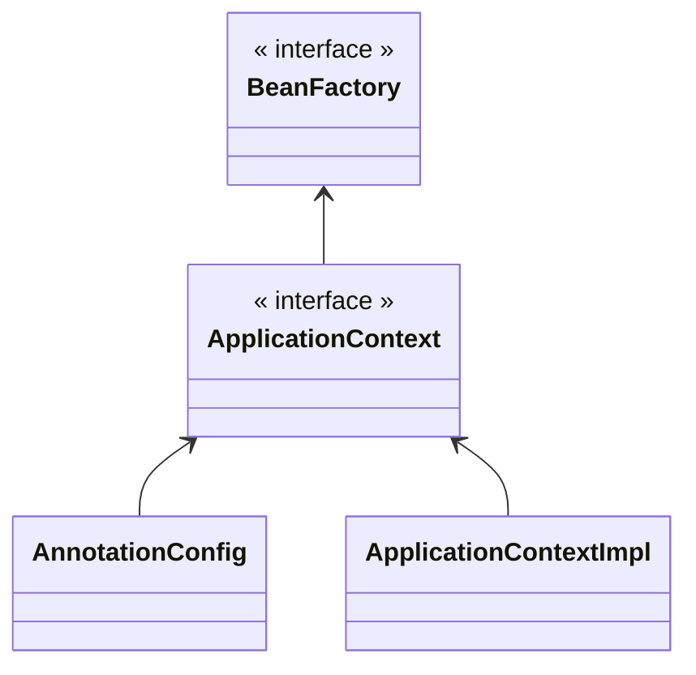
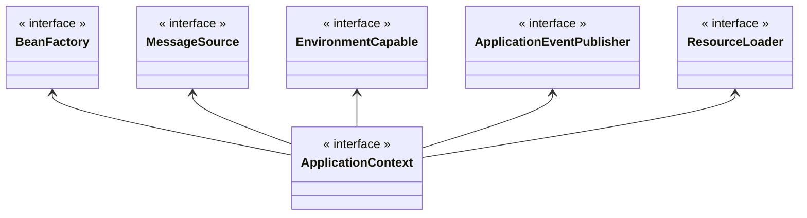

---
title:
tags:
  - java
  - programming
  - spring
publish: true
date: 2024-11-16
---

## 스프링 컨테이너 생성

```java
ApplicationContext applicationContext = new AnnotationConfigApplicationContext(AppConfig.class);
```

- `ApplicationContext`를 스프링 컨테이너라 한다.
- `ApplicationContext`는 인터페이스다.
- 스프링 컨테이너는 XML을 기반으로 만들 수도 있고, 어노테이션 기반의 자바 설정 클래스로 만들 수 있다.
- 앞서 `AppConfig`을 사용했던 방식이 어노테이션 기반의 자바 설정 클래스로 스프링 컨테이너를 만든 것이다.
- `new AnnotationConfigApplicationContext(AppConfig.class)` 이 클래스는 `ApplicationContext`의 구현체이다.
- 이 코드는 자바 설정 클래스를 기반으로 스프링 컨테이너를 만든 것이다.

> [!tip] 참고
> 더 정확히는 스프링 컨테이너를 부를 때 `BeanFactory`와 `ApplicationContext`로 구분해서 이야기 한다. 이에 대해서는 추후에 따로 설명한다.
>
> `BeanFactory`를 직접 사용하는 경우는 거의 없으므로 일반적으로 `ApplicationContext`를 스프링 컨테이너라 한다.

### 스프링 컨테이너의 생성 과정

![[spring-container-1.png]]

- `new AnnotationConfigApplicationContext(AppConfig.class)` 실행 시 스프링 컨테이너가 만들어진다.
- 스프링 컨테이너 내부에는 스프링 빈(Bean) 저장소가 존재한다.
- 스프링 컨테이너 생성자에 전달한 `AppConfig.class`를 구성 정보로 활용한다.
- 스프링 빈 저장소는 맵 자료구조와 유사한 형태로 키(Key)와 값(Value)을 빈 이름, 빈 객체로 저장한다.

![[spring-container-2.png]]

- 스프링 컨테이너는 `AppConfig.class`의 구성 정보를 사용해서 `@Bean` 어노테이션이 사용된 메서드를 모두 호출한다.
- 그리고 메서드 이름을 스프링 빈 저장소에 빈 이름(Key)으로, 반환된 객체의 참조를 값(Value)으로 빈 객체에 저장한다.

> [!tip] 참고
>
> - 빈 이름의 기본 값은 메서드 이름을 사용한다.
> - 빈 이름은 직접 부여할 수도 있다.
>   - `@Bean(name="memberService2")`

![[spring-container-3.png]]

- 스프링 컨테이너는 의존관계 설정을 준비한다.
- 의존관계 설정 준비가 끝나면 설정 정보(`AppConfig.class`)를 참고해서 의존관계를 주입한다.
- 단순히 자바 코드를 호출하는 것 같지만, 차이가 있다. 스프링 컨테이너에 생성된 빈 객체는 모두 싱글턴 패턴을 사용한다는 것이다.

> [!tip] 참고
> 스프링은 빈을 생성하고, 의존관계를 주입하는 단계가 나누어져 있다. 그런데 이렇게 자바 코드로 스프링 빈을 등록하면 생성자를 호출하면서 의존관계 주입도 한번에 처리된다.
>
> 자세한 내용은 의존관계 자동 주입에서 알아본다.

### 컨테이너에 등록된 모든 빈 조회

스프링 컨테이너에 스프링 빈들이 잘 등록 되어있는지 확인 해본다.

```java
public class ApplicationContextInfoTest {

    AnnotationConfigApplicationContext ac = new AnnotationConfigApplicationContext(AppConfig.class);

    @Test
    @DisplayName("모든 빈 출력")
    void findAllBean() {
        String[] beanDefinitionNames = ac.getBeanDefinitionNames();
        for (String name : beanDefinitionNames) {
            Object bean = ac.getBean(name);
            System.out.println("bean = " + name + ", object = " + bean);
        }
    }
}
```

```title="실행 결과"
bean = org.springframework.context.annotation.internalConfigurationAnnotationProcessor, object = org.springframework.context.annotation.ConfigurationClassPostProcessor@45312be2
bean = org.springframework.context.annotation.internalAutowiredAnnotationProcessor, object = org.springframework.beans.factory.annotation.AutowiredAnnotationBeanPostProcessor@7fb95505
bean = org.springframework.context.annotation.internalCommonAnnotationProcessor, object = org.springframework.context.annotation.CommonAnnotationBeanPostProcessor@58be6e8
bean = org.springframework.context.event.internalEventListenerProcessor, object = org.springframework.context.event.EventListenerMethodProcessor@7331196b
bean = org.springframework.context.event.internalEventListenerFactory, object = org.springframework.context.event.DefaultEventListenerFactory@3f9342d4
bean = appConfig, object = hello.core.AppConfig$$SpringCGLIB$$0@ab7395e
bean = memberService, object = hello.core.member.MemberServiceImpl@50d13246
bean = memberRepository, object = hello.core.member.MemoryMemberRepository@2bd08376
bean = orderService, object = hello.core.order.OrderServiceImpl@e70f13a
bean = discountPolicy, object = hello.core.discount.RateDiscountPolicy@3d3e5463
```

- 상위 로그의 `internal...` 빈들은 스프링에서 내부적으로 설정하는 것들이다.
- 구성 정보인 `AppConfig`에 작성한 대로, 빈들이 제대로 스프링 컨테이너에 등록 되어있는 것을 확인했다.
- 그러나 정보가 너무 많다.

```java
@Test
@DisplayName("어플리케이션 빈 출력")
void findApplicationBean() {
    String[] beanDefinitionNames = ac.getBeanDefinitionNames();
    for (String name : beanDefinitionNames) {
        BeanDefinition beanDefinition = ac.getBeanDefinition(name);

        if (beanDefinition.getRole() == BeanDefinition.ROLE_APPLICATION) {
            Object bean = ac.getBean(name);
            System.out.println("bean = " + name + ", object = " + bean);
        }
    }
}


```

```title="실행 결과"
bean = appConfig, object = hello.core.AppConfig$$SpringCGLIB$$0@45312be2
bean = memberService, object = hello.core.member.MemberServiceImpl@7fb95505
bean = memberRepository, object = hello.core.member.MemoryMemberRepository@58be6e8
bean = orderService, object = hello.core.order.OrderServiceImpl@7331196b
bean = discountPolicy, object = hello.core.discount.RateDiscountPolicy@3f9342d4
```

- 이 코드는 스프링이 내부에서 사용하는 빈은 제외하고, `AppConfig`에서 등록한 빈만 출력한다.
- 스프링이 내부에서 사용하는 빈은 `getRole()` 메서드로 구분할 수 있다.
  - `ROLE_APPLICATION`: 일반적으로 사용자가 정의한 빈
  - `ROLE_INFRASTRUCTURE`: 스프링이 내부에서 사용하는 빈

### 스프링 빈 조회 - 기본

스프링 컨테이너에서 스프링 빈을 찾는 가장 기본적인 조회 방법

- `getBean(타입)`
- `getBean(빈 이름, 타입)`
- 조회 대상 스프링 빈이 없으면 `NoSuchBeanDefinitionException` 예외가 발생한다.

```java
public class ApplicationContextBasicFindTest {
    AnnotationConfigApplicationContext ac = new AnnotationConfigApplicationContext(AppConfig.class);

    @Test
    @DisplayName("빈 이름으로 조회")
    void findBeanByName() {
        MemberService memberService = ac.getBean("memberService", MemberService.class);
        assertThat(memberService).isInstanceOf(MemberServiceImpl.class);
    }

    @Test
    @DisplayName("이름 없이 타입으로만 조회")
    void findBeanByType() {
        MemberService memberService = ac.getBean(MemberService.class);
        assertThat(memberService).isInstanceOf(MemberServiceImpl.class);
    }

    @Test
    @DisplayName("구현체 타입으로 조회")
    void findBeanByImplementsType() {
        MemberService memberService = ac.getBean("memberService", MemberServiceImpl.class);
        assertThat(memberService).isInstanceOf(MemberService.class);
    }

    @Test
    @DisplayName("없는 이름으로 빈 조회시 예외 발생")
    void findBeanByNameX() {
        assertThrows(NoSuchBeanDefinitionException.class, () ->
                ac.getBean("xxxxx", MemberService.class));
    }
}
```

### 스프링 빈 조회 - 동일한 타입이 둘 이상

- 타입으로 조회 시 같은 타입의 스프링 빈이 둘 이상이면 오류가 발생한다. 이 때는 빈 이름을 지정하면 된다.
- `ac.getBeansOfType()`을 사용하면 해당 타입의 모든 빈을 조회할 수 있다.

```java
public class ApplicationContextSameBeanFindTest {
    AnnotationConfigApplicationContext ac = new AnnotationConfigApplicationContext(SameBeanConfig.class);

    @Test
    @DisplayName("타입으로 조회 시 같은 타입이 둘 이상 있으면, 중복 오류 발생")
    void findBeanByTypeDuplicate() {
        assertThrows(NoUniqueBeanDefinitionException.class, () -> ac.getBean(MemberRepository.class));
    }

    @Test
    @DisplayName("타입으로 조회 시 같은 타입이 둘 이상 있으면 이름 지정")
    void findBeanByName() {
        MemberRepository bean = ac.getBean("memberRepository1", MemberRepository.class);

        assertThat(bean).isInstanceOf(MemberRepository.class);
    }

    @Test
    @DisplayName("특정 타입 모두 조회")
    void findAllBeanByType() {
        Map<String, MemberRepository> beansOfType = ac.getBeansOfType(MemberRepository.class);
        for (String key : beansOfType.keySet()) {
            System.out.println("key = " + key + ", value = " + beansOfType.get(key));
        }
        assertThat(beansOfType.size()).isEqualTo(2);
    }

    @Configuration
    static class SameBeanConfig {

        @Bean
        public MemberRepository memberRepository1() {
            return new MemoryMemberRepository();
        }

        @Bean
        public MemberRepository memberRepository2() {
            return new MemoryMemberRepository();
        }
    }
}
```

### 스프링 빈 조회 - 상속 관계

- 부모 타입을 조회하면, 자식 타입도 함께 조회한다.
- 만약 모든 자바 객체의 최상위 부모인 `Object` 타입으로 조회하면, 모든 스프링 빈을 조회한다.

```java
public class ApplicationContextExtendsFindTest {
    AnnotationConfigApplicationContext ac = new AnnotationConfigApplicationContext(TestConfig.class);

    @Test
    @DisplayName("부모 타입으로 조회 시 자식이 둘 이상 있으면 중복 오류 발생")
    void findBeanByParentTypeDuplicate() {
        assertThrows(NoUniqueBeanDefinitionException.class,
                () -> ac.getBean(DiscountPolicy.class));
    }

    @Test
    @DisplayName("부모 타입으로 조회 시 자식이 둘 이상 있으면, 빈 이름을 지정하면 된다.")
    void findBeanByParentTypeBeanName() {
        DiscountPolicy bean = ac.getBean("rateDiscountPolicy", DiscountPolicy.class);
        assertThat(bean).isInstanceOf(RateDiscountPolicy.class);
    }

    @Test
    @DisplayName("부모 타입으로 모두 조회하기")
    void findAllBeanByParentType() {
        Map<String, DiscountPolicy> beansOfType = ac.getBeansOfType(DiscountPolicy.class);
        assertThat(beansOfType.size()).isEqualTo(2);
    }

    @Test
    @DisplayName("부모 타입으로 모두 조회하기 - Object")
    void findAllBeanByObjectType() {
        Map<String, Object> beansOfType = ac.getBeansOfType(Object.class);
        for (String key : beansOfType.keySet()) {
            System.out.println("key = " + key + ", value = " + beansOfType.get(key));
        }
    }

    @Configuration
    static class TestConfig {
        @Bean
        public DiscountPolicy rateDiscountPolicy() {
            return new RateDiscountPolicy();
        }

        @Bean
        public DiscountPolicy fixDiscountPolicy() {
            return new FixDiscountPolicy();
        }
    }
}
```

## BeanFactory와 ApplicationContext



**BeanFactory**

- 스프링 컨테이너의 최상위 인터페이스
- 스프링 빈을 관리하고 조회하는 역할을 담당
- 지금까지 사용해보았던 대부분의 기능은 `BeanFactory`가 제공하는 기능

**ApplicationContext**

- `BeanFactory` 기능을 모두 상속 받아서 제공
- 빈을 관리하고 검색하는 기능을 `BeanFactory`가 제공해주는데, 그러면 둘의 차이는 뭘까?
- 어플리케이션을 개발할 때는 빈을 관리하고 조회하는 기능은 물론이고, 수 많은 부가기능이 필요하다.



- `MessageSource`를 활용한 국제화 기능
  - 예를 들어 한국에서 들어오면 한국어로, 영어권에서 들어오면 영어로 출력
- `EnvironmentCapable`을 이용한 환경 변수
  - 로컬, 개발, 운영등을 구분해서 처리
- `ApplicationEventPublisher`를 이용한 어플리케이션 이벤트 관리
  - 이벤트를 발행하고 구독하는 모델을 편리하게 지원
- `ResourceLoader`를 통한 리소스 조회
  - 파일, 클래스 패스, 외부 등에서 리소스를 편리하게 조회

> [!note] 정리
>
> - `ApplicationContext`는 `BeanFactory`의 기능을 상속 받는다.
> - `ApplicationContext`는 빈 관리기능 + 편리한 부가기능을 제공한다.
> - 따라서 `BeanFactory`를 직접 사용할 일은 거의 없다. 부가기능이 포함된 `ApplicationContext`를 사용한다.
> - `BeanFactory`나 `ApplicationContext`를 스프링 컨테이너라 한다.

### 스프링 빈 설정 메타 정보 - BeanDefinition

스프링은 어떻게 이런 다양한 설정 형식을 지원하는 것일까? 그 중심에는 `BeanDefinition`이라는 추상화가 있다.

쉽게 이야기 해서 역할과 구현을 개념적으로 나눈 것이다.

- XML을 읽어서 `BeanDefinition`을 만들면 된다.
- 자바 코드를 읽어서 `BeanDefinition`을 만들면 된다.
- 스프링 컨테이너는 자바 코드인지, XML인지 몰라도 된다. 오직 `BeanDefinition`만 알면 된다.

`BeanDefinition`을 빈 설정 메타정보라 한다.

- `@Bean` 또는 `<bean>`당 각각 하나씩 메타정보가 생성된다.
- 스프링 컨테이너는 이 메타정보를 기반으로 스프링 빈을 생성한다.

좀 더 코드 레벨로 깊게 들어가본다.

![[spring-container-5.png]]

- 앞서 스프링 컨테이너를 생성할 때 사용했던 `AnnotationConfigApplicationContext`는 `AnnotatedBeanDefinitionReader`를 사용해서 `AppConfig.class`를 읽고 `BeanDefinition`을 생성한다.
- `GenericXmlApplicationContext`는 `XmlBeanDefinitionReader`를 사용해서 `appConfig.xml` 설정 정보를 읽고 `BeanDefinition`을 생성한다.

---

References: 김영한의 스프링 핵심 원리 - 기본편

Links to this page: [[스프링 핵심 원리]], [[스프링 AOP 실무 주의사항]]
