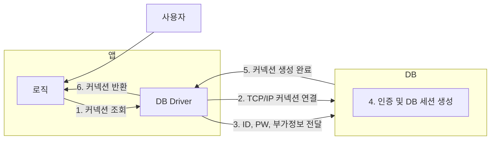
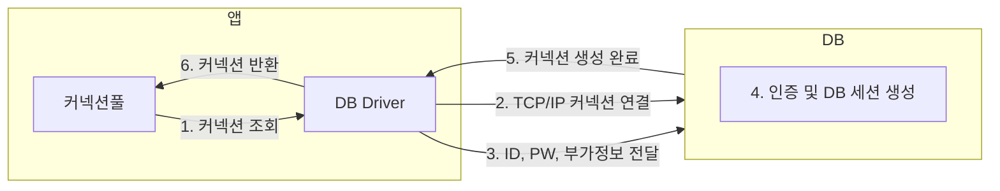
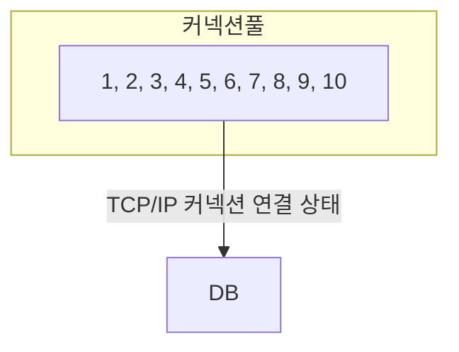
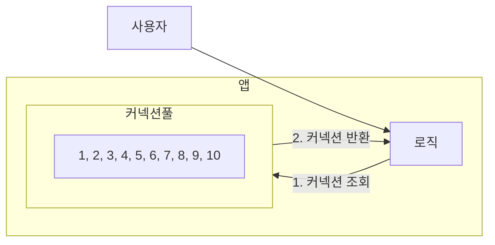
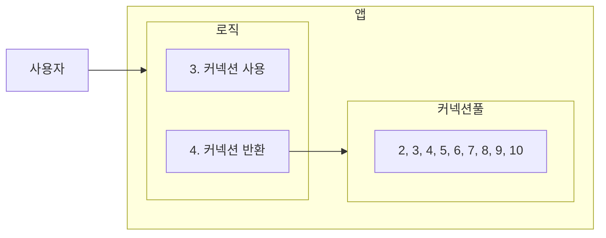
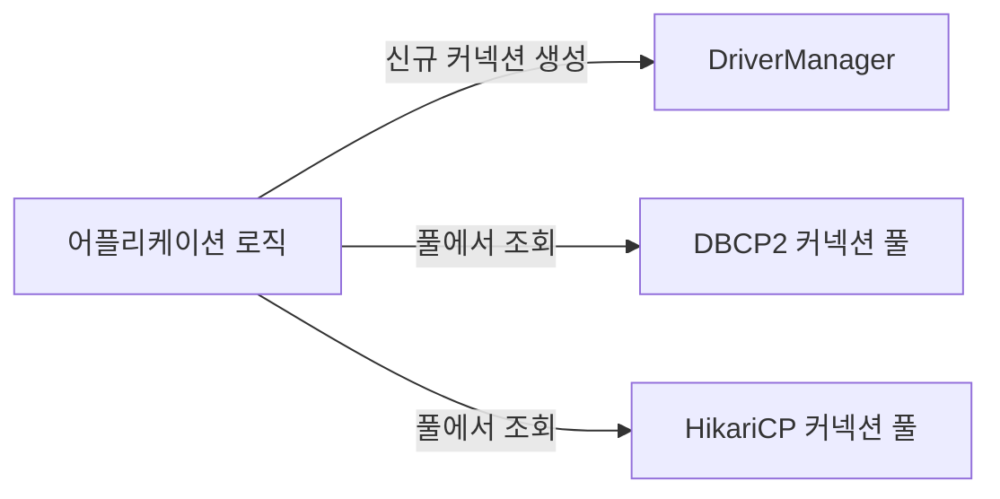
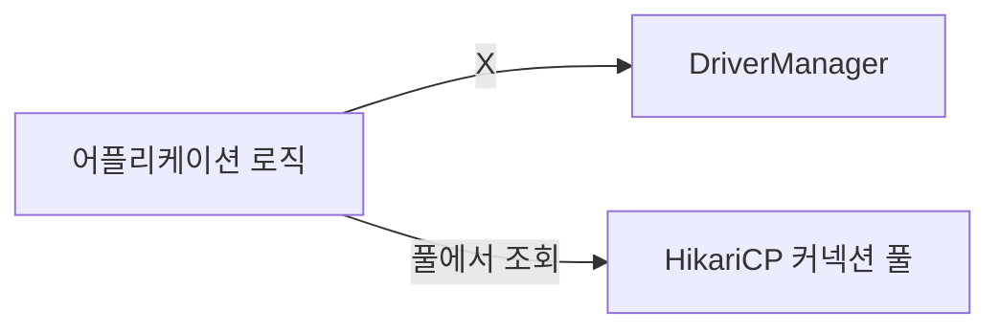
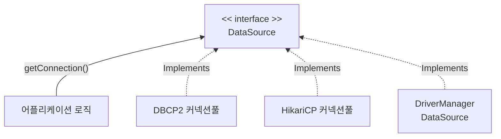

## 커넥션 풀 이해



앞서 [[JDBC 이해]]에서는 `JDBC`가 제공하는 `DriverManager`를 통해서 요청마다 매번 커넥션을 획득 했었다.

이 커넥션 획득 과정은 다음과 같다.

1. 어플리케이션 로직은 DB 드라이버를 통해 커넥션을 조회한다.
2. DB 드라이버는 DB와 `TCP/IP` 커넥션을 연결한다. 이 과정에서 `3 way handshake`같은 `TCP/IP` 연결을 위한 네트워크 동작이 발생한다.
3. DB 드라이버는 `TCP/IP` 커넥션이 연결되면 ID, PW와 기타 부가정보를 DB에 전달한다.
4. DB는 ID, PW를 통해 내부 인증을 완료하고 내부에 DB 세션을 생성한다.
5. DB는 커넥션 생성이 완료되었다는 응답을 보낸다.
6. DB 드라이버는 커넥션 객체를 생성해서 클라이언트에 반환한다.

이렇게 커넥션을 새로 만드는 일은 과정도 복잡하고 시간도 많이 소모 되는 일이다. DB는 물론이고 어플리케이션 서버에서도 `TCP/IP` 커넥션을 새로 생성하기 위한 리소스를 매번 사용해야 한다.

진짜 문제는 고객이 어플리케이션을 사용할 때 SQL을 실행하는 시간 뿐만 아니라 커넥션을 새로 만드는 시간이 추가되기 때문에 결과적으로 응답 속도에 영향을 준다.

> 데이터베이스마다 커넥션을 생성하는 시간은 조금씩 다르다. 시스템 상황마다 다르지만 MySQL 계열은 수 ms(밀리초) 정도로 매우 빨리 커넥션을 확보할 수 있다. 반면에 수십 밀리초 이상 걸리는 데이터베이스들도 있다.

이런 커넥션 획득 과정의 복잡함과 시간 낭비를 해결하는 아이디어가 바로 커넥션을 미리 생성해두고 사용하는 커넥션 풀이라는 방법이다. 커넥션 풀은 이름 그대로 커넥션을 관리하는 [[풀]](Pool)이다.

#### 커넥션 풀 초기화



- 어플리케이션을 시작하는 시점에 커넥션 풀은 필요한 만큼 커넥션을 미리 확보해서 풀에 보관한다.
- 보통 얼마나 보관할 지는 서비스의 특징과 서버 스펙에 따라 다르지만 기본 값은 보통 10개이다.

#### 커넥션 풀의 연결 상태



- 커넥션 풀에 들어 있는 커넥션들은 `TCP/IP`로 지속적으로 DB와 커넥션이 연결되어 있는 상태이기 때문에 언제든지 즉시 SQL을 DB에 전달할 수 있다.

#### 커넥션 풀 사용 1



- 어플리케이션 로직에서 이제는 DB 드라이버를 통해 새로운 커넥션을 획득하는 것이 아니라, 커넥션 풀에서 커넥션을 가져와 사용한다.
- 커넥션 풀을 통해 이미 생성되어 있는 커넥션을 객체 참조로 그냥 가져다 쓰기만 하면 되는 것이다.
- 커넥션 풀에 커넥션을 요청하면 커넥션 풀은 자신이 가지고 있는 커넥션 중에 하나를 반환한다.

#### 커넥션 풀 반환



- 어플리케이션 로직은 커넥션을 사용해서 SQL을 데이터베이스에 전달하고 그 결과를 받아서 처리한다.
- 커넥션을 모두 사용하고 나면 이제는 커넥션을 종료하는 것이 아니라, 다음에 다시 사용할 수 있도록 해당 커넥션을 그대로 커넥션 풀에 반환한다.
- 주의할 점은 커넥션을 종료하여 `TCP/IP` 연결을 끊는 것이 아니라, 커넥션과 DB가 `TCP/IP`로 연결이 유지 되어 있는 상태로 커넥션 풀에 반환 해야 한다는 것이다.

> [!summary] 커넥션 풀 정리
>
> - 적절한 커넥션 풀 숫자는 서비스의 특징과 서버 스펙, DB 서버 스펙에 따라 다르기 때문에 성능 테스트를 통해서 정해야 한다.
> - 커넥션 풀은 서버당 최대 커넥션 수를 제한할 수 있다. 따라서 DB에 무한정 연결이 생성되는 것을 막아줄 수 있다.
> - 커넥션 풀은 얻는 이점이 매우 크기 때문에 **실무에서는 항상 기본으로 사용**한다.
> - 커넥션 풀은 개념적으로 단순해서 직접 구현할 수 있지만, 사용도 편리하고 성능도 뛰어난 오픈소스 커넥션 풀이 많기 때문에 오픈소스를 사용하는 것이 좋다.
> - 대표적인 커넥션 풀 오픈 소스는 `commons-dbcp2`, `tomcat-jdbc pool`, `HikariCP`등이 있다.
> - 성능과 사용의 편리함 측면에서 최근에는 `hikariCP`를 주로 사용한다. 스프링 부트 2.0부터는 기본 커넥션 풀로 `hikariCP`를 제공한다. 성능, 사용의 편리함, 안정성 측면에서 이미 검증이 되었기 때문에 커넥션 풀을 사용할 때는 고민할 것 없이 `hikariCP`를 사용하면 된다.

## 데이터소스 이해

#### 커넥션을 획득하는 다양한 방법



커넥션은 위 그림처럼 다양한 방법으로 획득할 수 있다는 것을 학습했다.

#### DriverManager를 통해 커넥션을 획득하다가 커넥션 풀로 변경시 문제



그런데 앞서 `JDBC`로 개발한 어플리케이션처럼 `DriverManager`를 통해서 커넥션을 획득하다가, 요구사항 변경등으로 인해 커넥션 풀을 사용하는 방법으로 변경해야 된다면 어떻게 해야할까?

위 그림처럼 변경하기 위해서는 현재 어플리케이션의 코드도 변경해야 한다. 의존관계가 `DriverManager`에서 `HikariCP`로 변경되기 때문이다. 물론 둘의 사용 방법도 조금씩 다를 것이다.

#### 커넥션을 획득하는 방법을 추상화



- 그림과 같이, 자바에서는 이런 문제를 해결하기 위해 `javax.sql.DataSource`라는 인터페이스를 제공한다.
- `DataSource`는 **커넥션을 획득하는 방법을 추상화**하는 인터페이스다.
- 이 인터페이스의 핵심 기능은 커넥션 조회 하나이다. (다른 일부 기능도 있지만 크게 중요하지 않다.)

```java title="DataSource 핵심 기능"
public interface DataSource {
	Connection getConnection() throws SQLException;
}
```

> [!summary] 정리
>
> - 대부분의 커넥션 풀은 `DataSource` 인터페이스를 이미 구현해두었다. 따라서 개발자는 `DBCP2`, `HikariCP`의 코드를 직접 의존하는 것이 아니라 `DataSource` 인터페이스에만 의존하도록 어플리케이션 로직을 작성하면 된다.
> - 커넥션 풀 구현 기술을 변경하고 싶으면, 해당 구현체로 갈아 끼기만 하면 된다.
> - `DriverManager`는 `DataSource` 인터페이스를 사용하지 않는다. 따라서 `DriverManager`는 직접 사용해야 한다. 따라서 `DriverManager`를 사용하다가 `DataSource` 인터페이스 구현체를 사용하도록 변경하려면 관련 코드를 다 고쳐야 한다. 이런 문제를 해결하기 위해 스프링은 `DriverManager`도 `DataSource`를 통해서 사용할 수 있도록 `DriverManagerDataSource`라는 구현체를 제공한다.
> - 자바는 `DataSource`를 통해 커넥션을 획득하는 방법을 추상화했다. 이제 어플리케이션 로직은 `DataSource` 인터페이스에만 의존하면 된다. 덕분에 `DriverManagerDataSource`를 통해서 `DriverManager`를 사용하다가 커넥션 풀을 사용하도록 코드를 변경해도 어플리케이션 로직은 변경하지 않아도 된다.

## 데이터소스 예제 1 - DriverManager

`DriverManager`와 `DataSource` 인터페이스를 구현한 `DriverManagerDataSource`의 차이를 알아보기 위해 다음과 같이 테스트를 작성한다.

```java
@Slf4j
public class ConnectionTest {
    @Test
    void driverManager() throws SQLException {
        Connection con1 = DriverManager.getConnection(URL, USERNAME, PASSWORD);
        Connection con2 = DriverManager.getConnection(URL, USERNAME, PASSWORD);
        log.info("connection = {}, class = {}", con1, con1.getClass());
        log.info("connection = {}, class = {}", con2, con2.getClass());
    }

    @Test
    void driverManagerDataSource() throws SQLException {
        DataSource dataSource = new DriverManagerDataSource(URL, USERNAME, PASSWORD);
        useDataSource(dataSource);
    }

    private void useDataSource(DataSource dataSource) throws SQLException {
        Connection con1 = dataSource.getConnection();
        Connection con2 = dataSource.getConnection();

        log.info("connection = {}, class = {}", con1, con1.getClass());
        log.info("connection = {}, class = {}", con2, con2.getClass());
    }
}
```

코드를 살펴보면 `DataSource`를 구현한 `DriverManagerDataSource`를 다형성을 통해 `userDataSource(DataSource dataSource)`로 호출하고 있다.

- 기존의 `DriverManager`는 커넥션을 획득 할 때마다 `URL`, `USERNAME`, `PASSWORD`를 전달해야 한다.
- 반면에 `DriverManagerDataSource`는 생성하는 시점과 커넥션을 획득하는 시점이 다르다.

쉽게 말해서 `DataSource`를 사용하는 방식은 처음 객체를 생성할 때만 필요한 파라미터를 넘겨주고, 커넥션을 획득할 때는 `DataSource` 인터페이스에 의존해서 단순히 `getConnection()`만 호출하면 된다.

> [!warning] DriverManagerDataSource
> `DriverManagerDataSource`를 사용해도 내부적으로는 `DriverManager`를 통해서 커넥션을 획득한다. 따라서 커넥션 풀과는 아무 관계가 없다.
>
> 즉, 호출마다 새로운 커넥션을 획득하는 것이다.

**설정과 사용의 분리**

- 설정: `DataSource`를 만들고 필요한 속성들을 사용해서 `URL`, `USERNAME`, `PASSWORD`같은 부분을 입력하는 것을 의미한다. 이렇게 설정과 관련된 속성들은 한 곳에 있는 것이 향후 변경에 더 유연하게 대처할 수 있다.
- 사용: 설정은 신경쓰지 않고, `DataSource`의 `getConnection()`만 호출해서 사용하면 된다.

이 부분이 작아보이지만 큰 차이를 만들어내는데, 필요한 데이터를 `DataSource`가 만들어지는 시점에 미리 다 설정해두면 `DataSource`를 사용하는 곳에서는 단순히 `getConnection()`만 호출하면 되므로 `URL`, `USERNAME`, `PASSWORD`같은 속성들에 의존하지 않아도 된다.

쉽게 이야기해서 `Repository` 같은 데이터베이스와 직접 소통하는 계층에서 `DataSource`만 의존하고 설정에 필요한 속성은 몰라도 된다.

## 데이터소스 예제 2 - 커넥션 풀

이번에는 `DataSource`를 통해 커넥션 풀을 사용하는 예제를 알아본다. 예제에서는 스프링이 기본으로 제공하는 `HikariCP`를 사용한다.

```java
@Test
void dataSourceConnectionPool() throws SQLException, InterruptedException {
    HikariDataSource dataSource = new HikariDataSource();
    dataSource.setJdbcUrl(URL);
    dataSource.setUsername(USERNAME);
    dataSource.setPassword(PASSWORD);
    dataSource.setMaximumPoolSize(10);
    dataSource.setPoolName("MyPool");

    useDataSource(dataSource);
    Thread.sleep(1000);
}
```

- `HikariDataSource`는 `DataSource` 인터페이스의 구현체이다.
- 커넥션 풀 최대 사이즈를 `setMaximumPoolSize(10)`을 통해 10으로 설정했다.
- 커넥션 풀의 이름을 지정할 수 있다. `setPoolName("MyPool")`로 지정했다.
- 커넥션 풀에서 커넥션을 생성하는 작업은 어플리케이션 실행 속도에 영향을 주지 않기 위해 별도의 쓰레드에서 작동한다. 별도의 쓰레드에서 동작하기 때문에 커넥션을 생성하는 동안 테스트 코드가 먼저 종료되어 버린다. 예제처럼 `Thread.sleep`을 통해 대기 시간을 주어야 커넥션 풀에 커넥션이 생성되는 로그를 확인할 수 있다.

#### HikariConfig

`HikariDataSource`는 이 `HikariConfig`을 상속 받아 설정하는 데에 사용한다. 여러 설정 메서드가 존재한다.

#### MyPool connection adder

별도의 쓰레드를 사용해서 커넥션 풀에 커넥션을 채우고 있는 것을 확인할 수 있다. 이 쓰레드는 커넥션 풀에 커넥션을 최대 풀 수 (10)까지 채운다.

왜 별도의 쓰레드를 사용해서 커넥션 풀에 커넥션을 채우는 것일까?

커넥션 풀에 커넥션을 채우는 것은 상대적으로 오래 걸리는 일이다. 어플리케이션을 실행할 때 커넥션 풀을 채울 때 까지 마냥 대기하고 있다면 어플리케이션 실행 시간이 늦어진다.

따라서 이렇게 별도의 쓰레드를 사용해서 커넥션 풀을 채워야 어플리케이션 실행 시간에 영향을 주지 않는다.

```
HikariPool -- MyPool - Added connection conn8: url=jdbc:h2:tcp://localhost/~/test user=SA
HikariPool -- MyPool - After adding stats (total=9, active=2, idle=7, waiting=0)
HikariPool -- MyPool - Added connection conn9: url=jdbc:h2:tcp://localhost/~/test user=SA
HikariPool -- MyPool - After adding stats (total=10, active=2, idle=8, waiting=0)
```

#### 커넥션 풀에서 커넥션 획득

커넥션 풀에서 커넥션을 획득하고 그 결과를 출력했다. 여기서는 커넥션 풀에서 커넥션을 2개 획득하고 반환하지는 않았다.

따라서 풀에 있는 10개의 커넥션 중에 2개를 가지고 있는 상태다. 그래서 마지막 로그를 살펴보면 다음과 같이 `active=2`, 풀에서 대기중인 유휴 커넥션 `idle=8`인 것을 확인할 수 있다.

```
HikariPool -- MyPool - Connection not added, stats (total=10, active=2, idle=8, waiting=0)
```

#### 커넥션 풀 테스트

만약 풀에 커넥션이 10개인데, 11개의 커넥션을 요청하면 어떻게 동작할까?

```java
private void useDataSource(DataSource dataSource) throws SQLException {
    Connection con1 = dataSource.getConnection();
    Connection con2 = dataSource.getConnection();
    Connection con3 = dataSource.getConnection();
    Connection con4 = dataSource.getConnection();
    Connection con5 = dataSource.getConnection();
    Connection con6 = dataSource.getConnection();
    Connection con7 = dataSource.getConnection();
    Connection con8 = dataSource.getConnection();
    Connection con9 = dataSource.getConnection();
    Connection con10 = dataSource.getConnection();
    Connection con11 = dataSource.getConnection();
    log.info("connection={}, class={}", con1, con1.getClass());
    log.info("connection={}, class={}", con2, con2.getClass());
}
```

테스트 코드를 실행해보면, 10개 까지는 문제 없이 커넥션을 획득한다. 그런데 코드를 살펴보면 커넥션을 획득하기만 하지 반환은 하지 않고 있다.

커넥션 풀은 기본적으로 사용 후 반납하여 재사용하는 개념이므로 11번째 커넥션 획득 요청은 다음의 로그처럼 대기 상태, `waiting`인 상태로 대기하게 된다.

```
HikariPool -- MyPool - Connection not added, stats (total=10, active=10, idle=0, waiting=1)
```

그러나 이 대기 상태도 오래 지속되지 않는다. 얼마 안가 다음과 같은 로그가 출력되며 획득 요청이 타임아웃 된다.

```
HikariPool -- MyPool - Timeout failure stats (total=10, active=10, idle=0, waiting=0)
```

`HikariCP`의 깃허브 README를 읽어보면 커넥션 타임아웃의 기본 설정 값을 알 수 있다.

> ⏳`connectionTimeout`
>
> This property controls the maximum number of milliseconds that a client (that's you) will wait for a connection from the pool. If this time is exceeded without a connection becoming available, a SQLException will be thrown. Lowest acceptable connection timeout is 250 ms. *Default: 30000 (30 seconds)*
>
> \- [Github HikariCP](https://github.com/brettwooldridge/HikariCP)

즉 커넥션 획득 요청이 30초동안 이루어지지 않으면 타임아웃으로 요청이 거절된다.

> [!tip] HikariCP 상태
> `HikariCP`의 커넥션 상태는 다음의 4가지로 구분 된다.
>
> - total: 총 커넥션 수
> - active: 사용 중 커넥션
> - idle: 유휴 상태 커넥션
> - waiting: 커넥션 획득 대기

## 어플리케이션에 데이터소스 적용

앞서 구현한 `MemberRepositoryV0`을 `DataSource`를 적용해서 개선한다.

```java title="MemberRepositoryV1.java"
/**
 * JDBC - DataSource 사용, JdbcUtils 사용
 */
@Slf4j
@RequiredArgsConstructor
public class MemberRepositoryV1 {
    private final DataSource dataSource;

    public Member save(Member member) throws SQLException {
        String sql = "INSERT INTO member(member_id, money) VALUES(?, ?)";

        Connection connection = null;
        PreparedStatement statement = null;

        try {
            connection = getConnection();
            statement = connection.prepareStatement(sql);
            statement.setString(1, member.getMemberId());
            statement.setInt(2, member.getMoney());

            statement.executeUpdate();

            return member;
        } catch (SQLException e) {
            log.error("db error", e);
            throw e;
        } finally {
            close(connection, statement, null);
        }
    }

    public void delete(String memberId) throws SQLException {
        String sql = "DELETE FROM member WHERE member_id = ?";
        Connection connection = null;
        PreparedStatement statement = null;

        try {
            connection = getConnection();
            statement = connection.prepareStatement(sql);
            statement.setString(1, memberId);

            int affectedRows = statement.executeUpdate();
            log.info("affectedRows = {}", affectedRows);
        } catch (SQLException e) {
            log.error("db error", e);
            throw e;
        } finally {
            close(connection, statement, null);
        }
    }

    public void update(String memberId, int money) throws SQLException {
        String sql = "UPDATE member SET money = ? WHERE member_id = ?";
        Connection connection = null;
        PreparedStatement statement = null;

        try {
            connection = getConnection();
            statement = connection.prepareStatement(sql);
            statement.setInt(1, money);
            statement.setString(2, memberId);

            int affectedRows = statement.executeUpdate();
            log.info("affectedRows = {}", affectedRows);
        } catch (SQLException e) {
            log.error("db error", e);
            throw e;
        } finally {
            close(connection, statement, null);
        }
    }

    public Member findById(String memberId) throws SQLException {
        String sql = "SELECT * FROM member WHERE member_id = ?";
        Connection connection = null;
        PreparedStatement statement = null;
        ResultSet resultSet = null;

        try {
            connection = getConnection();
            statement = connection.prepareStatement(sql);
            statement.setString(1, memberId);
            resultSet = statement.executeQuery();

            if (resultSet.next()) {
                Member member = new Member();
                member.setMemberId(resultSet.getString("member_id"));
                member.setMoney(resultSet.getInt("money"));
                return member;
            } else {
                throw new NoSuchElementException("Member not found memberId = " + memberId);
            }

        } catch (SQLException e) {
            log.info("error", e);
            throw e;
        } finally {
            close(connection, statement, resultSet);
        }
    }

    private void close(Connection connection, Statement statement, ResultSet resultSet) {
        JdbcUtils.closeResultSet(resultSet);
        JdbcUtils.closeStatement(statement);
        JdbcUtils.closeConnection(connection);
    }

    private Connection getConnection() throws SQLException {
        Connection connection = dataSource.getConnection();
        log.info("getConnection = {}, class = {}", connection, connection.getClass());

        return connection;
    }
}
```

- 외부에서 `DataSource`를 의존관계 주입 받아서 사용한다. 이제 직접 만든 `DBConnectionUtil`을 사용하지 않아도 된다.
- 스프링은 `JDBC`를 편리하게 다룰 수 있는 `JdbcUtils`라는 편의 메서드를 제공한다.
  - `JdbcUtils`의 편의 메서드를 사용해 커넥션을 편리하게 닫는다.
  - `JdbcUtils.closeResultSet(resultSet)`
  - `JdbcUtils.closeStatement(statement)`
  - `JdbcUtils.closeConnection(connection)`

기존의 테스트 코드를 복사해서 `MemberRepositoryV1Test`를 만든다.

```java
@Slf4j
class MemberRepositoryV1Test {

    MemberRepositoryV1 repository;

    @BeforeEach
    void beforeEach() {
        // 기본 DriverManager - 항상 새로운 커넥션 획득
        DriverManagerDataSource dataSource = new DriverManagerDataSource(URL, USERNAME, PASSWORD);
        repository = new MemberRepositoryV1(dataSource);
    }

    @Test
    void crud() throws SQLException {
        String memberId = "memberV0";

        // save
        Member member = new Member(memberId, 10000);
        repository.save(member);

        // findById
        Member findMember = repository.findById(memberId);
        assertThat(findMember).isEqualTo(member);

        // update member's money to be 20_000
        repository.update(member.getMemberId(), 20000);
        Member affectedMember = repository.findById(memberId);
        assertThat(affectedMember.getMoney()).isEqualTo(20_000);

        // delete
        repository.delete(member.getMemberId());
        assertThatThrownBy(() ->
                repository.findById(member.getMemberId()))
                .isInstanceOf(NoSuchElementException.class);
    }
}
```

`@BeforeEach`를 통해 각 테스트 케이스가 작동하기 전에 `DriverManagerDataSource`를 통해 `DataSource`를 생성하고 `MemberRepositoryV1`에 의존 관계를 주입 한다.

그런데 `DriverManagerDataSource`는 항상 새로운 커넥션을 생성하고 획득하기 때문에 성능상 단점이 존재한다.

이번에는 `HikariCP`를 사용해보자, 위 처럼 `@BeforeEach`를 통해 `DataSource`를 생성하고 의존 관계를 주입하고 있기 때문에 손쉽게 구현체를 변경할 수 있다.

따라서 `beforeEach()`만 다음과 같이 변경한다.

```java
@BeforeEach
void beforeEach() {
    // 기본 DriverManager - 항상 새로운 커넥션 획득
    // DriverManagerDataSource dataSource = new DriverManagerDataSource(URL, USERNAME, PASSWORD);

    // HikariCP - 커넥션 풀링
    HikariDataSource dataSource = new HikariDataSource();
    dataSource.setJdbcUrl(URL);
    dataSource.setUsername(USERNAME);
    dataSource.setPassword(PASSWORD);

    repository = new MemberRepositoryV1(dataSource);
}
```

이제 실행 결과를 분석해보자.

```
HikariPool-1 - Start completed.
getConnection = HikariProxyConnection@1233505227 wrapping conn0: url=jdbc:h2:tcp://localhost/~/test user=SA, class = class com.zaxxer.hikari.pool.HikariProxyConnection
affectedRows = 1
getConnection = HikariProxyConnection@1200048933 wrapping conn0: url=jdbc:h2:tcp://localhost/~/test user=SA, class = class com.zaxxer.hikari.pool.HikariProxyConnection
affectedRows = 1
```

affectedRows 로그가 출력되는 것을 보니 잘 작동하고 있다. 테스트 코드 자체가 순차적으로 커넥션을 획득하고, 반환하고 있다.

따라서 `conn0`이라는 커넥션만 계속 사용하고, 반환하고, 다시 사용하고 반환하는 것이다.

```java title="MemberRepositoryV1.java"
private void close(Connection connection, Statement statement, ResultSet resultSet) {
    JdbcUtils.closeResultSet(resultSet);
    JdbcUtils.closeStatement(statement);
    JdbcUtils.closeConnection(connection);
}
```

앞서 작성한 `MemberRepositoryV1`의 `close()`이다. 커넥션 풀을 사용하는 경우에 `JdbcUtils`를 통해 `close()`를 호출하면 이 커넥션을 닫는게 아니라, 커넥션 풀에 다시 반환한다.

따라서 웹 어플리케이션에서 동시에 여러 요청이 들어오면 여러 쓰레드에서 커넥션 풀을 다양하게 가져가는 상황을 확인할 수 있다.

> [!summary] 의존 관계 주입
> `DriverManagerDataSource`에서 `HikariDataSource`로 변경해도 `MemberRepositoryV1`의 코드는 전혀 변경하지 않아도 된다. `MemberRepositoryV1`은 `DataSource` 인터페이스에만 의존하기 때문이다.
>
> 의존 관계 주입에 대한 내용은 블로그 내의 [[컴포넌트 스캔과 의존관계 자동 주입]]에서 확인할 수 있다.

---

References: 김영한의 스프링 DB 1편

Links to this page: [[JDBC 이해]], [[풀]], [[컴포넌트 스캔과 의존관계 자동 주입]]
