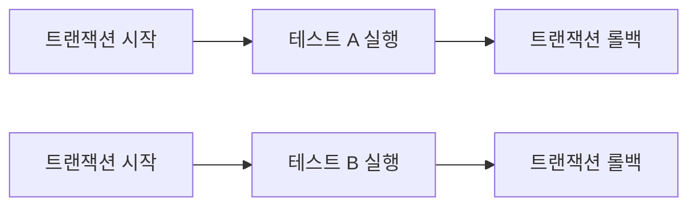

## 테스트 - 데이터베이스 연동

데이터 접근 기술에 대해서 더 알아보기 전에 데이터베이스에 연동하는 테스트에 대해서 알아본다. 데이터 접근 기술은 실제 데이터베이스에 접근해서 데이터를 잘 저장하고 조회할 수 있는지 확인하는 것이 필요하다.

지금부터 테스트를 실행할 때 실제 데이터베이스를 연동해서 진행해본다. 앞서 개발한 `ItemRepositoryTest`를 통해서 테스트를 진행한다.

테스트를 실행하기 전에 먼저 지금까지 설정한 `application.properties`를 확인해보자.

```properties title="main/application.properties"
spring.profiles.active=local
spring.datasource.url=jdbc:h2:tcp://localhost/~/test
spring.datasource.username=sa
spring.datasource.password=
logging.level.org.springframework.jdbc=debug
```

다음으로 `test/application.properties`를 확인해본다.

```properties title="test/application.properties"
spring.profiles.active=test
```

테스트 케이스는 `src/test` 경로에 있기 때문에 실행하면 `src/test`에 있는 `application.properties` 파일이 우선 순위를 가지고 실행된다.

그런데 문제는 테스트용 설정에는 `spring.datasource.url`과 같은 데이터베이스 연결 설정이 없다는 점이다. 테스트 케이스에서도 데이터베이스에 접속할 수 있게 `test/application.properties`를 다음과 같이 수정하자.

```properties title="test/application.properties"
spring.profiles.active=test
spring.datasource.url=jdbc:h2:tcp://localhost/~/test
spring.datasource.username=sa
spring.datasource.password=
logging.level.org.springframework.jdbc=debug
```

## 테스트 실행 - 로컬 DB

`ItemRepositoryTest` 테스트 코드를 확인해보자.

```java
@SpringBootTest
class ItemRepositoryTest {
```

`ItemRepositoryTest`는 `@SpringBootTest`를 사용한다. `@SpringBootTest`는 `@SpringBootApplication`을 찾아서 설정으로 사용한다.

예를 들면 현재는 다음과 같은 `@SpringBootApplication`을 사용한다.

```java title="ItemServiceApplication.java"
@Import(JdbcTemplateV3Configure.class)
@SpringBootApplication(scanBasePackages = "hello.itemservice.web")
public class ItemServiceApplication {

    public static void main(String[] args) {
        SpringApplication.run(ItemServiceApplication.class, args);
    }

    @Bean
    @Profile("local")
    public TestDataInit testDataInit(ItemRepository itemRepository) {
        return new TestDataInit(itemRepository);
    }
}
```

따라서 현재 테스트를 실행하면, `ItemServiceApplication`에 적용된 설정을 가지고, 테스트를 실행하게 된다. 따라서 테스트도 현재 설정에 따라서 `JdbcTemplate`을 통해 실제 데이터베이스를 호출하게 된다.

먼저 테스트 코드 전체를 실행해본다.

```java
@SpringBootTest
class ItemRepositoryTest {

    @Autowired
    ItemRepository itemRepository;

    @AfterEach
    void afterEach() {
        //MemoryItemRepository 의 경우 제한적으로 사용
        if (itemRepository instanceof MemoryItemRepository) {
            ((MemoryItemRepository) itemRepository).clearStore();
        }
    }

    @Test
    void save() {
        //given
        Item item = new Item("itemA", 10000, 10);

        //when
        Item savedItem = itemRepository.save(item);

        //then
        Item findItem = itemRepository.findById(item.getId()).get();
        assertThat(findItem).isEqualTo(savedItem);
    }

    @Test
    void updateItem() {
        //given
        Item item = new Item("item1", 10000, 10);
        Item savedItem = itemRepository.save(item);
        Long itemId = savedItem.getId();

        //when
        ItemUpdateDto updateParam = new ItemUpdateDto("item2", 20000, 30);
        itemRepository.update(itemId, updateParam);

        //then
        Item findItem = itemRepository.findById(itemId).get();
        assertThat(findItem.getItemName()).isEqualTo(updateParam.getItemName());
        assertThat(findItem.getPrice()).isEqualTo(updateParam.getPrice());
        assertThat(findItem.getQuantity()).isEqualTo(updateParam.getQuantity());
    }

    @Test
    void findItems() {
        //given
        Item item1 = new Item("itemA-1", 10000, 10);
        Item item2 = new Item("itemA-2", 20000, 20);
        Item item3 = new Item("itemB-1", 30000, 30);

        itemRepository.save(item1);
        itemRepository.save(item2);
        itemRepository.save(item3);

        //둘 다 없음 검증
        test(null, null, item1, item2, item3);
        test("", null, item1, item2, item3);

        //itemName 검증
        test("itemA", null, item1, item2);
        test("temA", null, item1, item2);
        test("itemB", null, item3);

        //maxPrice 검증
        test(null, 10000, item1);

        //둘 다 있음 검증
        test("itemA", 10000, item1);
    }

    void test(String itemName, Integer maxPrice, Item... items) {
        List<Item> result = itemRepository.findAll(new ItemSearchCond(itemName, maxPrice));
        assertThat(result).containsExactly(items);
    }
}
```

테스트 코드를 실행해보면 `updateItem()`, `save()`는 테스트에 통과하지만 `findItems()`는 실패한다.

**실패 원인**

왜 이런 문제가 발생하는 것일까?

혹시 테스트를 실행할 때 `TestDataInit`이 실행되는 것은 아닐까? 이 문제는 아니다. `TestDataInit`은 프로필이 `local`일 때만 동작한다.

문제는 H2 데이터베이스가 이미 과거에 서버를 실행하면서 저장했던 데이터가 보관되어 있기 때문이다. 이 데이터가 현재 테스트에 영향을 주고 있다.

## 테스트 - 데이터베이스 분리

로컬에서 사용하는 어플리케이션 서버와 테스트에서 같은 데이터베이스를 사용하고 있으므로 테스트에서 문제가 발생한다.

이런 문제를 해결하려면 테스트를 다른 환경과 철저하게 분리해야 한다.

가장 간단한 방법은 테스트 전용 데이터베이스를 별도로 운영하는 것이다.

- `jdbc:h2:tcp://localhost/~/test` local에서 접근하는 서버 전용 데이터베이스
- `jdbc:h2:tcp://localhost/~/testcase` test 케이스에서 사용하는 전용 데이터베이스

H2로 `testcase` 서버를 생성하고 다음의 SQL을 실행해 `item` 테이블을 생성한다.

```sql
DROP TABLE IF EXISTS item CASCADE;
CREATE TABLE item
(
	id bigint GENERATED BY DEFAULT AS IDENTITY,
	item_name varchar(10),
	price integer,
	quantity integer,
	PRIMARY KEY (id)
);
```

이제 앞서 설정했던 접속 정보를 변경한다. 참고로 `test`에 있는 `application.properties`만 변경해야 한다.

```properties title="test/application.properties"
spring.profiles.active=test
spring.datasource.url=jdbc:h2:tcp://localhost/~/testcase
spring.datasource.username=sa
spring.datasource.password=
logging.level.org.springframework.jdbc=debug
```

그런데 가장 중요한 이유로 이렇게까지 하는 이유가 무엇일까?

테스트에서 매우 중요한 원칙은 다음과 같다.

- 테스트는 다른 테스트와 격리되어 실행되어야 한다.
- 테스트는 반복해서 실행할 수 있어야 한다.

물론 테스트가 끝날 때 마다 추가한 데이터에 삭제 SQL을 사용해도 되겠지만, 이 방법도 궁극적인 해결책은 아니다. 만약 테스트 과정에서 이미 데이터를 추가 했는데, 테스트가 실행되는 도중에 예외가 발생하거나 어플리케이션이 종료되어 버려서 테스트 종료 시점에 삭제 SQL을 실행하지 못할 수도 있다.

이런 문제를 어떻게 해결할 수 있을까?

## 테스트 - 데이터 롤백

이 때 도움이 되는 것이 바로 [[트랜잭션 이해|트랜잭션]]이다. 테스트가 끝나고 나서 트랜잭션을 강제로 롤백해버리면 데이터가 깔끔하게 제거된다.

테스트를 하면서 이미 데이터를 저장했는데, 중간에 테스트가 실패해서 롤백을 호출하지 못해도 괜찮다. 트랜잭션을 커밋하지 않았기 때문에 데이터베이스에 해당 데이터가 반영되지 않는다.

이렇게 트랜잭션을 활용하면 테스트가 끝나고 나서 데이터를 깔끔하게 원래 상태로 되돌릴 수 있다.

예를 들어서 다음 순서와 같이 각각의 테스트 실행 직전에 트랜잭션을 시작하고, 테스트 실행 직후 트랜잭션을 롤백해야 한다. 그래야 다음 테스트에 데이터로 인한 영향을 주지 않는다.



테스트는 각각의 테스트 실행 전 후로 동작하는 `@BeforeEach`, `@AfterEach`라는 편리한 기능을 제공한다. 테스트에 트랜잭션과 롤백을 적용하기 위해 다음 코드를 추가하자.

```java
@Autowired
PlatformTransactionManager transactionManager;
TransactionStatus status;

@BeforeEach
void beforeEach() {
    status = transactionManager.getTransaction(new DefaultTransactionDefinition());
}

@AfterEach
void afterEach() {
    //MemoryItemRepository 의 경우 제한적으로 사용
    if (itemRepository instanceof MemoryItemRepository) {
        ((MemoryItemRepository) itemRepository).clearStore();
    }

    transactionManager.rollback(status);
}
```

트랜잭션 매니저는 `PlatformTransactionManager`를 주입 받아서 사용하면 된다. 스프링 부트는 자동으로 적절한 트랜잭션 매니저를 스프링 빈으로 등록해준다. [[스프링 부트의 자동 리소스 등록|스프링 부트의 자동 리소스 등록]]을 참고하자.

`@BeforeEach`는 각각의 테스트 케이스를 실행하기 직전에 호출된다. 따라서 여기서 트랜잭션을 시작하면 된다. 그러면 각각의 테스트를 트랜잭션 범위 안에서 실행할 수 있다.

`@AfterEach`는 각각의 테스트 케이스가 완료된 후에 호출된다. 따라서 여기서 트랜잭션을 롤백하면 된다. 그러면 데이터를 트랜잭션 실행 전 상태로 복구할 수 있다.

트랜잭션을 시작하고 변경 SQL을 실행하면 임시로 데이터가 저장된다. 그리고 이 임시로 저장된 데이터는 다른 커넥션(세션)에서는 조회가 되지 않는다. 따라서 각각의 테스트에 영향을 주지 않게 된다.

`ItemRepositoryTest`를 실행해보면 여러번 반복해서 실행해도 테스트가 성공하는 것을 확인할 수 있다.

롤백의 결과도 로그로 출력된다.

```
Rolling back JDBC transaction on Connection [HikariProxyConnection@1281205497 wrapping conn0: url=jdbc:h2:tcp://localhost/~/testcase user=SA]
```

## 테스트 - @Transactional

스프링은 테스트 데이터 초기화를 위해 트랜잭션을 적용하고 롤백하는 방식을 `@Transactional` 어노테이션 하나로 깔끔하게 해결해준다.

이전에 테스트에 트랜잭션과 롤백을 위해 추가했던 코드를 모두 제거하고 다음과 같이 `ItemRepositoryTest` 클래스에 스프링이 제공하는 `@Transactional` 어노테이션을 적용한다.

```java
@SpringBootTest
@Transactional
class ItemRepositoryTest {
	...
}
```

여러 번 반복해서 테스트를 실행해도 통과하고, 결과 로그도 다음과 같이 동일하게 출력된다.

```
Rolling back JDBC transaction on Connection [HikariProxyConnection@2109182431 wrapping conn0: url=jdbc:h2:tcp://localhost/~/testcase user=SA]
```

#### @Transactional 원리

기본적으로 스프링이 제공하는 `@Transactional` 어노테이션은 로직이 성공적으로 수행되면 커밋하도록 동작한다. 반면 테스트에서 `@Transactional` 어노테이션은 아주 특별하게 동작한다.

이 `@Transactional`이 테스트에 있으면 스프링은 테스트를 트랜잭션 안에서 실행하고, 테스트가 끝나면 트랜잭션을 자동으로 롤백한다.

`findItems()` 테스트 케이스를 통해 작동 흐름을 살펴보자.

![[transaction-test-1.png]]

1. 테스트에 `@Transactional` 어노테이션이 테스트 메서드나 클래스에 있으면 먼저 트랜잭션을 시작한다.
2. 테스트 로직을 실행한다. 테스트가 끝날 때 까지 모든 로직은 트랜잭션 안에서 수행된다.
   - 트랜잭션은 기본적으로 전파되기 때문에, 리포지토리에서 사용하는 `JdbcTemplate`도 같은 트랜잭션을 사용한다.
3. 테스트 실행 중에 INSERT SQL을 사용해서 `item1`, `item2`, `item3`을 데이터베이스에 저장한다.
   - 물론 테스트가 리포지토리를 호출하고, 리포지토리는 `JdbcTemplate`를 사용해서 데이터를 저장한다.
4. 검증을 위해서 SELECT SQL로 데이터를 조회한다. 동기화 된 하나의 커넥션을 사용하기 때문에 앞서 저장한 `item1`, `item2`, `item3`이 조회 된다. 따라서 다른 테스트에서는 이 데이터가 조회되지 않는다.
   - 여기서 `assertThat()`으로 검증이 모두 끝난다.
5. `@Transactional`이 테스트에 있으면 테스트가 끝날 때 트랜잭션을 강제로 롤백한다.
6. 롤백에 의해 앞서 데이터베이스에 저장한 `item1`, `item2`, `item3`의 데이터가 제거된다.

> 테스트 케이스의 메서드나 클래스에 `@Transactional`을 직접 붙여서 사용할 때만 이렇게 동작한다.
>
> 그리고 트랜잭션을 테스트에서 시작하기 때문에 서비스나 리포지토리에 있는 `@Transactional`도 테스트에서 시작한 트랜잭션에 참여한다. (이 부분은 뒤에서 자세히 설명한다. 지금은 테스트에서 트랜잭션을 시작하면 테스트 실행이 종료될 때 까지 테스트가 실행하는 모든 코드가 같은 트랜잭션 범위에 들어간다고 이해하면 된다.)

> [!summary] 정리
>
> - 테스트에 `@Transactional` 어노테이션을 적용하면 테스트가 끝난 후 개발자가 직접 데이터를 삭제하지 않아도 되는 편리함을 제공한다.
> - 테스트 실행 중에 데이터를 등록하고 중간에 테스트가 강제로 종료되어도 걱정이 없다. 이 경우 트랜잭션을 커밋하지 않기 때문에, 데이터는 자동으로 롤백된다. (보통 데이터베이스 커넥션이 끊어지면 자동으로 롤백되어 버린다.)
> - 트랜잭션 범위 안에서(동기화된 동일한 커넥션을 범위라고 표현) 테스트를 진행하기 때문에 동시에 다른 테스트가 진행되어도 서로 영향을 주지 않는 장점이 있다.
>
> `@Transactional` 덕분에 아주 편리하게 다음 원칙을 지킬 수 있게 되었다.
>
> - 테스트는 다른 테스트와 격리되어야 한다.
> - 테스트는 반복해서 실행할 수 있어야 한다.

#### 강제로 커밋하기 - @Commit

`@Transactional`을 테스트에서 사용하면 테스트가 끝나면 바로 롤백되기 때문에 테스트 과정에서 저장한 모든 데이터가 사라진다. 이게 개발자의 의도라면 상관 없지만 가끔은 데이터베이스에 데이터가 잘 보관 되었는지 최종 결과를 눈으로 확인하고 싶을 때도 있다.

이럴 때는 다음과 같이 `@Commit`을 클래스 또는 메서드에 적용하면 테스트 종료 후 롤백 대신 커밋이 호출된다. 참고로 `@Rollback(value = false)`를 사용해도 된다.

```java
import org.springframework.test.annotation.Commit;

@Commit
@Transactional
@SpringBootTest
class ItemRepositoryTest {}
```

## 테스트 - 임베디드 모드 DB

테스트 케이스를 실행하기 위해서 별도의 데이터베이스를 설치하고 운영하는 것은 번잡한 작업이다. 단순히 테스트를 검증할 용도로만 사용하기 때문에 테스트가 끝나면 테스트용 데이터베이스가 필요하지 않다.

더 나아가서 테스트가 끝나면 데이터베이스 자체를 제거해도 된다.

**임베디드 모드**

H2 데이터베이스는 자바로 개발되어 있고, JVM 안에서 메모리 모드로 동작하는 특별한 기능을 제공한다. 그래서 어플리케이션을 실행할 때 H2 데이터베이스도 해당 JVM 메모리에 포함해서 함께 실행 할 수 있다.

데이터베이스를 어플리케이션에 **내장**해서 실행한다고 해서 임베디드 모드(Embedded mode)라고 한다. 물론 어플리케이션이 종료되면 임베디드 모드로 동작하는 H2 데이터베이스도 함께 종료되고 데이터도 모두 사라진다.

쉽게 이야기해서 어플리케이션에서 자바 메모리를 함께 사용하는 라이브러리처럼 동작하는 것이다.

#### 임베디드 모드 직접 사용

임베디드 모드를 직접 사용하는 방법은 다음과 같다.

```java
@Slf4j
@Import(JdbcTemplateV3Configure.class)
@SpringBootApplication(scanBasePackages = "hello.itemservice.web")
public class ItemServiceApplication {

    public static void main(String[] args) {
        SpringApplication.run(ItemServiceApplication.class, args);
    }

    @Bean
    @Profile("local")
    public TestDataInit testDataInit(ItemRepository itemRepository) {
        return new TestDataInit(itemRepository);
    }

    @Bean
    @Profile("test")
    public DataSource dataSource() {
        log.info("메모리 데이터베이스 초기화");
        HikariDataSource dataSource = new HikariDataSource();
        dataSource.setDriverClassName("org.h2.Driver");
        dataSource.setJdbcUrl("jdbc:h2:mem:db;DB_CLOSE_DELAY=-1");
        dataSource.setUsername("sa");
        dataSource.setPassword("");
        return dataSource;
    }
}
```

앞서 학습한 내용을 생각해보면, `@SpringBootTest` 어노테이션은 `@SpringBootApplication` 어노테이션이 적용된 클래스를 설정으로 사용한다고 했다.

그리고 `@Profile("test")`는 `application.properties`의 `spring.profiles.active` 옵션을 참조해서 실행한다. 따라서 프로필이 `test`인 경우에만 해당 `DataSource`를 빈으로 등록하는 것이다.

> 참고로 `application.properties`의 설정을 기반으로 하는 `DataSource` 자동 빈 등록보다 위의 수동 빈 등록이 높은 우선 순위이므로, 수동으로 등록된 `DataSource`가 생성되고 사용된다.

조금 더 자세히 살펴보자.

```java
DriverManagerDataSource dataSource = new DriverManagerDataSource();
dataSource.setDriverClassName("org.h2.Driver");
dataSource.setUrl("jdbc:h2:mem:db;DB_CLOSE_DELAY=-1");
dataSource.setUsername("sa");
dataSource.setPassword("");
return dataSource;
```

- `setDriverClassName`은 드라이버 클래스 이름을 지정하는 곳인데, 앞서 학습한 내용을 돌아보면 스프링 부트는 라이브러리를 자동으로 찾아서 지정한다. 지금은 `H2` 드라이버만 라이브러리로 등록되어 있기 때문에 따로 지정해주지 않고 생략해도 된다. 그런데 H2 데이터베이스를 임베디드 모드로 동작하게 하는 것이 목적이므로 해당 설정을 그냥 둔다.
- `jdbc:h2:mem:db` 부분이 중요하다. 데이터소스를 만들때 이렇게만 적으면 임베디드 모드(메모리 모드)로 동작하는 H2 데이터베이스를 사용할 수 있다.
- `DB_CLOSE_DELAY=-1`는 임베디드 모드에서 데이터베이스 커넥션 연결이 모두 끊어지면 데이터베이스도 종료되는데, 그것을 방지하는 설정이다.

이렇게 H2 데이터베이스를 임베디드 모드로 사용하는 설정은 모두 끝났다. 그런데 아직 `item` 테이블이 없기 때문에 테스트 케이스를 실행하면 모두 실패한다.

따라서 테스트를 실행하기 전에 테이블을 먼저 생성해주어야 한다. 수동으로 할 수도 있지만 스프링 부트는 이 문제를 해결할 수 있는 아주 편리한 기능을 제공해준다.

#### 스프링 부트 - 기본 SQL 스크립트를 사용해서 데이터베이스를 초기화 하는 기능

메모리 데이터베이스는 어플리케이션이 종료 될 때 함께 사라지기 때문에 어플리케이션 실행 시점에 데이터베이스 테이블도 새로 만들어주어야 한다.

`JDBC`나 `JdbcTemplate`를 직접 사용해서 테이블을 생성하는 DDL을 호출해도 되지만, 너무 불편하다. 스프링 부트는 SQL 스크립트를 실행해서 어플리케이션 로딩 시점에 데이터베이스를 초기화 하는 기능을 제공한다.

다음 파일을 생성하는데, 경로와 파일 명을 주의해서 생성하자.

```sql title="src/test/resources/schema.sql"
DROP TABLE IF EXISTS item CASCADE;

CREATE TABLE item (
    id BIGINT GENERATED BY DEFAULT AS IDENTITY,
    item_name VARCHAR(10),
    price INTEGER,
    quantity INTEGER,
    PRIMARY KEY (id)
);
```

> SQL 스크립트를 사용해서 데이터베이스를 초기화하는 자세한 방법은 다음 문서를 참고하자. [스프링 공식 문서 - Initialize a Database Using Basic SQL Scripts](https://docs.spring.io/spring-boot/how-to/data-initialization.html#howto.data-initialization.using-basic-sql-scripts)

이제 `ItemRepositoryTest`를 실행해보면 드디어 테스트가 정상 수행되는 것을 확인할 수 있다.

## 테스트 - 스프링 부트와 임베디드 모드

스프링 부트는 개발자에게 정말 많은 편리함을 제공하는데, 임베디드 데이터베이스에 대한 설정도 기본으로 제공한다. 스프링 부트는 데이터베이스에 대한 별다른 설정이 없으면 임베디드 데이터베이스를 사용한다.

앞서 직접 스프링 빈으로 등록한 메모리 DB용 데이터소스를 주석 처리하고, `test/application.properties`의 데이터베이스에 접근하는 설정 정보도 주석 처리한다.

```java title="ItemServiceApplication.java"
@Import(JdbcTemplateV3Configure.class)
@SpringBootApplication(scanBasePackages = "hello.itemservice.web")
public class ItemServiceApplication {

    public static void main(String[] args) {
        SpringApplication.run(ItemServiceApplication.class, args);
    }

    @Bean
    @Profile("local")
    public TestDataInit testDataInit(ItemRepository itemRepository) {
        return new TestDataInit(itemRepository);
    }
//
//    @Bean
//    @Profile("test")
//    public DataSource dataSource() {
//        log.info("메모리 데이터베이스 초기화");
//        DriverManagerDataSource dataSource = new DriverManagerDataSource();
//        dataSource.setUrl("jdbc:h2:mem:db;DB_CLOSE_DELAY=-1");
//        dataSource.setUsername("sa");
//        dataSource.setPassword("");
//        return dataSource;
//    }
}
```

```properties title="test/application.properties"
spring.profiles.active=test
#spring.datasource.url=jdbc:h2:tcp://localhost/~/testcase
#spring.datasource.username=sa
#spring.datasource.password=
logging.level.org.springframework.jdbc=debug
```

이렇게 하면 데이터베이스에 접근하는 모든 설정 정보가 사라지게 된다. 이렇게 스프링 부트는 `DataSource`에 관련한 별다른 정보가 없으면 임베디드 모드로 접근하는 `DataSource`를 만들어서 제공한다. 앞서 수동 등록한 `DataSource`와 비슷하다 생각하면 된다.

`ItemRepositoryTest`를 실행해보면 테스트가 정상 수행되는 것을 확인할 수 있다.

참고로 로그를 보면 다음 부분을 확인할 수 있는데 `jdbc:h2:mem` 뒤에 임의의 데이터베이스 이름이 들어가 있다.

이것은 혹시라도 여러 데이터소스가 사용될 때 같은 데이터베이스를 사용하면서 발생하는 충돌을 방지하기 위해 스프링부트가 임의의 이름을 부여한 것이다. (다음의 ba31ad82-819a-4076-ab3e-50da501befb0 부분)

```
conn0: url=jdbc:h2:mem:ba31ad82-819a-4076-ab3e-50da501befb0 user=SA]
```

만약 임베디드 데이터베이스 이름을 스프링 부트가 기본으로 제공하는 `jdbc:h2:mem:testdb`로 고정하고 싶으면 `application.properties`에 다음 설정을 추가하면 된다.

```properties title="test/application.properties"
spring.datasource.generate-unique-name=false
```

> 임베디드 데이터베이스에 대한 스프링 부트의 더 자세한 설정은 다음 공식 메뉴얼을 참고하자.
>
> [스프링 공식 문서 - Embedded Database Support](https://docs.spring.io/spring-boot/reference/data/sql.html#data.sql.datasource.embedded)

> [!summary] 정리
>
> - `@Transactional` 어노테이션만 적용하면 된다.
> - 스프링 부트는 설정에 데이터소스 정보가 없고 클래스패스에 임베디드 데이터베이스(H2, HSQLDB, Derby) 드라이버가 존재할 경우, 자동으로 임베디드 데이터베이스를 데이터소스로 설정한다.
> - 따라서 임베디드 모드를 사용하기 위해서는 해당 데이터베이스 드라이버가 임베디드 모드 지원 여부가 중요하다.

---

References: 김영한의 스프링 DB 2편

Links to this page: [[트랜잭션 이해]], [[스프링 부트의 자동 리소스 등록]]
