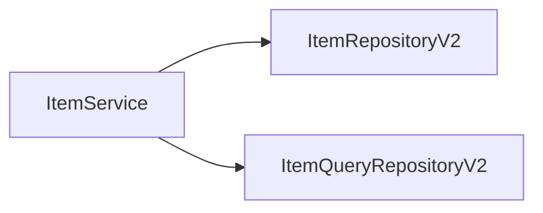

## 스프링 데이터 JPA 예제와 트레이드 오프

다시 [[스프링 데이터 JPA]]를 되돌아보면, 다음과 같이 `jpaItemRepositoryV2`가 어댑터 역할을 해준 덕분에 `itemService`의 코드 변경 없이 구현체를 변경할 수 있었다.


- 문제는 이런 구조를 맞추기 위해서(서비스 레이어가 외부 의존성을 갖지 않기 위해서) 중간에 어댑터가 들어가면서 전체 구조가 복잡해지고, 사용하는 클래스도 많아지는 단점이 생겼다.
- 실제 이 코드를 구현해야 하는 개발자 입장에서 보면 중간에 어댑터도 만들고, 실제 코드까지 만들어야 하는 불편함이 생긴다.
- 유지보수적 관점에서 `ItemService`를 변경하지 않고 `ItemRepository`의 구현체를 변경할 수 있는 장점이 있다. 그러니까 DI, OCP 원칙을 지킬 수 있다는 좋은 점은 있지만 반대로 구조가 복잡해지면서 어댑터 코드와 실제 코드까지 함께 유지보수 해야 하는 어려움도 발생한다.

쉽게 말해서 다음과 같은 트레이드 오프가 존재한다.

- 어댑터 패턴을 활용해서 `itemService` 코드의 변경 없이 사용하지만, 어플리케이션 구조가 복잡해진다. (유지보수가 어려워짐)
- `itemService`가 직접적으로 `jpaItemRepositoryV2`를 의존하고 코드도 변경해야 하지만, 어플리케이션 구조가 단순해진다. (유지보수가 쉬워짐)

**어플리케이션 구조의 안정성 vs 단순한 구조와 개발의 편리성** 사이의 선택인 것이다. 이 둘 중에 어느 것 하나가 정답이라고 할 순 없지만 어설픈 추상화는 오히려 독이 되는 경우가 많다. 무엇보다 추상화도 비용이 든다.

여기서 말하는 비용이란 유지보수 관점에서의 비용을 뜻한다. 이 추상화 비용을 넘어설 만큼 효과가 있을 때 추상화를 도입하는 것이 실용적이다.

## 실용적인 구조

앞서 [[Querydsl]]를 사용한 리포지토리는 `스프링 데이터 JPA`를 사용하지 않고 `JPA`만 사용했다. 이번에는 `스프링 데이터 JPA`의 기능은 최대한 살리면서 `Querydsl`도 편리하게 사용할 수 있는 다음과 같은 구조로 만들어본다.



- `ItemRepositoryV2`는 스프링 데이터 JPA의 기능을 제공하는 리포지토리다.
- `ItemQueryRepositoryV2`는 `Querydsl`을 사용해서 복잡한 쿼리 기능을 제공하는 리포지토리이다.

이렇게 둘을 분리하면 기본 CRUD와 단순 조회는 스프링 데이터 JPA가 담당하고, 복잡한 조회 쿼리는 `Querydsl`이 담당하게 된다. 물론 `ItemService`는 기존 `ItemRepository`를 사용할 수 없기 때문에 코드를 변경해야 한다.

```java title="ItemQueryRepositoryV2.java"
@Repository
public class ItemQueryRepositoryV2 {
    private final JPAQueryFactory query;

    public ItemQueryRepositoryV2(EntityManager em) {
        this.query = new JPAQueryFactory(em);
    }

    public List<Item> findAll(ItemSearchCond cond) {
        return query.select(item)
                .from(item)
                .where(
                        likeItemName(cond.getItemName()),
                        maxPrice(cond.getMaxPrice()))
                .fetch();
    }

    private BooleanExpression likeItemName(String itemName) {
        if (StringUtils.hasText(itemName)) {
            return item.itemName.like("%" + itemName + "%");
        }
        return null;
    }

    private BooleanExpression maxPrice(Integer maxPrice) {
        if (maxPrice != null) {
            return item.price.loe(maxPrice);
        }
        return null;
    }

}
```

- `ItemQueryRepositoryV2`는 복잡한 쿼리를 수행하는 리포지토리이다. `Querydsl`을 사용하기 위해서 생성자에서 `EntityManager`를 주입 받아 `JPAQueryFactory`를 생성한다.

```java title="ItemRepositoryV2.java"
public interface ItemRepositoryV2 extends JpaRepository<Item, Long> {
}
```

- `ItemRepositoryV2`는 스프링 데이터 JPA를 이용해서 간단히 구현할 수 있다.

```java title="ItemServiceV2.java"
@Service
@RequiredArgsConstructor
@Transactional
public class ItemServiceV2 implements ItemService {
    private final ItemRepositoryV2 itemRepositoryV2;
    private final ItemQueryRepositoryV2 itemQueryRepositoryV2;

    @Override
    public Item save(Item item) {
        return itemRepositoryV2.save(item);
    }

    @Override
    public void update(Long itemId, ItemUpdateDto updateParam) {
        Item item = itemRepositoryV2.findById(itemId).orElseThrow();
        item.setItemName(updateParam.getItemName());
        item.setPrice(updateParam.getPrice());
        item.setQuantity(updateParam.getQuantity());
    }

    @Override
    public Optional<Item> findById(Long id) {
        return itemRepositoryV2.findById(id);
    }

    @Override
    public List<Item> findItems(ItemSearchCond itemSearch) {
        return itemQueryRepositoryV2.findAll(itemSearch);
    }
}
```

- `ItemServiceV2`는 `ItemService`를 구현하는데, 서비스 내부에서는 앞서 구현한 두 리포지토리를 의존한다.
- 복잡한 쿼리는 `ItemQueryRepositoryV2`를 사용하고, 단순한 쿼리는 스프링 데이터 JPA가 제공하는 기능을 사용하면 된다.

#### Config

```java
@Configuration
@RequiredArgsConstructor
public class V2Config {
    private final EntityManager em;
    private final ItemRepositoryV2 itemRepositoryV2;

    @Bean
    public ItemService itemService() {
        return new ItemServiceV2(itemRepositoryV2, itemQueryRepositoryV2());
    }

    @Bean
    public ItemQueryRepositoryV2 itemQueryRepositoryV2() {
        return new ItemQueryRepositoryV2(em);
    }

    @Bean
    public ItemRepository itemRepository() {
        return new JpaItemRepositoryV3(em);
    }
}
```

- `ItemRepository()`는 테스트에서 사용하므로 여전히 필요하다. 따라서 남겨둔다.
- 중요한 것은, 스프링 데이터 JPA를 사용하면 동적 프록시 기술을 통해서 구현체를 생성하고 스프링 빈으로 자동으로 등록한다.
- 따라서 스프링 빈으로 직접 등록할 필요가 없다.

## 다양한 데이터 접근 기술 조합

- `JdbcTemplate`이나 `MyBatis` 같은 기술들은 `SQL`을 직접 작성해야 하는 단점은 있지만, 기술이 단순하기 때문에 `SQL`에 익숙한 개발자라면 금방 적응할 수 있다.
- 반면 `JPA`, `스프링 데이터 JPA`, `Querydsl` 같은 기술들은 생산성 측면에서 혁신적이지만, 학습 곡선이 높다. 그리고 매우 복잡한 통계 쿼리를 작성하는 경우에는 잘 맞지 않는다.

**데이터 접근 기술 사용 추천 방향**

`JPA`, `스프링 데이터 JPA`, `Querydsl`을 기본으로 사용하고 이 기술들로 해결되지 않는 복잡한 쿼리는 `JdbcTemplate`이나 `MyBatis`를 함께 사용

**트랜잭션 매니저 선택**

`JPA`, `스프링 데이터 JPA`, `Querydsl`은 모두 `JPA` 기술을 사용하는 것이기 때문에 트랜잭션 매니저로 `JpaTransactionManager`를 선택하면 된다. 이 기술을 사용하면 스프링 부트는 자동으로 `JpaTransactionManager`를 스프링 빈에 등록한다.

그런데 `JdbcTemplate`, `MyBatis`와 같은 기술들은 내부에서 `JDBC`를 직접 사용하기 때문에 `DataSourceTransactionManager`를 사용한다. 따라서 `JPA`와 `JdbcTemplate`를 함께 사용하면 트랜잭션 매니저가 달라진다.

결국 트랜잭션을 하나로 묶을 수 없는 문제가 발생할 수 있다. 그런데 이 부분은 걱정하지 않아도 된다.

**JpaTransactionManager의 다양한 지원**

`JpaTransactionManager`은 `DataSourceTransactionManager`가 제공하는 기능도 대부분 제공한다. `JPA`도 결국 내부에서는 `DataSource`와 `JDBC 커넥션`을 사용하기 때문이다.

따라서 `JdbcTemplate`, `MyBatis`와 함께 사용할 수 있다. 결과적으로 `JpaTransactionManager` 하나만 스프링 빈에 등록하면 `JPA`, `JdbcTemplate`, `MyBatis` 모두를 하나의 트랜잭션으로 묶어서 사용할 수 있다. 물론 함께 롤백도 할 수 있다.

**주의점**

`JPA`와 `JdbcTemplate`을 함께 사용하는 경우 `JPA`의 플러시 타이밍에 주의해야 한다. `JPA`는 데이터를 변경하면 변경 사항을 즉시 데이터베이스에 반영하지 않는다. 기본적으로 트랜잭션이 커밋되는 시점에 변경 사항을 데이터베이스에 반영한다.

그래서 하나의 트랜잭션 안에서 `JPA`를 통해 데이터를 변경한 다음에 `JdbcTemplate`을 호출하는 경우 `JdbcTemplate`에서는 `JPA`가 변경한 데이터를 읽지 못하는 문제가 발생한다. 이 문제를 해결하려면 `JPA` 호출이 끝난 시점에 `JPA`가 제공하는 플러시라는 기능을 이용해서 `JPA`의 변경 내역을 데이터베이스에 반영해주어야 한다. 그래야 그 다음 호출되는 `JdbcTemplate`에서 `JPA`가 반영한 데이터를 사용할 수 있다.

이 `JPA` 플러시에 대한 부분은 `JPA`를 학습해야 이해할 수 있다. 지금은 `JpaTransactionManager`를 사용해서 여러 데이터 접근 기술을 함께 사용할 수 있다는 점만 기억하자.

---

References: 김영한의 스프링 DB 2편

Links to this page: [[스프링 데이터 JPA]]
